# Install GitLab on Microsoft Azure

> 原文：[https://docs.gitlab.com/ee/install/azure/](https://docs.gitlab.com/ee/install/azure/)

*   [Getting started](#getting-started)
*   [Working with Azure](#working-with-azure)
*   [Create New VM](#create-new-vm)
*   [Basics](#basics)
*   [Size](#size)
*   [Settings](#settings)
*   [Purchase](#purchase)
*   [Deployment](#deployment)
*   [Set up a domain name](#set-up-a-domain-name)
*   [Let’s open some ports](#lets-open-some-ports)
    *   [Which ports to open?](#which-ports-to-open)
    *   [Open HTTP on Port 80](#open-http-on-port-80)
    *   [Open SSH on Port 22](#open-ssh-on-port-22)
*   [Connecting to GitLab](#connecting-to-gitlab)
    *   [Success?](#success)
*   [Creating your first GitLab project](#creating-your-first-gitlab-project)
*   [Maintaining your GitLab instance](#maintaining-your-gitlab-instance)
    *   [Checking our current version](#checking-our-current-version)
    *   [Connect via SSH](#connect-via-ssh)
        *   [SSH from the command-line](#ssh-from-the-command-line)
        *   [SSH from Windows (PuTTY)](#ssh-from-windows-putty)
    *   [Updating GitLab](#updating-gitlab)
        *   [Check out your updated GitLab](#check-out-your-updated-gitlab)
*   [Conclusion](#conclusion)
*   [Where to next?](#where-to-next)
    *   [Useful links](#useful-links)

# Install GitLab on Microsoft Azure[](#install-gitlab-on-microsoft-azure "Permalink")

Azure 是 Microsoft 的业务云，GitLab 是 Azure 市场上的预配置产品. 希望您不会惊讶地听到 Microsoft 和 Azure 接受了开源软件，例如 Ubuntu，Red Hat Enterprise Linux，当然还有 GitLab！ 这意味着您可以启动预配置的 GitLab VM，并在 30 分钟左右启动并运行自己的私有 GitLab. 让我们开始吧.

## Getting started[](#getting-started "Permalink")

首先，您需要在 Azure 上拥有一个帐户. 有三种方法可以做到这一点：

*   如果您的公司（或您）已经有一个帐户，那么您就可以开始了！
*   您还可以免费打开自己的 Azure 帐户. *在撰写本文时* ，您将获得 200 美元的信用额度，可用于 30 天的 Azure 服务支出. 您可以使用此信用额度试用付费的 Azure 服务，免费浏览 Microsoft 的云. 即使在开始的 30 天之后，您也无需支付任何费用，除非您决定转换为使用"按需付费" Azure 订阅的付费服务. 这是试用 Azure 和云计算的好方法，您可以[在其全面的 FAQ 中阅读更多内容](https://azure.microsoft.com/en-us/free/free-account-faq/) .
*   如果您具有 MSDN 订阅，则可以激活 Azure 订阅者权益. 您的 MSDN 订阅每月为您提供经常性的 Azure 信用，那么为什么不立即使用这些信用并尝试 GitLab 呢？

## Working with Azure[](#working-with-azure "Permalink")

Once you have an Azure account, you can get started. [Log in to Azure](https://portal.azure.com) and the first thing you will see is the Dashboard:

[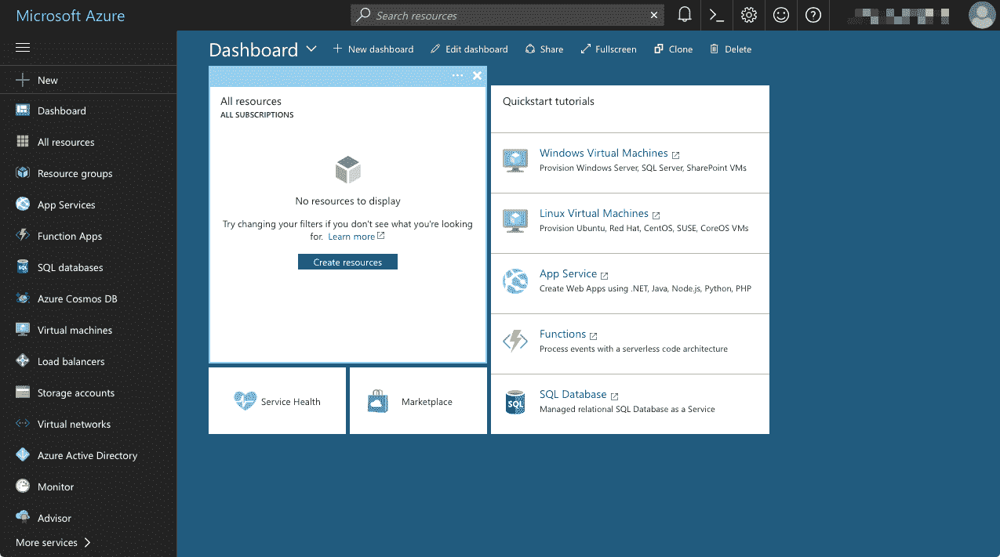](img/azure-dashboard.png)

仪表板为您提供了 Azure 资源的快速概述，从这里您可以构建 VM，创建 SQL 数据库，创建网站以及执行许多其他云任务.

## Create New VM[](#create-new-vm "Permalink")

[Azure 市场](https://azuremarketplace.microsoft.com/en-us/marketplace/)是一个在线商店，用于存储预配置的应用程序和服务，这些软件和服务已由 GitLab 等软件供应商针对云进行了优化，可以在 Azure 市场上作为预配置的解决方案使用. 在本教程中，我们将安装 GitLab 社区版，但是对于 GitLab 企业版，您可以遵循相同的过程.

要开始创建新的 GitLab VM，请单击**+新建**图标，在搜索框中键入" GitLab"，然后单击**" GitLab Community Edition"**搜索结果：

[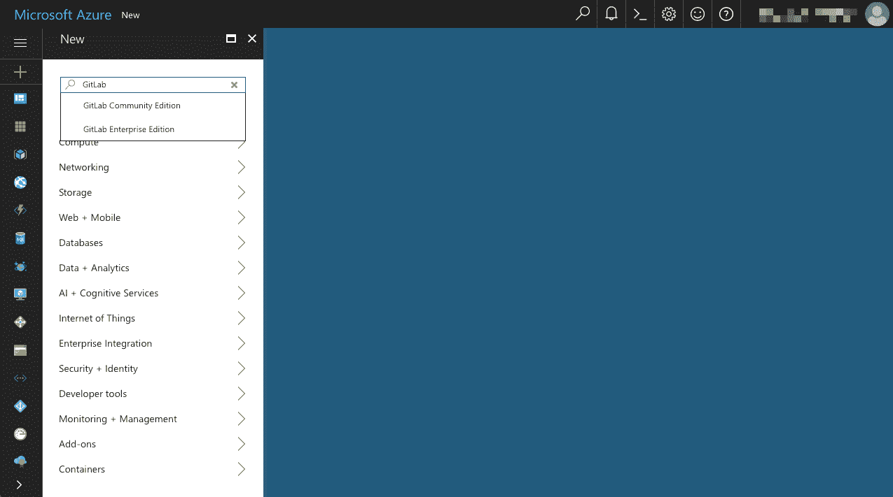](img/azure-new-search-gitlab.png)

将会弹出一个新的"刀片"窗口，您可以在其中阅读有关 MIT Expat 许可免费提供的**" GitLab 社区版"**产品的更多信息：

[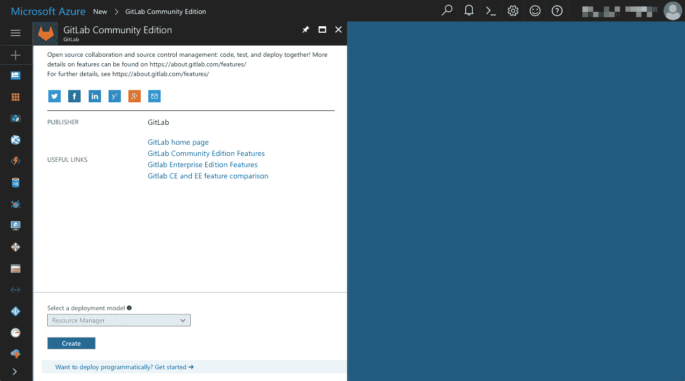](img/azure-new-gitlab-ce.png)

单击**"创建"** ，将显示"创建虚拟机"刀片：

[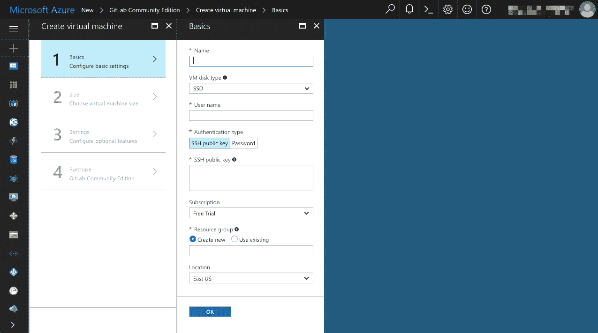](img/azure-create-virtual-machine-basics.png)

## Basics[](#basics "Permalink")

我们需要配置的第一项是基础虚拟机的基本设置：

1.  输入虚拟机的`Name` -例如**" GitLab-CE"**
2.  选择一个`VM disk type` -无论是***HDD（**慢，成本更低）*或***SSD（**更快，更高成本）*
3.  输入`User name` -例如`gitlab-admin`
4.  选择一种`Authentication type` ， **SSH 公钥**或**密码** ：

    > **注意：**如果不确定要使用哪种身份验证类型，请选择**密码**

    1.  如果您选择**SSH 公钥** -在提供的字段中输入`SSH public key` *（请阅读[SSH 文档，](../../ssh/README.html)以了解有关如何设置 SSH 公钥的更多信息）*
    2.  如果选择了**密码** -输入要使用*的密码（这是本教程后面将用于[SSH](https://en.wikipedia.org/wiki/Secure_Shell)到 VM 的密码，因此请确保它是一个强密码/密码）*
5.  为您的 Azure 帐户选择适当的`Subscription`层
6.  选择一个现有的`Resource Group`或创建一个新的`Resource Group` -例如**" GitLab-CE-Azure"**

    > **注意：** "资源组"是一种将相关资源分组在一起以简化管理的方法. 我们选择了" GitLab-CE-Azure"，但是您的资源组可以与 VM 具有相同的名称.

7.  选择一个`Location` -如果不确定，请选择默认位置

这是我们使用的设置：

[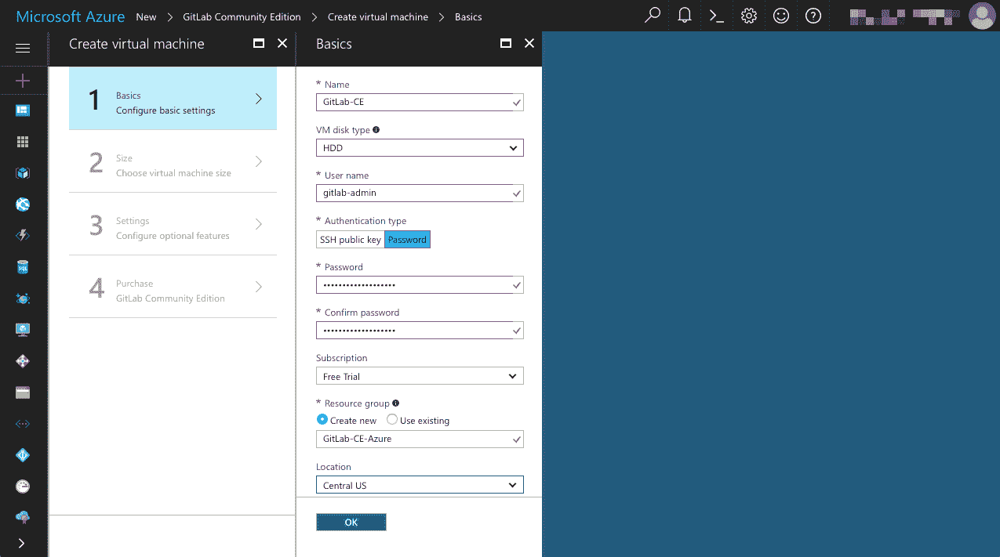](img/azure-create-virtual-machine-basics-password.png)

检查您输入的设置，然后在准备好继续时单击**"确定"** .

## Size[](#size "Permalink")

接下来，您需要选择 VM 的大小-选择功能，例如 CPU 内核数，RAM 数量，存储大小（及其速度）等.

> **注意：**与其他云供应商一样，Azure 运行资源/使用定价模型，即，VM 消耗的资源越多，运行成本就越高，因此请谨慎选择. 您会看到，Azure 提供了每个 VM 大小以下的*估计*每月费用，以帮助指导选择.

默认大小-成本最低的**" DS1_V2 标准" VM-**满足运行测试和评估目的小型 GitLab 环境的最低系统要求，因此我们将继续选择该大小，但请选择大小最能满足您的要求：

[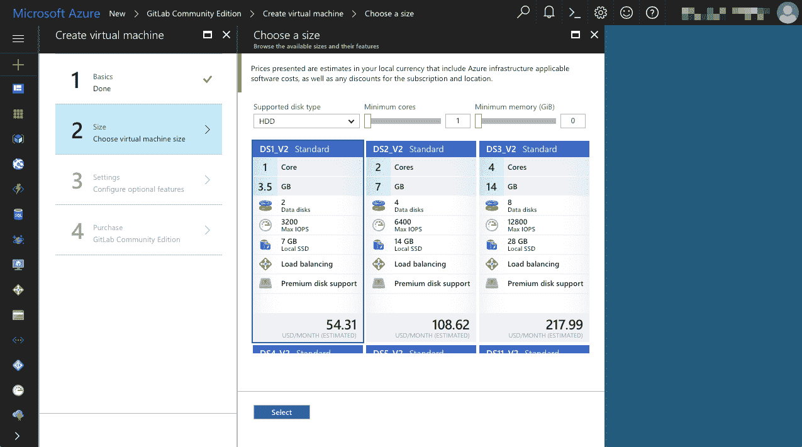](img/azure-create-virtual-machine-size.png)

> **注意：请**注意，当您的 VM 处于活动状态（称为"已分配"）时，将产生"计算费用"，最终将向您收费. 因此，即使您使用的是免费试用版信用，您也可能想学习[如何正确关闭 Azure VM 以节省资金](https://build5nines.com/properly-shutdown-azure-vm-to-save-money/) .

继续并单击您选择的大小，然后在准备进行下一步时单击**"选择"** .

## Settings[](#settings "Permalink")

在下一个刀片服务器上，要求您配置存储，网络和扩展设置. 我们保留了默认设置，因为它们足以进行 GitLab 的测试驾驶，但是请选择最能满足您自己要求的设置：

[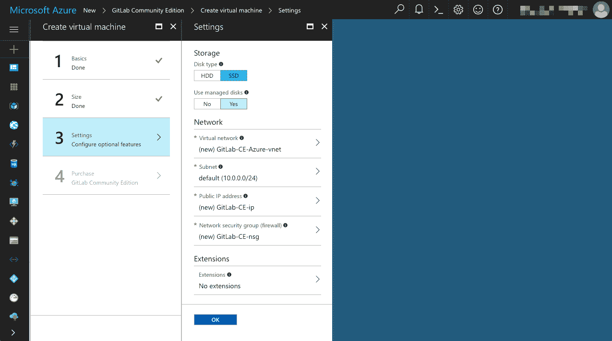](img/azure-create-virtual-machine-settings.png)

检查设置，然后在准备好进行最后一步时单击**"确定"** .

## Purchase[](#purchase "Permalink")

"购买"页面是最后一步，在这里将为您显示新 VM 的每小时价格. 您只需要为 VM 本身付费（例如" Standard DS1 v2"），因为**" GitLab 社区版"**市场解决方案可以以 0 美元/小时的价格免费使用：

[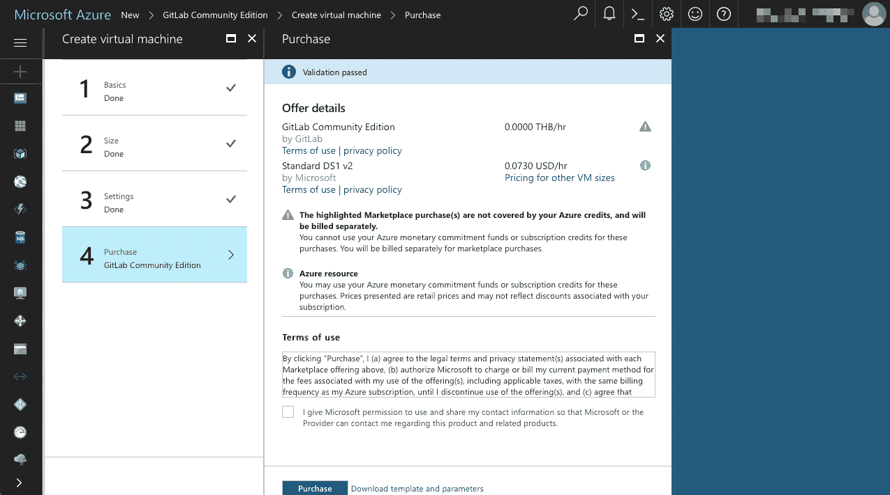](img/azure-create-virtual-machine-purchase.png)

> **注意：**在此阶段，您可以查看和修改在之前所有步骤中所做的任何设置，只需单击四个步骤中的任何一个即可重新打开它们.

阅读并同意使用条款并准备进行时，请单击**"购买"** .

## Deployment[](#deployment "Permalink")

此时，Azure 将开始部署您的新 VM. 部署过程将需要几分钟才能完成，进度显示在**"部署"**刀片上：

[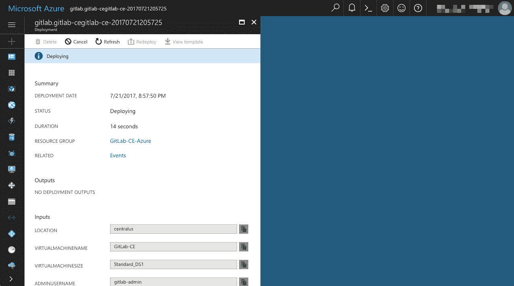](img/azure-create-virtual-machine-deployment.png)

部署过程完成后，新的 VM 及其相关资源将显示在 Azure 仪表板上（您可能需要刷新页面）：

[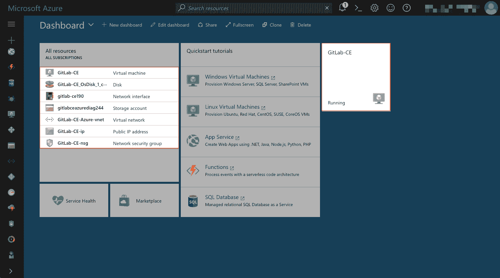](img/azure-dashboard-running-resources.png)

也可以通过单击 Azure Portal 侧栏导航菜单中的" `All resources`或" `Virtual machines`图标来访问新 VM.

## Set up a domain name[](#set-up-a-domain-name "Permalink")

该虚拟机将具有一个公共 IP 地址（默认情况下为静态），但是 Azure 允许我们为该虚拟机分配一个友好的 DNS 名称，所以让我们继续吧.

在控制面板中，单击**" GitLab-CE"**图块以打开新 VM 的管理刀片. VM 使用的公共 IP 地址在"基本"部分中显示：

[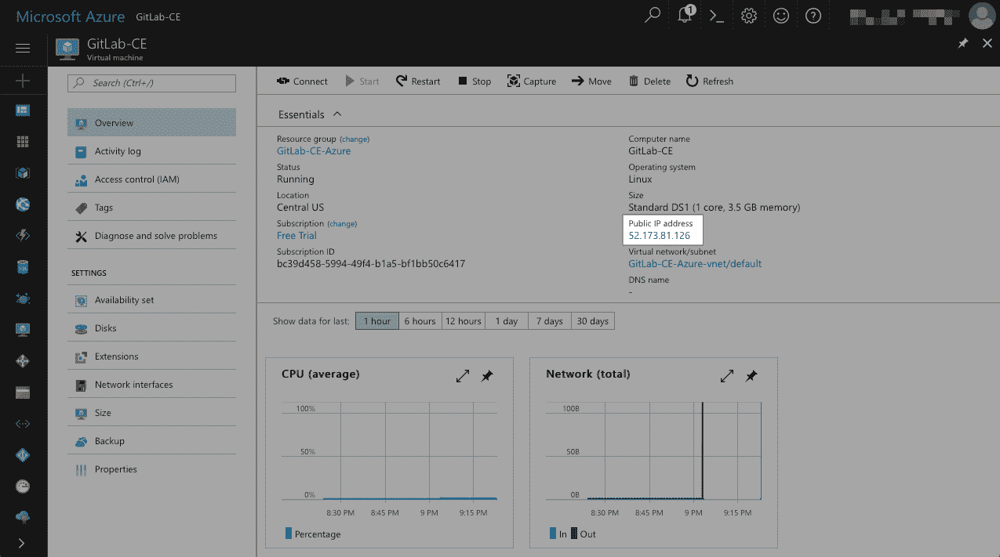](img/azure-vm-management-public-ip.png)

单击公共 IP 地址-这将打开**"公共 IP 地址-配置"**刀片，然后单击**"配置"** （在"设置"下）. 现在，在" `DNS name label`字段中为您的实例输入一个友好的 DNS 名称：

[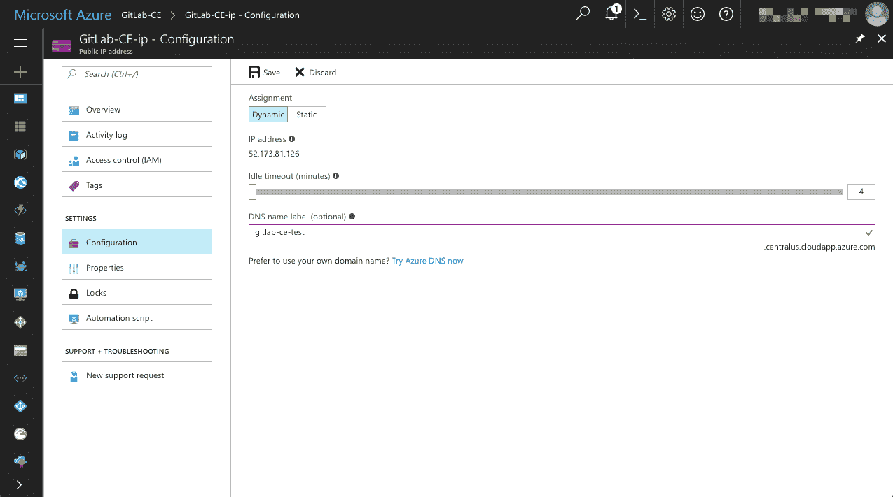](img/azure-vm-domain-name.png)

In the screenshot above, you’ll see that we’ve set the `DNS name label` to `gitlab-ce-test`. This will make our VM accessible at `gitlab-ce-test.centralus.cloudapp.azure.com` *（当然，您自己的 VM 的完整域名将有所不同）*.

单击**"保存"**以使更改生效.

> **注意：**如果要使用自己的域名，则需要在域注册商处添加 DNS `A`记录， `A`记录指向 Azure VM 的公共 IP 地址. 如果这样做，则需要确保将 VM 配置为使用*静态的*公共 IP 地址（即不是*动态的* IP 地址），否则每次 Azure 重新为 VM 分配新的公共 IP 时，都必须重新配置 DNS `A`记录.地址. 阅读[公共 IP 地址](https://docs.microsoft.com/en-us/azure/virtual-network/public-ip-addresses)以了解更多信息.

## Let’s open some ports[](#lets-open-some-ports "Permalink")

在此阶段，您应该拥有一个正在运行且完全可运行的 VM. 但是，在您打开必要的端口以启用对这些服务的访问之前，将无法通过 Internet 公开访问 VM 上的任何服务（例如 GitLab）.

通过将*安全规则*添加到已分配了我们的 VM 的**"网络安全组"** （NSG），可以打开端口. 如果按照上述过程进行操作，则 Azure 将自动创建一个名为`GitLab-CE-nsg`的 NSG 并将`GitLab-CE` VM 分配给它.

> **注意：**如果给虚拟机命名不同，则 Azure 自动创建的 NSG 也将具有不同的名称-您拥有虚拟机的名称，并附加`-nsg` .

您可以通过 Azure 门户中的许多不同路径导航到 NSG 设置，但是最简单的方法之一是转到 Azure 仪表板，然后单击**"所有资源"**图块中列出的 Network Security 组：

[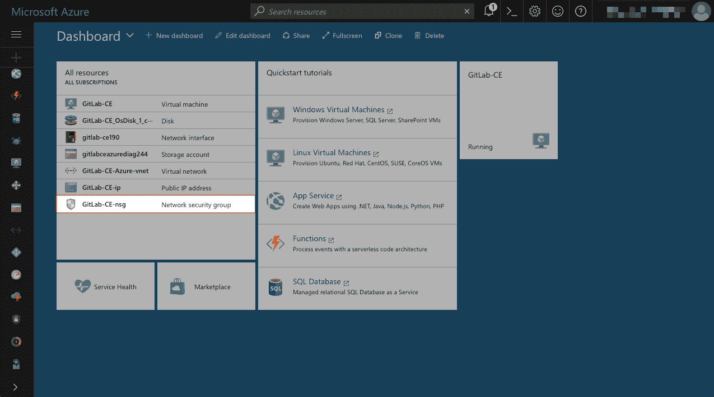](img/azure-dashboard-highlight-nsg.png)

在打开**"网络安全组"**刀片的情况下，单击**"设置"**下的**"** **入站安全规则** **"** ：

[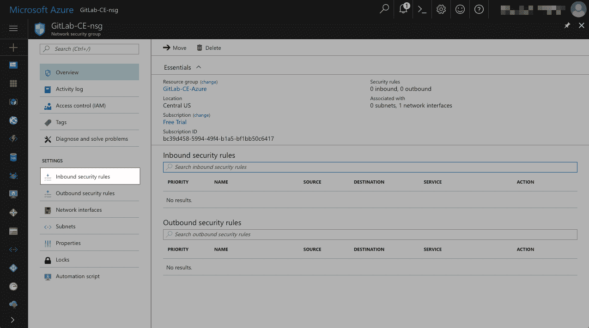](img/azure-nsg-inbound-sec-rules-highlight.png)

接下来，点击**"添加"** ：

[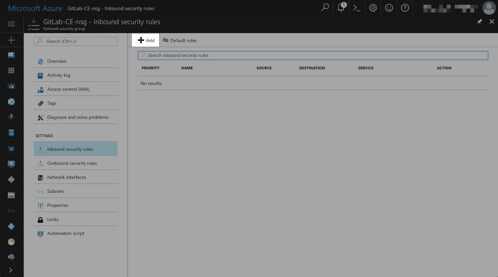](img/azure-nsg-inbound-sec-rules-add-highlight.png)

### Which ports to open?[](#which-ports-to-open "Permalink")

像所有服务器一样，我们的 VM 将运行许多服务. 但是，我们要打开正确的端口，以使公共互联网特别能够访问两种服务：

1.  **HTTP** （端口 80）-打开端口 80 将使我们的 VM 能够响应 HTTP 请求，从而允许公众访问在我们的 VM 上运行的 GitLab 实例.
2.  **SSH** （端口 22）-打开端口 22 将使我们的 VM 能够响应 SSH 连接请求，允许对远程终端会话进行公共访问（带有身份验证） *（您将[在本教程的后面部分](#maintaining-your-gitlab-instance)看到为什么我们需要对 VM 进行[SSH](https://en.wikipedia.org/wiki/Secure_Shell)访问）*

### Open HTTP on Port 80[](#open-http-on-port-80 "Permalink")

在**"添加入站安全规则"**刀片中，让我们打开端口 80，以便我们的 VM 可以接受 HTTP 连接：

[](img/azure-add-inbound-sec-rule-http.png)

1.  在`Name`字段中输入**" HTTP"**
2.  从`Service`下拉列表中的选项中选择**HTTP**
3.  确保将`Action`设置为**允许**
4.  Click **“OK”**

### Open SSH on Port 22[](#open-ssh-on-port-22 "Permalink")

重复上述过程，添加第二个入站安全规则以打开端口 22，使我们的 VM 能够接受[SSH](https://en.wikipedia.org/wiki/Secure_Shell)连接：

[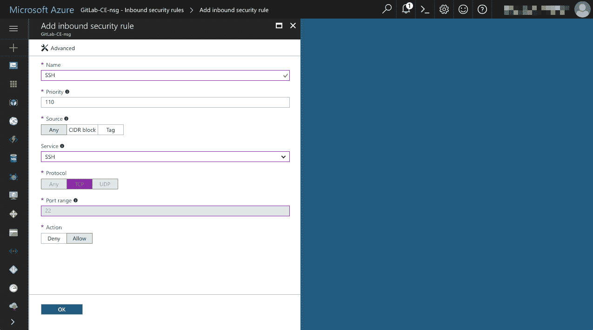](img/azure-add-inbound-sec-rule-ssh.png)

1.  在" `Name`字段中输入**" SSH"**
2.  从`Service`下拉列表中的选项中选择**SSH**
3.  确保将`Action`设置为**允许**
4.  Click **“OK”**

Azure 将花一点时间来添加每个新的入站安全规则（您可能需要单击**"入站安全规则"**以刷新列表），但是一旦完成，您应该在列表中看到两个新规则：

[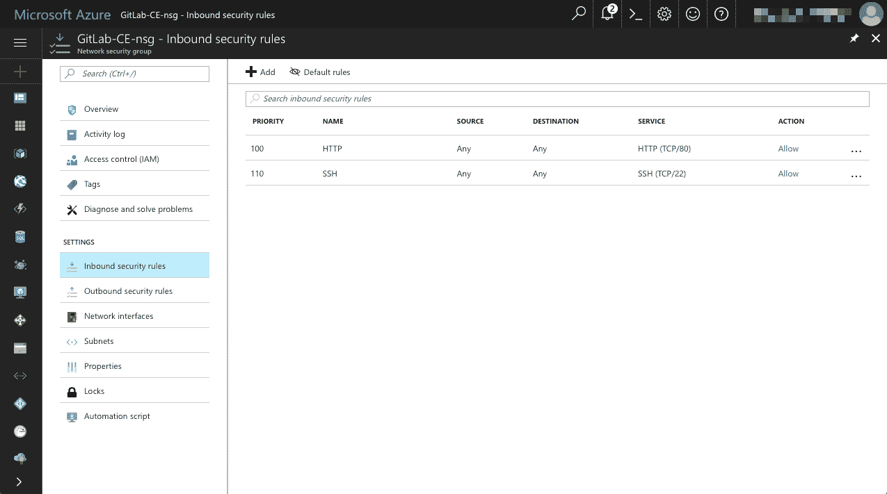](img/azure-inbound-sec-rules-list.png)

## Connecting to GitLab[](#connecting-to-gitlab "Permalink")

使用您先前设置的域名（或公共 IP 地址）在浏览器中访问新的 GitLab 实例. 如果一切都按计划进行，则应显示以下页面，要求您为 GitLab 自动创建的管理员帐户设置*新*密码：

[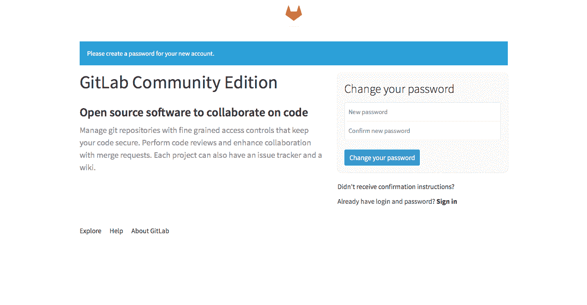](img/gitlab-change-password.png)

在两个表单字段中输入您的*新*密码，然后单击**"更改密码"** .

更改密码后，您将被重定向到 GitLab 登录页面. 使用`root`作为用户名，输入在上一步中设置的新密码，然后单击**"登录"** ：

[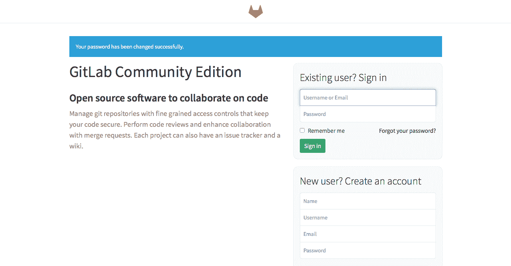](img/gitlab-login.png)

### Success?[](#success "Permalink")

成功登录后，您应该看到 GitLab 项目页面显示**"欢迎使用 GitLab！".** 信息：

[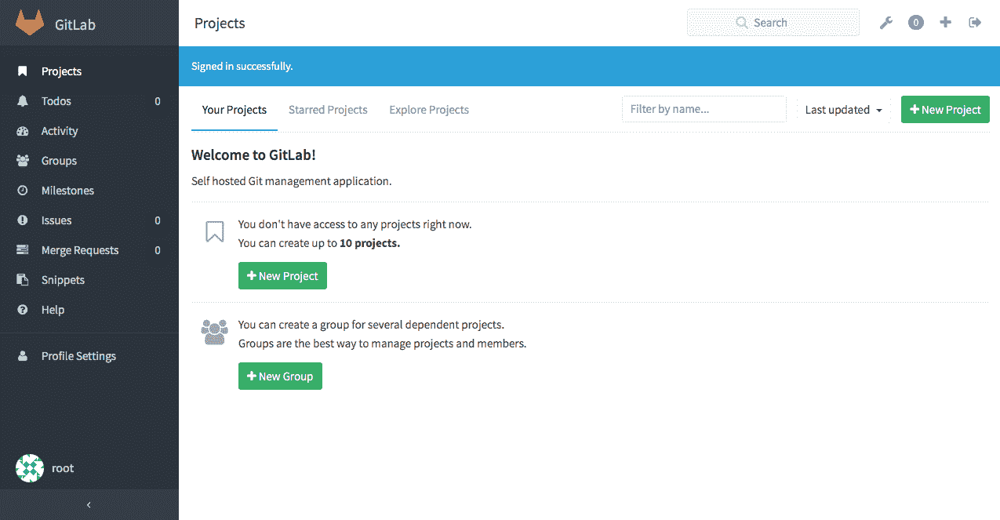](img/gitlab-home.png)

如果是这样，您现在可以在自己的私有 Azure VM 上拥有一个正常的 GitLab 实例. **恭喜你！**

## Creating your first GitLab project[](#creating-your-first-gitlab-project "Permalink")

如果您熟悉 Git 和 GitLab，则可以跳过本节. 否则，让我们创建第一个项目. 在"欢迎"页面上，单击**"新建项目"** .

让我们给项目命名和描述，然后接受其他所有内容的默认值：

1.  在`Project path`项目名称字段中输入**" demo"**
2.  输入`description` ，例如**"我的真棒演示项目！"**
3.  Click **"创建项目"**

[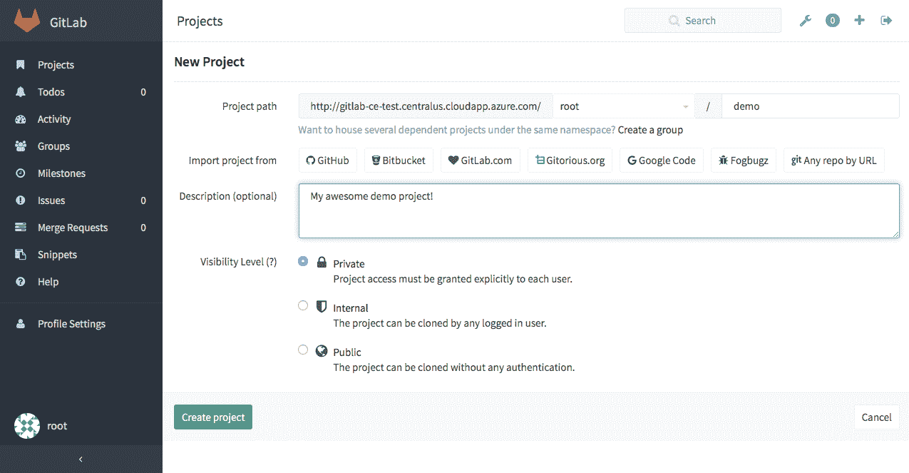](img/gitlab-new-project.png)

一旦创建了新项目（只需要一点时间），您将被重定向到该项目的主页：

[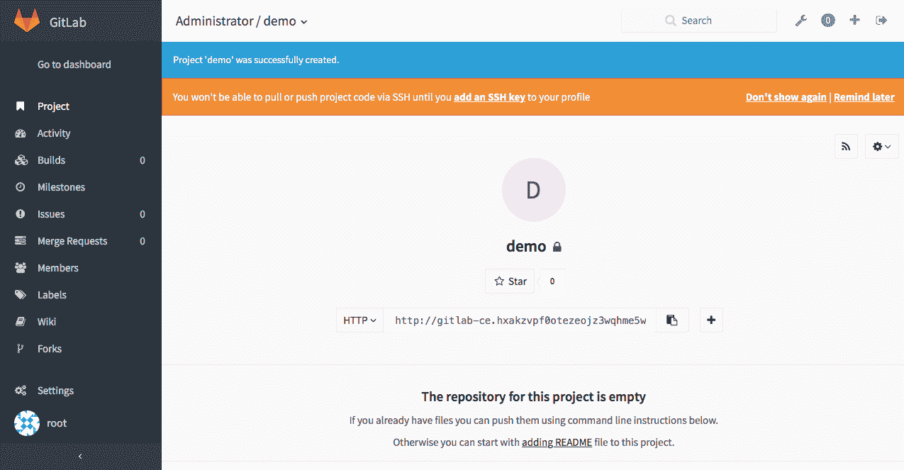](img/gitlab-project-home-empty.png)

If you scroll further down the project’s home page, you’ll see some basic instructions on how to set up a local clone of your new repository and push and pull from it:

[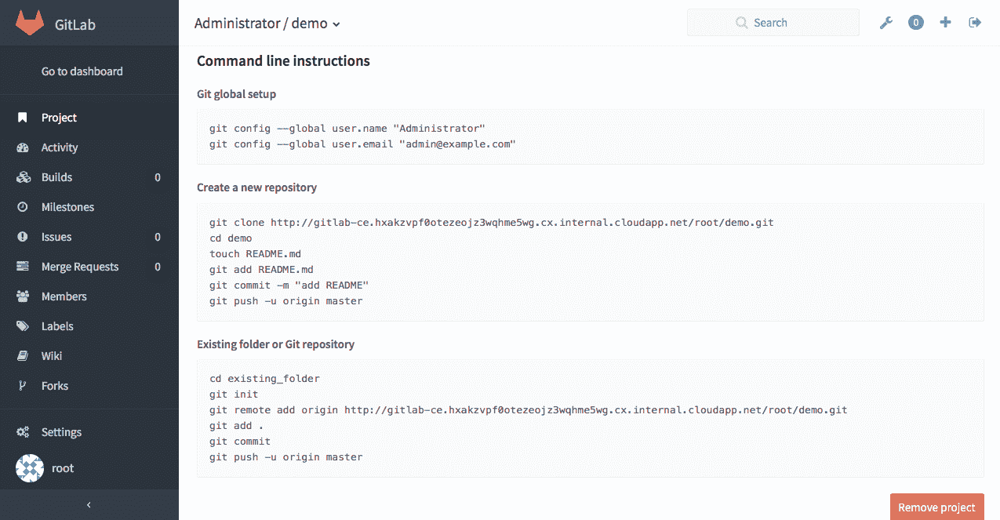](img/gitlab-project-home-instructions.png)

**而已！ 现在，您已经在云中安装并运行了自己的私有 GitLab 环境！**

## Maintaining your GitLab instance[](#maintaining-your-gitlab-instance "Permalink")

保持最新的 GitLab 环境非常重要. GitLab 团队会不断进行增强，出于安全原因，有时您可能需要进行更新. 因此，让我们回顾一下如何更新 GitLab.

### Checking our current version[](#checking-our-current-version "Permalink")

要检查我们当前正在运行的 GitLab 版本，请单击"管理区域"链接-它是显示在搜索框旁边的右上角的扳手图标.

在以下屏幕截图中，您可以在右上角看到**"尽快更新"**通知消息. 此特定消息表明存在可用的较新版本的 GitLab，其中包含一个或多个安全修复程序：

[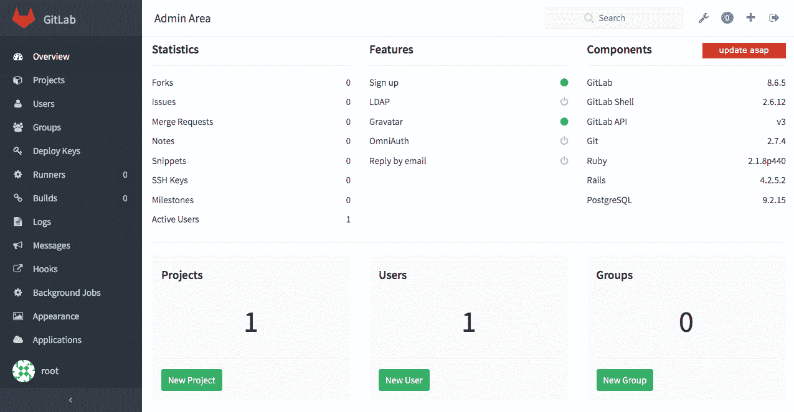](img/gitlab-admin-area.png)

在**"组件"**部分下，我们可以看到我们的 VM 当前正在运行 GitLab 的`8.6.5`版本. 这是 GitLab 的版本，包含在 Azure 市场**" GitLab 社区版"中，该**产品在编写本教程时曾用来构建 VM.

> **注意：**您自己的 VM 实例中的 GitLab 版本可能会有所不同，但是更新过程仍然相同.

### Connect via SSH[](#connect-via-ssh "Permalink")

要执行更新，我们需要直接连接到我们的 Azure VM 实例并从终端运行一些命令. 我们的 Azure VM 实际上是运行 Linux（Ubuntu）的服务器，因此我们需要使用 SSH（ [Secure Shell](https://en.wikipedia.org/wiki/Secure_Shell) ）连接到它.

如果您正在运行 Windows，则需要使用[PuTTY](https://www.putty.org)或等效的 Windows SSH 客户端进行连接. 如果您正在运行 Linux 或 macOS，则说明您已经安装了 SSH 客户端.

> **Note:**
> 
> *   请记住，您将需要使用[创建](#basics) Azure VM [时](#basics)指定的用户名和密码登录
> *   如果需要重置虚拟机密码，请阅读[如何为 Azure VM 上的用户重置 SSH 凭据](https://docs.microsoft.com/en-us/azure/virtual-machines/troubleshooting/troubleshoot-ssh-connection) .

#### SSH from the command-line[](#ssh-from-the-command-line "Permalink")

如果您从命令行（终端）运行[SSH](https://en.wikipedia.org/wiki/Secure_Shell) ，则键入以下命令以连接到您的 VM，用`username`和`your-azure-domain-name.com`替换正确的值.

再次提醒您，您的 Azure VM 域名将是您[先前在本教程中设置的](#set-up-a-domain-name)域名. 如果未为 VM 设置域名，则可以在以下命令中使用其 IP 地址：

```
ssh username@your-azure-domain-name.com 
```

在提示时提供密码以进行身份​​验证.

#### SSH from Windows (PuTTY)[](#ssh-from-windows-putty "Permalink")

如果您将 Windows 中的[PuTTY](https://www.putty.org)用作[SSH](https://en.wikipedia.org/wiki/Secure_Shell)客户端，那么您可能想快速阅读[Windows 中的 PuTTY](https://mediatemple.net/community/products/dv/204404604/using-ssh-in-putty-) .

### Updating GitLab[](#updating-gitlab "Permalink")

通过 SSH 登录后，输入以下命令将 GitLab 更新到最新版本：

```
sudo apt-get update && sudo apt-get install gitlab-ce 
```

此命令会将 GitLab 及其关联的组件更新为最新版本，因此需要一些时间才能完成. 您将在 SSH 终端窗口中看到各种更新任务正在完成：

[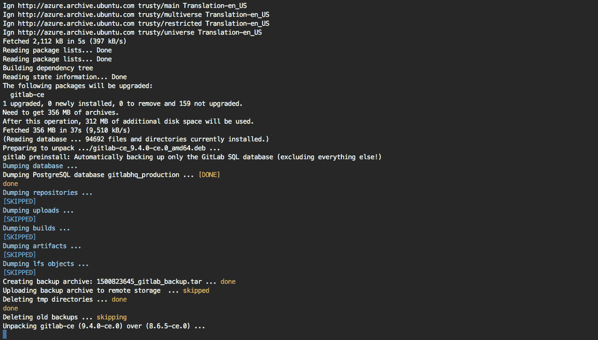](img/gitlab-ssh-update-in-progress.png)

更新过程完成后，您将看到以下消息：

```
Upgrade complete! If your GitLab server is misbehaving try running

   sudo gitlab-ctl restart

before anything else. 
```

#### Check out your updated GitLab[](#check-out-your-updated-gitlab "Permalink")

在浏览器中刷新您的 GitLab 实例，然后导航到"管理区域". 您现在应该具有最新的 GitLab 实例.

在编写本教程时，我们的 Azure VM GitLab 实例在撰写本文时已更新为最新版本（ `9.4.0` ）. 您可以看到以前显示**" update asap"**的消息现在显示为**"最新"** ：

[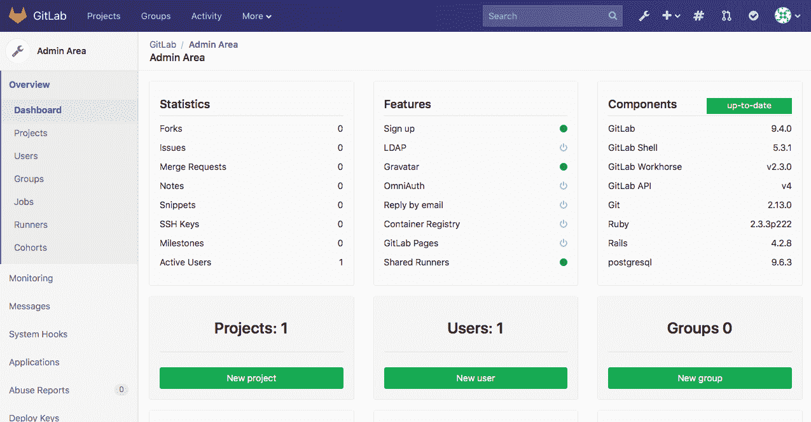](img/gitlab-admin-area-9.4.0.png)

## Conclusion[](#conclusion "Permalink")

自然地，我们认为 GitLab 是一个很棒的 Git 存储库工具. 但是，GitLab 的功能远不止于此. GitLab 将问题，代码审查，CI 和 CD 统一到一个 UI 中，可帮助您从构思到生产更快地迁移，并且在本教程中，我们向您展示了在 Azure 上设置和运行自己的 GitLab 实例是多么快速和容易. ，微软的云服务.

Azure 是尝试 GitLab 的好方法，如果您决定（如我们所愿）GitLab 适合您，则可以继续使用 Azure 作为您的安全，可扩展的云提供商，当然也可以在您选择的任何云服务上运行 GitLab.

## Where to next?[](#where-to-next "Permalink")

查看其他[技术文章](../../articles/index.html)或浏览[GitLab 文档](../../README.html)以了解有关 GitLab 的更多信息.

### Useful links[](#useful-links "Permalink")

*   [GitLab Community Edition](https://about.gitlab.com/features/)
*   [GitLab Enterprise Edition](https://about.gitlab.com/features/#ee-starter)
*   [Microsoft Azure](https://azure.microsoft.com/en-us/)
    *   [Azure - Free Account FAQ](https://azure.microsoft.com/en-us/free/free-account-faq/)
    *   [Azure - Marketplace](https://azuremarketplace.microsoft.com/en-us/marketplace/)
    *   [Azure Portal](https://portal.azure.com)
    *   [Azure - Pricing Calculator](https://azure.microsoft.com/en-us/pricing/calculator/)
    *   [Azure - Troubleshoot SSH Connections to an Azure Linux VM](https://docs.microsoft.com/en-us/azure/virtual-machines/troubleshooting/troubleshoot-ssh-connection)
    *   [Azure - Properly Shutdown an Azure VM](https://build5nines.com/properly-shutdown-azure-vm-to-save-money/)
*   [SSH](https://en.wikipedia.org/wiki/Secure_Shell), [PuTTY](https://www.putty.org) and [Using SSH in PuTTY](https://mediatemple.net/community/products/dv/204404604/using-ssh-in-putty-)