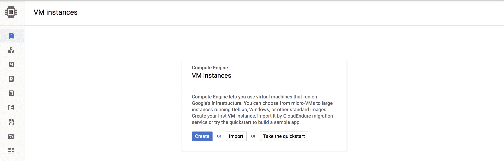
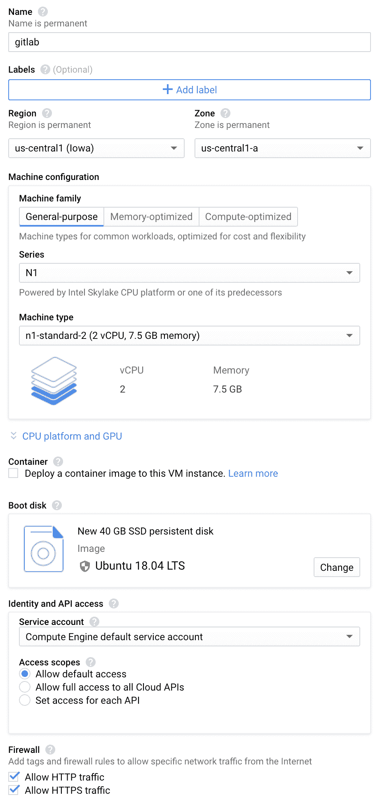
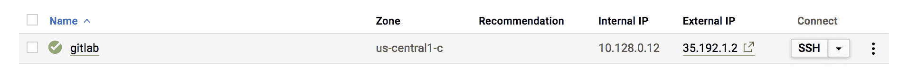
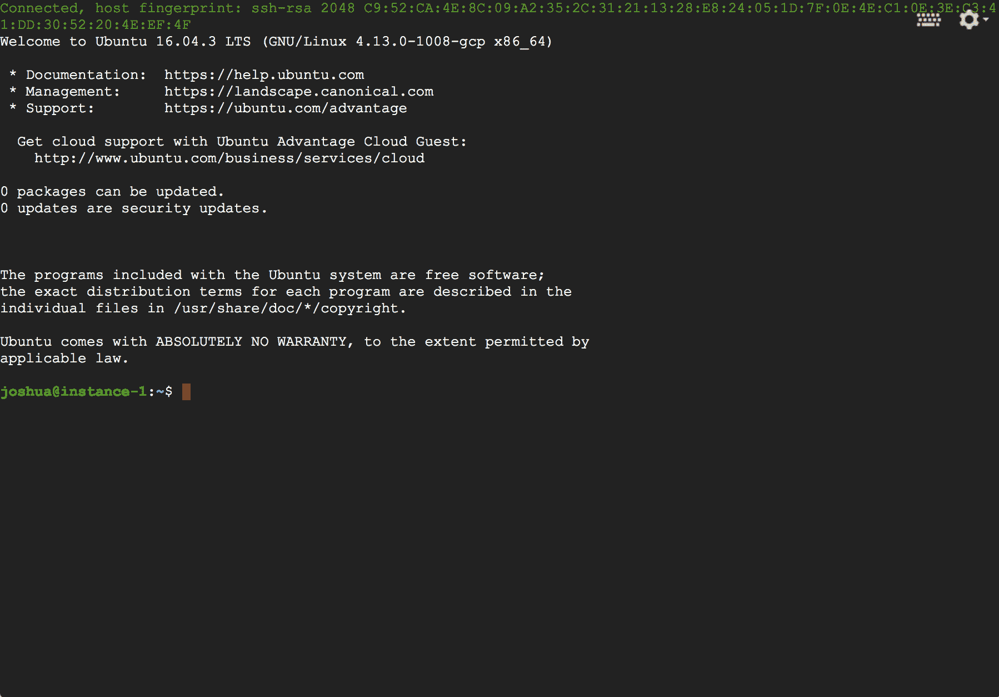
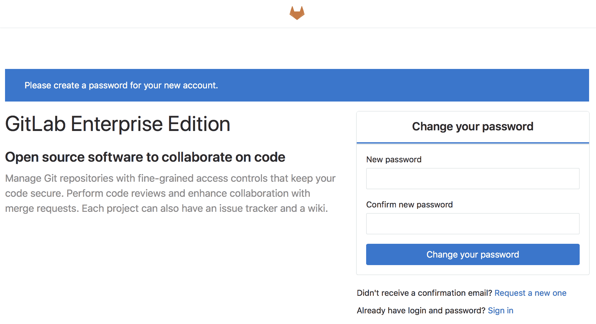

# Installing GitLab on Google Cloud Platform

> 原文：[https://docs.gitlab.com/ee/install/google_cloud_platform/](https://docs.gitlab.com/ee/install/google_cloud_platform/)

*   [Prerequisites](#prerequisites)
*   [Creating the VM](#creating-the-vm)
*   [Installing GitLab](#installing-gitlab)
*   [Next steps](#next-steps)
    *   [Assigning a static IP](#assigning-a-static-ip)
    *   [Using a domain name](#using-a-domain-name)
    *   [Configuring HTTPS with the domain name](#configuring-https-with-the-domain-name)
    *   [Configuring the email SMTP settings](#configuring-the-email-smtp-settings)
*   [Further reading](#further-reading)

# Installing GitLab on Google Cloud Platform[](#installing-gitlab-on-google-cloud-platform "Permalink")

本指南将帮助您在[Google Cloud Platform（GCP）](https://cloud.google.com/)实例上安装 GitLab.

**替代安装方法：** Google 提供了一份白皮书，用于[在 Google Kubernetes Engine 上部署可投入生产的 GitLab](https://cloud.google.com/solutions/deploying-production-ready-gitlab-on-gke) ，包括所有步骤和外部资源配置. 这些是使用 GCP VM 的替代方法，并使用[Cloud native GitLab Helm chart](https://docs.gitlab.com/charts/) .

## Prerequisites[](#prerequisites "Permalink")

在 GCP 上安装 GitLab 的前提条件只有两个：

1.  您需要有一个 Google 帐户.
2.  您需要注册 GCP 计划. 如果您是第一次，Google 会为您提供[$ 300 的信用额，](https://console.cloud.google.com/freetrial)可在 60 天内[免费](https://console.cloud.google.com/freetrial)使用.

完成这两个步骤后，就可以[创建 VM 了](#creating-the-vm) .

## Creating the VM[](#creating-the-vm "Permalink")

要在 GCP 上部署 GitLab，您首先需要创建一个虚拟机：

1.  转到[https://console.cloud.google.com/compute/instances](https://console.cloud.google.com/compute/instances)并使用您的 Google 凭据登录.
2.  点击**创建**

    [](img/launch_vm.png)

3.  On the next page, you can select the type of VM as well as the estimated costs. Provide the name of the instance, desired datacenter, and machine type. Note our [hardware requirements for different user base sizes](../requirements.html#hardware-requirements).

    [](img/vm_details.png)

4.  要选择大小，类型和所需的[操作系统](../requirements.html#supported-linux-distributions) ，请在" `Boot disk` **"**下单击" **更改** ". 完成后单击" **选择"** .

5.  最后，允许 HTTP 和 HTTPS 通信，然后点击**创建** . 该过程将在几秒钟内完成.

## Installing GitLab[](#installing-gitlab "Permalink")

几秒钟后，实例将被创建并可以登录.下一步是将 GitLab 安装到实例上.

[](img/vm_created.png)

1.  记下实例的 IP 地址，因为在后续步骤中将需要使用该 IP 地址.
2.  单击 SSH 按钮以连接到实例.
3.  登录到实例后，将出现一个新窗口.

    [](img/ssh_terminal.png)

4.  接下来，在[https://about.gitlab.com/install/上](https://about.gitlab.com/install/)按照说明为您选择的操作系统安装 GitLab. 您可以将上述步骤中的 IP 地址用作主机名.

5.  恭喜你！ GitLab 现在已安装，您可以通过浏览器访问它. 要完成安装，请在浏览器中打开 URL 并提供初始管理员密码. 该帐户的用户名是`root` .

    [](img/first_signin.png)

## Next steps[](#next-steps "Permalink")

这些是首次安装 GitLab 之后要执行的最重要的后续步骤.

### Assigning a static IP[](#assigning-a-static-ip "Permalink")

默认情况下，Google 会为您的实例分配一个临时 IP. 如果您要在生产中使用 GitLab 并使用域名，则强烈建议分配一个静态 IP，如下所示.

阅读 Google 有关如何[提升临时 IP 地址](https://cloud.google.com/compute/docs/ip-addresses/reserve-static-external-ip-address#promote_ephemeral_ip)的文档.

### Using a domain name[](#using-a-domain-name "Permalink")

假设您拥有一个域名，并且已正确设置 DNS 以指向在上一步中配置的静态 IP，则可以通过以下方法配置 GitLab 以了解更改：

1.  SSH 进入虚拟机. 您可以轻松使用 Google 控制台中的**SSH**按钮，然后会弹出一个新窗口.

    [](img/vm_created.png)

    将来，您可能想设置[使用 SSH 密钥的连接](https://cloud.google.com/compute/docs/instances/connecting-to-instance) .

2.  使用您喜欢的文本编辑器编辑 Omnibus GitLab 的配置文件：

    ```
    sudo vim /etc/gitlab/gitlab.rb 
    ```

3.  将`external_url`值设置为您希望 GitLab 在**不使用** `https` **情况下**拥有的域名：

    ```
    external_url 'http://gitlab.example.com' 
    ```

    我们将在下一步中设置 HTTPS，而现在无需这样做.

4.  重新配置 GitLab，以使更改生效：

    ```
    sudo gitlab-ctl reconfigure 
    ```

5.  您现在可以使用域名访问 GitLab.

### Configuring HTTPS with the domain name[](#configuring-https-with-the-domain-name "Permalink")

尽管不需要，但强烈建议使用 TLS 证书保护 GitLab. 请遵循[Omnibus 文档中](https://docs.gitlab.com/omnibus/settings/nginx.html)的步骤.

### Configuring the email SMTP settings[](#configuring-the-email-smtp-settings "Permalink")

您需要正确配置电子邮件 SMTP 设置，否则 GitLab 将无法发送通知电子邮件，例如注释和密码更改. 检查[Omnibus 文档的](https://docs.gitlab.com/omnibus/settings/smtp.html)操作方法.

## Further reading[](#further-reading "Permalink")

可以将 GitLab 配置为与其他 OAuth 提供程序，LDAP，SAML，Kerberos 等进行身份验证.以下是您可能感兴趣阅读的一些文档：

*   [Omnibus GitLab documentation](https://docs.gitlab.com/omnibus/)
*   [Integration documentation](../../integration/README.html)
*   [GitLab Pages configuration](../../administration/pages/index.html)
*   [GitLab Container Registry configuration](../../administration/packages/container_registry.html)