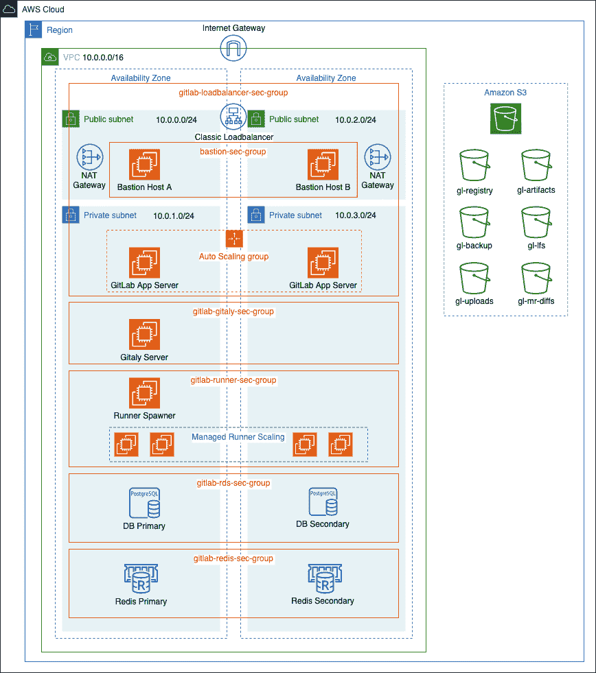
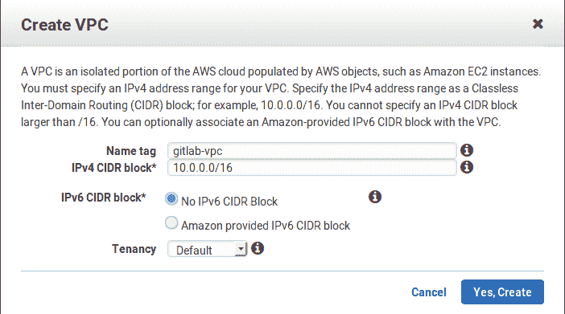
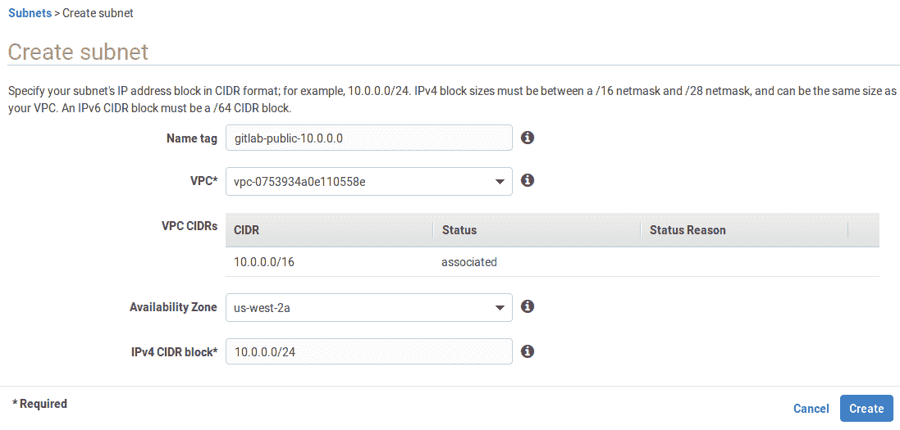
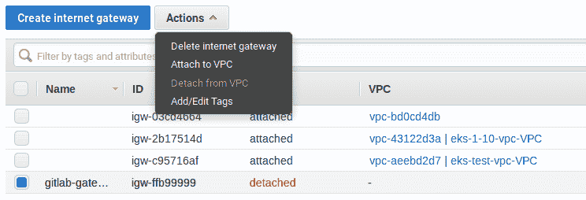
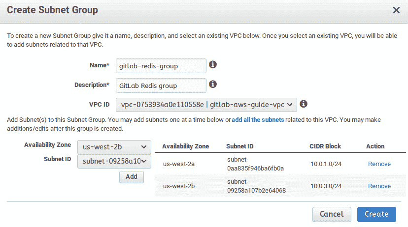
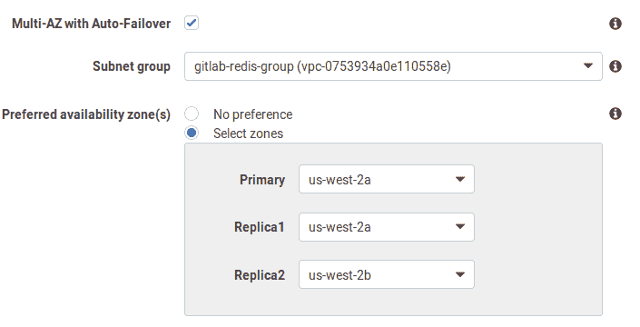
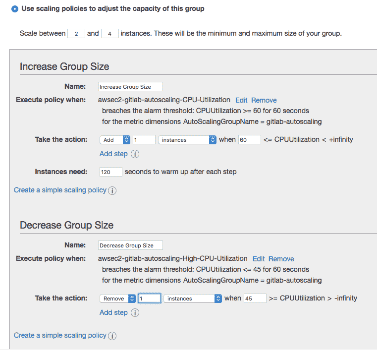

# Installing GitLab on Amazon Web Services (AWS)

> 原文：[https://docs.gitlab.com/ee/install/aws/](https://docs.gitlab.com/ee/install/aws/)

*   [Introduction](#introduction)
*   [Requirements](#requirements)
*   [Architecture](#architecture)
*   [AWS costs](#aws-costs)
*   [Create an IAM EC2 instance role and profile](#create-an-iam-ec2-instance-role-and-profile)
    *   [Create an IAM Policy](#create-an-iam-policy)
    *   [Create an IAM Role](#create-an-iam-role)
*   [Configuring the network](#configuring-the-network)
    *   [Creating the Virtual Private Cloud (VPC)](#creating-the-virtual-private-cloud-vpc)
    *   [Subnets](#subnets)
    *   [Internet Gateway](#internet-gateway)
    *   [Create NAT Gateways](#create-nat-gateways)
    *   [Route Tables](#route-tables)
        *   [Public Route Table](#public-route-table)
        *   [Private Route Tables](#private-route-tables)
*   [Load Balancer](#load-balancer)
    *   [Configure DNS for Load Balancer](#configure-dns-for-load-balancer)
*   [PostgreSQL with RDS](#postgresql-with-rds)
    *   [RDS Security Group](#rds-security-group)
    *   [RDS Subnet Group](#rds-subnet-group)
    *   [Create the database](#create-the-database)
*   [Redis with ElastiCache](#redis-with-elasticache)
    *   [Create a Redis Security Group](#create-a-redis-security-group)
    *   [Redis Subnet Group](#redis-subnet-group)
    *   [Create the Redis Cluster](#create-the-redis-cluster)
*   [Setting up Bastion Hosts](#setting-up-bastion-hosts)
    *   [Create Bastion Host A](#create-bastion-host-a)
    *   [Create Bastion Host B](#create-bastion-host-b)
    *   [Use SSH Agent Forwarding](#use-ssh-agent-forwarding)
*   [Install GitLab and create custom AMI](#install-gitlab-and-create-custom-ami)
    *   [Install GitLab](#install-gitlab)
    *   [Add custom configuration](#add-custom-configuration)
        *   [Disable Let’s Encrypt](#disable-lets-encrypt)
        *   [Install the `pg_trgm` extension for PostgreSQL](#install-the-pg_trgm-extension-for-postgresql)
        *   [Configure GitLab to connect to PostgreSQL and Redis](#configure-gitlab-to-connect-to-postgresql-and-redis)
        *   [Set up Gitaly](#set-up-gitaly)
        *   [Add Support for Proxied SSL](#add-support-for-proxied-ssl)
        *   [Fast lookup of authorized SSH keys](#fast-lookup-of-authorized-ssh-keys)
        *   [Configure host keys](#configure-host-keys)
        *   [Amazon S3 object storage](#amazon-s3-object-storage)
    *   [Create custom AMI](#create-custom-ami)
*   [Deploy GitLab inside an auto scaling group](#deploy-gitlab-inside-an-auto-scaling-group)
    *   [Create a launch configuration](#create-a-launch-configuration)
    *   [Create an auto scaling group](#create-an-auto-scaling-group)
    *   [Log in for the first time](#log-in-for-the-first-time)
*   [Health check and monitoring with Prometheus](#health-check-and-monitoring-with-prometheus)
*   [GitLab Runners](#gitlab-runners)
*   [Backup and restore](#backup-and-restore)
    *   [Backing up GitLab](#backing-up-gitlab)
    *   [Restoring GitLab from a backup](#restoring-gitlab-from-a-backup)
*   [Updating GitLab](#updating-gitlab)
*   [Conclusion](#conclusion)
*   [Troubleshooting](#troubleshooting)
    *   [Instances are failing health checks](#instances-are-failing-health-checks)
    *   [“The change you requested was rejected (422)”](#the-change-you-requested-was-rejected-422)

# Installing GitLab on Amazon Web Services (AWS)[](#installing-gitlab-on-amazon-web-services-aws "Permalink")

该页面提供了 AWS 上 GitLab 通用配置的演练. 您应该对其进行自定义以满足您的需求.

**注意：**对于拥有 1,000 个或更少用户的组织，建议的 AWS 安装方法是启动 EC2 单框[Omnibus 安装](https://about.gitlab.com/install/)并实施快照策略以备份数据. 有关更多信息，请参见[1,000 个用户参考体系结构](../../administration/reference_architectures/1k_users.html) .

## Introduction[](#introduction "Permalink")

在大多数情况下，我们将在我们的设置中使用 Omnibus GitLab，但我们还将利用本机 AWS 服务. 代替使用 Omnibus 捆绑的 PostgreSQL 和 Redis，我们将使用 AWS RDS 和 ElastiCache.

在本指南中，我们将进行多节点设置，首先将配置虚拟私有云和子网，以稍后集成服务（例如用于数据库服务器的 RDS 和作为 Redis 集群的 ElastiCache）以最终在一个具有自定义缩放策略的自动缩放组.

## Requirements[](#requirements "Permalink")

除了基本了解[AWS](https://docs.aws.amazon.com/)和[Amazon EC2 之外](https://docs.aws.amazon.com/ec2/) ，您还需要：

*   [An AWS account](https://console.aws.amazon.com/console/home)
*   [To create or upload an SSH key](https://docs.aws.amazon.com/AWSEC2/latest/UserGuide/ec2-key-pairs.html) to connect to the instance via SSH
*   GitLab 实例的域名
*   SSL / TLS 证书以保护您的域. 如果您还不拥有该证书，则可以通过[AWS Certificate Manager](https://aws.amazon.com/certificate-manager/) （ACM）设置免费的公共 SSL / TLS 证书，以与我们将创建的[Elastic Load Balancer](#load-balancer)一起使用.

**注意：**验证通过 ACM 设置的证书可能需要几个小时. 为避免以后出现延迟，请尽快申请您的证书.

## Architecture[](#architecture "Permalink")

下面是推荐架构的示意图.

[](img/aws_ha_architecture_diagram.png)

## AWS costs[](#aws-costs "Permalink")

以下是我们将使用的 AWS 服务的列表，以及指向定价信息的链接：

*   **EC2** ：GitLab 将部署在共享硬件上，这意味着将[按需定价](https://aws.amazon.com/ec2/pricing/on-demand/) . 如果要在专用或保留实例上运行它，请参阅[EC2 定价页面](https://aws.amazon.com/ec2/pricing/)以获取有关费用的更多信息.
*   **S3** ：我们将使用 S3 来存储备份，工件，LFS 对象等.请参阅[Amazon S3 定价](https://aws.amazon.com/s3/pricing/) .
*   **ELB** ：经典负载均衡器将用于将请求路由到 GitLab 实例. 请参阅[Amazon ELB 定价](https://aws.amazon.com/elasticloadbalancing/pricing/) .
*   **RDS** ：将使用使用 PostgreSQL 的 Amazon Relational Database Service. 请参阅[Amazon RDS 定价](https://aws.amazon.com/rds/postgresql/pricing/) .
*   **ElastiCache** ：内存缓存环境将用于提供 Redis 配置. 请参阅[Amazon ElastiCache 定价](https://aws.amazon.com/elasticache/pricing/) .

## Create an IAM EC2 instance role and profile[](#create-an-iam-ec2-instance-role-and-profile "Permalink")

由于我们将使用[Amazon S3 对象存储](#amazon-s3-object-storage) ，因此我们的 EC2 实例需要具有对 S3 存储桶的读取，写入和列出权限. 为了避免将 AWS Key 嵌入我们的 GitLab 配置中，我们将利用[IAM 角色](https://docs.aws.amazon.com/IAM/latest/UserGuide/id_roles.html)允许 GitLab 实例具有此访问权限. 我们需要创建一个 IAM 策略以附加到我们的 IAM 角色：

### Create an IAM Policy[](#create-an-iam-policy "Permalink")

1.  导航到 IAM 仪表板，然后单击左侧菜单中的" **策略** ".
2.  单击**创建策略** ，选择`JSON`选项卡，然后添加策略. 我们希望[遵循安全最佳实践并授予*最少的特权*](https://docs.aws.amazon.com/IAM/latest/UserGuide/best-practices.html#grant-least-privilege) ，仅向我们的角色授予执行所需操作所需的权限.
    1.  假设如图所示，在 S3 存储桶名称前添加`gl-`作为前缀，请添加以下策略：

```
{  "Version":  "2012-10-17",  "Statement":  [  {  "Effect":  "Allow",  "Action":  [  "s3:AbortMultipartUpload",  "s3:CompleteMultipartUpload",  "s3:ListBucket",  "s3:PutObject",  "s3:GetObject",  "s3:DeleteObject",  "s3:PutObjectAcl"  ],  "Resource":  [  "arn:aws:s3:::gl-*/*"  ]  }  ]  } 
```

1.  点击**审核政策** ，为您的政策命名（我们将使用`gl-s3-policy` ），然后点击**创建政策** .

### Create an IAM Role[](#create-an-iam-role "Permalink")

1.  仍在 IAM 仪表板上，单击左侧菜单中的**角色** ，然后单击**创建角色** .
2.  通过选择**AWS 服务> EC2**来创建新角色，然后单击**下一步：权限** .
3.  在策略过滤器中，搜索我们在上面创建的`gl-s3-policy` ，选择它，然后点击**标签** .
4.  根据需要添加标签，然后单击" **查看"** .
5.  为角色命名（我们将使用`GitLabS3Access` ），然后点击**创建角色** .

稍后[创建启动配置](#create-a-launch-configuration)时，将使用此角色.

## Configuring the network[](#configuring-the-network "Permalink")

我们将从为 GitLab 云基础架构创建 VPC 开始，然后我们可以创建子网以在至少两个[可用区（AZ）中](https://docs.aws.amazon.com/AWSEC2/latest/UserGuide/using-regions-availability-zones.html)具有公共实例和私有实例. 公共子网将需要保留路由表和关联的 Internet 网关.

### Creating the Virtual Private Cloud (VPC)[](#creating-the-virtual-private-cloud-vpc "Permalink")

现在，我们将创建一个 VPC，一个您可以控制的虚拟网络环境：

1.  导航至[https://console.aws.amazon.com/vpc/home](https://console.aws.amazon.com/vpc/home) .
2.  从左侧菜单中选择**您的 VPC** ，然后单击**创建 VPC** . 在"名称标签"中输入`gitlab-vpc` ，在" IPv4 CIDR 块"中输入`10.0.0.0/16` . 如果不需要专用硬件，则可以将" Tenancy"保留为默认设置. 单击**是，**准备好后**创建** .

    [](img/create_vpc.png)

3.  选择 VPC，单击" **操作"** ，单击" **编辑 DNS 解析"** ，然后启用 DNS 解析. 完成后点击**保存** .

### Subnets[](#subnets "Permalink")

现在，让我们在不同的可用区中创建一些子网. 确保每个子网都与我们刚刚创建的 VPC 相关联，并且 CIDR 块不会重叠. 这也将使我们能够启用多可用区以实现冗余.

我们还将创建专用和公用子网以匹配负载均衡器和 RDS 实例：

1.  从左侧菜单中选择**子网** .
2.  单击**创建子网** . 给它一个基于 IP 的描述性名称标签，例如`gitlab-public-10.0.0.0` ，选择我们之前创建的 VPC，选择一个可用区（我们将使用`us-west-2a` ），并在 IPv4 CIDR 块上让我们给它一个 24 个子网`10.0.0.0/24` ：

    [](img/create_subnet.png)

3.  请按照相同的步骤创建所有子网：

    | 名称标签 | Type | 可用区 | CIDR 块 |
    | --- | --- | --- | --- |
    | `gitlab-public-10.0.0.0` | public | `us-west-2a` | `10.0.0.0/24` |
    | `gitlab-private-10.0.1.0` | private | `us-west-2a` | `10.0.1.0/24` |
    | `gitlab-public-10.0.2.0` | public | `us-west-2b` | `10.0.2.0/24` |
    | `gitlab-private-10.0.3.0` | private | `us-west-2b` | `10.0.3.0/24` |

4.  创建所有子网后，请为两个公共子网启用**自动分配 IPv4** ：
    1.  依次选择每个公共子网，单击" **操作"** ，然后单击" **修改自动分配 IP 设置"** . 启用该选项并保存.

### Internet Gateway[](#internet-gateway "Permalink")

现在，仍然在同一仪表板上，转到 Internet 网关并创建一个新的网关：

1.  从左侧菜单中选择" **Internet 网关** ".
2.  单击**创建互联网网关** ，为其命名为`gitlab-gateway` ，然后单击**创建** .
3.  从表中选择它，然后在" **操作"**下拉菜单下选择"附加到 VPC".

    [](img/create_gateway.png)

4.  从列表中选择`gitlab-vpc` ，然后点击**Attach** .

### Create NAT Gateways[](#create-nat-gateways "Permalink")

部署在我们专用子网中的实例需要连接到 Internet 进行更新，但不能从公共 Internet 到达. 为此，我们将利用部署在每个公共子网中的[NAT 网关](https://docs.aws.amazon.com/vpc/latest/userguide/vpc-nat-gateway.html) ：

1.  导航到 VPC 仪表板，然后单击左侧菜单栏中的**NAT 网关** .
2.  单击**创建 NAT 网关，**然后完成以下操作：
    1.  **子网** ：从下拉列表中选择`gitlab-public-10.0.0.0` .
    2.  **弹性 IP 分配 ID** ：输入现有的弹性 IP 或单击**分配弹性 IP 地址，**以将新 IP 分配给您的 NAT 网关.
    3.  如果需要，添加标签.
    4.  单击**创建 NAT 网关** .

创建第二个 NAT 网关，但这一次将其放置在第二个公共子网`gitlab-public-10.0.2.0` .

### Route Tables[](#route-tables "Permalink")

#### Public Route Table[](#public-route-table "Permalink")

我们需要为公共子网创建路由表，以通过上一步中创建的 Internet 网关访问 Internet.

在 VPC 仪表板上：

1.  从左侧菜单中选择**路由表** .
2.  Click **创建路由表**.
3.  在"名称标签"中，输入`gitlab-public` ， `gitlab-vpc`在" VPC"下选择`gitlab-vpc` .
4.  Click **Create**.

现在，我们需要将我们的 Internet 网关添加为新目标，并使其接收来自任何目的地的流量.

1.  从左侧菜单中选择" **路由表"** ，然后选择`gitlab-public`路由以在底部显示选项.
2.  选择" **路线"**选项卡，单击" **编辑路线">"添加路线"，**然后将`0.0.0.0/0`设置为目的地. 在目标列中，选择我们之前创建的`gitlab-gateway` . 完成后，点击**保存路线** .

接下来，我们必须将**公共**子网关联到路由表：

1.  Select the **子网关联** tab and click **编辑子网关联**.
2.  仅检查公共子网，然后单击" **保存"** .

#### Private Route Tables[](#private-route-tables "Permalink")

我们还需要创建两个私有路由表，以便每个私有子网中的实例都可以通过同一可用性区域中相应公共子网中的 NAT 网关到达 Internet.

1.  请按照与上述相同的步骤创建两个专用路由表. 将它们`gitlab-private-a`命名为`gitlab-private-a`和`gitlab-private-b` .
2.  Next, add a new route to each of the private route tables where the destination is `0.0.0.0/0` and the target is one of the NAT gateways we created earlier.
    1.  将我们在`gitlab-public-10.0.0.0`创建的 NAT 网关添加为`gitlab-private-a`路由表中新路由的目标.
    2.  同样，在`gitlab-public-10.0.2.0`添加 NAT 网关作为`gitlab-private-b`新路由的目标.
3.  最后，将每个专用子网与专用路由表相关联.
    1.  将`gitlab-private-10.0.1.0` `gitlab-private-a`与`gitlab-private-a` .
    2.  将`gitlab-private-10.0.3.0`与`gitlab-private-b` .

## Load Balancer[](#load-balancer "Permalink")

我们将创建一个负载平衡器，以在我们的 GitLab 应用程序服务器之间平均分配端口`80`和`443`上的入站流量. 根据我们稍后将创建的[扩展策略](#create-an-auto-scaling-group) ，实例将根据需要添加到负载均衡器中或从负载均衡器中删除. 此外，负载平衡将对我们的实例执行运行状况检查.

在 EC2 仪表板上，在左侧导航栏中查找 Load Balancer：

1.  单击**创建负载均衡器**按钮.
    1.  选择**经典负载均衡器** .
    2.  给它`gitlab-loadbalancer` （我们将使用`gitlab-loadbalancer` ），并在**Create LB Inside**选项中，从下拉菜单中选择`gitlab-vpc` .
    3.  在" **侦听器"**部分中，设置以下侦听器：
        *   负载均衡器和实例协议以及端口的 HTTP 端口 80
        *   负载均衡器和实例协议以及端口的 TCP 端口 22
        *   HTTPS 端口 443（用于负载均衡器协议和端口），转发到实例上的 HTTP 端口 80（我们将[在指南](#add-support-for-proxied-ssl)中将 GitLab 配置为侦听端口 80）
    4.  在" **选择子网"**部分中，从列表中选择两个公共子网，以便负载均衡器可以将流量路由到两个可用区域.
2.  我们将为负载均衡器添加一个安全组，以充当防火墙来控制允许通过的流量. 单击**分配安全组，**然后选择**创建新的安全组** ，为其命名（我们将使用`gitlab-loadbalancer-sec-group` ）和说明，并允许来自任何地方的 HTTP 和 HTTPS 通信（ `0.0.0.0/0, ::/0` ）. 还允许 SSH 流量，选择自定义来源，并以 CIDR 表示法添加单个受信任的 IP 地址或 IP 地址范围. 这将允许用户通过 SSH 执行 Git 操作.
3.  单击**配置安全设置，**然后进行以下设置：
    1.  从 ACM 中选择一个 SSL / TLS 证书或将一个证书上传到 IAM.
    2.  在" **选择密码"下** ，从下拉列表中选择预定义的安全策略. 您可以在 AWS 文档中[查看 Classic Load Balancer](https://docs.aws.amazon.com/elasticloadbalancing/latest/classic/elb-security-policy-table.html)的[预定义 SSL 安全策略](https://docs.aws.amazon.com/elasticloadbalancing/latest/classic/elb-security-policy-table.html)明细. 检查 GitLab 代码库以获取[受支持的 SSL 密码和协议](https://gitlab.com/gitlab-org/gitlab/-/blob/9ee7ad433269b37251e0dd5b5e00a0f00d8126b4/lib/support/nginx/gitlab-ssl#L97-99)的列表.
4.  单击" **配置**运行状况检查"，然后为您的 EC2 实例设置运行状况检查.
    1.  对于" **Ping 协议"** ，选择" HTTP".
    2.  对于**Ping 端口** ，输入 80\.
    3.  对于**Ping Path** ，输入`/users/sign_in` . （我们使用`/users/sign_in`因为它是不需要授权的公共端点.）
    4.  保留默认的" **高级详细信息"**或根据需要进行调整.
5.  单击**添加 EC2 实例** -不要添加任何内容，因为稍后我们将创建一个 Auto Scaling 组来为我们管理实例.
6.  单击**添加标签，**然后添加您需要的任何标签.
7.  单击" **查看并创建"** ，查看所有设置，如果满意，请单击" **创建"** .

在负载均衡器启动并运行后，您可以重新访问安全组以仅通过 ELB 和您可能具有的任何其他要求来完善访问.

### Configure DNS for Load Balancer[](#configure-dns-for-load-balancer "Permalink")

在 Route 53 仪表板上，单击左侧导航栏中的" **托管区域** "：

1.  选择一个现有的托管区域，或者，如果您的域还没有一个，请单击**创建托管区域** ，输入您的域名，然后单击**创建** .
2.  单击**创建记录集，**并提供以下值：
    1.  **名称：**使用域名（默认值）或输入一个子域.
    2.  **类型：**选择**A-IPv4 地址** .
    3.  **别名：**默认为**No.** 选择**是** .
    4.  **别名目标：**找到" **ELB 经典负载均衡器"**部分，然后选择我们之前创建的经典负载均衡器.
    5.  **路由策略：**我们将使用" **简单"，**但您可以根据用例选择其他策略.
    6.  **评估目标健康状况：**我们将其设置为" **否"，**但是您可以选择让负载均衡器根据目标健康状况来路由流量.
    7.  点击**创建** .
3.  如果您通过 Route 53 注册了域，那么您就完成了. 如果您使用了其他域名注册商，则需要使用域名注册商更新 DNS 记录. 您需要：
    1.  单击**托管区域，**然后选择您在上面添加的域.
    2.  您将看到`NS`记录列表. 在您的域名注册商的管理面板中，将每一个作为`NS`记录添加到您域的 DNS 记录中. 这些步骤在域注册商之间可能会有所不同. 如果您陷入困境，则 Google **"您的注册商名称"会添加 dns 记录** ，您应该会找到针对您的域名注册商的帮助文章.

根据您使用的注册商的不同，执行此操作的步骤也有所不同，这超出了本指南的范围.

## PostgreSQL with RDS[](#postgresql-with-rds "Permalink")

对于我们的数据库服务器，我们将使用提供多可用区以实现冗余的 Amazon RDS. 首先，我们将创建一个安全组和子网组，然后将创建实际的 RDS 实例.

### RDS Security Group[](#rds-security-group "Permalink")

我们需要一个用于数据库的安全组，该安全组将允许稍后将在`gitlab-loadbalancer-sec-group`部署的实例的入站流量：

1.  在 EC2 仪表板中，从左侧菜单栏中选择" **安全组** ".
2.  Click **创建安全组**.
3.  给它起一个名字（我们将使用`gitlab-rds-sec-group` ），一个描述，并从**VPC**下拉列表中选择`gitlab-vpc` .
4.  在" **入站规则"**部分中，单击" **添加规则"**并进行以下设置：
    1.  **键入：**搜索并选择**PostgreSQL**规则.
    2.  **来源类型：**设置为"自定义".
    3.  **来源：**选择我们之前创建的`gitlab-loadbalancer-sec-group` .
5.  完成后，点击**创建安全组** .

### RDS Subnet Group[](#rds-subnet-group "Permalink")

1.  导航到 RDS 仪表板，然后从左侧菜单中选择" **子网组** ".
2.  单击**创建数据库子网组** .
3.  在" **子网组详细信息"下** ，输入名称（我们将使用`gitlab-rds-group` ），描述，然后从 VPC 下拉列表中选择`gitlab-vpc` .
4.  从" **可用区"**下拉列表中，选择包括您已配置的子网的可用区. 在本例中，我们将添加`eu-west-2a`和`eu-west-2b` .
5.  从**子网**下拉列表中，选择两个专用子网（ `10.0.1.0/24`和`10.0.3.0/24` ，因为我们在定义它们） [的子网部分](#subnets) .
6.  准备好后，单击**创建** .

### Create the database[](#create-the-database "Permalink")

**危险：**避免对数据库使用易爆实例（t 类实例），因为由于 CPU 信用在持续的高负载期间用尽而可能导致性能问题.

现在，该创建数据库了：

1.  导航到 RDS 仪表板，从左侧菜单中选择" **数据库** "，然后单击" **创建数据库"** .
2.  选择**标准创建**作为数据库创建方法.
3.  选择**PostgreSQL**作为数据库引擎，然后选择在[数据库要求中](../../install/requirements.html#postgresql-requirements)为您的 GitLab 版本定义的最低 PostgreSQL 版本.
4.  由于这是生产服务器，因此我们从" **模板"**部分中选择" **生产** ".
5.  在**"设置"下** ，设置数据库实例标识符，主用户名和主密码. 我们将分别使用`gitlab-db-ha` ， `gitlab`和一个非常安全的密码. 记下这些内容，稍后我们将需要它们.
6.  对于数据库实例大小，请选择" **标准类"，**然后从下拉菜单中选择一个满足您要求的实例大小. 我们将使用`db.m4.large`实例.
7.  在" **存储"下** ，配置以下内容：
    1.  从存储类型下拉菜单中选择" **Provisioned IOPS（SSD）** ". 预置 IOPS（SSD）存储最适合此用途（尽管您可以选择 General Purpose（SSD）来降低成本）. 在[Amazon RDS 的存储中](https://docs.aws.amazon.com/AmazonRDS/latest/UserGuide/CHAP_Storage.html)阅读有关它的更多信息.
    2.  分配存储并设置预配置的 IOPS. 我们将分别使用最小值`100`和`1000` .
    3.  启用存储自动缩放（可选）并设置最大存储阈值.
8.  在" **可用性和持久性"下** ，选择" **创建备用实例"**以在另一个可用[区中](https://docs.aws.amazon.com/AmazonRDS/latest/UserGuide/Concepts.MultiAZ.html)配置备用 RDS 实例.
9.  在" **连接性"下** ，配置以下内容：
    1.  从**虚拟私有云（VPC）**下拉菜单中选择我们之前创建的 VPC（ `gitlab-vpc` ）.
    2.  展开**其他连接配置**部分，然后选择我们之前创建的子网组（ `gitlab-rds-group` ）.
    3.  设置公众了解**没有** .
    4.  在**VPC 安全组下** ，选择**选择现有，**然后从下拉列表中选择我们在上面创建的`gitlab-rds-sec-group` .
    5.  将数据库端口保留为默认值`5432` .
10.  对于**数据库身份验证** ，选择**密码身份验证** .
11.  展开**其他配置**部分，并完成以下操作：
    1.  初始数据库名称. 我们将使用`gitlabhq_production` .
    2.  配置您的首选备份设置.
    3.  我们将在此处进行的唯一其他更改是禁用" **维护"**下的自动次要版本更新.
    4.  保留所有其他设置不变或根据需要进行调整.
    5.  满意后，点击**创建数据库** .

现在已经创建了数据库，让我们继续使用 ElastiCache 设置 Redis.

## Redis with ElastiCache[](#redis-with-elasticache "Permalink")

ElastiCache 是​​一个内存托管的缓存解决方案. Redis 保持其自身的持久性，并用于为 GitLab 应用程序存储会话数据，临时缓存信息和后台作业队列.

### Create a Redis Security Group[](#create-a-redis-security-group "Permalink")

1.  导航到 EC2 仪表板.
2.  从左侧菜单中选择" **安全组** ".
3.  单击**创建安全组，**然后填写详细信息. 给它`gitlab-redis-sec-group` （我们将使用`gitlab-redis-sec-group` ），添加描述，然后选择我们之前创建的 VPC
4.  在" **入站规则"**部分中，单击" **添加规则"**并添加一个" **自定义 TCP"**规则，设置端口`6379` ，并将"自定义"源设置为我们之前创建的`gitlab-loadbalancer-sec-group` .
5.  完成后，点击**创建安全组** .

### Redis Subnet Group[](#redis-subnet-group "Permalink")

1.  从您的 AWS 控制台导航到 ElastiCache 仪表板.
2.  转到左侧菜单中的" **子网组** "，然后创建一个新的子网组（我们将其命名为`gitlab-redis-group` ）. 确保选择我们的 VPC 及其[专用子网](#subnets) . 准备好后，单击**创建** .

    [](img/ec_subnet.png)

### Create the Redis Cluster[](#create-the-redis-cluster "Permalink")

1.  导航回到 ElastiCache 仪表板.
2.  在左侧菜单上选择**Redis** ，然后单击**创建**以创建新的 Redis 集群. 不要启用**集群模式，**因为它[不受支持](../../administration/redis/replication_and_failover_external.html#requirements) . 即使没有启用群集模式，您仍然有机会在多个可用性区域中部署 Redis.
3.  在设置部分：
    1.  为集群命名（ `gitlab-redis` ）和描述.
    2.  对于版本，选择最新的`5.0`系列（例如`5.0.6` ）.
    3.  将端口保留为`6379`因为这是我们在上面的 Redis 安全组中使用的端口.
    4.  选择节点类型（至少为`cache.t3.medium` ，但根据需要进行调整）和副本数.
4.  在高级设置部分：
    1.  选择多可用区自动故障转移选项.
    2.  选择我们之前创建的子网组.
    3.  手动选择首选的可用区域，然后在"副本 2"下选择与其他两个区域不同的区域.

        [](img/ec_az.png)

5.  在安全设置中，编辑安全组，然后选择我们之前创建的`gitlab-redis-sec-group` .
6.  将其余设置保留为默认值，或根据自己的喜好进行编辑.
7.  完成后，点击**创建** .

## Setting up Bastion Hosts[](#setting-up-bastion-hosts "Permalink")

由于我们的 GitLab 实例将位于专用子网中，因此我们需要一种通过 SSH 连接到这些实例以进行配置更改，执行升级等的方法.一种方法是通过[堡垒主机](https://en.wikipedia.org/wiki/Bastion_host) ，有时也称为跳转框.

**提示：**如果您不想维护堡垒主机，则可以设置[AWS Systems Manager Session Manager](https://docs.aws.amazon.com/systems-manager/latest/userguide/session-manager.html)来访问实例. 这超出了本文档的范围.

### Create Bastion Host A[](#create-bastion-host-a "Permalink")

1.  导航到 EC2 仪表板，然后单击**Launch instance** .
2.  选择**Ubuntu Server 18.04 LTS（HVM）** AMI.
3.  选择一个实例类型. 我们将使用`t2.micro`因为我们仅使用堡垒主机将 SSH SSH 到我们的其他实例中.
4.  Click **配置实例详细信息**.
    1.  在" **网络"下** ，从下拉菜单中选择`gitlab-vpc` .
    2.  在" **子网"下** ，选择我们之前创建的公共子网（ `gitlab-public-10.0.0.0` ）.
    3.  仔细检查是否在" **自动分配公用 IP"下**选择了" **使用子网设置"（"启用"）** .
    4.  将其他所有内容保留为默认值，然后单击" **添加存储"** .
5.  对于存储，我们将所有内容保留为默认设置，仅添加 8GB 根卷. 我们不会在此实例上存储任何内容.
6.  单击**添加标签** ，然后在下一个屏幕上单击**添加标签** .
    1.  我们只设置`Key: Name`和`Value: Bastion Host A`
7.  Click **配置安全组**.
    1.  选择**创建新的安全组** ，输入**安全组名称** （我们将使用`bastion-sec-group` ），然后添加描述.
    2.  我们将从任何地方（ `0.0.0.0/0` ）启用 SSH 访问. 如果需要更严格的安全性，请以 CIDR 表示法指定单个 IP 地址或 IP 地址范围.
    3.  Click **审查并启动**
8.  Review all your settings and, if you’re happy, click **Launch**.
9.  确认您有权访问现有的密钥对或创建一个新的密钥对. 单击**启动实例** .

确认您可以通过 SSH 进入实例：

1.  在 EC2 仪表板上，单击左侧菜单中的**Instances** .
2.  从实例列表中选择**Bastion HostA** .
3.  单击**连接，**然后按照连接说明进行操作.
4.  如果能够成功连接，让我们继续设置第二个堡垒主机以实现冗余.

### Create Bastion Host B[](#create-bastion-host-b "Permalink")

1.  按照与上述相同的步骤创建 EC2 实例，并进行以下更改：
    1.  对于**Subnet** ，选择我们之前创建的第二个公共子网（ `gitlab-public-10.0.2.0` ）.
    2.  在" **添加标签"**部分下，我们将设置" `Key: Name`和`Value: Bastion Host B`以便我们可以轻松识别两个实例.
    3.  对于安全组，选择我们上面创建的现有`bastion-sec-group` .

### Use SSH Agent Forwarding[](#use-ssh-agent-forwarding "Permalink")

运行 Linux 的 EC2 实例使用私钥文件进行 SSH 身份验证. 您将使用 SSH 客户端和存储在客户端上的私钥文件连接到堡垒主机. 由于私有密钥文件不存在于堡垒主机上，因此您将无法连接到私有子网中的实例.

在堡垒主机上存储私钥文件是一个坏主意. 要解决此问题，请在客户端上使用 SSH 代理转发. 有关如何使用 SSH 代理转发的分步指南，请参阅[安全连接到在私有 Amazon VPC 中运行的 Linux 实例](https://aws.amazon.com/blogs/security/securely-connect-to-linux-instances-running-in-a-private-amazon-vpc/) .

## Install GitLab and create custom AMI[](#install-gitlab-and-create-custom-ami "Permalink")

我们将需要预先配置的自定义 GitLab AMI，以便稍后在我们的启动配置中使用. 首先，我们将使用官方的 GitLab AMI 创建 GitLab 实例. 然后，我们将为 PostgreSQL，Redis 和 Gitaly 添加自定义配置. 如果愿意，您也可以使用自己选择的 EC2 实例启动并[手动安装 GitLab](https://about.gitlab.com/install/) ，而不是使用官方的 GitLab AMI.

### Install GitLab[](#install-gitlab "Permalink")

从 EC2 仪表板：

1.  单击**启动实例，**然后从左侧菜单中选择**社区 AMI** .
2.  在搜索栏中，搜索`GitLab EE <version>` ，其中`<version>`是[发行页面](https://about.gitlab.com/releases/)上显示的最新版本. 选择最新的补丁程序版本，例如`GitLab EE 12.9.2` .
3.  根据您的工作量选择一个实例类型. 请查阅[硬件要求，](../../install/requirements.html#hardware-requirements)以选择适合您需求的[硬件](../../install/requirements.html#hardware-requirements) （至少`c5.xlarge` ，足以容纳 100 位用户）.
4.  Click **配置实例详细信息**:
    1.  在" **网络"**下拉列表中，选择`gitlab-vpc` ，这是我们之前创建的 VPC.
    2.  在" **子网"**下拉列表中，从我们先前创建的**子网**列表中选择`gitlab-private-10.0.1.0` .
    3.  仔细检查是否将" **自动分配公用 IP"**设置为" `Use subnet setting (Disable)` .
    4.  Click **添加存储**.
    5.  默认情况下，根卷为 8GiB，并且在我们不会在其中存储任何数据的情况下，根卷应该足够.
5.  单击**添加标签，**然后添加您可能需要的任何标签. 在本例中，我们将仅设置`Key: Name`和`Value: GitLab` .
6.  单击**配置安全组** . 选中**选择现有安全组，**然后选择我们之前创建的`gitlab-loadbalancer-sec-group` .
7.  如果对设置满意，请单击**查看并启动，**然后单击**启动** .
8.  最后，确认您有权访问所选的私钥文件或创建一个新的私钥文件. 单击**启动实例** .

### Add custom configuration[](#add-custom-configuration "Permalink")

使用[SSH 代理转发](#use-ssh-agent-forwarding)通过**Bastion Host A**连接到您的 GitLab 实例. 连接后，添加以下自定义配置：

#### Disable Let’s Encrypt[](#disable-lets-encrypt "Permalink")

由于我们要在负载均衡器中添加 SSL 证书，因此我们不需要 GitLab 对 Let's Encrypt 的内置支持. 自 GitLab 10.7 起，使用`https`域时[，默认情况下启用](https://docs.gitlab.com/omnibus/settings/ssl.html)加密[功能](https://docs.gitlab.com/omnibus/settings/ssl.html) ，因此我们需要显式禁用它：

1.  打开`/etc/gitlab/gitlab.rb`并禁用它：

    ```
    letsencrypt['enable'] = false 
    ```

2.  保存文件并重新配置以使更改生效：

    ```
    sudo gitlab-ctl reconfigure 
    ```

#### Install the `pg_trgm` extension for PostgreSQL[](#install-the-pg_trgm-extension-for-postgresql "Permalink")

在您的 GitLab 实例中，连接到 RDS 实例以验证访问权限并安装所需的`pg_trgm`扩展.

要查找主机或终端节点，请导航至**Amazon RDS>数据库** ，然后单击您之前创建的数据库. 在" **连接性和安全性"**选项卡下查找端点.

不要包括冒号和端口号：

```
sudo /opt/gitlab/embedded/bin/psql -U gitlab -h <rds-endpoint> -d gitlabhq_production 
```

在`psql`提示符下，创建扩展，然后退出会话：

```
psql (10.9)
Type "help" for help.

gitlab=# CREATE EXTENSION pg_trgm;
gitlab=# \q 
```

#### Configure GitLab to connect to PostgreSQL and Redis[](#configure-gitlab-to-connect-to-postgresql-and-redis "Permalink")

1.  编辑`/etc/gitlab/gitlab.rb` ，找到`external_url 'http://<domain>'`选项并将其更改为您将使用的`https`域.

2.  查找 GitLab 数据库设置，并根据需要取消注释. 在当前情况下，我们将指定数据库适配器，编码，主机，名称，用户名和密码：

    ```
    # Disable the built-in Postgres
     postgresql['enable'] = false

    # Fill in the connection details
    gitlab_rails['db_adapter'] = "postgresql"
    gitlab_rails['db_encoding'] = "unicode"
    gitlab_rails['db_database'] = "gitlabhq_production"
    gitlab_rails['db_username'] = "gitlab"
    gitlab_rails['db_password'] = "mypassword"
    gitlab_rails['db_host'] = "<rds-endpoint>" 
    ```

3.  接下来，我们需要通过添加主机并取消注释端口来配置 Redis 部分：

    ```
    # Disable the built-in Redis
    redis['enable'] = false

    # Fill in the connection details
    gitlab_rails['redis_host'] = "<redis-endpoint>"
    gitlab_rails['redis_port'] = 6379 
    ```

4.  最后，重新配置 GitLab 以使更改生效：

    ```
    sudo gitlab-ctl reconfigure 
    ```

5.  您可能还会发现运行检查和服务状态以确保一切均已正确设置很有用：

    ```
    sudo gitlab-rake gitlab:check
    sudo gitlab-ctl status 
    ```

#### Set up Gitaly[](#set-up-gitaly "Permalink")

**注意：**在这种体系结构中，只有一台 Gitaly 服务器会造成单点故障. 使用[Gitaly Cluster](../../administration/gitaly/praefect.html)可以消除此限制.

Gitaly 是一项服务，它提供对 Git 存储库的高级 RPC 访问. 应该在我们之前配置的[专用子网](#subnets)之一中的单独 EC2 实例上启用和配置它.

让我们创建一个安装 Gitaly 的 EC2 实例：

1.  在 EC2 仪表板中，单击**启动实例** .
2.  选择一个 AMI. 在此示例中，我们将选择**Ubuntu Server 18.04 LTS（HVM），SSD Volume Type** .
3.  Choose an instance type. We’ll pick a **c5.xlarge**.
4.  Click **配置实例详细信息**.
    1.  在" **网络"**下拉列表中，选择`gitlab-vpc` ，这是我们之前创建的 VPC.
    2.  在" **子网"**下拉列表中，从我们先前创建的**子网**列表中选择`gitlab-private-10.0.1.0` .
    3.  仔细检查是否将" **自动分配公用 IP"**设置为" `Use subnet setting (Disable)` .
    4.  Click **添加存储**.
5.  将根卷大小增加到`20 GiB` ，并将**卷类型**更改为`Provisoned IOPS SSD (io1)` . （这是一个任意大小.创建一个足以满足您的存储库存储需求的卷.）
    1.  对于**IOPS**设置`1000` （20 GiB x 50 IOPS）. 每个 GiB 最多可以配置 50 IOPS. 如果选择更大的音量，请相应地增加 IOPS. 以串行方式写入许多小文件的工作负载（如`git` ）需要高性能的存储，因此选择`Provisoned IOPS SSD (io1)` .
6.  单击**添加标签**并添加您的标签. 在本例中，我们将仅设置`Key: Name`和`Value: Gitaly` .
7.  单击" **配置安全组"，**然后**创建一个新的安全组** .
    1.  给您的安全组一个名称和描述. 我们将同时使用`gitlab-gitaly-sec-group` .
    2.  创建一个**自定义 TCP**规则，并将端口`8075`添加到" **端口范围"中** . 对于**Source** ，选择`gitlab-loadbalancer-sec-group` .
    3.  还要从`bastion-sec-group`添加 SSH 的入站规则，以便我们可以使用来自堡垒主机的[SSH 代理转发](#use-ssh-agent-forwarding)进行连接.
8.  如果对设置满意，请单击**查看并启动，**然后单击**启动** .
9.  最后，确认您有权访问所选的私钥文件或创建一个新的私钥文件. 单击**启动实例** .

**注意：**除了将配置*和*存储库数据存储在根卷上之外，您还可以选择添加其他 EBS 卷用于存储库存储. 请遵循上述相同的指导. 请参阅[Amazon EBS 定价](https://aws.amazon.com/ebs/pricing/) . 我们不建议使用 EFS，因为它可能会对 GitLab 的性能产生负面影响. 您可以查看[相关文档](../../administration/high_availability/nfs.html#avoid-using-awss-elastic-file-system-efs)以了解更多详细信息.

现在我们已经准备好我们的 EC2 实例，请按照[文档安装 GitLab 并在其自己的服务器上设置 Gitaly](../../administration/gitaly/index.html#run-gitaly-on-its-own-server) . 在[我们](#install-gitlab)上面[创建](#install-gitlab)的[GitLab 实例](#install-gitlab)上，从该文档执行客户端设置步骤.

#### Add Support for Proxied SSL[](#add-support-for-proxied-ssl "Permalink")

当我们在[负载均衡器](#load-balancer)处终止 SSL 时，请按照[支持代理的 SSL 中](https://docs.gitlab.com/omnibus/settings/nginx.html)的步骤在`/etc/gitlab/gitlab.rb`进行配置.

将更改保存到`gitlab.rb`文件后，切记要运行`sudo gitlab-ctl reconfigure` .

#### Fast lookup of authorized SSH keys[](#fast-lookup-of-authorized-ssh-keys "Permalink")

允许访问 GitLab 的用户的公共 SSH 密钥存储在`/var/opt/gitlab/.ssh/authorized_keys` . 通常，我们会使用共享存储，以便当用户通过 SSH 执行 Git 操作时，所有实例都能够访问该文件. 由于我们的设置中没有共享存储，因此我们将更新配置，以通过 GitLab 数据库中的索引查找来授权 SSH 用户.

按照[通过 GitLab Shell 设置快速查找中](../../administration/operations/fast_ssh_key_lookup.html#setting-up-fast-lookup-via-gitlab-shell)的说明，从使用`authorized_keys`文件切换到数据库.

如果不配置快速查找，则通过 SSH 进行的 Git 操作将导致以下错误：

```
Permission denied (publickey).
fatal: Could not read from remote repository.

Please make sure you have the correct access rights
and the repository exists. 
```

#### Configure host keys[](#configure-host-keys "Permalink")

通常，我们将手动将主应用程序服务器上`/etc/ssh/`的内容（主密钥和公共密钥）复制到所有辅助服务器上的`/etc/ssh` . 这样可以防止在访问负载均衡器后面的群集中的服务器时出现虚假的中间人攻击警报.

我们将通过创建静态主机密钥作为自定义 AMI 的一部分来自动执行此操作. 由于每次 EC2 实例启动时也会旋转这些主机密钥，因此将它们"硬编码"到我们的自定义 AMI 中是一种方便的解决方法.

在您的 GitLab 实例上运行以下命令：

```
sudo mkdir /etc/ssh_static
sudo cp -R /etc/ssh/* /etc/ssh_static 
```

在`/etc/ssh/sshd_config`更新以下内容：

```
# HostKeys for protocol version 2
HostKey /etc/ssh_static/ssh_host_rsa_key
HostKey /etc/ssh_static/ssh_host_dsa_key
HostKey /etc/ssh_static/ssh_host_ecdsa_key
HostKey /etc/ssh_static/ssh_host_ed25519_key 
```

#### Amazon S3 object storage[](#amazon-s3-object-storage "Permalink")

由于我们不使用 NFS 进行共享存储，因此我们将使用[Amazon S3](https://aws.amazon.com/s3/)存储桶来存储备份，工件，LFS 对象，上传，合并请求差异，容器注册表映像等等. 我们的文档包括[有关如何](../../administration/object_storage.html)为每种数据类型[配置对象存储的说明](../../administration/object_storage.html) ，以及有关在 GitLab 中使用对象存储的其他信息.

**注意：**由于我们使用的是之前创建的[AWS IAM 配置文件](#create-an-iam-role) ，因此在配置对象存储时，请确保省略 AWS 访问密钥和秘密访问密钥/值对. 而是在您的配置中使用`'use_iam_profile' => true` ，如上面链接的对象存储文档中所示.

将更改保存到`gitlab.rb`文件后，切记要运行`sudo gitlab-ctl reconfigure` .

**注意：** GitLab 的当前一项功能仍需要共享目录（NFS），即[GitLab Pages](../../user/project/pages/index.html) . 目前[正在进行的工作](https://gitlab.com/gitlab-org/gitlab-pages/-/issues/196) ，以消除支持 GitLab 页面需要 NFS.

* * *

到此，我们的 GitLab 实例的配置更改结束了. 接下来，我们将基于该实例创建自定义 AMI，以用于我们的启动配置和自动缩放组.

### Create custom AMI[](#create-custom-ami "Permalink")

在 EC2 仪表板上：

1.  选择我们[之前创建](#install-gitlab)的`GitLab`实例.
2.  单击" **操作"** ，向下滚动到" **图像"** ，然后单击" **创建图像"** .
3.  给您的图像起一个名称和描述（我们将同时使用`GitLab-Source` ）.
4.  将其他所有内容保留为默认值，然后单击**创建图像**

现在，我们有了一个定制的 AMI，将用于下一步创建启动配置.

## Deploy GitLab inside an auto scaling group[](#deploy-gitlab-inside-an-auto-scaling-group "Permalink")

### Create a launch configuration[](#create-a-launch-configuration "Permalink")

从 EC2 仪表板：

1.  从左侧菜单中选择**启动配置** ，然后单击**创建启动配置** .
2.  从左侧菜单中选择**我的 AMI** ，然后选择我们在上面创建的`GitLab`自定义 AMI.
3.  选择最适合您需求的实例类型（至少为`c5.xlarge` ），然后单击**配置详细信息** .
4.  输入启动配置的名称（我们将使用`gitlab-ha-launch-config` ）.
5.  **不要** check **请求竞价型实例**.
6.  从**IAM 角色**下拉列表中，选择我们[之前创建](#create-an-iam-ec2-instance-role-and-profile)的`GitLabAdmin`实例角色.
7.  将其余的保留为默认值，然后单击" **添加存储"** .
8.  默认情况下，根卷为 8GiB，并且在我们不会在其中存储任何数据的情况下，根卷应该足够. 单击**配置安全组** .
9.  选中**选择和现有安全组，**然后选择我们之前创建的`gitlab-loadbalancer-sec-group` .
10.  点击**查看** ，查看您的更改，然后点击**创建启动配置** .
11.  确认您有权访问私钥或创建一个新私钥. 单击**创建启动配置** .

### Create an auto scaling group[](#create-an-auto-scaling-group "Permalink")

1.  创建启动配置后，您将看到一个**使用此启动配置创建 Auto Scaling 组**的选项. 单击以开始创建自动缩放组.
2.  输入一个**组名** （我们将使用`gitlab-auto-scaling-group` ）.
3.  对于**Group size** ，输入您要开始的实例数（我们将输入`2` ）.
4.  从" **网络"**下拉列表中选择`gitlab-vpc` .
5.  添加[我们先前创建的](#subnets)两个专用[子网](#subnets) .
6.  展开" **高级详细信息"**部分，然后选中" **从一个或多个负载平衡器接收流量"**选项.
7.  从**经典负载均衡器**下拉列表中，选择我们之前创建的负载均衡器.
8.  For **健康检查类型**, select **ELB**.
9.  我们将" **健康检查宽限期"**保留为默认的`300`秒. 单击" **配置扩展策略"** .
10.  Check **使用扩展策略来调整该组的容量**.
11.  对于该组，我们将在 2 到 4 个实例之间扩展，如果 CPU 利用率大于 60％将添加一个实例，如果 CPU 利用率小于 45％则删除一个实例.

[](img/policies.png)

1.  最后，根据需要配置通知和标签，查看更改并创建自动缩放组.

创建自动伸缩组后，您将在 EC2 仪表板中看到新实例. 您还将看到新实例添加到您的负载均衡器. 一旦实例通过健康检查，它们就准备开始从负载平衡器接收流量.

由于我们的实例是由自动缩放组创建的，因此请返回您的实例并终止[我们在上面手动创建](#install-gitlab)的[实例](#install-gitlab) . 我们只需要该实例即可创建我们的自定义 AMI.

### Log in for the first time[](#log-in-for-the-first-time "Permalink")

现在，使用[为负载均衡器](#configure-dns-for-load-balancer)设置[DNS](#configure-dns-for-load-balancer)时使用的域名，您现在应该能够在浏览器中访问 GitLab. 首次要求您为在 GitLab 实例上具有管理员权限的`root`用户设置密码.

设置后，使用用户名`root`和新创建的密码登录.

## Health check and monitoring with Prometheus[](#health-check-and-monitoring-with-prometheus "Permalink")

除了可以在各种服务上启用的 Amazon Cloudwatch 之外，GitLab 还提供了自己的基于 Prometheus 的集成监控解决方案. 有关如何设置的更多信息，请访问[GitLab Prometheus 文档.](../../administration/monitoring/prometheus/index.html)

GitLab 还具有各种[运行状况检查端点](../../user/admin_area/monitoring/health_check.html) ，您可以对其进行 ping 操作并获取报告.

## GitLab Runners[](#gitlab-runners "Permalink")

如果要利用[GitLab CI / CD](../../ci/README.html) ，则必须至少设置一个[GitLab Runner](https://docs.gitlab.com/runner/) .

阅读有关[在 AWS](https://docs.gitlab.com/runner/configuration/runner_autoscale_aws/)上配置[自动缩放 GitLab Runner 的](https://docs.gitlab.com/runner/configuration/runner_autoscale_aws/)更多信息.

## Backup and restore[](#backup-and-restore "Permalink")

GitLab 提供[了一个备份](../../raketasks/backup_restore.html#back-up-gitlab)和还原其 Git 数据，数据库，附件，LFS 对象等的工具.

一些重要的事情要知道：

*   备份/还原工具**不**存储某些配置文件，例如机密. 您需要[自己配置](../../raketasks/backup_restore.html#storing-configuration-files) .
*   默认情况下，备份文件存储在本地，但是您可以[使用 S3 备份 GitLab](../../raketasks/backup_restore.html#using-amazon-s3) .
*   您可以[从备份中排除特定目录](../../raketasks/backup_restore.html#excluding-specific-directories-from-the-backup) .

### Backing up GitLab[](#backing-up-gitlab "Permalink")

备份 GitLab：

1.  SSH 进入您的实例.
2.  备份：

    ```
    sudo gitlab-backup create 
    ```

**注意：**对于 GitLab 12.1 和更早版本，请使用`gitlab-rake gitlab:backup:create` .

### Restoring GitLab from a backup[](#restoring-gitlab-from-a-backup "Permalink")

To restore GitLab, first review the [restore documentation](../../raketasks/backup_restore.html#restore-gitlab), and primarily the restore prerequisites. Then, follow the steps under the [Omnibus installations section](../../raketasks/backup_restore.html#restore-for-omnibus-gitlab-installations).

## Updating GitLab[](#updating-gitlab "Permalink")

GitLab 于 22 日每月发布一个新版本. 每当发布新版本时，您都可以更新您的 GitLab 实例：

1.  SSH 进入您的实例
2.  备份：

    ```
    sudo gitlab-backup create 
    ```

**注意：**对于 GitLab 12.1 和更早版本，请使用`gitlab-rake gitlab:backup:create` .

1.  更新存储库并安装 GitLab：

    ```
    sudo apt update
    sudo apt install gitlab-ee 
    ```

几分钟后，新版本应已启动并正在运行.

## Conclusion[](#conclusion "Permalink")

在本指南中，我们主要进行了缩放和一些冗余选项，您的里程可能会有所不同.

请记住，所有解决方案都需要在成本/复杂性和正常运行时间之间进行权衡. 您想要的正常运行时间越长，解决方案就越复杂. 解决方案越复杂，设置和维护该解决方案所涉及的工作就越多.

通读以下其他资源，并随时[提出问题](https://gitlab.com/gitlab-org/gitlab/-/issues/new)以请求其他材料：

*   [扩展 GitLab](../../administration/reference_architectures/index.html) ：GitLab 支持几种不同类型的集群.
*   [Geo 复制](../../administration/geo/replication/index.html) ：Geo 是面向广泛分布的开发团队的解决方案.
*   [Omnibus GitLab-](https://docs.gitlab.com/omnibus/)您需要了解的有关管理 GitLab 实例的所有信息.
*   [上载许可证](../../user/admin_area/license.html) ： [使用许可证](../../user/admin_area/license.html)激活所有的 GitLab Enterprise Edition 功能.
*   [定价](https://about.gitlab.com/pricing/) ：不同层级的定价.

## Troubleshooting[](#troubleshooting "Permalink")

### Instances are failing health checks[](#instances-are-failing-health-checks "Permalink")

如果您的实例未通过负载均衡器的运行状况检查，请验证它们是否从我们之前配置的运行状况检查终结点返回状态`200` . 任何其他状态，包括重定向（例如状态`302` ），都会导致运行状况检查失败.

您可能必须在`root`用户上设置密码，以防止在运行状况检查通过之前在登录端点上进行自动重定向.

### “The change you requested was rejected (422)”[](#the-change-you-requested-was-rejected-422 "Permalink")

如果你看到这个页面，试图设置通过网络界面输入密码时，请确保`external_url`在`gitlab.rb`你正在从一个请求域，并运行匹配`sudo gitlab-ctl reconfigure`进行任何更改之后.