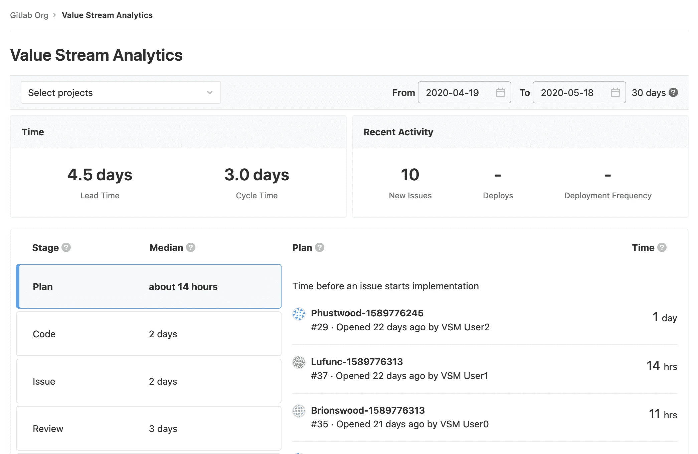
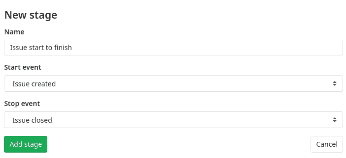
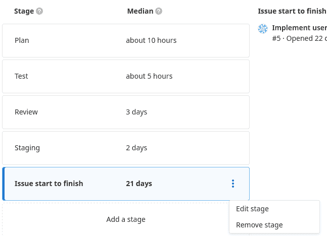
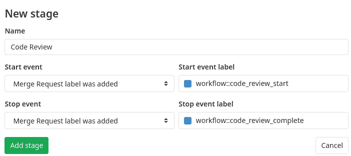

# Value Stream Analytics

> 原文：[https://docs.gitlab.com/ee/user/analytics/value_stream_analytics.html](https://docs.gitlab.com/ee/user/analytics/value_stream_analytics.html)

*   [Overview](#overview)
*   [Date ranges](#date-ranges)
*   [How Time metrics are measured](#how-time-metrics-are-measured)
*   [How the stages are measured](#how-the-stages-are-measured)
*   [Example workflow](#example-workflow)
*   [Customizable Value Stream Analytics](#customizable-value-stream-analytics)
    *   [Stage path](#stage-path)
    *   [Adding a stage](#adding-a-stage)
    *   [Re-ordering stages](#re-ordering-stages)
    *   [Label based stages](#label-based-stages)
    *   [Hiding unused stages](#hiding-unused-stages)
*   [Days to completion chart](#days-to-completion-chart)
    *   [Chart median line](#chart-median-line)
    *   [Disabling chart](#disabling-chart)
    *   [Disabling chart median line](#disabling-chart-median-line)
*   [Type of work - Tasks by type chart](#type-of-work---tasks-by-type-chart)
*   [Permissions](#permissions)
*   [More resources](#more-resources)

# Value Stream Analytics[](#value-stream-analytics "Permalink")

版本历史

*   在项目级别在 GitLab 12.3 之前作为 Cycle Analytics 引入.
*   在小组级别的[GitLab Premium](https://about.gitlab.com/pricing/) 12.3 中[引入](https://gitlab.com/gitlab-org/gitlab/-/issues/12077) .
*   在 GitLab 12.8 中从 Cycle Analytics [重命名](https://gitlab.com/gitlab-org/gitlab/-/merge_requests/23427)为 Value Stream Analytics.

Value Stream Analytics measures the time spent to go from an [idea to production](https://about.gitlab.com/blog/2016/08/05/continuous-integration-delivery-and-deployment-with-gitlab/#from-idea-to-production-with-gitlab) (also known as cycle time) for each of your projects. Value Stream Analytics displays the median time spent in each stage defined in the process.

有关如何为 Value Stream Analytics 的发展做出贡献的信息，请参阅我们的[贡献者文档](../../development/value_stream_analytics.html) .

值流分析有助于快速确定给定项目的速度. 它指出了开发过程中的瓶颈，从而使管理层能够发现，分类和识别软件开发生命周期中速度下降的根本原因.

Value Stream Analytics 与[GitLab 流程](../../topics/gitlab_flow.html)紧密结合，并为每个阶段计算单独的中位数.

## Overview[](#overview "Permalink")

价值流分析可用：

*   在 GitLab 12.9 中，通过**组>分析>值流**在组级别.
*   在项目级别，通过" **项目">"分析">"价值流"** .

作为"价值流分析"计算的一部分，将跟踪七个阶段.

*   **Issue** (Tracker)
    *   安排问题的时间（按里程碑或通过将其添加到问题板）
*   **Plan** (Board)
    *   第一次提交的时间
*   **Code** (IDE)
    *   是时候创建合并请求了
*   **Test** (CI)
    *   GitLab CI / CD 测试代码所需的时间
*   **审核** （合并请求/ MR）
    *   花在代码审查上的时间
*   **暂存** （连续部署）
    *   合并和部署到生产之间的时间
*   **Total** (Total)
    *   总生命周期时间. 也就是说，项目或团队的速度. [以前称为](https://gitlab.com/gitlab-org/gitlab/-/issues/38317) **Production** .

## Date ranges[](#date-ranges "Permalink")

在 GitLab 12.4 中[引入](https://gitlab.com/gitlab-org/gitlab/-/issues/13216) .

GitLab 提供了根据日期范围过滤分析的功能. 要过滤结果：

1.  选择一个组.
2.  （可选）选择一个项目.
3.  使用可用的日期选择器选择日期范围.

## How Time metrics are measured[](#how-time-metrics-are-measured "Permalink")

页面顶部附近的"时间"指标的测量方法如下：

*   **提前期** ：从创建问题到关闭问题的平均时间.
*   **周期时间** ：从第一次提交到发布完成的中值时间.

注意：通过在提交消息中进行[交联](../project/issues/crosslinking_issues.html)或通过手动链接包含提交的合并请求，将提交与问题相关[联](../project/issues/crosslinking_issues.html) .

[](img/vsa_time_metrics_v13_0.png)

## How the stages are measured[](#how-the-stages-are-measured "Permalink")

Value Stream Analytics 根据项目问题记录阶段时间和数据，但阶段和总阶段除外，在阶段和总阶段中，仅测量部署到生产中的数据.

具体而言，如果未设置 CI 且尚未定义`production`或`production/*` [环境](../../ci/yaml/README.html#environment) ，则此阶段将没有任何数据.

下表进一步描述了价值流分析的每个阶段.

| **Stage** | **Description** |
| --- | --- |
| Issue | 通过标记问题或将其添加到里程碑中，以先发生的为准，来衡量从创建问题到采取行动解决问题之间的平均时间. 仅在标签已经为其创建了[发行委员会列表的](../project/issue_board.html)情况下，才会跟踪该标签. |
| Plan | 测量您在上一阶段采取的操作与将第一次提交推入分支之间的平均时间. 分支的第一个提交是触发**计划**和**代码**之间分离的提交，并且分支中的至少一个提交需要包含相关的发行编号（例如`#42` ）. 如果分支中的所有提交都未提及相关的发行号，则不会考虑该阶段的度量时间. |
| Code | 测量推入第一个提交（上一阶段）与创建与该提交相关的合并请求（MR）之间的平均时间. 保持流程跟踪的关键是在合并请求的描述中包括[问题关闭模式](../project/issues/managing_issues.html#closing-issues-automatically) （例如， `Closes #xxx` ，其中`xxx`是与此合并请求相关的问题编号）. 如果合并请求描述中不存在问题结束模式，则不会将 MR 视为平台的测量时间. |
| Test | 测量运行该项目的整个管道的中值时间. 这与 GitLab CI / CD 为推送到上一阶段中定义的合并请求的提交运行每个作业所花费的时间有关. 基本上，这是所有管道的开始->完成时间. |
| Review | 测量从创建到合并之间，审核具有结束问题模式的合并请求所需的平均时间. |
| Staging | 测量从合并合并请求到结束发布模式到首次部署到生产之间的平均时间. 在您的 GitLab CI / CD 配置中，通过设置为`production`或匹配`production/*` （区分大小写， `Production`将不起作用）的环境进行跟踪. 如果没有生产环境，则不会进行跟踪. |
| Total | 从问题创建到将代码部署到生产中，运行整个过程所需的所有时间（中位数）之和. [以前称为](https://gitlab.com/gitlab-org/gitlab/-/issues/38317) **Production** . |

幕后工作原理：

1.  问题和合并请求成对地分组在一起，这样对于每个`<issue, merge request>`对，合并请求都具有对应问题的[问题关闭模式](../project/issues/managing_issues.html#closing-issues-automatically) . **不**考虑所有其他问题和合并请求.
2.  然后，在最近的 XX 天（由 UI 指定-默认为 90 天）中过滤出`<issue, merge request>`对. 因此，它禁止考虑这些对.
3.  对于其余的`<issue, merge request>`对，我们检查阶段所需的信息，例如发行日期，合并请求合并时间等.

综上所述，不会跟踪任何未遵循[GitLab 流程的](../../workflow/gitlab_flow.html)内容，并且 Value Stream Analytics 仪表板将不会显示以下任何数据：

*   合并不会解决问题的请求.
*   未在发行委员会中贴有标签的问题或未分配里程碑的问题.
*   如果项目没有`production`或`production/*`环境，则为阶段和生产阶段.

## Example workflow[](#example-workflow "Permalink")

以下是一个简单的虚拟周期工作流，它在一天中经历了所有七个阶段后，才发生. 请注意，如果一个阶段没有开始和结束标记，则不会对其进行测量，因此不会在中位时间中进行计算. 假定已创建里程碑并配置了用于测试和设置环境的 CI.

1.  在 09:00（ **发行**阶段开始）创建**发行** .
2.  在 11:00（ **发行**阶段停止/ **计划**阶段开始）将发行添加到里程碑.
3.  开始解决此问题，在本地创建一个分支，并在 12:00 提交一次.
4.  对分支进行第二次提交，该分支在 12.30（ **计划**阶段的停止/ **代码**阶段的开始）中提及发行号.
5.  推送分支并创建一个合并请求，该请求的描述在 14:00（ **代码**阶段停止/ **测试**和**复审**阶段开始）中包含[问题关闭模式](../project/issues/managing_issues.html#closing-issues-automatically) .
6.  CI 将开始运行您在[`.gitlab-ci.yml`](../../ci/yaml/README.html)定义的脚本，并需要 5 分钟（ **测试**阶段停止）.
7.  查看合并请求，确保一切正常，然后在 19:00 合并合并请求. （ **复习**阶段的停止/启动**分期**阶段）.
8.  现在，合并请求合并，部署到`production`环境中开始和结束日 19:30（ **分期**阶段停止）.
9.  循环完成，并且先前阶段的中位数时间总和记录到" **总计"**阶段. 这是从创建问题到将其相关合并请求部署到生产之间的时间.

从上面的示例中，您可以得出每个阶段完成所需的时间，只要达到其总时间即可：

*   **问题** ：2 小时（11:00-09:00）
*   **计划** ：1 小时（12:00-11:00）
*   **编码** ：2h（14:00-12:00）
*   **测试时间** ：5 分钟
*   **评论** ：5 小时（19:00-14:00）
*   **演出时间** ：30 分钟（19:30-19:00）
*   **总计** ：由于此阶段测量的是之前所有阶段的中位时间之和，因此如果我们不知道之前各阶段的状态，则无法计算. 如果这是项目中运行的第一个周期，则**总**时间为 10h 30min（19:30-09:00）

一些注意事项：

*   在上面的示例中，我们演示了您的第一次提交没有提到发行号也没关系，您可以稍后在正在处理的分支的任何提交中进行此操作.
*   您可以看到，由于未将" **测试"**阶段计算为整个周期的时间，因此" **检查"**阶段已包含在" **审查"**过程中（应测试每个 MR）.
*   上面的示例只是七个阶段中的**一个循环** . 添加多个周期，计算它们的中值时间，结果就是 Value Stream Analytics 仪表板显示的内容.

## Customizable Value Stream Analytics[](#customizable-value-stream-analytics "Permalink")

在 GitLab 12.9 中[引入](https://gitlab.com/gitlab-org/gitlab/-/issues/12196) .

默认阶段旨在直接使用，但是可能并不适合所有团队. 不同的团队使用不同的方法来构建软件，因此一些团队可能想要自定义其 Value Stream Analytics.

GitLab 允许用户隐藏默认阶段并创建自定义阶段，使其更适合其开发工作流程.

**注意：**自定义性[仅适用于组级别的](https://gitlab.com/gitlab-org/gitlab/-/issues/35823#note_272558950)价值流分析.

### Stage path[](#stage-path "Permalink")

在 GitLab 13.0 中[引入](https://gitlab.com/gitlab-org/gitlab/-/issues/210315) .

从视觉上将阶段描绘为水平过程流. 选择一个阶段将更新值流下方的内容.

默认情况下禁用. 如果您具有自我管理的实例，则管理员可以[打开 Rails 控制台](../../administration/troubleshooting/navigating_gitlab_via_rails_console.html)并使用以下命令启用它：

```
Feature.enable(:value_stream_analytics_path_navigation) 
```

### Adding a stage[](#adding-a-stage "Permalink")

在下面的示例中，我们将创建一个新阶段，该阶段可以衡量和跟踪从创建到关闭的所有问题.

1.  导航到您组的" **分析">"价值流"** .
2.  单击**添加阶段**按钮.
3.  填写新的舞台表格：
    *   名称：问题开始完成.
    *   开始事件：已创建问题.
    *   结束事件：问题已关闭.
4.  单击**添加阶段**按钮.

[](img/new_vsm_stage_v12_9.png)

新阶段将保持不变，并将始终显示在您组的"价值流分析"页面上.

如果要更改或删除阶段，可以通过以下方法轻松地针对自定义阶段进行操作：

1.  Hovering over the stage.
2.  单击垂直省略号（ ）出现的按钮.

[](img/vsm_stage_list_v12_9.png)

创建自定义阶段需要指定两个事件：

*   开始.
*   结束.

请小心选择*在*结束事件*之前*发生的开始事件. 例如，考虑一个阶段：

*   在将问题添加到板上时开始.
*   创建问题时结束.

此阶段将不起作用，因为开始事件发生时，结束事件已经发生. 为防止此类无效阶段，UI 禁止出现不兼容的开始和结束事件. 选择开始事件后，停止事件下拉列表将仅列出兼容事件.

### Re-ordering stages[](#re-ordering-stages "Permalink")

在 GitLab 12.10 中[引入](https://gitlab.com/gitlab-org/gitlab/-/issues/196698) .

添加自定义阶段后，您可以"拖放"阶段以重新排列其顺序. 这些更改将自动保存到系统中.

### Label based stages[](#label-based-stages "Permalink")

预定义的开始和结束事件可以涵盖涉及问题和合并请求的许多用例.

为了支持更复杂的工作流程，请使用基于组标签的阶段. 这些事件基于添加或删除的标签. 特别是， [范围标签](../project/labels.html#scoped-labels-premium)对于复杂的工作流程很有用.

在此示例中，我们希望测量更准确的代码检查时间. 工作流程如下：

*   代码审阅开始时，审阅者将`workflow::code_review_start`标签添加到合并请求中.
*   代码检查完成后，检查者将`workflow::code_review_complete`标签添加到合并请求中.

创建一个称为"代码审查"的新阶段：

[](img/label_based_stage_vsm_v12_9.png)

### Hiding unused stages[](#hiding-unused-stages "Permalink")

有时某些默认阶段与团队无关. 在这种情况下，您可以轻松隐藏阶段，使它们不再出现在列表中. 隐藏阶段：

1.  添加定制阶段以激活可定制性.
2.  将鼠标悬停在要隐藏的默认阶段上.
3.  单击垂直省略号（ ）按钮出现，然后选择" **隐藏舞台"** .

要恢复以前隐藏的默认阶段：

1.  Click **添加一个阶段** button.
2.  在右上角打开" **恢复隐藏的阶段"**下拉列表.
3.  选择一个阶段.

## Days to completion chart[](#days-to-completion-chart "Permalink")

在 GitLab 12.6 中[引入](https://gitlab.com/gitlab-org/gitlab/-/merge_requests/21631) .

该图表直观地描述了完成周期所需的总天数.

该图表使用全局页面过滤器来基于选定的组，项目和时间范围显示数据. 此外，可以从图表本身内选择特定阶段.

### Chart median line[](#chart-median-line "Permalink")

在 GitLab 12.7 中[引入](https://gitlab.com/gitlab-org/gitlab/-/issues/36675) .

图表上的中间线显示的数据偏移了所选的天数. 例如，如果选择了 30 天的数据（例如 2019-12-16 至 2020-01-15），则中线将代表前 30 天的数据（2019-11-16 至 2019-12 -16）作为要比较的指标.

### Disabling chart[](#disabling-chart "Permalink")

This chart is enabled by default. If you have a self-managed instance, an administrator can open a Rails console and disable it with the following command:

```
Feature.disable(:cycle_analytics_scatterplot_enabled) 
```

### Disabling chart median line[](#disabling-chart-median-line "Permalink")

默认情况下，此图表的中线是启用的. 如果您具有自我管理的实例，则管理员可以打开 Rails 控制台并使用以下命令将其禁用：

```
Feature.disable(:cycle_analytics_scatterplot_median_enabled) 
```

## Type of work - Tasks by type chart[](#type-of-work---tasks-by-type-chart "Permalink")

在 GitLab 12.10 中[引入](https://gitlab.com/gitlab-org/gitlab/-/issues/32421) .

此图表显示每天的问题和合并请求的累积计数.

该图表使用全局页面过滤器来基于选定的组，项目和时间范围显示数据. 该图表默认为显示问题计数，但可以切换为显示合并请求数据，并进一步细化为特定的组级标签.

默认情况下，预先选择了最高的组级别标签（最多 10 个），最多可以选择 15 个标签.

## Permissions[](#permissions "Permalink")

Project Value Stream Analytics 仪表板上的当前权限为：

*   公共项目-任何人都可以访问.
*   内部项目-任何经过身份验证的用户都可以访问.
*   私人项目-访客及以上的任何成员都可以访问.

您通常可以[阅读有关权限的更多信息](../../ci/yaml/README.html) .

对于 GitLab 12.3 和更高版本中引入的 Value Stream Analytics 功能：

*   用户必须具有 Reporter 或更高权限.
*   仅在[Premium 或 Silver 等级](https://about.gitlab.com/pricing/)及更高[级别](https://about.gitlab.com/pricing/)上可用.

## More resources[](#more-resources "Permalink")

Learn more about Value Stream Analytics in the following resources:

*   [Value Stream Analytics feature page](https://about.gitlab.com/stages-devops-lifecycle/value-stream-analytics/).
*   [Value Stream Analytics feature preview](https://about.gitlab.com/blog/2016/09/16/feature-preview-introducing-cycle-analytics/).
*   [Value Stream Analytics feature highlight](https://about.gitlab.com/blog/2016/09/21/cycle-analytics-feature-highlight/).