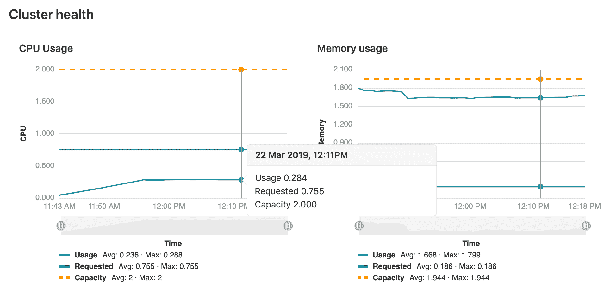

# Kubernetes clusters

> 原文：[https://docs.gitlab.com/ee/user/project/clusters/](https://docs.gitlab.com/ee/user/project/clusters/)

*   [Overview](#overview)
*   [Setting up](#setting-up)
    *   [Supported cluster versions](#supported-cluster-versions)
    *   [Adding and removing clusters](#adding-and-removing-clusters)
    *   [Multiple Kubernetes clusters](#multiple-kubernetes-clusters)
        *   [Setting the environment scope](#setting-the-environment-scope-premium)
*   [Configuring your Kubernetes cluster](#configuring-your-kubernetes-cluster)
    *   [Security implications](#security-implications)
    *   [GitLab-managed clusters](#gitlab-managed-clusters)
        *   [Important notes](#important-notes)
        *   [Clearing the cluster cache](#clearing-the-cluster-cache)
    *   [Base domain](#base-domain)
*   [Installing applications](#installing-applications)
*   [Auto DevOps](#auto-devops)
*   [Deploying to a Kubernetes cluster](#deploying-to-a-kubernetes-cluster)
    *   [Deployment variables](#deployment-variables)
    *   [Custom namespace](#custom-namespace)
    *   [Integrations](#integrations)
        *   [Canary Deployments](#canary-deployments-premium)
        *   [Deploy Boards](#deploy-boards-premium)
        *   [Viewing pod logs](#viewing-pod-logs)
        *   [Web terminals](#web-terminals)
    *   [Troubleshooting](#troubleshooting)
*   [Monitoring your Kubernetes cluster](#monitoring-your-kubernetes-cluster)
    *   [Visualizing cluster health](#visualizing-cluster-health)

# Kubernetes clusters[](#kubernetes-clusters "Permalink")

版本历史

*   在项目的 GitLab 10.1 中[引入](https://gitlab.com/gitlab-org/gitlab-foss/-/issues/35954) .
*   在 GitLab 11.6 中针对[组](../../group/clusters/index.html) [引入](https://gitlab.com/gitlab-org/gitlab-foss/-/issues/34758) .
*   在 GitLab 11.11 中[引入](https://gitlab.com/gitlab-org/gitlab-foss/-/issues/39840)了[实例](../../instance/clusters/index.html) .

## Overview[](#overview "Permalink")

使用 GitLab 项目 Kubernetes 集成，您可以：

*   Use [Review Apps](../../../ci/review_apps/index.html).
*   Run [pipelines](../../../ci/pipelines/index.html).
*   [部署](#deploying-to-a-kubernetes-cluster)您的应用程序.
*   检测和[监控 Kubernetes](#monitoring-your-kubernetes-cluster) .
*   与[Auto DevOps](#auto-devops)一起使用.
*   Use [Web terminals](#web-terminals).
*   Use [Deploy Boards](#deploy-boards-premium).
*   Use [Canary Deployments](#canary-deployments-premium).
*   View [Logs](#viewing-pod-logs).
*   [使用 Knative](serverless/index.html)在[Kubernetes 上](serverless/index.html)运行无服务器工作负载.

除了在项目级别进行集成之外，Kubernetes 集群还可以在[组级别](../../group/clusters/index.html)或[GitLab 实例级别](../../instance/clusters/index.html)进行集成.

## Setting up[](#setting-up "Permalink")

### Supported cluster versions[](#supported-cluster-versions "Permalink")

GitLab 承诺在任何给定时间至少支持两个生产就绪的 Kubernetes 次要版本. 我们会定期审查我们支持的版本，并提供四个月的弃用期，然后再删除特定版本的支持. 支持的版本范围基于以下方面的评估：

*   我们自己的需求.
*   主要托管 Kubernetes 提供商支持的版本.
*   [Kubernetes 社区支持](https://kubernetes.io/docs/setup/release/version-skew-policy/#supported-versions)的版本.

当前，GitLab 支持以下 Kubernetes 版本：

*   1.16
*   1.15
*   1.14
*   1.13（不建议使用，支持终止于 2020 年 11 月 22 日）
*   1.12（不建议使用，支持终止于 2020 年 9 月 22 日）

**注意：**某些 GitLab 功能可能支持此处提供的范围之外的版本.

### Adding and removing clusters[](#adding-and-removing-clusters "Permalink")

有关如何执行以下操作的详细信息，请参见[添加和删​​除 Kubernetes 集群](add_remove_clusters.html) ：

*   使用 GitLab 的 UI 在 Google Cloud Platform（GCP）或 Amazon Elastic Kubernetes Service（EKS）中创建集群.
*   从任何 Kubernetes 平台向现有集群添加集成.

### Multiple Kubernetes clusters[](#multiple-kubernetes-clusters "Permalink")

版本历史

*   在[GitLab Premium](https://about.gitlab.com/pricing/) 10.3 中引入
*   在 13.2 中[移至](https://gitlab.com/gitlab-org/gitlab/-/merge_requests/35094) GitLab 核心.

您可以将多个 Kubernetes 集群关联到您的项目. 这样，您可以为不同的环境（例如开发，登台，生产等）使用不同的集群.

就像您第一次一样，只需添加另一个集群，并确保[设置一个环境范围即可](#setting-the-environment-scope-premium)将新集群与其他集群区分开.

#### Setting the environment scope[](#setting-the-environment-scope-premium "Permalink")

将多个 Kubernetes 集群添加到您的项目时，您需要通过环境范围来区分它们. 环境范围将群集与[环境](../../../ci/environments/index.html)相关联，类似于[特定](../../../ci/variables/README.html#limit-the-environment-scopes-of-environment-variables)于[环境的变量的](../../../ci/variables/README.html#limit-the-environment-scopes-of-environment-variables)工作方式.

默认环境范围是`*` ，这意味着所有作业，无论其环境如何，都将使用该群集. 每个作用域只能由项目中的单个群集使用，否则将发生验证错误. 另外，没有设置环境关键字的作业将无法访问任何群集.

例如，假设项目中存在以下 Kubernetes 集群：

| Cluster | 环境范围 |
| --- | --- |
| Development | `*` |
| Production | `production` |

[`.gitlab-ci.yml`](../../../ci/yaml/README.html)中设置了以下环境：

```
stages:
  - test
  - deploy

test:
  stage: test
  script: sh test

deploy to staging:
  stage: deploy
  script: make deploy
  environment:
    name: staging
    url: https://staging.example.com/

deploy to production:
  stage: deploy
  script: make deploy
  environment:
    name: production
    url: https://example.com/ 
```

结果将是：

*   The Development cluster details will be available in the `deploy to staging` job.
*   生产集群详细信息将在`deploy to production`作业中提供.
*   `test`作业中没有可用的群集详细信息，因为它没有定义任何环境.

## Configuring your Kubernetes cluster[](#configuring-your-kubernetes-cluster "Permalink")

[将 Kubernetes 群集添加](add_remove_clusters.html)到 GitLab 之后，请阅读本节，其中涵盖了使用 GitLab 配置 Kubernetes 群集的重要注意事项.

### Security implications[](#security-implications "Permalink")

**Important:** The whole cluster security is based on a model where [developers](../../permissions.html) are trusted, so **仅允许受信任的用户控制您的集群**.

默认的群集配置授予对成功构建和部署容器化应用程序所需的广泛功能的访问权限. 请记住，群集上运行的所有应用程序都使用相同的凭据.

### GitLab-managed clusters[](#gitlab-managed-clusters "Permalink")

版本历史

*   在 GitLab 11.5 中[引入](https://gitlab.com/gitlab-org/gitlab-foss/-/merge_requests/22011) .
*   在 GitLab 11.11 中成为[可选](https://gitlab.com/gitlab-org/gitlab-foss/-/merge_requests/26565) .

您可以选择允许 GitLab 为您管理集群. 如果您的集群由 GitLab 管理，则将自动创建项目资源. 有关创建哪些资源的详细信息，请参见" [访问控制"](add_remove_clusters.html#access-controls)部分.

如果选择管理自己的群集，则不会自动创建特定于项目的资源. 如果使用的是[Auto DevOps](../../../topics/autodevops/index.html) ，则需要显式提供部署作业将使用的`KUBE_NAMESPACE` [部署变量](#deployment-variables) ，否则将为您创建一个名称空间.

#### Important notes[](#important-notes "Permalink")

在 GitLab 和集群上注意以下几点：

*   如果您在群集上[安装应用程序](#installing-applications) ，即使您选择管理自己的群集，GitLab 也会创建运行这些资源所需的资源.
*   请注意，手动管理由 GitLab 创建的资源（例如名称空间和服务帐户）可能会导致意外错误. 如果发生这种情况，请尝试[清除集群缓存](#clearing-the-cluster-cache) .

#### Clearing the cluster cache[](#clearing-the-cluster-cache "Permalink")

在 GitLab 12.6 中[引入](https://gitlab.com/gitlab-org/gitlab/-/issues/31759) .

如果您选择允许 GitLab 为您管理集群，则 GitLab 将存储它为项目创建的名称空间和服务帐户的缓存版本. 如果在群集中手动修改这些资源，则此缓存可能与群集不同步，这可能导致部署作业失败.

清除缓存：

1.  导航到项目的" **操作">" Kubernetes"**页面，然后选择您的集群.
2.  展开**高级设置**部分.
3.  Click **Clear cluster cache**.

### Base domain[](#base-domain "Permalink")

在 GitLab 11.8 中[引入](https://gitlab.com/gitlab-org/gitlab-foss/-/merge_requests/24580) .

**注意：**使用 GitLab Serverless 时，无需在群集设置上指定基本域. 在这种情况下，域将被指定为 Knative 安装的一部分. 请参阅[安装应用程序](#installing-applications) .

指定基本域将自动将`KUBE_INGRESS_BASE_DOMAIN`设置为环境变量. 如果您使用的是[Auto DevOps](../../../topics/autodevops/index.html) ，则此域将用于不同的阶段. 例如，"自动查看应用程序"和"自动部署".

该域应将通配符 DNS 配置为入口 IP 地址. 安装 Ingress 之后（请参阅[安装应用程序](#installing-applications) ），您可以：

*   创建一个指向您的域提供商指向入口 IP 地址的`A`记录.
*   使用 nip.io 或 xip.io 之类的服务输入通配符 DNS 地址. 例如， `192.168.1.1.xip.io` .

## Installing applications[](#installing-applications "Permalink")

GitLab 可以在项目级集群中安装和管理一些应用程序，例如 Helm，GitLab Runner，Ingress，Prometheus 等. 有关为项目集群安装，升级，卸载和故障排除应用程序的更多信息，请参阅[GitLab 托管应用程序](../../clusters/applications.html) .

## Auto DevOps[](#auto-devops "Permalink")

Auto DevOps 自动检测，构建，测试，部署和监视您的应用程序.

要充分利用 Auto DevOps（自动部署，自动查看应用程序和自动监控），您需要启用 Kubernetes 项目集成.

[Read more about Auto DevOps](../../../topics/autodevops/index.html)

**注意** Kubernetes 群集可以在没有 Auto DevOps 的情况下使用.

## Deploying to a Kubernetes cluster[](#deploying-to-a-kubernetes-cluster "Permalink")

Kubernetes 集群可以作为部署作业的目标. 如果

*   该集群与 GitLab 集成在一起，特殊的[部署变量](#deployment-variables)可用于您的工作，并且不需要配置. 您可以使用诸如`kubectl`或`helm`工具立即开始从作业中与集群进行交互.
*   您无需使用 GitLab 的集群集成，仍然可以将其部署到集群中. 但是，您需要自己使用[环境变量](../../../ci/variables/README.html#custom-environment-variables)配置 Kubernetes 工具，然后才能通过作业与集群进行交互.

### Deployment variables[](#deployment-variables "Permalink")

Kubernetes 集群集成在 GitLab CI / CD 构建环境中公开了以下[部署变量](../../../ci/variables/README.html#deployment-environment-variables) .

| Variable | Description |
| --- | --- |
| `KUBE_URL` | 等于 API URL. |
| `KUBE_TOKEN` | [环境服务帐户](add_remove_clusters.html#access-controls)的 Kubernetes 令牌. |
| `KUBE_NAMESPACE` | 与项目的部署服务帐户关联的名称空间. 格式为`<project_name>-<project_id>-<environment>` . 对于由 GitLab 管理的集群，GitLab 会在集群中自动创建一个匹配的名称空间. |
| `KUBE_CA_PEM_FILE` | 包含 PEM 数据的文件的路径. 仅当指定了自定义 CA 捆绑包时才存在. |
| `KUBE_CA_PEM` | （ **已弃用** ）原始 PEM 数据. 仅当指定了自定义 CA 捆绑包时. |
| `KUBECONFIG` | 包含用于此部署的`kubeconfig`的文件的路径. 如果指定，则将嵌入 CA 捆绑软件. 此配置还嵌入了在`KUBE_TOKEN`定义的相同令牌，因此您可能只需要此变量. 该变量名也会由`kubectl`自动选择，因此，如果使用`kubectl`则实际上不需要显式引用它. |
| `KUBE_INGRESS_BASE_DOMAIN` | 从 GitLab 11.8 开始，此变量可用于为每个群集设置一个域. 有关更多信息，请参见[群集域](#base-domain) . |

**注意：**在 GitLab 11.5 之前， `KUBE_TOKEN`是集群集成的主要服务帐户的 Kubernetes 令牌.**注意：**如果您的集群是在 GitLab 12.2 之前创建的，则默认`KUBE_NAMESPACE`将设置为`<project_name>-<project_id>` .

### Custom namespace[](#custom-namespace "Permalink")

在 GitLab 12.6 中[引入](https://gitlab.com/gitlab-org/gitlab/-/issues/27630) .

Kubernetes 集成默认为格式为`<project_name>-<project_id>-<environment>`的特定于项目环境的名称空间（请参阅[部署变量](#deployment-variables) ）.

对于**非** GitLab 管理的集群，可以使用`.gitlab-ci.yml` [`environment:kubernetes:namespace`](../../../ci/environments/index.html#configuring-kubernetes-deployments)来定制[`environment:kubernetes:namespace`](../../../ci/environments/index.html#configuring-kubernetes-deployments) .

**注意：**使用[GitLab 管理的集群时](#gitlab-managed-clusters) ，名称空间是在部署之前自动创建的， [无法自定义](https://gitlab.com/gitlab-org/gitlab/-/issues/38054) .

### Integrations[](#integrations "Permalink")

#### Canary Deployments[](#canary-deployments-premium "Permalink")

利用[Kubernetes 的 Canary 部署，](https://kubernetes.io/docs/concepts/cluster-administration/manage-deployment/#canary-deployments)并在部署板内部可视化您的 Canary 部署，而无需离开 GitLab.

[Read more about Canary Deployments](../canary_deployments.html)

#### Deploy Boards[](#deploy-boards-premium "Permalink")

GitLab 的部署板提供了 Kubernetes 上运行的每个 CI [环境](../../../ci/environments/index.html)的当前运行状况和状态的合并视图，显示了部署中 Pod 的状态. 开发人员和其他团队成员可以在已经使用的工作流程中逐个窗格地查看发布的进度和状态，而无需访问 Kubernetes.

[Read more about Deploy Boards](../deploy_boards.html)

#### Viewing pod logs[](#viewing-pod-logs "Permalink")

使用 GitLab 可以轻松查看连接的 Kubernetes 集群中正在运行的 Pod 的日志. 通过直接在 GitLab 中显示日志，开发人员可以避免管理控制台工具或跳转到其他界面.

[Read more about Kubernetes logs](kubernetes_pod_logs.html)

#### Web terminals[](#web-terminals "Permalink")

在 GitLab 8.15 中引入.

启用后，Kubernetes 集成将为您的[环境](../../../ci/environments/index.html)添加[Web 终端](../../../ci/environments/index.html#web-terminals)支持. 这基于 Docker 和 Kubernetes 中的`exec`功能，因此您可以在现有容器中获得一个新的 Shell 会话. 要使用此集成，您应该使用上面的部署变量将其部署到 Kubernetes，并确保对所有部署，副本集和 Pod 进行注释：

*   `app.gitlab.com/env: $CI_ENVIRONMENT_SLUG`
*   `app.gitlab.com/app: $CI_PROJECT_PATH_SLUG`

`$CI_ENVIRONMENT_SLUG`和`$CI_PROJECT_PATH_SLUG`是 CI 变量的值.

您必须是项目所有者或拥有`maintainer`权限才能使用终端. 支持仅限于环境中第一个容器中的第一个容器.

### Troubleshooting[](#troubleshooting "Permalink")

在开始部署作业之前，GitLab 将为部署作业专门创建以下内容：

*   命名空间.
*   A service account.

但是，有时 GitLab 无法创建它们. 在这种情况下，您的工作将失败，并显示以下消息：

```
This job failed because the necessary resources were not successfully created. 
```

要在创建名称空间和服务帐户时查找导致此错误的原因，请检查[日志](../../../administration/logs.html#kuberneteslog) .

失败的原因包括：

*   您为 GitLab 提供的令牌没有 GitLab 所需的[`cluster-admin`](https://kubernetes.io/docs/reference/access-authn-authz/rbac/#user-facing-roles)特权.
*   缺少`KUBECONFIG`或`KUBE_TOKEN`变量. 要传递给您的工作，他们必须具有匹配的[`environment:name`](../../../ci/environments/index.html#defining-environments) . 如果您的作业没有设置`environment:name` ，则不会通过 Kubernetes 凭据.

**注意：**从 GitLab 12.0 或更早版本升级的项目级群集可能以导致此错误的方式进行配置. 如果要自己管理名称空间和服务帐户，请确保取消选择由[GitLab 管理的群集](#gitlab-managed-clusters)选项.

## Monitoring your Kubernetes cluster[](#monitoring-your-kubernetes-cluster "Permalink")

自动检测和监控 Kubernetes 指标. 还支持[NGINX Ingress 的](../integrations/prometheus_library/nginx.html)自动监视.

[Read more about Kubernetes monitoring](../integrations/prometheus_library/kubernetes.html)

### Visualizing cluster health[](#visualizing-cluster-health "Permalink")

版本历史

*   在[GitLab Ultimate](https://about.gitlab.com/pricing/) 10.6 中[引入](https://gitlab.com/gitlab-org/gitlab/-/merge_requests/4701) .
*   在 13.2 中[移至](https://gitlab.com/gitlab-org/gitlab/-/issues/208224) GitLab 核心.

[部署 Prometheus 后](#installing-applications) ，GitLab 将自动监视群集的运行状况. 在群集设置页面的顶部，显示 CPU 和内存利用率以及可用总量. 如果群集的内存不足，则监视群集资源可能很重要，可能会关闭或无法启动.

[](img/k8s_cluster_monitoring.png)