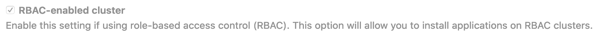

# Adding and removing Kubernetes clusters

> 原文：[https://docs.gitlab.com/ee/user/project/clusters/add_remove_clusters.html](https://docs.gitlab.com/ee/user/project/clusters/add_remove_clusters.html)

*   [Before you begin](#before-you-begin)
*   [Access controls](#access-controls)
    *   [Important notes](#important-notes)
    *   [RBAC cluster resources](#rbac-cluster-resources)
    *   [ABAC cluster resources](#abac-cluster-resources)
    *   [Security of GitLab Runners](#security-of-gitlab-runners)
*   [Create new cluster](#create-new-cluster)
*   [Add existing cluster](#add-existing-cluster)
    *   [Existing Kubernetes cluster](#existing-kubernetes-cluster)
        *   [Disable Role-Based Access Control (RBAC) (optional)](#disable-role-based-access-control-rbac-optional)
*   [Enabling or disabling integration](#enabling-or-disabling-integration)
*   [Removing integration](#removing-integration)
*   [Learn more](#learn-more)

# Adding and removing Kubernetes clusters[](#adding-and-removing-kubernetes-clusters "Permalink")

GitLab 为以下 Kubernetes 提供者提供了集成的集群创建功能：

*   Google Kubernetes 引擎（GKE）.
*   Amazon Elastic Kubernetes 服务（EKS）.

GitLab 还可以与本地或托管的任何标准 Kubernetes 提供程序集成.

**注意：**观看[使用 GitLab 和 Google Cloud Platform 进行](https://about.gitlab.com/webcast/scalable-app-deploy/)的网络广播[可扩展应用程序部署，](https://about.gitlab.com/webcast/scalable-app-deploy/)并了解如何通过单击几下加速由 Google Cloud Platform（GCP）管理的 Kubernetes 集群.**提示：**每个新的 Google Cloud Platform（GCP）帐户[在注册后](https://console.cloud.google.com/freetrial)都会获得[$ 300 的信用额](https://console.cloud.google.com/freetrial) ，并且与 Google 合作，GitLab 能够为新的 GCP 帐户提供额外的$ 200，以开始使用 GitLab 的 Google Kubernetes Engine Integration. 您所要做的就是[点击此链接](https://cloud.google.com/partners/partnercredit/?pcn_code=0014M00001h35gDQAQ#contact-form)并申请信贷.

## Before you begin[](#before-you-begin "Permalink")

在使用 GitLab [添加 Kubernetes 集群](#create-new-cluster)之前，您需要：

*   GitLab 本身. 要么：
    *   一个[GitLab.com 帐户](https://about.gitlab.com/pricing/#gitlab-com) .
    *   使用 GitLab 12.5 或更高版本的[自我管理安装](https://about.gitlab.com/pricing/#self-managed) . 这将确保 GitLab UI 可用于创建集群.
*   以下 GitLab 访问：
    *   [维护者](../../permissions.html#project-members-permissions)对项目级集群的项目[访问](../../permissions.html#project-members-permissions) .
    *   [维护者](../../permissions.html#group-members-permissions)对组级别集群的[访问权限](../../permissions.html#group-members-permissions) .
    *   自我管理的实例级别群集的管理[区域访问](../../admin_area/index.html) .

## Access controls[](#access-controls "Permalink")

在 GitLab 中创建集群时，系统会询问您是否要创建以下任一集群：

*   A [Role-based access control (RBAC)](https://kubernetes.io/docs/reference/access-authn-authz/rbac/) cluster.
*   An [Attribute-based access control (ABAC)](https://kubernetes.io/docs/reference/access-authn-authz/abac/) cluster.

**注意：**建议使用[RBAC](#rbac-cluster-resources) ，GitLab 为默认值.

GitLab 创建必要的服务帐户和特权，以安装和运行[GitLab 托管的应用程序](index.html#installing-applications) . 当 GitLab 创建集群时，将在`default`名称空间中创建具有`cluster-admin`特权的`gitlab`服务帐户，以管理新创建的集群.

**注意：**用于部署的受限服务帐户是在 GitLab 11.5 中[引入的](https://gitlab.com/gitlab-org/gitlab-foss/-/issues/51716) .

The first time you install an application into your cluster, the `tiller` service account is created with `cluster-admin` privileges in the `gitlab-managed-apps` namespace. This service account will be used by Helm to install and run [GitLab managed applications](index.html#installing-applications).

Helm 还将为每个已安装的应用程序创建其他服务帐户和其他资源. 有关每个应用程序，请查阅 Helm 图表的文档.

如果要[添加现有的 Kubernetes 集群](add_remove_clusters.html#add-existing-cluster) ，请确保该帐户的令牌具有该集群的管理员特权.

GitLab 创建的资源取决于集群的类型.

### Important notes[](#important-notes "Permalink")

请注意以下有关访问控制的内容：

*   仅当集群[由 GitLab 管理时，](index.html#gitlab-managed-clusters)才会创建特定于环境的资源.
*   如果您的集群是在 GitLab 12.2 之前创建的，它将为所有项目环境使用单个名称空间.

### RBAC cluster resources[](#rbac-cluster-resources "Permalink")

GitLab 为 RBAC 集群创建以下资源.

| Name | Type | Details | 创建时间 |
| --- | --- | --- | --- |
| `gitlab` | `ServiceAccount` | `default` namespace | 创建一个新集群 |
| `gitlab-admin` | `ClusterRoleBinding` | [`cluster-admin`](https://kubernetes.io/docs/reference/access-authn-authz/rbac/#user-facing-roles) roleRef | 创建一个新集群 |
| `gitlab-token` | `Secret` | `gitlab` ServiceAccount 的令牌 | 创建一个新集群 |
| `tiller` | `ServiceAccount` | `gitlab-managed-apps` namespace | 安装舵图 |
| `tiller-admin` | `ClusterRoleBinding` | `cluster-admin` roleRef | 安装舵图 |
| 环境名称空间 | `Namespace` | 包含所有特定于环境的资源 | 部署到集群 |
| 环境名称空间 | `ServiceAccount` | 使用环境的名称空间 | 部署到集群 |
| 环境名称空间 | `Secret` | 环境 ServiceAccount 的令牌 | 部署到集群 |
| 环境名称空间 | `RoleBinding` | [`edit`](https://kubernetes.io/docs/reference/access-authn-authz/rbac/#user-facing-roles) roleRef | 部署到集群 |

### ABAC cluster resources[](#abac-cluster-resources "Permalink")

GitLab 为 ABAC 群集创建以下资源.

| Name | Type | Details | 创建时间 |
| --- | --- | --- | --- |
| `gitlab` | `ServiceAccount` | `default` namespace | 创建一个新集群 |
| `gitlab-token` | `Secret` | `gitlab` ServiceAccount 的令牌 | 创建一个新集群 |
| `tiller` | `ServiceAccount` | `gitlab-managed-apps` namespace | 安装舵图 |
| `tiller-admin` | `ClusterRoleBinding` | `cluster-admin` roleRef | 安装舵图 |
| 环境名称空间 | `Namespace` | 包含所有特定于环境的资源 | 部署到集群 |
| 环境名称空间 | `ServiceAccount` | 使用环境的名称空间 | 部署到集群 |
| 环境名称空间 | `Secret` | 环境 ServiceAccount 的令牌 | 部署到集群 |

### Security of GitLab Runners[](#security-of-gitlab-runners "Permalink")

GitLab Runners 默认情况[下](https://docs.gitlab.com/runner/executors/docker.html)启用了[特权模式](https://docs.gitlab.com/runner/executors/docker.html) ，这使他们可以执行特殊命令并在 Docker 中运行 Docker. 运行某些[Auto DevOps](../../../topics/autodevops/index.html)作业需要此功能. 这意味着容器正在特权模式下运行，因此，您应该注意一些重要的细节.

特权标志为正在运行的容器提供了所有功能，而容器又可以执行主机可以执行的几乎所有操作. 请注意与对任意映像执行`docker run`操作相关的固有安全风险，因为它们有效地具有 root 用户访问权限.

如果您不想在特权模式下使用 GitLab Runner，请执行以下任一操作：

*   在 GitLab.com 上使用共享的跑步者. 他们没有这个安全问题.
*   使用[Shared Runners 中](../../gitlab_com/index.html#shared-runners)描述的配置来设置自己的[Runners](../../gitlab_com/index.html#shared-runners) . 这涉及：
    1.  确保您没有通过[应用程序](index.html#installing-applications)安装它.
    2.  [使用`docker+machine`](https://docs.gitlab.com/runner/executors/docker_machine.html)安装 Runner.

## Create new cluster[](#create-new-cluster "Permalink")

可以使用 Google Kubernetes Engine（GKE）上的 GitLab 或 Amazon Elastic Kubernetes Service（EKS）在项目，组或实例级别上创建新集群：

1.  导航到您的：
    *   项目的 **操作> Kubernetes**页面，用于项目级集群.
    *   组的 **Kubernetes**页面，用于组级别集群.
    *   **管理区>** **Kubernetes**页面，用于实例级集群.
2.  Click **添加 Kubernetes 集群**.
3.  单击**创建新集群**选项卡.
4.  单击**Amazon EKS**或**Google GKE** ，然后按照说明提供所需的服务：
    *   [亚马逊 EKS](add_eks_clusters.html#new-eks-cluster) .
    *   [Google GKE](add_gke_clusters.html#creating-the-cluster-on-gke) .

## Add existing cluster[](#add-existing-cluster "Permalink")

如果您已有 Kubernetes 集群，则可以将其添加到项目，组或实例中.

**注意：** arm64 集群不支持 Kubernetes 集成. 有关详细信息，请参阅问题[Helm Tiller 无法在 arm64 群集上安装](https://gitlab.com/gitlab-org/gitlab/-/issues/29838) .

### Existing Kubernetes cluster[](#existing-kubernetes-cluster "Permalink")

要将 Kubernetes 集群添加到您的项目，组或实例：

1.  导航到您的：
    1.  项目的 **操作> Kubernetes**页面，用于项目级集群.
    2.  组的 **Kubernetes**页面，用于组级别集群.
    3.  **管理区>** **Kubernetes**页面，用于实例级集群.
2.  Click **添加 Kubernetes 集群**.
3.  单击**添加现有集群**选项卡，然后填写详细信息：
    1.  **Kubernetes 集群名称** （必填）-您希望为**集群指定**的名称.
    2.  **环境范围** （必需）- [与](index.html#setting-the-environment-scope-premium)此集群[相关的环境](index.html#setting-the-environment-scope-premium) .
    3.  **API URL** （必填）-这是 GitLab 用于访问 Kubernetes API 的 URL. Kubernetes 公开了几个 API，我们想要所有这些 API 通用的"基本" URL. 例如， `https://kubernetes.example.com`而不是`https://kubernetes.example.com/api/v1` .

        通过运行以下命令获取 API URL：

        ```
         kubectl cluster-info | grep 'Kubernetes master' | awk '/http/ {print $NF}' 
        ```

    4.  **CA 证书** （必需）-需要有效的 Kubernetes 证书才能对集群进行身份验证. 我们将使用默认创建的证书.
        1.  列出带有`kubectl get secrets` ，并且应将其命名类似于`default-token-xxxxx` . 复制该令牌名称以在下面使用.
        2.  通过运行以下命令获取证书：

            ```
             kubectl get secret <secret name> -o jsonpath = "{['data']['ca \. crt']}" | base64 --decode 
            ```

            **注意：**如果命令返回整个证书链，则需要在证书链的底部复制*根 ca*证书.
    5.  **令牌** -GitLab 使用服务令牌对 Kubernetes 进行身份验证，服务令牌的作用域是特定的`namespace` . **使用的令牌应属于具有[`cluster-admin`](https://kubernetes.io/docs/reference/access-authn-authz/rbac/#user-facing-roles)特权的服务帐户.** 要创建此服务帐户：
        1.  创建一个名为`gitlab-admin-service-account.yaml` ，其内容为：

            ```
             apiVersion : v1 kind : ServiceAccount metadata : name : gitlab-admin namespace : kube-system --- apiVersion : rbac.authorization.k8s.io/v1beta1 kind : ClusterRoleBinding metadata : name : gitlab-admin roleRef : apiGroup : rbac.authorization.k8s.io kind : ClusterRole name : cluster-admin subjects : - kind : ServiceAccount name : gitlab-admin namespace : kube-system 
            ```

        2.  将服务帐户和群集角色绑定应用于您的群集：

            ```
             kubectl apply -f gitlab-admin-service-account.yaml 
            ```

            您将需要`container.clusterRoleBindings.create`权限来创建集群级角色. 如果您没有此权限，则可以选择启用基本身份验证，然后以管理员身份运行`kubectl apply`命令：

            ```
             kubectl apply -f gitlab-admin-service-account.yaml --username = admin --password = <password> 
            ```

            **注意：**可以打开基本身份验证，并可以使用 Google Cloud Console 获取密码凭据.

            输出：

            ```
             serviceaccount "gitlab-admin" created clusterrolebinding "gitlab-admin" created 
            ```

        3.  检索`gitlab-admin`服务帐户的令牌：

            ```
             kubectl -n kube-system describe secret $( kubectl -n kube-system get secret | grep gitlab-admin | awk '{print $1}' ) 
            ```

            从输出中复制`<authentication_token>`值：

            ```
             Name : gitlab-admin-token-b5zv4 Namespace : kube-system Labels : <none> Annotations : kubernetes.io/service-account.name=gitlab-admin kubernetes.io/service-account.uid=bcfe66ac-39be-11e8-97e8-026dce96b6e8 Type : kubernetes.io/service-account-token Data ==== ca.crt : 1025 bytes namespace : 11 bytes token : <authentication_token> 
            ```

            **注意：**对于 GKE 群集，您将需要`container.clusterRoleBindings.create`权限来创建群集角色绑定. 您可以按照[Google Cloud 文档](https://cloud.google.com/iam/docs/granting-changing-revoking-access)授予访问权限.
    6.  **由 GitLab 管理的群集** -如果要让 GitLab 管理该群集的名称空间和服务帐户，请选中此复选框. 有关更多信息，请参见[托管集群部分](index.html#gitlab-managed-clusters) .
    7.  **项目名称空间** （可选）-您不必填写它； 将其保留为空白，GitLab 将为您创建一个. 也：
        *   每个项目应具有唯一的名称空间.
        *   如果您正在使用具有更广泛权限的机密（例如`default`的机密），则项目名称空间不一定是机密的名称空间.
        *   你**不**应该使用`default`为项目命名空间.
        *   如果您或某人为项目专门创建了一个秘密（通常具有有限的权限），则该秘密的名称空间和项目名称空间可能是相同的.
4.  最后，单击**创建 Kubernetes 集群**按钮.

几分钟后，您的集群将准备就绪. 现在，您可以继续安装一些[预定义的应用程序](index.html#installing-applications) .

#### Disable Role-Based Access Control (RBAC) (optional)[](#disable-role-based-access-control-rbac-optional "Permalink")

通过 GitLab 集成连接集群时，您可以指定集群是否支持 RBAC. 这将影响 GitLab 如何与集群进行某些操作的交互. 如果您在创建时*未*选中**启用 RBAC 的群集**复选框，则 GitLab 将假定与群集进行交互时禁用了 RBAC. 如果是这样，则必须在群集上禁用 RBAC 才能使集成正常工作.

[](img/rbac_v13_1.png)

**注意：**禁用 RBAC 意味着群集中运行的任何应用程序或可以向群集进行身份验证的用户都具有完全的 API 访问权限. 这是一个[安全问题](index.html#security-implications) ，可能不是所希望的.

为了有效地禁用 RBAC，可以应用全局权限来授予完全访问权限：

```
kubectl create clusterrolebinding permissive-binding \
  --clusterrole=cluster-admin \
  --user=admin \
  --user=kubelet \
  --group=system:serviceaccounts 
```

## Enabling or disabling integration[](#enabling-or-disabling-integration "Permalink")

成功创建新集群或添加现有集群后，即可启用 Kubernetes 集群集成. 要禁用 Kubernetes 集群集成：

1.  导航到您的：
    *   项目的 **操作> Kubernetes**页面，用于项目级集群.
    *   组的 **Kubernetes**页面，用于组级别集群.
    *   **管理区>** **Kubernetes**页面，用于实例级集群.
2.  单击群集的名称.
3.  单击**GitLab 集成**切换.
4.  Click **保存更改**.

## Removing integration[](#removing-integration "Permalink")

要从您的项目中删除 Kubernetes 集群集成，请首先导航到集群详细信息页面的**Advanced Settings**选项卡，然后执行以下任一操作：

*   选择**删除集成** ，仅删除 Kubernetes 集成.
*   [从 GitLab 12.6 中](https://gitlab.com/gitlab-org/gitlab/-/issues/26815) ，选择**删除集成和资源** ，以在**删除集成时**也删除所有相关的 GitLab 集群资源（例如，名称空间，角色和绑定）.

删除集群集成时，请注意：

*   您需要具有维护人员及以上[权限](../../permissions.html)才能删除 Kubernetes 集群集成.
*   删除集群时，只删除其与 GitLab 的关系，而不删除集群本身. 要删除集群，可以通过访问 GKE 或 EKS 仪表板或使用`kubectl`来`kubectl` .

## Learn more[](#learn-more "Permalink")

要了解有关自动部署应用程序的更多信息，请阅读有关[Auto DevOps](../../../topics/autodevops/index.html) .