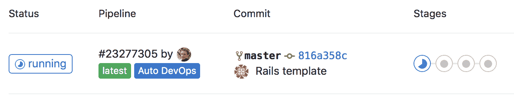
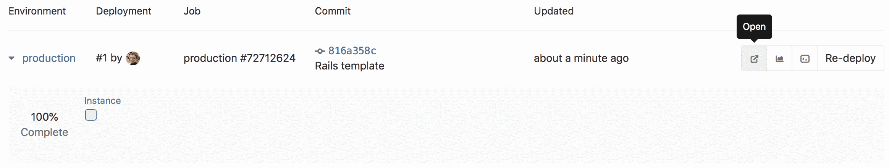

# Adding EKS clusters

> 原文：[https://docs.gitlab.com/ee/user/project/clusters/add_eks_clusters.html](https://docs.gitlab.com/ee/user/project/clusters/add_eks_clusters.html)

*   [EKS requirements](#eks-requirements)
    *   [Additional requirements for self-managed instances](#additional-requirements-for-self-managed-instances-core-only)
*   [New EKS cluster](#new-eks-cluster)
    *   [Troubleshooting creating a new cluster](#troubleshooting-creating-a-new-cluster)
        *   [Error: Request failed with status code 422](#error-request-failed-with-status-code-422)
        *   [Could not load Security Groups for this VPC](#could-not-load-security-groups-for-this-vpc)
        *   [`ROLLBACK_FAILED` during cluster creation](#rollback_failed-during-cluster-creation)
*   [Existing EKS cluster](#existing-eks-cluster)
    *   [Create a default Storage Class](#create-a-default-storage-class)
    *   [Deploy the app to EKS](#deploy-the-app-to-eks)

# Adding EKS clusters[](#adding-eks-clusters "Permalink")

GitLab 支持添加新的和现有的 EKS 集群.

## EKS requirements[](#eks-requirements "Permalink")

在通过 GitLab 集成在 Amazon EKS 上创建第一个集群之前，请确保满足以下要求：

*   设置了[Amazon Web Services](https://aws.amazon.com/)帐户，您就可以登录.
*   您有权管理 IAM 资源.
*   如果要使用[现有的 EKS 集群](#existing-eks-cluster) ：
    *   已正确配置工作节点的 Amazon EKS 集群.
    *   [安装并配置](https://docs.aws.amazon.com/eks/latest/userguide/getting-started.html#get-started-kubectl)了`kubectl`以访问 EKS 集群.

### Additional requirements for self-managed instances[](#additional-requirements-for-self-managed-instances-core-only "Permalink")

如果您使用自我管理的 GitLab 实例，则必须首先使用一组 Amazon 凭证配置 GitLab. 这些凭证将用于承担创建集群的用户提供的 Amazon IAM 角色. 创建一个 IAM 用户，并确保其有权承担您的用户将用来创建 EKS 群集的角色.

例如，以下策略文档允许在帐户`123456789012`假设一个角色的名称以`gitlab-eks-` ：

```
{  "Version":  "2012-10-17",  "Statement":  {  "Effect":  "Allow",  "Action":  "sts:AssumeRole",  "Resource":  "arn:aws:iam::123456789012:role/gitlab-eks-*"  }  } 
```

为 IAM 用户生成访问密钥，并使用凭据配置 GitLab：

1.  导航至**管理区域>设置>集成，**然后展开**Amazon EKS**部分.
2.  Check **启用 Amazon EKS 集成**.
3.  在相应的`Account ID` ， `Access key ID`和`Secret access key`字段中输入帐户 ID 和访问密钥凭据.
4.  Click **保存更改**.

## New EKS cluster[](#new-eks-cluster "Permalink")

在 GitLab 12.5 中[引入](https://gitlab.com/gitlab-org/gitlab/-/issues/22392) .

要创建新的 Kubernetes 集群并将其添加到您的项目，组或实例：

1.  导航到您的：
    *   项目的 **操作> Kubernetes**页面，用于项目级集群.
    *   组的 **Kubernetes**页面，用于组级别集群.
    *   **管理区>** **Kubernetes** ，用于实例级集群.
2.  Click **添加 Kubernetes 集群**.
3.  在" **创建新集群"**选项卡下，单击**Amazon EKS** . 将为您提供一个`Account ID`和`External ID` ，供下一步使用.
4.  在[IAM 管理控制台中](https://console.aws.amazon.com/iam/home) ，创建一个 IAM 角色：
    1.  在左侧面板中，选择**角色** .
    2.  单击**创建角色** .
    3.  在`Select type of trusted entity` ，选择**另一个 AWS 账户** .
    4.  在 GitLab 中的`Account ID`字段中输入`Account ID` .
    5.  选中**需要外部 ID** .
    6.  在 GitLab 中将`External ID`输入到`External ID`字段中.
    7.  单击**下一步：权限** .
    8.  点击**创建策略** ，这将打开一个新窗口.
    9.  选择**JSON**标签，然后粘贴以下代码段代替现有内容：

        ```
         { 
             "Version" :   "2012-10-17" , 
             "Statement" :   [ 
                 { 
                     "Effect" :   "Allow" , 
                     "Action" :   [ 
                         "autoscaling:CreateAutoScalingGroup" , 
                         "autoscaling:DescribeAutoScalingGroups" , 
                         "autoscaling:DescribeScalingActivities" , 
                         "autoscaling:UpdateAutoScalingGroup" , 
                         "autoscaling:CreateLaunchConfiguration" , 
                         "autoscaling:DescribeLaunchConfigurations" , 
                         "cloudformation:CreateStack" , 
                         "cloudformation:DescribeStacks" , 
                         "ec2:AuthorizeSecurityGroupEgress" , 
                         "ec2:AuthorizeSecurityGroupIngress" , 
                         "ec2:RevokeSecurityGroupEgress" , 
                         "ec2:RevokeSecurityGroupIngress" , 
                         "ec2:CreateSecurityGroup" , 
                         "ec2:createTags" , 
                         "ec2:DescribeImages" , 
                         "ec2:DescribeKeyPairs" , 
                         "ec2:DescribeRegions" , 
                         "ec2:DescribeSecurityGroups" , 
                         "ec2:DescribeSubnets" , 
                         "ec2:DescribeVpcs" , 
                         "eks:CreateCluster" , 
                         "eks:DescribeCluster" , 
                         "iam:AddRoleToInstanceProfile" , 
                         "iam:AttachRolePolicy" , 
                         "iam:CreateRole" , 
                         "iam:CreateInstanceProfile" , 
                         "iam:CreateServiceLinkedRole" , 
                         "iam:GetRole" , 
                         "iam:ListRoles" , 
                         "iam:PassRole" , 
                         "ssm:GetParameters" 
                     ], 
                     "Resource" :   "*" 
                 } 
             ] 
         }   
        ```

        **注意：**这些权限使 GitLab 能够创建资源，但不能删除它们. 这意味着，如果在创建过程中遇到错误，更改将不会回滚，您必须手动删除资源. 您可以通过删除相关的[CloudFormation 堆栈](https://docs.aws.amazon.com/AWSCloudFormation/latest/UserGuide/cfn-console-delete-stack.html)来做到这一点
    10.  点击**审核政策** .
    11.  为此策略输入合适的名称，然后点击**创建策略** . 您现在可以关闭此窗口.
    12.  切换回"创建角色"窗口，然后选择刚创建的策略.
    13.  单击**下一步：标签** ，并选择输入您希望与此角色关联的任何标签.
    14.  单击**下一步：查看** .
    15.  在提供的字段中输入角色名称和可选描述.
    16.  点击**创建角色** ，新角色名称将显示在顶部. 单击其名称，然后从新创建的角色复制`Role ARN` .
5.  在 GitLab 中，将复制的角色 ARN 输入到`Role ARN`字段中.
6.  Click **使用 AWS 进行身份验证**.
7.  选择集群的设置：
    *   **Kubernetes 集群名称** -您希望赋予集群的名称.
    *   **环境范围** -该集群的[关联环境](index.html#setting-the-environment-scope-premium) .
    *   **Kubernetes 版本** -要使用的 Kubernetes 版本. 当前唯一支持的版本是 1.14\.
    *   **角色名称** -选择[IAM 角色](https://docs.aws.amazon.com/eks/latest/userguide/service_IAM_role.html)以允许 Amazon EKS 和 Kubernetes 控制平面代表您管理 AWS 资源. 此 IAM 角色与上面创建的 IAM 角色是分开的，如果尚不存在，则需要创建它.
    *   **区域** -将在其中创建群集的[区域](https://docs.aws.amazon.com/AWSEC2/latest/UserGuide/using-regions-availability-zones.html) .
    *   **密钥对名称** -如果需要，选择可用于连接到工作节点的[密钥对](https://docs.aws.amazon.com/AWSEC2/latest/UserGuide/ec2-key-pairs.html) .
    *   **VPC-**选择要用于 EKS 群集资源的[VPC](https://docs.aws.amazon.com/vpc/latest/userguide/what-is-amazon-vpc.html) .
    *   **子网** -在您的 VPC 中选择运行工作节点的[子网](https://docs.aws.amazon.com/vpc/latest/userguide/VPC_Subnets.html) . 您必须至少选择两个.
    *   **安全组** -选择[安全组](https://docs.aws.amazon.com/vpc/latest/userguide/VPC_SecurityGroups.html)以应用到在工作节点子网中创建的 EKS 管理的弹性网络接口.
    *   **实例类型** -工作节点的[实例类型](https://aws.amazon.com/ec2/instance-types/) .
    *   **节点数** -工作节点数.
    *   **由 GitLab 管理的群集** -如果要让 GitLab 管理该群集的名称空间和服务帐户，请选中此复选框. 有关更多信息，请参见[托管集群部分](index.html#gitlab-managed-clusters) .
8.  最后，单击**创建 Kubernetes 集群**按钮.

大约 10 分钟后，您的集群便可以使用了. 现在，您可以继续安装一些[预定义的应用程序](index.html#installing-applications) .

**注意：**您需要将 AWS 外部 ID 添加到[AWS CLI 中](https://docs.aws.amazon.com/cli/latest/userguide/cli-configure-role.html#cli-configure-role-xaccount)的[IAM 角色，](https://docs.aws.amazon.com/cli/latest/userguide/cli-configure-role.html#cli-configure-role-xaccount)才能使用`kubectl`管理集群.

### Troubleshooting creating a new cluster[](#troubleshooting-creating-a-new-cluster "Permalink")

创建新集群时，通常会遇到以下错误.

#### Error: Request failed with status code 422[](#error-request-failed-with-status-code-422 "Permalink")

提交初始身份验证表单时，如果无法确定您提供的角色，则 GitLab 会返回状态码 422 错误. 确保已使用 GitLab 提供的**帐户 ID**和**外部 ID**正确配置了角色. 在 GitLab 中，确保输入正确的**Role ARN** .

#### Could not load Security Groups for this VPC[](#could-not-load-security-groups-for-this-vpc "Permalink")

当在配置表单中填充选项时，GitLab 将返回此错误，因为 GitLab 已成功承担了您提供的角色，但是该角色没有足够的权限来检索表单所需的资源. 确保已为角色分配了正确的权限.

#### `ROLLBACK_FAILED` during cluster creation[](#rollback_failed-during-cluster-creation "Permalink")

由于 GitLab 在创建一个或多个资源时遇到错误，因此创建过程停止. 您可以检查关联的[CloudFormation 堆栈](https://docs.aws.amazon.com/AWSCloudFormation/latest/UserGuide/cfn-console-view-stack-data-resources.html)以查找创建失败的特定资源.

如果`Cluster`资源因错误`The provided role doesn't have the Amazon EKS Managed Policies associated with it.`失败，则`The provided role doesn't have the Amazon EKS Managed Policies associated with it.` ， **角色名称**中指定的**角色**配置不正确.

**注意：**此角色不应与上面创建的角色相同. 如果您没有现有的[EKS 群集 IAM 角色](https://docs.aws.amazon.com/eks/latest/userguide/service_IAM_role.html) ，则必须创建一个.

## Existing EKS cluster[](#existing-eks-cluster "Permalink")

有关添加现有 EKS 群集的信息，请参阅" [现有 Kubernetes 群集"](add_remove_clusters.html#existing-kubernetes-cluster) .

### Create a default Storage Class[](#create-a-default-storage-class "Permalink")

Amazon EKS 没有开箱即用的默认存储类，这意味着对持久卷的请求将不会自动满足. 作为 Auto DevOps 的一部分，已部署的 PostgreSQL 实例将请求持久存储，并且如果没有默认存储类，它将无法启动.

如果默认的存储类尚不存在并且需要使用，请按照 Amazon 的[存储类指南](https://docs.aws.amazon.com/eks/latest/userguide/storage-classes.html)创建一个.

或者，通过将项目变量[`POSTGRES_ENABLED`](../../../topics/autodevops/customize.html#environment-variables)设置为`false`来禁用 PostgreSQL.

### Deploy the app to EKS[](#deploy-the-app-to-eks "Permalink")

在禁用 RBAC 和部署服务的情况下，现在可以利用[Auto DevOps](../../../topics/autodevops/index.html)构建，测试和部署应用程序.

如果尚未启用，则[启用 Auto DevOps](../../../topics/autodevops/index.html#at-the-project-level) . 如果创建了通配符 DNS 条目以解析到负载均衡器，请在"自动 DevOps"设置下的" `domain`字段中输入它. 否则，已部署的应用程序将无法在群集外部从外部获得.

[](img/pipeline.png)

将自动创建一个新管道，该管道将开始构建，测试和部署该应用程序.

管道完成后，您的应用将在 EKS 中运行，并可供用户使用. 单击**CI / CD>环境** .

[](img/environment.png)

您将看到环境及其部署状态的列表，以及浏览到应用程序，查看监视指标甚至访问正在运行的 Pod 上的 Shell 的选项.