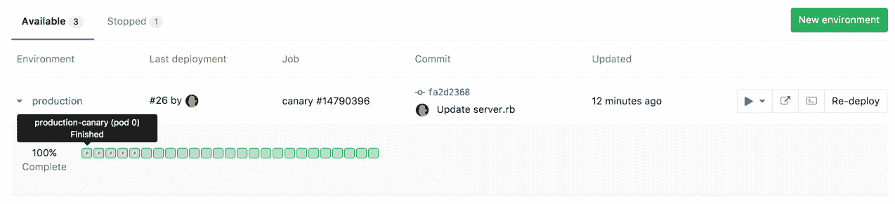

# Canary Deployments

> 原文：[https://docs.gitlab.com/ee/user/project/canary_deployments.html](https://docs.gitlab.com/ee/user/project/canary_deployments.html)

*   [Overview](#overview)
*   [Use cases](#use-cases)
*   [Enabling Canary Deployments](#enabling-canary-deployments)

# Canary Deployments

[Introduced](https://gitlab.com/gitlab-org/gitlab/-/issues/1659) in [GitLab Premium](https://about.gitlab.com/pricing/) 9.1.

一种流行的[持续部署](https://en.wikipedia.org/wiki/Continuous_deployment)策略，其中将一小部分机队更新为应用程序的新版本.

## Overview

在采用[持续交付时](https://about.gitlab.com/blog/2016/08/05/continuous-integration-delivery-and-deployment-with-gitlab/) ，公司需要决定要使用哪种部署策略. 最受欢迎的策略之一是金丝雀部署，首先将一小部分机队更新为新版本. 金丝雀的这个子集，然后在煤矿中成为众所周知的[金丝雀](https://en.wiktionary.org/wiki/canary_in_a_coal_mine) .

如果应用程序的新版本存在问题，则仅会影响一小部分用户，并且可以固定更改或快速还原更改.

利用[Kubernetes 的 Canary 部署](https://kubernetes.io/docs/concepts/cluster-administration/manage-deployment/#canary-deployments) ，无需离开 GitLab，即可在[Deploy Board](deploy_boards.html)内部可视化您的 Canary 部署.

## Use cases

当您只想向部分 Pod 舰队提供功能并观看其行为时，可以使用 Canary 部署. 如果一切正常，您可以将该功能部署到生产中，因为它不会造成任何问题.

Canary 部署对于后端重构，性能改进或用户界面不变的其他更改也特别有用，但是您要确保性能保持不变或有所提高. 开发人员在使用面向用户的更改的 Canary 时需要谨慎，因为默认情况下，来自同一用户的请求将随机分布在 Canary 和非 Canary Pod 之间，这可能导致混乱甚至错误. 如果需要，您可能需要考虑[在 Kubernetes 服务定义中将`service.spec.sessionAffinity`设置为`ClientIP`](https://kubernetes.io/docs/concepts/services-networking/service/#virtual-ips-and-service-proxies) ，但这超出了本文档的范围.

## Enabling Canary Deployments

Canary 部署要求您正确配置 Deploy Boards：

1.  请按照以下步骤[启用 Deploy Boards](deploy_boards.html#enabling-deploy-boards) .
2.  要跟踪 canary 部署，您需要使用`track: canary`标记 Kubernetes 部署和 Pod. 为了快速入门，您可以将[自动部署](../../topics/autodevops/stages.html#auto-deploy)模板用于 GitLab 提供的金丝雀部署.

根据部署情况，标签应该是`stable`或`canary` . 通常， `stable`且空白或丢失的标签表示同一件事，而`canary`或任何其他轨道表示金丝雀/临时. 这使 GitLab 能够发现部署是稳定的还是金丝雀（临时）的.

完成以上所有设置并且管道至少运行了一次之后，导航至" **管道">"环境"**下的环境页面. 随着管道的执行，部署委员会将清楚地标记金丝雀荚，从而可以快速，轻松地洞察每种环境和部署的状态.

Canary deployments are marked with a yellow dot in the Deploy Board so that you can easily notice them.

