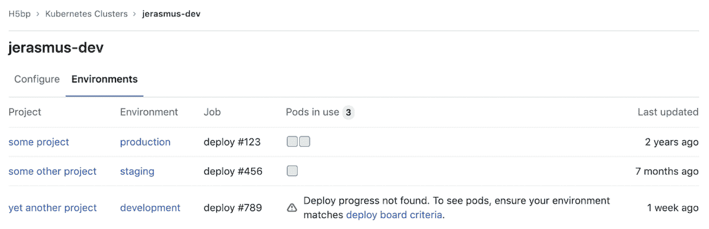

# Cluster Environments

> 原文：[https://docs.gitlab.com/ee/user/clusters/environments.html](https://docs.gitlab.com/ee/user/clusters/environments.html)

*   [Overview](#overview)
*   [Usage](#usage)

# Cluster Environments

> *   在[GitLab Premium](https://about.gitlab.com/pricing/) 12.3 中针对组级集群[引入](https://gitlab.com/gitlab-org/gitlab/-/issues/13392) .
> *   在[GitLab Premium](https://about.gitlab.com/pricing/) 12.4 中针对实例级集群进行了[介绍](https://gitlab.com/gitlab-org/gitlab/-/issues/14809) .

群集环境提供了一个统一的视图，用于说明将哪些 CI [环境](../../ci/environments/index.html)部署到 Kubernetes 群集及其：

*   显示项目和与部署相关的相关环境.
*   显示该环境的窗格的状态.

## Overview

使用集群环境，您可以深入了解：

*   哪些项目已部署到集群.
*   每个项目的环境使用了多少个 Pod.
*   用于部署到该环境的 CI 作业.

仅限集群[维护者和所有者](../permissions.html#group-members-permissions)访问集群环境

## Usage

为了：

*   跟踪集群的环境，您必须成功[部署到 Kubernetes 集群](../project/clusters/index.html#deploying-to-a-kubernetes-cluster) .
*   正确显示容器使用情况，必须[启用 Deploy Boards](../project/deploy_boards.html#enabling-deploy-boards) .

成功部署到组级或实例级集群后：

1.  导航到您组的**Kubernetes**页面.
2.  单击**环境**选项卡.

**注意：**此页面仅包含成功部署到群集的信息. 非群集环境将不包括在内.