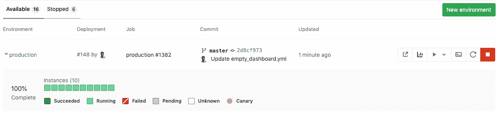
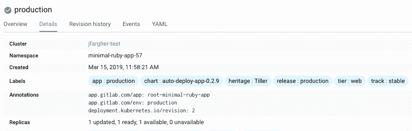

# Deploy Boards

> 原文：[https://docs.gitlab.com/ee/user/project/deploy_boards.html](https://docs.gitlab.com/ee/user/project/deploy_boards.html)

*   [Overview](#overview)
*   [Use cases](#use-cases)
*   [Enabling Deploy Boards](#enabling-deploy-boards)
    *   [Example manifest file](#example-manifest-file)
*   [Canary Deployments](#canary-deployments)
*   [Further reading](#further-reading)

# Deploy Boards[](#deploy-boards-premium "Permalink")

[Introduced](https://gitlab.com/gitlab-org/gitlab/-/issues/1589) in [GitLab Premium](https://about.gitlab.com/pricing/) 9.0.

GitLab 的部署板提供了[Kubernetes](https://kubernetes.io)上运行的每个 CI [环境](../../ci/environments/index.html)的当前运行状况和状态的综合视图，显示了部署中 Pod 的状态. 开发人员和其他团队成员可以在已经使用的工作流程中逐个窗格地查看发布的进度和状态，而无需访问 Kubernetes.

## Overview[](#overview "Permalink")

使用部署板，您可以通过以下优势对部署进行更多了解：

*   从头开始进行部署，而不仅仅是完成之后
*   监视跨多个服务器的构建的推出
*   更详细的状态详细信息（成功，正在运行，失败，待处理，未知）
*   See [Canary Deployments](canary_deployments.html)

这是生产环境的部署板的示例.

[](img/deploy_boards_landing_page.png)

正方形表示与给定环境关联的 Kubernetes 集群中的 Pod. 将鼠标悬停在每个方块上方，可以看到部署的状态. 百分比是已更新到最新版本的 Pod 的百分比.

由于部署板与 Kubernetes 紧密结合，因此需要一些知识. 特别是，您应该熟悉：

*   [Kubernetes pods](https://kubernetes.io/docs/concepts/workloads/pods/pod/)
*   [Kubernetes labels](https://kubernetes.io/docs/concepts/overview/working-with-objects/labels/)
*   [Kubernetes namespaces](https://kubernetes.io/docs/concepts/overview/working-with-objects/namespaces/)
*   [Kubernetes canary deployments](https://kubernetes.io/docs/concepts/cluster-administration/manage-deployment/#canary-deployments)

**注意：**包含多个部署的应用程序在部署板上显示为重复项. 有关详细信息，请关注[此问题](https://gitlab.com/gitlab-org/gitlab/-/issues/8463) .

## Use cases[](#use-cases "Permalink")

由于部署板是针对特定环境的 Kubernetes 吊舱的直观表示，因此存在许多用例. 仅举几例：

*   您想将分阶段运行的产品推广到生产环境. 您转到环境列表，验证阶段运行的是您认为正在运行的，然后单击[手动操作](../../ci/yaml/README.html#whenmanual)以部署到生产环境.
*   您触发了部署，并且有很多容器需要升级，因此您将花费一段时间（您也限制了部署，一次只能删除 X 个容器）. 但是您需要告诉某人何时部署，因此您可以转到环境列表，查看生产环境，以了解每个 Pod 滚动时的实时进度.
*   您会得到一份报告，说明生产中有些异常，因此您可以查看生产环境以查看正在运行什么，以及部署是否正在进行，是否停止或失败.
*   您的 MR 看起来不错，但是您希望在登台上运行它，因为登台是在某种程度上更接近生产环境进行设置的. 您转到环境列表，找到您感兴趣的[Review App](../../ci/review_apps/index.html) ，然后单击手动操作将其部署到登台.

## Enabling Deploy Boards[](#enabling-deploy-boards "Permalink")

要显示特定[环境](../../ci/environments/index.html)的部署板，您应该：

1.  用部署阶段[定义了一个环境](../../ci/environments/index.html#defining-environments) .

2.  使 Kubernetes 集群启动并运行.

    **在 OpenShift 上运行：**如果使用的是 OpenShift，请确保使用的是`Deployment`资源而不是`DeploymentConfiguration` . 否则，部署板将无法正确渲染. 有关更多信息，请阅读[OpenShift docs](https://docs.openshift.com/container-platform/3.7/dev_guide/deployments/kubernetes_deployments.html#kubernetes-deployments-vs-deployment-configurations)和[GitLab 问题＃4584](https://gitlab.com/gitlab-org/gitlab/-/issues/4584) .
3.  使用[Docker](https://docs.gitlab.com/runner/executors/docker.html)或[Kubernetes](https://docs.gitlab.com/runner/executors/kubernetes.html)执行器[配置 GitLab Runner](../../ci/runners/README.html) .
4.  在您的项目中为集群配置[Kubernetes 集成](clusters/index.html) . 特别注意 Kubernetes 命名空间，因为部署脚本（由`KUBE_NAMESPACE` env 变量公开）将需要它.
5.  确保将 app.gitlab.com/env：$ `app.gitlab.com/env: $CI_ENVIRONMENT_SLUG`和`app.gitlab.com/app: $CI_PROJECT_PATH_SLUG` CI_PROJECT_PATH_SLUG 的 Kubernetes 注释应用于部署，副本集和 Pod，其中`$CI_ENVIRONMENT_SLUG`和`$CI_PROJECT_PATH_SLUG`是 CI 变量的值. 这样一来，我们便可以在可能有多个的群集/命名空间中查找适当的环境. 这些资源应包含在 Kubernetes 服务设置中定义的名称空间中. 您可以使用[Autodeploy](../../topics/autodevops/stages.html#auto-deploy) `.gitlab-ci.yml`模板，该模板具有要使用的预定义阶段和命令，并自动应用注释. 每个项目还需要在 Kubernetes 中具有唯一的名称空间. 下图演示了如何在 Kubernetes 中显示此内容.

    **注意：**在[GitLab 12.1](https://gitlab.com/gitlab-org/gitlab/-/merge_requests/14020)中删除了基于 Kubernetes `app`标签的匹配. 要迁移，请应用所需的注释（请参见上文），然后重新部署您的应用程序. 如果您使用的是 Auto DevOps，这将自动完成，无需采取任何措施.

    [](img/deploy_boards_kubernetes_label.png)

完成以上所有设置并且管道至少运行了一次之后，导航至**Operations> Environments**下的 environment 页面.

默认情况下，部署板是可见的. 您可以显式单击相应环境名称旁边的三角形以隐藏它们.

### Example manifest file[](#example-manifest-file "Permalink")

以下示例是使用两个注释`app.gitlab.com/env`和`app.gitlab.com/app`启用 Kubernetes 清单部署文件的`app.gitlab.com/env` ，以启用**Deploy Boards** ：

```
apiVersion: apps/v1
kind: Deployment
metadata:
  name: "APPLICATION_NAME"
  annotations:
    app.gitlab.com/app: ${CI_PROJECT_PATH_SLUG}
    app.gitlab.com/env: ${CI_ENVIRONMENT_SLUG}
spec:
  replicas: 1
  selector:
    matchLabels:
      app: "APPLICATION_NAME"
  template:
    metadata:
      labels:
        app: "APPLICATION_NAME"
      annotations:
        app.gitlab.com/app: ${CI_PROJECT_PATH_SLUG}
        app.gitlab.com/env: ${CI_ENVIRONMENT_SLUG} 
```

注释将应用于部署，副本集和 Pod. 通过更改副本数量，例如`kubectl scale --replicas=3 deploy APPLICATION_NAME -n ${KUBE_NAMESPACE}` ，您可以从开发板上跟踪实例的 pod.

**注意：** YAML 文件是静态的. 如果使用`kubectl apply` ，则必须在`kubectl apply`之前手动提供项目和环境段，或者创建脚本来替换 YAML 中的变量.

## Canary Deployments[](#canary-deployments "Permalink")

一种流行的 CI 策略，其中将一小部分车队更新为应用程序的新版本.

[Read more about Canary Deployments.](canary_deployments.html)

## Further reading[](#further-reading "Permalink")

*   [GitLab Autodeploy](../../topics/autodevops/stages.html#auto-deploy)
*   [GitLab CI/CD environment variables](../../ci/variables/README.html)
*   [Environments and deployments](../../ci/environments/index.html)
*   [Kubernetes deploy example](https://gitlab.com/gitlab-examples/kubernetes-deploy)