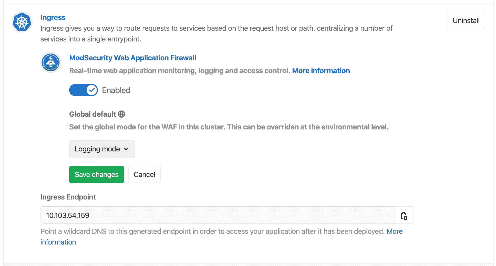
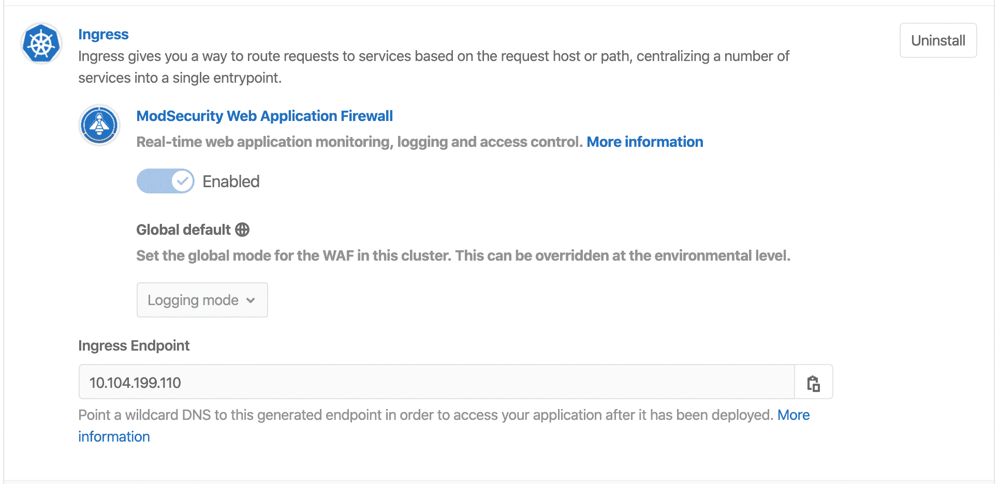
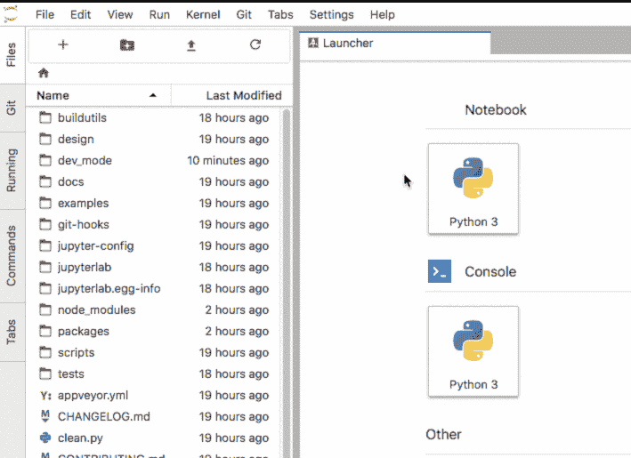
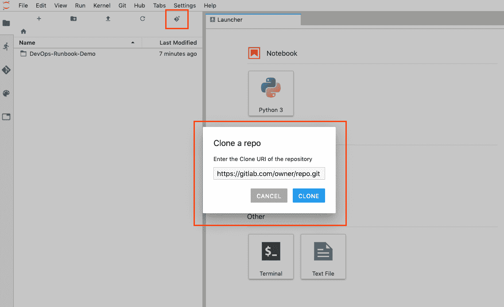
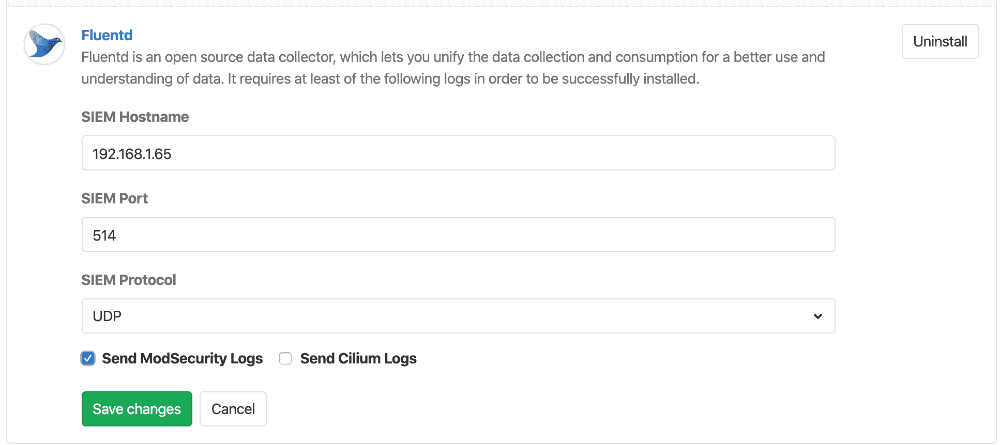

# GitLab Managed Apps

> 原文：[https://docs.gitlab.com/ee/user/clusters/applications.html](https://docs.gitlab.com/ee/user/clusters/applications.html)

*   [Installing applications](#installing-applications)
    *   [Helm](#helm)
    *   [Enable or disable local Tiller](#enable-or-disable-local-tiller-core-only)
    *   [cert-manager](#cert-manager)
    *   [GitLab Runner](#gitlab-runner)
    *   [Ingress](#ingress)
        *   [Determining the external endpoint automatically](#determining-the-external-endpoint-automatically)
        *   [Determining the external endpoint manually](#determining-the-external-endpoint-manually)
        *   [Using a static IP](#using-a-static-ip)
        *   [Pointing your DNS at the external endpoint](#pointing-your-dns-at-the-external-endpoint)
        *   [Web Application Firewall (ModSecurity)](#web-application-firewall-modsecurity)
            *   [Logging and blocking modes](#logging-and-blocking-modes)
            *   [WAF version updates](#waf-version-updates)
            *   [Viewing Web Application Firewall traffic](#viewing-web-application-firewall-traffic)
    *   [JupyterHub](#jupyterhub)
        *   [Jupyter Git Integration](#jupyter-git-integration)
    *   [Knative](#knative)
    *   [Prometheus](#prometheus)
    *   [Crossplane](#crossplane)
    *   [Elastic Stack](#elastic-stack)
        *   [Optional: deploy Kibana to perform advanced queries](#optional-deploy-kibana-to-perform-advanced-queries)
    *   [Fluentd](#fluentd)
    *   [Future apps](#future-apps)
*   [Install using GitLab CI/CD (alpha)](#install-using-gitlab-cicd-alpha)
    *   [Usage](#usage)
    *   [Important notes](#important-notes)
    *   [Install Ingress using GitLab CI/CD](#install-ingress-using-gitlab-cicd)
    *   [Install cert-manager using GitLab CI/CD](#install-cert-manager-using-gitlab-cicd)
    *   [Install Sentry using GitLab CI/CD](#install-sentry-using-gitlab-cicd)
    *   [Install PostHog using GitLab CI/CD](#install-posthog-using-gitlab-cicd)
    *   [Install Prometheus using GitLab CI/CD](#install-prometheus-using-gitlab-cicd)
    *   [Install GitLab Runner using GitLab CI/CD](#install-gitlab-runner-using-gitlab-cicd)
    *   [Install Cilium using GitLab CI/CD](#install-cilium-using-gitlab-cicd)
    *   [Install Falco using GitLab CI/CD](#install-falco-using-gitlab-cicd)
    *   [Install Vault using GitLab CI/CD](#install-vault-using-gitlab-cicd)
    *   [Install JupyterHub using GitLab CI/CD](#install-jupyterhub-using-gitlab-cicd)
    *   [Install Elastic Stack using GitLab CI/CD](#install-elastic-stack-using-gitlab-cicd)
    *   [Install Crossplane using GitLab CI/CD](#install-crossplane-using-gitlab-cicd)
    *   [Install Fluentd using GitLab CI/CD](#install-fluentd-using-gitlab-cicd)
    *   [Install Knative using GitLab CI/CD](#install-knative-using-gitlab-cicd)
        *   [Knative Metrics](#knative-metrics)
        *   [Uninstall Knative](#uninstall-knative)
    *   [Install AppArmor using GitLab CI/CD](#install-apparmor-using-gitlab-cicd)
        *   [Using AppArmor profiles in your deployments](#using-apparmor-profiles-in-your-deployments)
*   [Upgrading applications](#upgrading-applications)
*   [Uninstalling applications](#uninstalling-applications)
*   [Troubleshooting applications](#troubleshooting-applications)
    *   [Error installing managed apps on EKS cluster](#error-installing-managed-apps-on-eks-cluster)
    *   [Unable to install Prometheus](#unable-to-install-prometheus)

# GitLab Managed Apps[](#gitlab-managed-apps "Permalink")

GitLab 提供**GitLab 托管应用程序** ，一键安装各种应用程序，可以直接将其添加到配置的集群中.

使用[Auto DevOps](../../topics/autodevops/index.html)时， [Review Apps](../../ci/review_apps/index.html)和[部署](../../ci/environments/index.html)需要这些应用程序.

您可以在[创建集群](../project/clusters/add_remove_clusters.html)后安装它们.

## Installing applications[](#installing-applications "Permalink")

由 GitLab `gitlab-managed-apps`将安装到`gitlab-managed-apps`命名空间中.

该名称空间：

*   与用于项目部署的名称空间不同.
*   创建一次.
*   具有不可配置的名称.

查看可用安装的应用程序列表. 为一个：

*   [项目级集群](../project/clusters/index.html) ，导航到项目的 **运营> Kubernetes** .
*   [小组级别的集群](../group/clusters/index.html) ，导航到您小组的 **Kubernetes**页面.

**注意：**从 GitLab 11.6 开始，Helm 将在安装任何应用程序之前升级到 GitLab 支持的最新版本.

可以安装以下应用程序：

*   [Helm](#helm)
*   [Ingress](#ingress)
*   [cert-manager](#cert-manager)
*   [Prometheus](#prometheus)
*   [GitLab Runner](#gitlab-runner)
*   [JupyterHub](#jupyterhub)
*   [Knative](#knative)
*   [Crossplane](#crossplane)
*   [Elastic Stack](#elastic-stack)
*   [Fluentd](#fluentd)

除 Knative 外，这些应用程序将安装在名为`gitlab-managed-apps`的专用命名空间中.

**注意：**某些应用程序仅可用于项目级集群安装. 计划在将来的发行版中支持在组级群集中安装这些应用程序. 有关更新，请参阅[问题跟踪进度](https://gitlab.com/gitlab-org/gitlab/-/issues/24411) .**注意：**如果您现有的 Kubernetes 集群已安装 Helm，则应谨慎使用，因为 GitLab 无法检测到它. 在这种情况下，通过应用程序安装 Helm 将导致集群对其进行两次配置，这可能导致部署期间的混乱.

### Helm[](#helm "Permalink")

版本历史

*   在 GitLab 10.2 中针对项目级集群引入.
*   在 GitLab 11.6 中针对组级集群引入.
*   在 GitLab 13.2 中[引入](https://gitlab.com/gitlab-org/gitlab/-/issues/209736)了本地 Tiller 选项，该选项在功能标记后（默认情况下启用）.
*   在 GitLab.com 上启用了本地 Tiller 的功能标志.

[Helm](https://helm.sh/docs/)是 Kubernetes 的软件包管理器，用于安装 GitLab 管理的应用程序. GitLab 在集群内`gitlab-managed-apps`命名空间内的 pod 中运行每个`helm`命令.

从 GitLab 13.2 开始，集成默认使用本地[Tiller](https://v2.helm.sh/docs/glossary/#tiller) . 使用本地 Tiller 时，不需要安装 Helm 应用程序，也不会显示在应用程序列表中.

**注意：** GitLab 的 Helm 集成不支持在代理后面安装应用程序，但是可以使用一种[解决方法](../../topics/autodevops/index.html#install-applications-behind-a-proxy) .

### Enable or disable local Tiller[](#enable-or-disable-local-tiller-core-only "Permalink")

版本历史

*   在 GitLab 13.2 中[引入](https://gitlab.com/gitlab-org/gitlab/-/issues/209736)
*   [计划](https://gitlab.com/gitlab-org/gitlab/-/issues/209736)在 GitLab 13.3 中[删除](https://gitlab.com/gitlab-org/gitlab/-/issues/209736)禁用本地 Tiller 的选项

本地分 iller 正在开发中，但已准备好用于生产. 它部署在**默认情况下启用**的功能标志的后面. [有权访问 GitLab Rails 控制台的 GitLab 管理员](../../administration/feature_flags.html)可以为您的实例启用它.

要启用它：

```
# Instance-wide
Feature.enable(:managed_apps_local_tiller) 
```

禁用它：

```
# Instance-wide
Feature.disable(:managed_apps_local_tiller) 
```

### cert-manager[](#cert-manager "Permalink")

在 GitLab 11.6 中针对项目级和组级集群引入.

[cert-manager](https://cert-manager.io/docs/)是本地 Kubernetes 证书管理控制器，可帮助颁发证书. 在群集上安装 cert-manager 将通过[Let's Encrypt](https://letsencrypt.org/)颁发证书，并确保证书有效和最新.

用于安装此应用程序的图表取决于所使用的 GitLab 版本. 在：

*   在 GitLab 12.3 及更高版本中， [jetstack / cert-manager](https://github.com/jetstack/cert-manager)图表与[`values.yaml`](https://gitlab.com/gitlab-org/gitlab/blob/master/vendor/cert_manager/values.yaml)文件一起使用.
*   在 GitLab 12.2 和更早版本中，使用了[稳定/证书管理器](https://github.com/helm/charts/tree/master/stable/cert-manager)图表.

如果您在 GitLab 12.3 之前安装了 cert-manager，那么我们加密将[阻止来自较早版本 cert-manager 的请求](https://community.letsencrypt.org/t/blocking-old-cert-manager-versions/98753) .

要解决此问题：

1.  卸载 cert-manager（考虑[备份任何其他配置](https://cert-manager.io/docs/tutorials/backup/) ）.
2.  再次安装 cert-manager.

### GitLab Runner[](#gitlab-runner "Permalink")

版本历史

*   在 GitLab 10.6 中针对项目级集群引入.
*   在 GitLab 11.10 中针对组级集群引入.

[GitLab Runner](https://docs.gitlab.com/runner/)是一个开源项目，用于运行您的作业并将结果发送回 GitLab. 它与[GitLab CI / CD](../../ci/README.html)结合使用， [GitLab CI / CD](../../ci/README.html)是 GitLab 随附的用于协调作业的开源持续集成服务.

如果该项目在 GitLab.com 上，则可以使用共享的 Runners（前 2000 分钟是免费的，以后您可以[购买更多](../../subscriptions/index.html#purchasing-additional-ci-minutes) ），并且如果它们足以满足您的需求，则不必部署它. 如果需要特定于项目的运行器，或者没有共享的运行器，则部署它很容易.

请注意，已部署的 Runner 将设置为**privileged** ，这意味着它实际上将具有对基础计算机的 root 访问权限. 这是构建 Docker 映像所必需的，因此它是默认设置. 在部署前，请确保已阅读[安全隐患](../project/clusters/index.html#security-implications) .

**注意：** [`runner/gitlab-runner`](https://gitlab.com/gitlab-org/charts/gitlab-runner)图表用于使用[预先配置的`values.yaml`](https://gitlab.com/gitlab-org/charts/gitlab-runner/-/blob/master/values.yaml)文件安装此应用程序. 不支持通过修改此文件来自定义安装.

### Ingress[](#ingress "Permalink")

版本历史

*   在 GitLab 10.2 中针对项目级集群引入.
*   在 GitLab 11.6 中针对组级集群引入.

[Ingress](https://kubernetes.io/docs/concepts/services-networking/ingress/)提供开箱即用的负载平衡，SSL 终止和基于名称的虚拟主机. 它充当应用程序的 Web 代理，如果要使用[Auto DevOps](../../topics/autodevops/index.html)或部署自己的 Web 应用程序，则很有用.

安装的 Ingress Controller 是[Ingress-NGINX](https://kubernetes.io/docs/concepts/services-networking/ingress/) ，由 Kubernetes 社区支持.

**注意：**通过以下过程，必须在群集中安装负载均衡器才能获取端点. 如果使用 Knative，则可以使用 Ingress 或 Knative 自己的负载平衡器（ [Istio](https://istio.io) ）.

In order to publish your web application, you first need to find the endpoint which will be either an IP address or a hostname associated with your load balancer.

要安装它，请点击 Ingress 的**安装**按钮. GitLab 将尝试确定外部端点，并且它应在几分钟之内可用.

#### Determining the external endpoint automatically[](#determining-the-external-endpoint-automatically "Permalink")

在 GitLab 10.6 中[引入](https://gitlab.com/gitlab-org/gitlab-foss/-/merge_requests/17052) .

安装 Ingress 之后，外部端点应在几分钟之内可用.

**提示：**可以使用`KUBE_INGRESS_BASE_DOMAIN`环境变量将此端点用于[Auto DevOps 基础域](../../topics/autodevops/index.html#auto-devops-base-domain) .

如果没有出现端点，并且您的集群在 Google Kubernetes Engine 上运行：

1.  [在 Google Kubernetes Engine 上](https://console.cloud.google.com/kubernetes)检查您的[Kubernetes 集群，](https://console.cloud.google.com/kubernetes)以确保其节点上没有错误.
2.  确保您在 Google Kubernetes Engine 上有足够的[配额](https://console.cloud.google.com/iam-admin/quotas) . 有关更多信息，请参见[资源配额](https://cloud.google.com/compute/quotas) .
3.  检查[Google Cloud 的状态，](https://status.cloud.google.com/)以确保它们没有任何中断.

安装后，您可能会看到一个`?` 取决于云提供商的"入口 IP 地址". 特别是对于 EKS，这是因为 ELB 是使用 DNS 名称而不是 IP 地址创建的. 如果 GitLab 仍然无法确定您的 Ingress 或 Knative 应用程序的端点，则可以[手动确定它](#determining-the-external-endpoint-manually) .

**注意：** [`stable/nginx-ingress`](https://github.com/helm/charts/tree/master/stable/nginx-ingress)图表用于通过[`values.yaml`](https://gitlab.com/gitlab-org/gitlab/blob/master/vendor/ingress/values.yaml)文件安装此应用程序.

#### Determining the external endpoint manually[](#determining-the-external-endpoint-manually "Permalink")

如果群集位于 GKE 上，请单击" **高级设置"中**的**Google Kubernetes Engine**链接，或直接转到[Google Kubernetes Engine 仪表板，](https://console.cloud.google.com/kubernetes/)然后选择适当的项目和群集. 然后单击" **连接"** ，然后在本地终端或使用**Cloud Shell**执行`gcloud`命令.

如果集群不在 GKE 上，请按照 Kubernetes 提供程序的特定说明使用正确的凭据配置`kubectl` . 以下示例的输出将显示集群的外部端点. 然后，可以使用此信息来设置 DNS 条目和转发规则，以允许外部访问已部署的应用程序.

If you installed Ingress via the **Applications**, run the following command:

```
kubectl get service --namespace=gitlab-managed-apps ingress-nginx-ingress-controller -o jsonpath='{.status.loadBalancer.ingress[0].ip}' 
```

有些 Kubernetes 集群会返回主机名，例如[Amazon EKS](https://aws.amazon.com/eks/) . 对于这些平台，运行：

```
kubectl get service --namespace=gitlab-managed-apps ingress-nginx-ingress-controller -o jsonpath='{.status.loadBalancer.ingress[0].hostname}' 
```

对于 Istio / Knative，命令将有所不同：

```
kubectl get svc --namespace=istio-system istio-ingressgateway -o jsonpath='{.status.loadBalancer.ingress[0].ip} ' 
```

否则，您可以列出所有负载均衡器的 IP 地址：

```
kubectl get svc --all-namespaces -o jsonpath='{range.items[?(@.status.loadBalancer.ingress)]}{.status.loadBalancer.ingress[*].ip} ' 
```

**注意：**如果使用 EKS，还将创建一个[Elastic Load Balancer](https://docs.aws.amazon.com/elasticloadbalancing/) ，这将产生额外的 AWS 成本.**注意：**在某些 Kubernetes 版本上，您可能会看到尾随`%` ， **但不要包括它** .

入口现在在此地址可用，并将基于请求中的 DNS 名称将传入请求路由到适当的服务. 为此，应为所需的域名创建通配符 DNS CNAME 记录. 例如， `*.myekscluster.com`将指向之前获得的 Ingress 主机名.

#### Using a static IP[](#using-a-static-ip "Permalink")

默认情况下，临时外部 IP 地址与群集的负载平衡器关联. 如果您将临时 IP 与 DNS 关联，并且 IP 更改，则将无法访问您的应用程序，因此您必须再次更改 DNS 记录. 为了避免这种情况，您应该将其更改为静态保留的 IP.

阅读如何[在 GKE 中提升临时外部 IP 地址](https://cloud.google.com/compute/docs/ip-addresses/reserve-static-external-ip-address#promote_ephemeral_ip) .

#### Pointing your DNS at the external endpoint[](#pointing-your-dns-at-the-external-endpoint "Permalink")

设置外部终结点后，应将其与[通配符 DNS 记录（](https://en.wikipedia.org/wiki/Wildcard_DNS_record)例如`*.example.com.`相关联`*.example.com.` 为了能够访问您的应用. 如果您的外部端点是 IP 地址，请使用 A 记录. 如果您的外部端点是主机名，请使用 CNAME 记录.

#### Web Application Firewall (ModSecurity)[](#web-application-firewall-modsecurity "Permalink")

在 GitLab 12.7 中[引入](https://gitlab.com/gitlab-org/gitlab/-/merge_requests/21966) .

Web 应用程序防火墙（WAF）可以检查正在发送或接收的流量，并可以在恶意流量到达您的应用程序之前对其进行阻止. WAF 的好处是：

*   实时监控您的应用程序
*   将所有 HTTP 通信记录到应用程序
*   您的应用程序的访问控制
*   高度可配置的日志记录和阻止规则

开箱即用，GitLab 为您提供了一个称为[`ModSecurity`](https://www.modsecurity.org/)的 WAF.

ModSecurity 是用于实时 Web 应用程序监视，日志记录和访问控制的工具包. 借助 GitLab 的产品，将自动应用[OWASP 的 Core Rule Set](https://www.modsecurity.org/CRS/Documentation/) （提供通用的攻击检测功能）.

此功能：

*   除非另有配置，否则以"仅检测模式"运行.
*   通过检查您的 Ingress 控制器的`modsec`日志中是否有违反规则可以查看. 例如：

    ```
    kubectl logs -n gitlab-managed-apps $(kubectl get pod -n gitlab-managed-apps -l app=nginx-ingress,component=controller --no-headers=true -o custom-columns=:metadata.name) modsecurity-log -f 
    ```

要启用 WAF，请在安装或更新[Ingress 应用程序](#ingress)时将其相应的切换开关切换到启用位置.

如果这是您首次使用 GitLab 的 WAF，我们建议您遵循[快速入门指南](../../topics/web_application_firewall/quick_start_guide.html) .

通过启用 ModSecurity，性能开销很小. 如果这对于您的应用程序而言很重要，则可以通过以下任何一种方式为已部署的应用程序禁用 ModSecurity 的规则引擎：

1.  Setting [the deployment variable](../../topics/autodevops/index.html) `AUTO_DEVOPS_MODSECURITY_SEC_RULE_ENGINE` to `Off`. This will prevent ModSecurity from processing any requests for the given application or environment.

2.  将其各自的切换开关切换到禁用位置，然后通过" **保存更改"**按钮应用更改. 这将使用最新更改重新安装 Ingress.

[](../../topics/web_application_firewall/img/guide_waf_ingress_save_changes_v12_10.png)

##### Logging and blocking modes[](#logging-and-blocking-modes "Permalink")

为了帮助您调整 WAF 规则，可以将 WAF 全局设置为" **日志记录"**或" **阻止"**模式：

*   **日志记录模式** -允许符合规则的流量通过并记录事件.
*   **阻止模式** -阻止符合规则的流量通过，并记录事件.

更改 WAF 的模式：

1.  如果尚未[安装 ModSecurity](../../topics/web_application_firewall/quick_start_guide.html) ，请[安装它](../../topics/web_application_firewall/quick_start_guide.html) .
2.  导航 **运营>州长** .
3.  In **Applications**, scroll to **Ingress**.
4.  在" **全局默认值"下** ，选择所需的模式.
5.  Click **保存更改**.

##### WAF version updates[](#waf-version-updates "Permalink")

由于[Helm 的](https://helm.sh/)限制，在以后的发行版中可能会克服这些问题，因此仅在同一版本的[Ingress 中](#ingress)才允许启用，禁用或更改**ModSecurity**的日志记录模式.

如果所部署的版本与 GitLab 中可用的版本不同，则将禁用**ModSecurity** UI 控件，而仍可以执行[Ingress](#ingress)级别的操作，例如卸载：

[](../../topics/web_application_firewall/img/guide_waf_ingress_disabled_settings_v12_10.png)

将[Ingress](#ingress)更新到最新版本使您能够利用错误修复，安全修复和性能改进. 要更新[Ingress 应用程序](#ingress) ，您必须首先将其卸载，然后按照[Install ModSecurity 中的说明](../../topics/web_application_firewall/quick_start_guide.html)进行重新[安装](../../topics/web_application_firewall/quick_start_guide.html) .

##### Viewing Web Application Firewall traffic[](#viewing-web-application-firewall-traffic "Permalink")

[Introduced](https://gitlab.com/gitlab-org/gitlab/-/issues/14707) in [GitLab Ultimate](https://about.gitlab.com/pricing/) 12.9.

您可以通过导航到项目的" **安全性和合规性">"威胁监视"**页面来查看 Web 应用程序防火墙的流量.

从那里，您可以看到随着时间的推移进行跟踪：

*   您的应用程序的总流量.
*   Web 应用程序防火墙的默认[OWASP 规则集](https://www.modsecurity.org/CRS/Documentation/)认为异常的流量比例.

如果很大一部分流量是异常的，则应[检查](#web-application-firewall-modsecurity)潜在的威胁，这可以通过[检查 Web 应用程序防火墙日志](#web-application-firewall-modsecurity)来完成.

[](img/threat_monitoring_v12_9.png)

### JupyterHub[](#jupyterhub "Permalink")

版本历史

*   在 GitLab 11.0 中针对项目级集群引入.
*   在 GitLab 12.3 中针对组和实例级集群引入.

[JupyterHub](https://jupyterhub.readthedocs.io/en/stable/)是用于在团队中管理笔记本的多用户服务. [Jupyter Notebook](https://jupyter-notebook.readthedocs.io/en/latest/)提供了一个基于 Web 的交互式编程环境，用于数据分析，可视化和机器学习.

Authentication will be enabled only for [project members](../project/members/index.html) for project-level clusters and group members for group-level clusters with [Developer or higher](../permissions.html) access to the associated project or group.

我们使用一个[自定义的 Jupyter 映像](https://gitlab.com/gitlab-org/jupyterhub-user-image/blob/master/Dockerfile) ，该[映像](https://gitlab.com/gitlab-org/jupyterhub-user-image/blob/master/Dockerfile)将在基础 Jupyter 之上安装其他有用的软件包. 您还将看到使用 Nurtch 的[Rubix 库](https://github.com/Nurtch/rubix)构建的即用型 DevOps Runbook.

有关创建可执行运行本的更多信息，请参见[我们的运行本文档](../project/clusters/runbooks/index.html#configure-an-executable-runbook-with-gitlab) . 请注意，必须先安装 Ingress 并分配 IP 地址，然后才能安装 JupyterHub.

**注意：** [`jupyter/jupyterhub`](https://jupyterhub.github.io/helm-chart/)图表用于通过[`values.yaml`](https://gitlab.com/gitlab-org/gitlab/blob/master/vendor/jupyter/values.yaml)文件安装此应用程序.

#### Jupyter Git Integration[](#jupyter-git-integration "Permalink")

版本历史

*   在 GitLab 12.0 中针对项目级集群[引入](https://gitlab.com/gitlab-org/gitlab-foss/-/merge_requests/28783) .
*   在 GitLab 12.3 中针对组和实例级集群[引入](https://gitlab.com/gitlab-org/gitlab-foss/-/merge_requests/32512) .

将 JupyterHub 安装到 Kubernetes 集群上时，将使用已验证用户的身份自动配置和配置[JupyterLab 的 Git 扩展](https://github.com/jupyterlab/jupyterlab-git) ：

*   Name.
*   Email.
*   新创建的访问令牌.

JupyterLab 的 Git 扩展使您能够对笔记本进行完整版本控制，并在 Jupyter 中发布 Git 命令. Git 命令可以通过左侧面板上的**Git**选项卡或 Jupyter 的命令行提示符发出.

**注意：** JupyterLab 的 Git 扩展将用户令牌以加密格式存储在 JupyterHub DB 中，并以纯文本形式存储在单个用户 Jupyter 实例中. 这是因为[Git 要求将凭据存储为纯文本](https://git-scm.com/docs/git-credential-store) . 潜在地，如果一个邪恶的用户在单用户 Jupyter 实例中找到一种从文件系统读取的方法，则他们可以检索令牌.

[](img/jupyter-git-extension.gif)

您可以从 Jupyter 的"文件"选项卡中克隆存储库：

[](img/jupyter-gitclone.png)

### Knative[](#knative "Permalink")

版本历史

*   在 GitLab 11.5 中针对项目级集群引入.
*   在 GitLab 12.3 中针对组和实例级集群引入.

[Knative](https://cloud.google.com/knative/)提供了一个平台，用于从 Kubernetes 集群创建，部署和管理无服务器工作负载. 它与[Istio](https://istio.io)结合使用并包括在内， [以为 Knative](https://istio.io)托管的所有程序提供外部 IP 地址.

系统将提示您输入一个通配符域，您的应用程序将在该域中公开. 配置您的 DNS 服务器以使用该域的外部 IP 地址. 对于创建和安装的任何应用程序，可以通过`<program_name>.<kubernetes_namespace>.<domain_name>` . 这将要求您的 Kubernetes 群集[启用 RBAC](../project/clusters/add_remove_clusters.html#rbac-cluster-resources) .

**Note:** The [`knative/knative`](https://storage.googleapis.com/triggermesh-charts) chart is used to install this application.

### Prometheus[](#prometheus "Permalink")

版本历史

*   在 GitLab 10.4 中针对项目级集群引入.
*   在 GitLab 11.11 中针对组级集群引入.

[Prometheus](https://s0prometheus0io.icopy.site/docs/introduction/overview/)是一个开源监视和警报系统，可用于监督已部署的应用程序.

GitLab 能够使用[Prometheus 集成](../project/integrations/prometheus.html)自动监视应用程序. Kubernetes 容器的 CPU 和内存指标将自动收集，响应指标也将从 NGINX Ingress 检索.

要启用监视，只需使用" **安装"**按钮将 Prometheus 安装到群集中.

**注意：** [`stable/prometheus`](https://github.com/helm/charts/tree/master/stable/prometheus)图表用于通过[`values.yaml`](https://gitlab.com/gitlab-org/gitlab/blob/master/vendor/prometheus/values.yaml)文件安装此应用程序.

### Crossplane[](#crossplane "Permalink")

版本历史

*   在 GitLab 12.5 中针对项目级集群[引入](https://gitlab.com/gitlab-org/gitlab/-/issues/34702) .

[Crossplane](https://crossplane.github.io/docs/v0.9/)是一种多云控制平面，可用于跨多个云管理应用程序和基础架构. 它使用以下方法扩展了 Kubernetes API：

*   自定义资源.
*   监视那些自定义资源的控制器.

Crossplane 通过抽象特定于云提供商的配置，以统一的方式允许跨云提供商进行基础架构组件的供应和生命周期管理.

Crossplane GitLab 管理的应用程序：

*   在连接到项目存储库的 Kubernetes 集群上使用选择的提供程序安装 Crossplane.
*   然后可以用于通过 Auto DevOps 管道来配置基础结构或托管应用程序，例如 PostgreSQL（例如，来自 GCP 的 CloudSQL 或来自 AWS 的 RDS）以及该应用程序所需的其他服务.

有关配置群集上安装的 Crossplane 的信息，请参阅[Crossplane 配置](crossplane.html) .

**注意：** [`alpha/crossplane`](https://github.com/crossplane/crossplane/tree/v0.4.1/cluster/charts/crossplane) crossplane 图表 v0.4.1 用于通过[`values.yaml`](https://github.com/crossplane/crossplane/blob/master/cluster/charts/crossplane/values.yaml.tmpl)文件安装 Crossplane.

### Elastic Stack[](#elastic-stack "Permalink")

在 GitLab 12.7 中针对项目级和组级集群引入.

[Elastic Stack](https://www.elastic.co/elastic-stack)是一个完整的端到端日志分析解决方案，可帮助深入搜索，分析和可视化从不同计算机生成的日志.

GitLab 能够自动从集群中的 Pod 收集日志. Filebeat 将在集群中的每个节点上作为 DaemonSet 运行，并将容器日志发送到 Elasticsearch 进行查询. 然后，GitLab 将连接到 Elasticsearch 以获取日志而不是 Kubernetes API，您将可以使用更高级的查询功能.

使用[Curator](https://www.elastic.co/guide/en/elasticsearch/client/curator/5.5/about.html)在 30 天后会自动删除日志数据.

要启用日志传送：

1.  确保您的集群至少包含 3 个实例类型大于`f1-micro` ， `g1-small`或`n1-standard-1`节点.
2.  导航 **运营>州长** .
3.  在**Kubernetes Cluster 中** ，选择一个集群.
4.  在" **应用程序"**部分中，找到" **Elastic Stack"** ，然后单击" **安装"** .

**注意：** [`gitlab/elastic-stack`](https://gitlab.com/gitlab-org/charts/elastic-stack)图用于通过[`values.yaml`](https://gitlab.com/gitlab-org/gitlab/blob/master/vendor/elastic_stack/values.yaml)文件安装此应用程序.**注意：**该图表部署了 3 个相同的 Elasticsearch Pod，这些 Pod 无法共置，每个 Pod 需要 1 个 CPU 和 2 GB RAM，从而使其与包含少于 3 个节点或由`f1-micro` ， `g1-small` ， `n1-standard-1`组成的集群不兼容`n1-standard-1`或`*-highcpu-2`实例类型.**注意：** Elastic Stack 群集应用程序旨在用作日志聚合解决方案，并且与我们的[Advanced Global Search](../search/advanced_global_search.html)功能无关，后者使用单独的 Elasticsearch 群集.

#### Optional: deploy Kibana to perform advanced queries[](#optional-deploy-kibana-to-perform-advanced-queries "Permalink")

如果您是高级用户，并且可以使用`kubectl`和`helm`直接访问 Kubernetes 集群，则可以手动部署 Kibana.

下面假设`helm`已经[初始化](https://v2.helm.sh/docs/helm/)与`helm init` .

将以下内容保存到`kibana.yml` ：

```
elasticsearch:
  enabled: false

filebeat:
  enabled: false

kibana:
  enabled: true
  elasticsearchHosts: http://elastic-stack-elasticsearch-master.gitlab-managed-apps.svc.cluster.local:9200 
```

然后将其安装在您的集群上：

```
helm repo add gitlab https://charts.gitlab.io
helm install --name kibana gitlab/elastic-stack --values kibana.yml 
```

要访问 Kibana，请将端口转发到本地计算机：

```
kubectl port-forward svc/kibana-kibana 5601:5601 
```

然后，您可以通过`http://localhost:5601`访问 Kibana.

### Fluentd[](#fluentd "Permalink")

在 GitLab 12.10 中针对项目级和组级集群引入.

[Fluentd](https://www.fluentd.org/)是一个开源数据收集器，它使您能够统一数据收集和使用以更好地使用和理解数据. Fluentd 以 syslog 格式发送日志.

To enable Fluentd:

1.  导航 **操作> Kubernetes** ，然后单击**应用程序** . 系统将提示您输入主机，端口和协议，WAF 日志将通过 syslog 发送到该主机，端口和协议.
2.  在**SIEM Hostname 中**提供主机域名或 URL.
3.  在**SIEM Port 中**提供主机端口号.
4.  选择一个**SIEM 协议** .
5.  选择至少一个可用日志（例如 WAF 或 Cilium）.
6.  Click **保存更改**.

[](img/fluentd_v13_0.png)

### Future apps[](#future-apps "Permalink")

有兴趣贡献一个新的 GitLab 托管应用程序吗？ 访问[开发指南页面](../../development/kubernetes.html#gitlab-managed-apps)以开始使用.

## Install using GitLab CI/CD (alpha)[](#install-using-gitlab-cicd-alpha "Permalink")

[Introduced](https://gitlab.com/gitlab-org/gitlab/-/merge_requests/20822) in GitLab 12.6.

**警告：**这是*Alpha 版*功能，如有更改，恕不另行通知.

这种替代方法允许用户使用 GitLab CI / CD 安装由 GitLab 管理的应用程序. 它还允许使用 Helm `values.yaml`文件来自定义安装.

支持的应用程序：

*   [Ingress](#install-ingress-using-gitlab-cicd)
*   [cert-manager](#install-cert-manager-using-gitlab-cicd)
*   [Sentry](#install-sentry-using-gitlab-cicd)
*   [GitLab Runner](#install-gitlab-runner-using-gitlab-cicd)
*   [Cilium](#install-cilium-using-gitlab-cicd)
*   [Falco](#install-falco-using-gitlab-cicd)
*   [Vault](#install-vault-using-gitlab-cicd)
*   [JupyterHub](#install-jupyterhub-using-gitlab-cicd)
*   [Elastic Stack](#install-elastic-stack-using-gitlab-cicd)
*   [Crossplane](#install-crossplane-using-gitlab-cicd)
*   [Fluentd](#install-fluentd-using-gitlab-cicd)
*   [Knative](#install-knative-using-gitlab-cicd)
*   [PostHog](#install-posthog-using-gitlab-cicd)
*   [Prometheus](#install-prometheus-using-gitlab-cicd)

### Usage[](#usage "Permalink")

您可以在[示例集群应用程序项目中](https://gitlab.com/gitlab-org/cluster-integration/example-cluster-applications/)找到并导入下面引用的所有文件.

要使用 GitLab CI / CD 安装应用程序：

1.  将集群连接到[集群管理项目](management_project.html) .
2.  在该项目中，添加具有以下内容的`.gitlab-ci.yml`文件：

    ```
    include:
      - template: Managed-Cluster-Applications.gitlab-ci.yml 
    ```

    **注意：**此模板提供的作业使用自定义 Docker 映像中提供的工具连接到集群. 它要求您具有在 Docker，Kubernetes 或 Docker Machine 执行器上注册的运行程序.
3.  添加`.gitlab/managed-apps/config.yaml`文件，以定义要安装的应用程序. 将已`installed`密钥定义为`true`以安装应用程序，将`false`为卸载应用程序. 例如，要安装 Ingress：

    ```
    ingress:
      installed: true 
    ```

4.  （可选）定义`.gitlab/managed-apps/<application>/values.yaml`文件，以自定义已安装应用程序的值.

然后，一个 GitLab CI / CD 管道将在`master`分支上运行，以安装您配置的应用程序. 万一管道发生故障， [Helm Tiller](https://v2.helm.sh/docs/install/#running-tiller-locally)二进制文件的输出将另存为[CI 作业工件](../../ci/pipelines/job_artifacts.html) .

### Important notes[](#important-notes "Permalink")

请注意以下几点：

*   我们建议仅使用集群管理项目来管理集群的部署. 不要将应用程序的源代码添加到此类项目中.
*   当您将`installed`密钥的值`installed`回`false` ，将从群集中取消配置该应用程序.
*   如果使用新值更新`.gitlab/managed-apps/<application>/values.yaml` ，则将重新部署该应用程序.

### Install Ingress using GitLab CI/CD[](#install-ingress-using-gitlab-cicd "Permalink")

要安装 Ingress，请使用以下命令定义`.gitlab/managed-apps/config.yaml`文件：

```
ingress:
  installed: true 
```

然后，Ingress 将安装到集群的`gitlab-managed-apps`命名空间中.

You can customize the installation of Ingress by defining a `.gitlab/managed-apps/ingress/values.yaml` file in your cluster management project. Refer to the [chart](https://github.com/helm/charts/tree/master/stable/nginx-ingress) for the available configuration options.

**注意：** GitLab 配置组提供了对安装 Ingress 托管应用程序的支持. 如果您遇到未知问题，请[打开一个新问题，](https://gitlab.com/gitlab-org/gitlab/-/issues/new)并从[Configure 组中](https://about.gitlab.com/handbook/product/categories/#configure-group) ping 通至少 2 个人.

### Install cert-manager using GitLab CI/CD[](#install-cert-manager-using-gitlab-cicd "Permalink")

通过在`.gitlab/managed-apps/config.yaml`定义配置，使用 GitLab CI / CD 安装了 cert-manager.

cert-manager:

*   已安装到集群的`gitlab-managed-apps`命名空间中.
*   Can be installed with or without a default [Let’s Encrypt `ClusterIssuer`](https://cert-manager.io/docs/configuration/acme/), which requires an email address to be specified. The email address is used by Let’s Encrypt to contact you about expiring certificates and issues related to your account.

使用 GitLab CI / CD 安装证书管理器需要以下配置：

```
certManager:
  installed: true
  letsEncryptClusterIssuer:
    installed: true
    email: "user@example.com" 
```

以下使用 GitLab CI / CD 安装 cert-manager，而没有默认的`ClusterIssuer` ：

```
certManager:
  installed: true
  letsEncryptClusterIssuer:
    installed: false 
```

您可以通过在集群管理项目中定义`.gitlab/managed-apps/cert-manager/values.yaml`文件来自定义 cert-manager 的安装. 请参阅[图表](https://hub.helm.sh/charts/jetstack/cert-manager)以获取可用的配置选项.

**注意：** GitLab 配置组提供了对安装 Cert Manager 托管应用程序的支持. 如果您遇到未知问题，请[打开一个新问题，](https://gitlab.com/gitlab-org/gitlab/-/issues/new)并从[Configure 组中](https://about.gitlab.com/handbook/product/categories/#configure-group) ping 通至少 2 个人.

### Install Sentry using GitLab CI/CD[](#install-sentry-using-gitlab-cicd "Permalink")

**注意：** Sentry Helm 图表[建议](https://github.com/helm/charts/blob/f6e5784f265dd459c5a77430185d0302ed372665/stable/sentry/values.yaml#L284-L285)至少 3GB 的可用 RAM 用于数据库迁移.

To install Sentry, define the `.gitlab/managed-apps/config.yaml` file with:

```
sentry:
  installed: true 
```

然后，将 Sentry 安装到集群的`gitlab-managed-apps`命名空间中.

您可以通过在集群管理项目中定义`.gitlab/managed-apps/sentry/values.yaml`文件来自定义 Sentry 的安装. 请参阅[图表](https://github.com/helm/charts/tree/master/stable/sentry)以获取可用的配置选项.

我们建议您密切注意以下配置选项：

*   `email` . 需要邀请用户加入您的 Sentry 实例并发送错误电子邮件.
*   `user` . 您可以在其中设置默认管理员用户的登录凭据.
*   `postgresql` . 有关在将来运行更新时可以使用的 PostgreSQL 密码.

**注意：**升级时，重要的是提供现有的 PostgreSQL 密码（使用`postgresql.postgresqlPassword`密钥提供），否则您将收到认证错误. 有关更多信息，请参见[PostgreSQL 图表文档](https://github.com/helm/charts/tree/master/stable/postgresql#upgrade) .

这是 Sentry 的示例配置：

```
# Admin user to create
user:
  # Indicated to create the admin user or not,
  # Default is true as the initial installation.
  create: true
  email: "<your  email>"
  password: "<your  password>"

email:
  from_address: "<your  from  email>"
  host: smtp
  port: 25
  use_tls: false
  user: "<your  email  username>"
  password: "<your  email  password>"
  enable_replies: false

ingress:
  enabled: true
  hostname: "<sentry.example.com>"

# Needs to be here between runs.
# See https://github.com/helm/charts/tree/master/stable/postgresql#upgrade for more info
postgresql:
  postgresqlPassword: example-postgresql-password 
```

**注意：** GitLab Health 组为安装 Sentry 托管应用程序提供支持. 如果您遇到未知问题，请[打开一个新的问题，](https://gitlab.com/gitlab-org/gitlab/-/issues/new)并从[健康小组](https://about.gitlab.com/handbook/product/product-categories/#health-group) ping 至少 2 个人.

### Install PostHog using GitLab CI/CD[](#install-posthog-using-gitlab-cicd "Permalink")

[PostHog](https://www.posthog.com)是开发人员友好的开源产品分析平台.

要将 PostHog 安装到群集的`gitlab-managed-apps`命名空间中，请使用以下`.gitlab/managed-apps/config.yaml`定义`.gitlab/managed-apps/config.yaml`文件：

```
posthog:
  installed: true 
```

您可以通过在群集管理项目中定义`.gitlab/managed-apps/posthog/values.yaml`来自定义`.gitlab/managed-apps/posthog/values.yaml`的安装. 有关可用的配置选项，请参阅[PostHog 图表的自述文件](https://github.com/PostHog/charts/tree/master/charts/posthog)的" [配置"部分](https://github.com/PostHog/charts/tree/master/charts/posthog) .

**注意：**您必须在`postgresql.postgresqlPassword`提供 PostgreSQL 密码，否则将收到身份验证错误. 有关更多信息，请参见[PostgreSQL 图表文档](https://github.com/helm/charts/tree/master/stable/postgresql#upgrade) .

Redis Pod 在升级之间重新启动. 为防止停机，请使用`redis.password`键提供 Redis 密码. 这样可以防止在每次重新启动时生成新密码.

这是 PostHog 的示例配置：

```
ingress:
  enabled: true
  hostname: "<posthog.example.com>"

# This will be autogenerated if you skip it. Include if you have 2 or more web replicas
posthogSecret: 'long-secret-key-used-to-sign-cookies'

# Needs to be here between runs.
# See https://github.com/helm/charts/tree/master/stable/postgresql#upgrade for more info
postgresql:
  postgresqlPassword: example-postgresql-password

# Recommended to set this to a value to redis prevent downtime between upgrades
redis:
  password: example-redis-password 
```

**注意：** PostHog 团队对 PostHog 托管应用程序提供支持. 如果遇到问题，请直接[打开支持凭单](https://github.com/PostHog/posthog/issues/new/choose) .

### Install Prometheus using GitLab CI/CD[](#install-prometheus-using-gitlab-cicd "Permalink")

在 GitLab 12.8 中[引入](https://gitlab.com/gitlab-org/gitlab/-/merge_requests/25138) .

[Prometheus](https://s0prometheus0io.icopy.site/docs/introduction/overview/)是用于监视已部署应用程序的开源监视和警报系统.

要将 Prometheus 安装到群集的`gitlab-managed-apps`命名空间中，请使用以下`.gitlab/managed-apps/config.yaml`定义`.gitlab/managed-apps/config.yaml`文件：

```
prometheus:
  installed: true 
```

您可以通过在群集管理项目中定义`.gitlab/managed-apps/prometheus/values.yaml`来定制 Prometheus 的安装. 有关可用的配置选项，请参阅[Prometheus 图的 README](https://github.com/helm/charts/tree/master/stable/prometheus#configuration)的[Configuration（配置）部分](https://github.com/helm/charts/tree/master/stable/prometheus#configuration) .

**注意：** GitLab APM 组提供了对安装 Prometheus 托管应用程序的支持. 如果遇到未知问题，请[打开一个新问题，](https://gitlab.com/gitlab-org/gitlab/-/issues/new)并 ping [APM 组中的](https://about.gitlab.com/handbook/product/product-categories/#apm-group)至少 2 个人.

### Install GitLab Runner using GitLab CI/CD[](#install-gitlab-runner-using-gitlab-cicd "Permalink")

通过在`.gitlab/managed-apps/config.yaml`定义配置，使用 GitLab CI / CD 安装了 GitLab Runner.

使用 GitLab CI / CD 安装 GitLab Runner 需要以下配置：

```
gitlabRunner:
  installed: true 
```

GitLab Runner 已安装到集群的`gitlab-managed-apps`命名空间中.

为了使 GitLab Runner 运行， **必须**指定以下内容：

*   `gitlabUrl`用于注册 Runner 的 GitLab 服务器完整 URL（例如， `https://example.gitlab.com` `gitlabUrl` ）.
*   `runnerRegistrationToken`用于将新的`runnerRegistrationToken`添加到 GitLab 的注册令牌. 这必须[从您的 GitLab 实例中检索](../../ci/runners/README.html) .

这些值可以使用[CI 变量](../../ci/variables/README.html)指定：

*   `GITLAB_RUNNER_GITLAB_URL`将用于`gitlabUrl` .
*   `GITLAB_RUNNER_REGISTRATION_TOKEN`将用于`runnerRegistrationToken`

您可以通过在集群管理项目中定义`.gitlab/managed-apps/gitlab-runner/values.yaml`文件来自定义 GitLab Runner 的安装. 请参阅[图表](https://gitlab.com/gitlab-org/charts/gitlab-runner)以获取可用的配置选项.

**注意：** GitLab Runner 组提供了对安装 Runner 管理的应用程序的支持. 如果您遇到未知问题，请[打开一个新问题，](https://gitlab.com/gitlab-org/gitlab/-/issues/new)并 ping [Runner 组中的](https://about.gitlab.com/handbook/product/product-categories/#runner-group)至少 2 个人.

### Install Cilium using GitLab CI/CD[](#install-cilium-using-gitlab-cicd "Permalink")

[Introduced](https://gitlab.com/gitlab-org/cluster-integration/cluster-applications/-/merge_requests/22) in GitLab 12.8.

[Cilium](https://cilium.io/)是[Kubernetes](https://cilium.io/)的网络插件，可用于实现对[NetworkPolicy](https://kubernetes.io/docs/concepts/services-networking/network-policies/)资源的支持. 有关更多信息，请参阅[网络策略](../../topics/autodevops/stages.html#network-policy) .

有关概述，请参见[GitLab 12.8](https://www.youtube.com/watch?v=pgUEdhdhoUI)的[容器网络安全演示](https://www.youtube.com/watch?v=pgUEdhdhoUI) .

在`.gitlab/managed-apps/config.yaml`文件中启用 Cilium 进行安装：

```
# possible values are gke, eks or you can leave it blank
clusterType: gke

cilium:
  installed: true 
```

`clusterType`变量为相应的群集类型启用建议的 Helm 变量. 默认值为空白. 您可以在官方文档中检查每种群集类型的建议变量：

*   [Google GKE](https://docs.cilium.io/en/stable/gettingstarted/k8s-install-gke/#deploy-cilium)
*   [AWS EKS](https://docs.cilium.io/en/stable/gettingstarted/k8s-install-eks/#deploy-cilium)

您可以通过在集群管理项目中定义`.gitlab/managed-apps/cilium/values.yaml`文件来自定义 Cilium 的 Helm 变量. 有关可用的配置选项，请参阅[Cilium 图表](https://github.com/cilium/cilium/tree/master/install/kubernetes/cilium) .

**注意：**安装和拆卸纤毛的需要**手动** [重新启动](https://docs.cilium.io/en/stable/gettingstarted/k8s-install-gke/#restart-unmanaged-pods)在所有命名空间所有受影响的吊舱，以确保它们[管理](https://docs.cilium.io/en/stable/troubleshooting/#ensure-pod-is-managed-by-cilium)由正确的网络插件.**注意：**主要升级可能需要其他设置步骤，请查阅官方[升级指南](https://docs.cilium.io/en/stable/install/upgrade/)以获取更多信息.

默认情况下，Cilium 会在策略部署时丢弃所有不允许的数据包. 但是，在[auditmode](https://docs.cilium.io/en/v1.8/gettingstarted/policy-creation/?highlight=policy-audit#enable-policy-audit-mode)中，Cilium 不会丢弃不允许的数据包. 您可以使用`policy-verdict`日志来观察与策略相关的决策. 您可以通过将以下内容添加到`.gitlab/managed-apps/cilium/values.yaml`来启用审核模式：

```
config:
  policyAuditMode: true

agent:
  monitor:
    eventTypes: ["drop", "policy-verdict"] 
```

用于流量的 Cilium 监视器日志由`cilium-monitor`边车容器注销. 您可以使用以下命令检查这些日志：

```
kubectl -n gitlab-managed-apps logs cilium-XXXX cilium-monitor 
```

您可以在`.gitlab/managed-apps/cilium/values.yaml`禁用监视器日志：

```
agent:
  monitor:
    enabled: false 
```

默认情况下，启用了[Hubble](https://github.com/cilium/hubble)监视守护程序，并将其设置为收集每个命名空间流指标. 可在" [威胁监控"](../application_security/threat_monitoring/index.html)仪表板上访问此指标. 您可以通过将以下内容添加到`.gitlab/managed-apps/cilium/values.yaml`来禁用 Hubble：

```
global:
  hubble:
    enabled: false 
```

您还可以通过`.gitlab/managed-apps/cilium/values.yaml`来为哈勃调整 Helm 值：

```
global:
  hubble:
    enabled: true
    metrics:
      enabled:
      - 'flow:sourceContext=namespace;destinationContext=namespace' 
```

**注意：** GitLab Container Security 组提供了对安装 Cilium 托管应用程序的支持. 如果您遇到未知问题，请[打开一个新问题，](https://gitlab.com/gitlab-org/gitlab/-/issues/new)并 ping 通至少来自[Container Security 组的](https://about.gitlab.com/handbook/product/product-categories/#container-security-group) 2 个人.

### Install Falco using GitLab CI/CD[](#install-falco-using-gitlab-cicd "Permalink")

在 GitLab 13.1 中[引入](https://gitlab.com/gitlab-org/cluster-integration/cluster-applications/-/merge_requests/91) .

GitLab 容器主机安全监视使用[Falco](https://falco.org/)作为运行时安全工具，该工具使用 eBPF 侦听 Linux 内核. Falco 实时解析系统调用并针对可配置的规则引擎声明流. 有关更多信息，请参见[Falco 的文档](https://falco.org/docs/) .

您可以在`.gitlab/managed-apps/config.yaml`文件中启用 Falco：

```
falco:
  installed: true 
```

您可以通过在集群管理项目中定义`.gitlab/managed-apps/falco/values.yaml`文件来自定义 Falco 的 Helm 变量. 有关可用的配置选项，请参考[Falco 图表](https://github.com/falcosecurity/charts/tree/master/falco) .

**警告：**默认情况下，eBPF 支持已启用，Falco 将使用[eBPF 探针](https://falco.org/docs/event-sources/drivers/#using-the-ebpf-probe)将系统调用传递到用户空间. 如果您的群集不支持此功能，则可以通过将以下内容添加到`.gitlab/managed-apps/falco/values.yaml` ，将其配置为使用 Falco 内核模块：

```
ebpf:
  enabled: false 
```

在极少数情况下，无法在群集上自动安装探针并且未预编译内核/探针，您可能需要手动准备带有[driverkit](https://github.com/falcosecurity/driverkit#against-a-kubernetes-cluster)的内核模块或 eBPF 探针，并将其安装在每个群集节点上.

默认情况下，Falco 部署的规则有限. 要添加更多规则，请将以下内容添加到`.gitlab/managed-apps/falco/values.yaml` （您可以从[Cloud Native Security Hub 中](https://securityhub.dev/)获取示例）：

```
customRules:
  file-integrity.yaml: |-
    - rule: Detect New File
      desc: detect new file created
      condition: >
        evt.type = chmod or evt.type = fchmod
      output: >
        File below a known directory opened for writing (user=%user.name
        command=%proc.cmdline file=%fd.name parent=%proc.pname pcmdline=%proc.pcmdline gparent=%proc.aname[2])
      priority: ERROR
      tags: [filesystem]
    - rule: Detect New Directory
      desc: detect new directory created
      condition: >
        mkdir
      output: >
        File below a known directory opened for writing (user=%user.name
        command=%proc.cmdline file=%fd.name parent=%proc.pname pcmdline=%proc.pcmdline gparent=%proc.aname[2])
      priority: ERROR
      tags: [filesystem] 
```

默认情况下，Falco 仅将安全事件作为 JSON 对象输出到日志. 要将其设置为输出到[外部 API](https://falco.org/docs/alerts/#https-output-send-alerts-to-an-https-end-point)或[应用程序](https://falco.org/docs/alerts/#program-output) ，请将以下内容添加到`.gitlab/managed-apps/falco/values.yaml` ：

```
falco:
  programOutput:
    enabled: true
    keepAlive: false
    program: mail -s "Falco Notification" someone@example.com

  httpOutput:
    enabled: true
    url: http://some.url 
```

您可以使用以下命令检查这些日志：

```
kubectl logs -l app=falco -n gitlab-managed-apps 
```

**注意：** GitLab Container Security 组提供了对安装 Falco 托管应用程序的支持. 如果您遇到未知问题，请[打开一个新问题，](https://gitlab.com/gitlab-org/gitlab/-/issues/new)并 ping 通至少来自[Container Security 组的](https://about.gitlab.com/handbook/product/product-categories/#container-security-group) 2 个人.

### Install Vault using GitLab CI/CD[](#install-vault-using-gitlab-cicd "Permalink")

在 GitLab 12.9 中[引入](https://gitlab.com/gitlab-org/gitlab/-/issues/9982) .

[Hashicorp Vault](https://www.vaultproject.io/)是一个秘密管理解决方案，可用于安全地管理和存储密码，凭据，证书等. 可以利用 Vault 安装为应用程序，GitLab CI / CD 作业等中使用的凭据提供一个安全的数据存储. 它还可以用作向基础结构中的系统和部署提供 SSL / TLS 证书的方式. 通过将 Vault 作为所有这些凭据的单一来源，可以通过对所有敏感凭据和证书具有单一的访问，控制和可审核性来源，从而提高安全性.

To install Vault, enable it in the `.gitlab/managed-apps/config.yaml` file:

```
vault:
  installed: true 
```

默认情况下，您将获得基本的保险柜设置，没有可扩展的存储后端. 这对于简单的测试和小规模部署就足够了，尽管限制了它可以扩展的规模，并且由于它是单实例部署，因此在升级 Vault 应用程序时会遇到停机时间.

为了在生产环境中最佳地使用 Vault，理想的是充分了解 Vault 的内部结构以及如何配置它. 这可以通过阅读[Vault 文档](https://www.vaultproject.io/docs/internals)以及 Vault Helm 图表[`values.yaml`文件来完成](https://github.com/hashicorp/vault-helm/blob/v0.3.3/values.yaml) .

至少您可能会设置：

*   用于对主密钥进行额外加密的[印章](https://www.vaultproject.io/docs/configuration/seal) .
*   适合于环境和存储安全性要求的[存储后端](https://www.vaultproject.io/docs/configuration/storage) .
*   [HA Mode](https://www.vaultproject.io/docs/concepts/ha).
*   [The Vault UI](https://www.vaultproject.io/docs/configuration/ui).

以下是一个示例值文件（ `.gitlab/managed-apps/vault/values.yaml` ），该文件使用 Google Cloud Storage 后端，启用 Vault UI 并启用具有 3 个 pod 的 HA，将 Google 密钥管理服务配置为自动`.gitlab/managed-apps/vault/values.yaml`副本. 下面的`storage`和`seal`节是示例，应替换为特定于您的环境的设置.

```
# Enable the Vault WebUI
ui:
  enabled: true
server:
  # Disable the built in data storage volume as it's not safe for Hight Availability mode
  dataStorage:
    enabled: false
  # Enable High Availability Mode
  ha:
    enabled: true
    # Configure Vault to listen on port 8200 for normal traffic and port 8201 for inter-cluster traffic
    config: |
      listener "tcp" {
        tls_disable = 1
        address = "[::]:8200"
        cluster_address = "[::]:8201"
      }
      # Configure Vault to store its data in a GCS Bucket backend
      storage "gcs" {
        path = "gcs://my-vault-storage/vault-bucket"
        ha_enabled = "true"
      }
      # Configure Vault to automatically unseal storage using a GKMS key
      seal "gcpckms" {
         project     = "vault-helm-dev-246514"
         region      = "global"
         key_ring    = "vault-helm-unseal-kr"
         crypto_key  = "vault-helm-unseal-key"
      } 
```

成功安装保险柜后，您将需要[初始化保险柜](https://learn.hashicorp.com/vault/getting-started/deploy#initializing-the-vault)并获取初始根令牌. 为此，您将需要访问已将 Vault 部署到的 Kubernetes 群集. 要初始化 Vault，请在 Kubernetes 内部运行的一个 Vault 容器中安装一个外壳（通常是通过使用`kubectl`命令行工具来完成）. 将外壳放入吊舱后，运行`vault operator init`命令：

```
kubectl -n gitlab-managed-apps exec -it vault-0 sh
/ $ vault operator init 
```

这应该为您提供解封密钥和初始根令牌. 确保记下这些内容并保持安全，因为您将需要它们在保险柜的整个生命周期内将其解封.

**注意：** GitLab 版本管理组提供了对安装 Vault 托管应用程序的支持. 如果您遇到未知问题，请[打开一个新问题，](https://gitlab.com/gitlab-org/gitlab/-/issues/new)并从" [发行管理"组](https://about.gitlab.com/handbook/product/product-categories/#release-management-group) ping 至少 2 个人.

### Install JupyterHub using GitLab CI/CD[](#install-jupyterhub-using-gitlab-cicd "Permalink")

在 GitLab 12.8 中[引入](https://gitlab.com/gitlab-org/cluster-integration/cluster-applications/-/merge_requests/40) .

通过在`.gitlab/managed-apps/config.yaml`定义配置，使用 GitLab CI / CD 安装`.gitlab/managed-apps/config.yaml` ，如下所示：

```
jupyterhub:
  installed: true
  gitlabProjectIdWhitelist: []
  gitlabGroupWhitelist: [] 
```

在配置中：

*   `gitlabProjectIdWhitelist`将 GitLab 身份验证限制为仅指定项目的成员.
*   `gitlabGroupWhitelist`将 GitLab 身份验证限制为仅指定组的成员.
*   为两者指定一个空数组将允许 GitLab 实例上的任何用户登录.

JupyterHub 已安装到集群的`gitlab-managed-apps`命名空间中.

为了使 JupyterHub 正常运行，您必须设置一个[OAuth 应用程序](../../integration/oauth_provider.html) . 组：

*   “Redirect URI” to `http://<JupyterHub Host>/hub/oauth_callback`.
*   `api read_repository write_repository` "范围".

此外，必须使用[CI 变量](../../ci/variables/README.html)指定以下[变量](../../ci/variables/README.html) ：

| 可变 CI | Description |
| --- | --- |
| `JUPYTERHUB_PROXY_SECRET_TOKEN` | 用于签名来自集线器的通信的安全字符串. 请参阅[`proxy.secretToken`](https://zero-to-jupyterhub.readthedocs.io/en/stable/reference/reference.html#proxy-secrettoken) . |
| `JUPYTERHUB_COOKIE_SECRET` | 用于签署安全 cookie 的安全字符串. 参见[`hub.cookieSecret`](https://zero-to-jupyterhub.readthedocs.io/en/stable/reference/reference.html#hub-cookiesecret) . |
| `JUPYTERHUB_HOST` | 用于安装的主机名. 例如， `jupyter.gitlab.example.com` . |
| `JUPYTERHUB_GITLAB_HOST` | 用于身份验证的 GitLab 实例的主机名. 例如， `gitlab.example.com` . |
| `JUPYTERHUB_AUTH_CRYPTO_KEY` | 一个 32 字节的加密密钥，用于设置[`auth.state.cryptoKey`](https://zero-to-jupyterhub.readthedocs.io/en/stable/reference/reference.html#auth-state-cryptokey) . |
| `JUPYTERHUB_AUTH_GITLAB_CLIENT_ID` | OAuth 应用程序的"应用程序 ID". |
| `JUPYTERHUB_AUTH_GITLAB_CLIENT_SECRET` | OAuth 应用程序的"秘密". |

默认情况下，将使用[默认值文件](https://gitlab.com/gitlab-org/cluster-integration/cluster-applications/-/blob/master/src/default-data/jupyterhub/values.yaml.gotmpl)安装 JupyterHub. 您可以通过在群集管理项目中定义`.gitlab/managed-apps/jupyterhub/values.yaml`文件来自定义`.gitlab/managed-apps/jupyterhub/values.yaml`的安装.

有关可用的配置选项，请参考[图表参考](https://zero-to-jupyterhub.readthedocs.io/en/stable/reference/reference.html) .

**注意：** GitLab 配置组提供了对安装 JupyterHub 托管应用程序的支持. 如果您遇到未知问题，请[打开一个新问题，](https://gitlab.com/gitlab-org/gitlab/-/issues/new)并从[Configure 组中](https://about.gitlab.com/handbook/product/categories/#configure-group) ping 通至少 2 个人.

### Install Elastic Stack using GitLab CI/CD[](#install-elastic-stack-using-gitlab-cicd "Permalink")

在 GitLab 12.8 中[引入](https://gitlab.com/gitlab-org/gitlab/-/merge_requests/25138) .

通过在`.gitlab/managed-apps/config.yaml`定义配置，使用 GitLab CI / CD 安装 Elastic Stack.

使用 GitLab CI / CD 安装 Elastic Stack 需要以下配置：

```
elasticStack:
  installed: true 
```

Elastic Stack 已安装到集群的`gitlab-managed-apps`命名空间中.

您可以检查默认[`values.yaml`](https://gitlab.com/gitlab-org/gitlab/-/blob/master/vendor/elastic_stack/values.yaml)我们此图表设置.

您可以通过在集群管理项目中定义`.gitlab/managed-apps/elastic-stack/values.yaml`文件来自定义 Elastic Stack 的安装. 请参阅[图表](https://gitlab.com/gitlab-org/charts/elastic-stack)以获取可用的配置选项.

**注意：**在通过 CI 安装 Elastic Stack 的 alpha 实现中，不支持通过 Elasticsearch 读取环境日志. 如果[通过 UI 安装，](#elastic-stack)则支持此功能.**注意：** GitLab APM 组提供了对安装 Elastic Stack 托管应用程序的支持. 如果遇到未知问题，请[打开一个新问题，](https://gitlab.com/gitlab-org/gitlab/-/issues/new)并 ping [APM 组中的](https://about.gitlab.com/handbook/product/product-categories/#apm-group)至少 2 个人.

### Install Crossplane using GitLab CI/CD[](#install-crossplane-using-gitlab-cicd "Permalink")

在 GitLab 12.9 中[引入](https://gitlab.com/gitlab-org/gitlab/-/issues/35675) .

通过在`.gitlab/managed-apps/config.yaml`定义配置，使用 GitLab CI / CD 安装 Crossplane.

使用 GitLab CI / CD 安装 Crossplane 需要以下配置：

```
Crossplane:
  installed: true 
```

Crossplane 已安装到集群的`gitlab-managed-apps`命名空间中.

您可以检查默认[`values.yaml`](https://github.com/crossplane/crossplane/blob/master/cluster/charts/crossplane/values.yaml.tmpl)我们此图表设置.

您可以通过在集群管理项目中定义`.gitlab/managed-apps/crossplane/values.yaml`文件来自定义 Crossplane 的安装. 请参阅[图表](https://github.com/crossplane/crossplane/tree/master/cluster/charts/crossplane#configuration)以获取可用的配置选项. 请注意，此链接指向当前开发版本的文档，该文档可能与您安装的版本不同.

**注意：** Crossplane 团队提供对 Crossplane 托管应用程序的支持. 如果遇到问题，请直接[打开支持凭单](https://github.com/crossplane/crossplane/issues/new/choose) .

### Install Fluentd using GitLab CI/CD[](#install-fluentd-using-gitlab-cicd "Permalink")

在 GitLab 12.10 中[引入](https://gitlab.com/gitlab-org/cluster-integration/cluster-applications/-/merge_requests/76) .

要使用 GitLab CI / CD 将`gitlab-managed-apps`安装到群集的`gitlab-managed-apps`命名空间中，请在`.gitlab/managed-apps/config.yaml`定义以下配置：

```
Fluentd:
  installed: true 
```

您也可以在[`values.yaml`](https://github.com/helm/charts/blob/master/stable/fluentd/values.yaml)文件中查看为此图表设置的默认值.

您可以通过在群集管理项目中定义`.gitlab/managed-apps/fluentd/values.yaml`文件来自定义`.gitlab/managed-apps/fluentd/values.yaml`的安装. 有关可用的配置选项，请参阅[Fluentd 当前开发版本](https://github.com/helm/charts/tree/master/stable/fluentd#configuration)的[配置表](https://github.com/helm/charts/tree/master/stable/fluentd#configuration) .

**注意：**配置图表链接指向当前的开发版本，该版本可能与您安装的版本不同. 为了确保兼容性，请切换到您正在使用的特定分支或标签.**注意：** GitLab Container Security 组提供了对安装 Fluentd 托管应用程序的支持. 如果您遇到未知问题，请[打开一个新问题，](https://gitlab.com/gitlab-org/gitlab/-/issues/new)并 ping 通至少来自[Container Security 组的](https://about.gitlab.com/handbook/product/product-categories/#container-security-group) 2 个人.

### Install Knative using GitLab CI/CD[](#install-knative-using-gitlab-cicd "Permalink")

要安装 Knative，请使用以下命令定义`.gitlab/managed-apps/config.yaml`文件：

```
knative:
  installed: true 
```

您可以通过在集群管理项目中定义`.gitlab/managed-apps/knative/values.yaml`文件来自定义`.gitlab/managed-apps/knative/values.yaml`的安装. 请参阅[图表](https://gitlab.com/gitlab-org/charts/knative)以获取可用的配置选项.

这是 Knative 的示例配置：

```
domain: 'my.wildcard.A.record.dns' 
```

如果计划使用 GitLab 无服务器功能，请确保在自定义配置上设置 A 记录通配符域.

**注意：** GitLab 配置组提供了对安装 Knative 托管应用程序的支持. 如果您遇到未知问题，请[打开一个新问题，](https://gitlab.com/gitlab-org/gitlab/-/issues/new)并从[Configure 组中](https://about.gitlab.com/handbook/product/categories/#configure-group) ping 通至少 2 个人.

#### Knative Metrics[](#knative-metrics "Permalink")

GitLab 为您的函数提供了[调用指标](../project/clusters/serverless/index.html#invocation-metrics) . 要收集这些指标，您必须具有：

1.  在群集上安装了 Knative 和 Prometheus 托管的应用程序.
2.  通过运行以下命令在群集上手动应用自定义指标：

    ```
    kubectl apply -f https://gitlab.com/gitlab-org/cluster-integration/cluster-applications/-/raw/02c8231e30ef5b6725e6ba368bc63863ceb3c07d/src/default-data/knative/istio-metrics.yaml 
    ```

#### Uninstall Knative[](#uninstall-knative "Permalink")

要卸载 Knative，必须首先通过运行以下命令手动删除已添加的所有自定义指标：

```
kubectl delete -f https://gitlab.com/gitlab-org/cluster-integration/cluster-applications/-/raw/02c8231e30ef5b6725e6ba368bc63863ceb3c07d/src/default-data/knative/istio-metrics.yaml 
```

### Install AppArmor using GitLab CI/CD[](#install-apparmor-using-gitlab-cicd "Permalink")

在 GitLab 13.1 中[引入](https://gitlab.com/gitlab-org/cluster-integration/cluster-applications/-/merge_requests/100) .

要使用 GitLab CI / CD 将 AppArmor 安装到群集的`gitlab-managed-apps`命名空间中，请在`.gitlab/managed-apps/config.yaml`定义以下配置：

```
apparmor:
  installed: true 
```

您可以通过将它们添加到`.gitlab/managed-apps/apparmor/values.yaml`来定义一个或多个 AppArmor 配置文件，如下所示：

```
profiles:
  profile-one: |-
    profile profile-one {
      file,
    } 
```

有关此图表的更多信息，请参考[AppArmor](https://gitlab.com/gitlab-org/charts/apparmor)图表.

#### Using AppArmor profiles in your deployments[](#using-apparmor-profiles-in-your-deployments "Permalink")

安装 AppAmor 之后，您可以通过添加 Pod 注释来使用配置文件. 如果您使用的是 Auto DevOps，则可以[自定义`auto-deploy-values.yaml`](../../topics/autodevops/customize.html#customize-values-for-helm-chart)来注释您的 Pod. 尽管了解[自定义属性列表](https://gitlab.com/gitlab-org/charts/auto-deploy-app#gitlabs-auto-deploy-helm-chart)会有所帮助，但只需`podAnnotations`如下所示设置`podAnnotations` ：

```
podAnnotations:
  container.apparmor.security.beta.kubernetes.io/auto-deploy-app: localhost/profile-one 
```

此处唯一要更改的信息是配置文件名称，在本示例中为`profile-one` . 有关如何在 Kubernetes 中集成[AppArmor](https://kubernetes.io/docs/tutorials/clusters/apparmor/#securing-a-pod)的更多信息，请参考[AppArmor 教程](https://kubernetes.io/docs/tutorials/clusters/apparmor/#securing-a-pod) .

**注意：** GitLab Container Security 组提供了对安装 AppArmor 托管应用程序的支持. 如果您遇到未知问题，请[打开一个新问题，](https://gitlab.com/gitlab-org/gitlab/-/issues/new)并 ping 通至少来自[Container Security 组的](https://about.gitlab.com/handbook/product/product-categories/#container-security-group) 2 个人.

## Upgrading applications[](#upgrading-applications "Permalink")

在 GitLab 11.8 中[引入](https://gitlab.com/gitlab-org/gitlab-foss/-/merge_requests/24789) .

以下应用程序可以升级.

| Application | GitLab 版本 |
| --- | --- |
| Runner | 11.8+ |

升级应用程序：

1.  为一个：
    *   [在项目级别的集群中](../project/clusters/index.html) ，导航到项目的**Operations> Kubernetes** .
    *   [组级别集群](../group/clusters/index.html) ，导航到您组的**Kubernetes**页面.
2.  选择您的集群.
3.  如果有升级，将显示" **升级"**按钮. 单击按钮进行升级.

**注意：**升级会将值重置为`runner`图表中内置的值， [`values.yaml`](https://gitlab.com/gitlab-org/gitlab/blob/master/vendor/runner/values.yaml)设置的值.

## Uninstalling applications[](#uninstalling-applications "Permalink")

在 GitLab 11.11 中[引入](https://gitlab.com/gitlab-org/gitlab-foss/-/issues/60665) .

可以卸载以下应用程序.

| Application | GitLab 版本 | Notes |
| --- | --- | --- |
| cert-manager | 12.2+ | 关联的私钥将被删除，并且无法还原. 部署的应用程序将继续使用 HTTPS，但是不会续订证书. 卸载之前，您可能希望[备份配置](https://cert-manager.io/docs/tutorials/backup/)或[吊销证书](https://letsencrypt.org/docs/revoking/) . |
| 亚搏体育 app Runner | 12.2+ | 任何正在运行的管道将被取消. |
| Helm | 12.2+ | 关联的 Tiller 容器， `gitlab-managed-apps`命名空间及其所有资源将被删除，并且无法还原. |
| Ingress | 12.1+ | 关联的负载均衡器和 IP 将被删除，并且无法还原. 此外，仅当未安装 JupyterHub 时才能将其卸载. |
| JupyterHub | 12.1+ | 所有未提交到 GitLab 的数据将被删除，并且无法还原. |
| Knative | 12.1+ | 关联的 IP 将被删除，无法恢复. |
| Prometheus | 11.11+ | 所有数据将被删除，无法还原. |
| Crossplane | 12.5+ | 所有数据将被删除，无法还原. |
| 弹性堆叠 | 12.7+ | 所有数据将被删除，无法还原. |
| Sentry | 12.6+ | PostgreSQL 永久卷将保留，应手动删除以完全卸载. |

卸载应用程序：

1.  为一个：
    *   [在项目级别的集群中](../project/clusters/index.html) ，导航到项目的**Operations> Kubernetes** .
    *   [组级别集群](../group/clusters/index.html) ，导航到您组的**Kubernetes**页面.
2.  选择您的集群.
3.  单击该应用程序的" **卸载"**按钮.

支持逐步卸载所有支持的应用程序. 要了解进度，请参阅[相关的史诗](https://gitlab.com/groups/gitlab-org/-/epics/1201) .

## Troubleshooting applications[](#troubleshooting-applications "Permalink")

应用程序可能因以下错误而失败：

```
Error: remote error: tls: bad certificate 
```

为避免安装错误：

*   在开始安装应用程序之前，请确保您的 GitLab 服务器和 Kubernetes 集群之间的时间已同步.
*   确保证书不同步. 在安装应用程序时，GitLab 需要一个没有先前安装的 Helm 的新集群.

    您可以通过`kubectl`确认证书匹配：

    ```
    kubectl get configmaps/values-content-configuration-ingress -n gitlab-managed-apps -o \
    "jsonpath={.data['cert\.pem']}" | base64 -d > a.pem
    kubectl get secrets/tiller-secret -n gitlab-managed-apps -o "jsonpath={.data['ca\.crt']}" | base64 -d > b.pem
    diff a.pem b.pem 
    ```

### Error installing managed apps on EKS cluster[](#error-installing-managed-apps-on-eks-cluster "Permalink")

如果您在 AWS EKS 上使用托管集群，但无法安装某些托管应用程序，请考虑检查日志.

您可以通过运行以下命令来检查日志：

```
kubectl get pods --all-namespaces
kubectl get services --all-namespaces 
```

如果遇到`Failed to assign an IP address to container`错误，则可能是由于您在 AWS 配置中指定的实例类型. 节点的数量和大小可能没有足够的 IP 地址来运行或安装这些 Pod.

作为参考，可以[在 GitHub 上的此 AWS 存储库](https://github.com/aws/amazon-vpc-cni-k8s/blob/master/pkg/awsutils/vpc_ip_resource_limit.go)中找到所有 AWS 实例 IP 限制（搜索`InstanceENIsAvailable` ）.

### Unable to install Prometheus[](#unable-to-install-prometheus "Permalink")

Prometheus 安装失败，出现以下错误：

```
# kubectl -n gitlab-managed-apps logs install-prometheus
...
Error: Could not get apiVersions from Kubernetes: unable to retrieve the complete list of server APIs: admission.certmanager.k8s.io/v1beta1: the server is currently unable to handle the request 
```

这是在 Helm `2.15`中引入并在`3.0.2`修复的错误. 解决方法是，在安装 Prometheus 之前，需要确保已成功安装[`cert-manager`](#cert-manager) .