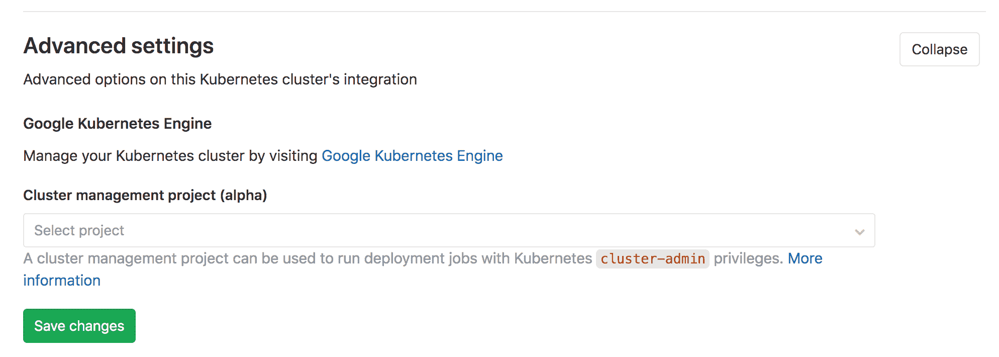

# Cluster management project (alpha)

> 原文：[https://docs.gitlab.com/ee/user/clusters/management_project.html](https://docs.gitlab.com/ee/user/clusters/management_project.html)

*   [Permissions](#permissions)
*   [Usage](#usage)
    *   [Selecting a cluster management project](#selecting-a-cluster-management-project)
    *   [Configuring your pipeline](#configuring-your-pipeline)
    *   [Setting the environment scope](#setting-the-environment-scope-premium)

# Cluster management project (alpha)[](#cluster-management-project-alpha "Permalink")

**警告：**这是*Alpha 版*功能，如有更改，恕不另行通知.

在 GitLab 12.5 中[引入](https://gitlab.com/gitlab-org/gitlab/-/issues/32810)

可以将一个项目指定为集群的管理项目. 管理项目可用于以 Kubernetes [`cluster-admin`](https://kubernetes.io/docs/reference/access-authn-authz/rbac/#user-facing-roles)权限运行部署作业.

这对以下情况很有用：

*   创建管道以将群集范围的应用程序安装到群集中，有关详细信息，请参见[使用 GitLab CI / CD（alpha）](applications.html#install-using-gitlab-cicd-alpha)安装.
*   需要`cluster-admin`权限的所有作业.

## Permissions[](#permissions "Permalink")

仅管理项目将获得`cluster-admin`权限. 所有其他项目将继续获得[命名空间范围的`edit`级别特权](../project/clusters/add_remove_clusters.html#rbac-cluster-resources) .

管理项目仅限于以下内容：

*   对于项目级集群，管理项目必须与集群项目位于相同的名称空间（或子代）中.
*   对于组级集群，管理项目必须与集群的组位于同一组（或子孙）中.
*   对于实例级群集，没有此类限制.

## Usage[](#usage "Permalink")

要将群集管理项目用于群集：

1.  选择项目.
2.  配置管道.
3.  设置环境范围.

### Selecting a cluster management project[](#selecting-a-cluster-management-project "Permalink")

选择要使用的集群管理项目：

1.  导航到适当的配置页面. 为一个：
    *   [项目级集群](../project/clusters/index.html) ，导航到项目的**Operations> Kubernetes**页面.
    *   [组级别集群](../group/clusters/index.html) ，导航到您组的**Kubernetes**页面.
    *   [实例级集群](../instance/clusters/index.html) ，导航到管理区域的**Kubernetes**页面.
2.  在" **高级设置"**部分中的"使用**集群管理项目"字段**中选择项目.

[](img/advanced-settings-cluster-management-project-v12_5.png)

### Configuring your pipeline[](#configuring-your-pipeline "Permalink")

将项目指定为集群的管理项目后，在该项目中编写[`.gitlab-ci.yml`](../../ci/yaml/README.html) . 例如：

```
configure cluster:
  stage: deploy
  script: kubectl get namespaces
  environment:
    name: production 
```

### Setting the environment scope[](#setting-the-environment-scope-premium "Permalink")

将多个群集与同一管理项目关联时，可以使用[环境范围](../project/clusters/index.html#setting-the-environment-scope-premium) .

每个作用域只能由单个群集用于管理项目.

例如，假设以下 Kubernetes 集群与管理项目相关联：

| Cluster | 环境范围 |
| --- | --- |
| Development | `*` |
| Staging | `staging` |
| Production | `production` |

[`.gitlab-ci.yml`](../../ci/yaml/README.html)设置的以下环境将分别部署到 Development，Staging 和 Production 集群.

```
stages:
  - deploy

configure development cluster:
  stage: deploy
  script: kubectl get namespaces
  environment:
    name: development

configure staging cluster:
  stage: deploy
  script: kubectl get namespaces
  environment:
    name: staging

configure production cluster:
  stage: deploy
  script: kubectl get namespaces
  environment:
    name: production 
```