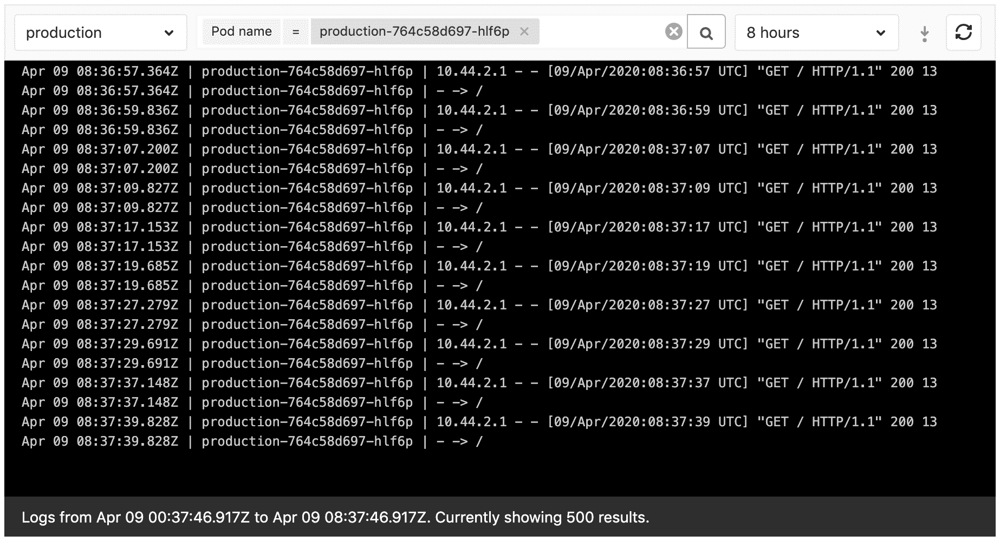
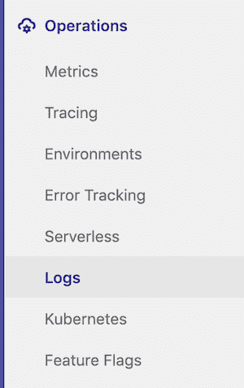
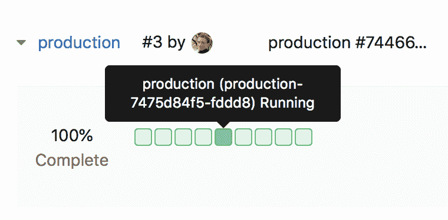

# Kubernetes Logs

> 原文：[https://docs.gitlab.com/ee/user/project/clusters/kubernetes_pod_logs.html](https://docs.gitlab.com/ee/user/project/clusters/kubernetes_pod_logs.html)

*   [Overview](#overview)
*   [Requirements](#requirements)
*   [Usage](#usage)
    *   [From the project sidebar](#from-the-project-sidebar)
    *   [From Deploy Boards](#from-deploy-boards)
    *   [Logs view](#logs-view)
    *   [Filter by date](#filter-by-date)
    *   [Full text search](#full-text-search)

# Kubernetes Logs

版本历史

*   在[GitLab Ultimate](https://about.gitlab.com/pricing/) 11.0 中[引入](https://gitlab.com/gitlab-org/gitlab/-/issues/4752) .
*   [移至](https://gitlab.com/gitlab-org/gitlab/-/merge_requests/26383) [GitLab Core](https://about.gitlab.com/pricing/) 12.9\.

使用 GitLab 可以轻松查看[连接的 Kubernetes 集群](index.html)中正在运行的 Pod 的日志. 通过直接在**Log Explorer 的** GitLab 中显示**日志** ，开发人员可以避免管理控制台工具或跳转到其他界面.

**注意：** [了解有关 Kubernetes + GitLab 的更多信息](https://about.gitlab.com/solutions/kubernetes/) . 大规模构建，测试，部署和运行应用程序所需的一切.

## Overview

[Kubernetes](https://kubernetes.io)日志可以使用**Log Explorer**在 GitLab 中直接查看.

要了解更多信息，请参阅[APM-Log Explorer](https://www.youtube.com/watch?v=hWclZHA7Dgw) .

## Requirements

要使用日志，需要[部署到 Kubernetes 环境](../deploy_boards.html#enabling-deploy-boards) .

## Usage

要访问日志，您必须具有正确的[权限](../../permissions.html#project-members-permissions) .

您可以通过两种方式访问​​它们.

### From the project sidebar

在 GitLab 12.5 中[引入](https://gitlab.com/gitlab-org/gitlab-foss/-/merge_requests/22011) .

去 侧栏菜单上的" **操作">"舱位日志** "以显示" **日志资源管理器"** .

### From Deploy Boards

可以通过单击[Deploy Boards 中](../deploy_boards.html)的特定窗格来显示日志：

1.  去 **操作>环境，**然后找到包含所需 pod 的环境，例如`production` .
2.  在" **环境"**页面上，您应该通过[Deploy Boards](../deploy_boards.html)看到环境容器的状态.
3.  将鼠标悬停在窗格列表上时，将显示一个工具提示，其中包含确切的窗格名称和状态. 
4.  单击所需的窗格以显示**Log Explorer** .

### Logs view

**日志浏览**器使您可以通过以下方式过滤日志：

*   Pods.
*   [从 GitLab 12.4 开始](https://gitlab.com/gitlab-org/gitlab/-/issues/5769) ，环境.
*   [From GitLab 12.7](https://gitlab.com/gitlab-org/gitlab/-/merge_requests/21656), [full text search](#full-text-search).
*   [从 GitLab 12.8 开始](https://gitlab.com/gitlab-org/gitlab/-/issues/197879) ，日期.

从[GitLab 12.9](https://gitlab.com/gitlab-org/gitlab/-/issues/198050)起可以加载 500 条以上的日志行.

[在将来的版本中将](https://gitlab.com/gitlab-org/gitlab/-/issues/13404)支持具有多个容器的 Pod.

[在将来的版本中将](https://gitlab.com/gitlab-org/gitlab/-/issues/196191)支持历史数据.

### Filter by date

在 GitLab 12.8 中[引入](https://gitlab.com/gitlab-org/gitlab/-/issues/197879) .

在集群上启用[Elastic Stack](../../clusters/applications.html#elastic-stack)时，您可以按日期过滤" **日志浏览**器"中显示的**日志** .

单击" **日志资源管理器"**中的" **显示最后一个** "以查看可用选项.

### Full text search

在 GitLab 12.7 中[引入](https://gitlab.com/gitlab-org/gitlab/-/merge_requests/21656) .

在集群上启用[Elastic Stack](../../clusters/applications.html#elastic-stack)时，可以通过搜索栏搜索日志的内容.

搜索通过使用[simple_query_string](https://www.elastic.co/guide/en/elasticsearch/reference/current/query-dsl-simple-query-string-query.html) Elasticsearch 函数传递给 Elasticsearch，该函数支持以下运算符：

| Operator | Description |
| --- | --- |
| `\&#124;` | 或运算. |
| `-` | 取反单个令牌. |
| `+` | AND 运算. |
| `"` | 包装许多标记以表示要搜索的短语. |
| `*` （每学期末） | 前缀查询. |
| `(` and `)` | Precedence. |
| `~N` （一个字之后） | 编辑距离（模糊性）. |
| `~N` （在短语之后） | 斜率. |