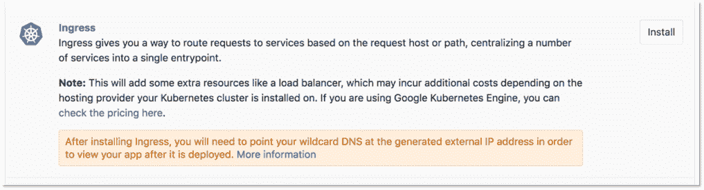
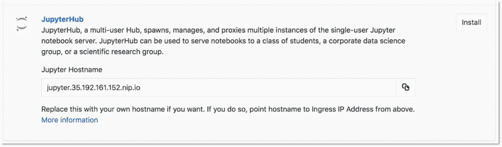
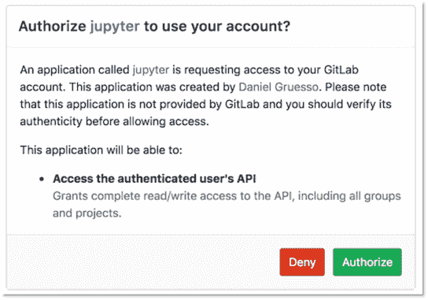
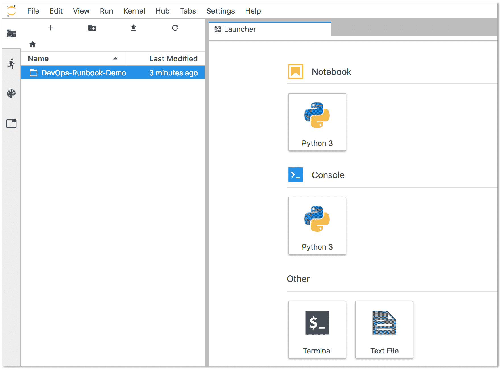
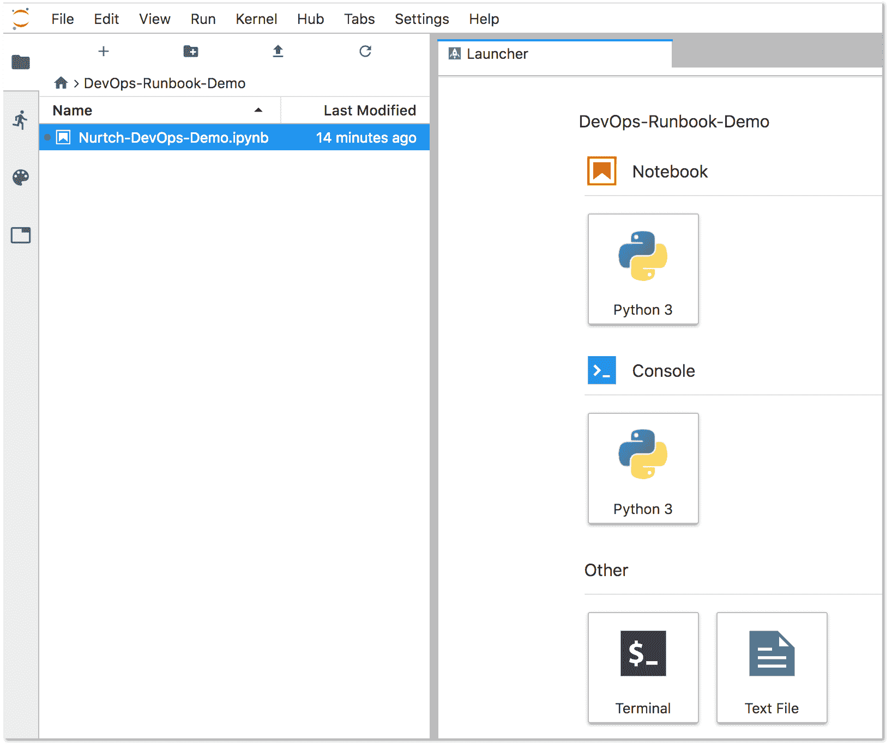
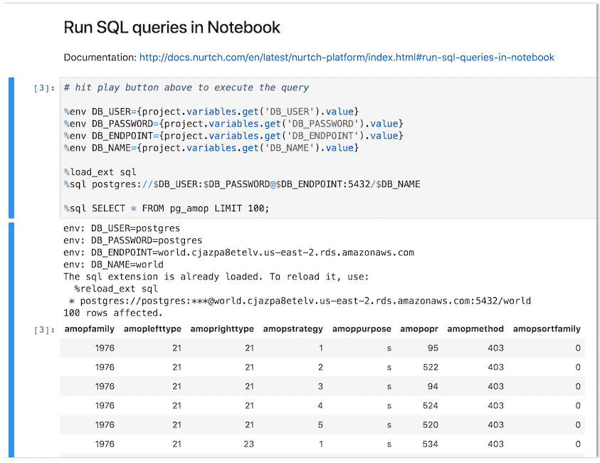

# Runbooks

> 原文：[https://docs.gitlab.com/ee/user/project/clusters/runbooks/](https://docs.gitlab.com/ee/user/project/clusters/runbooks/)

*   [Executable Runbooks](#executable-runbooks)
*   [Requirements](#requirements)
*   [Nurtch](#nurtch)
*   [Configure an executable runbook with GitLab](#configure-an-executable-runbook-with-gitlab)

# Runbooks[](#runbooks "Permalink")

Runbooks 是记录在案的过程的集合，这些过程解释了如何执行特定过程，包括启动，停止，调试特定系统或对特定系统进行故障排除.

使用[Jupyter Notebook](https://jupyter.org/)和[Rubix 库](https://github.com/Nurtch/rubix) ，用户可以开始编写自己的可执行运行手册.

从历史上看，运行手册根据情况或系统采用决策树或详细的分步指南的形式.

现代的实现方式引入了"可执行的运行手册"的概念，其中，操作员可以结合定义良好的流程在给定的环境中执行预写的代码块或数据库查询.

## Executable Runbooks[](#executable-runbooks "Permalink")

在 GitLab 11.4 中[引入](https://gitlab.com/gitlab-org/gitlab-foss/-/issues/45912) .

通过 GitLab 的 Kubernetes 集成提供的 JupyterHub 应用程序现在随 Nurtch 的 Rubix 库一起提供，提供了一种创建 DevOps Runbook 的简单方法. 提供了一个样本运行手册，其中展示了常见的操作. 虽然 Rubix 使创建常见的 Kubernetes 和 AWS 工作流变得简单，但是您也可以不使用 Rubix 手动创建它们.

观看此[视频](https://www.youtube.com/watch?v=Q_OqHIIUPjE) ，了解如何在 GitLab 中完成此操作！

## Requirements[](#requirements "Permalink")

要创建可执行的运行本，您将需要：

*   **Kubernetes-**需要 Kubernetes 集群才能部署其余应用程序. 最简单的入门方法是使用[GitLab 的集成](../add_remove_clusters.html#create-new-cluster)之一添加集群.
*   **入口** -入口可以提供负载平衡，SSL 终止和基于名称的虚拟主机. 它充当您的应用程序的 Web 代理.
*   **JupyterHub** - [JupyterHub](https://jupyterhub.readthedocs.io/)是用于在团队中管理笔记本的多用户服务. Jupyter Notebook 提供了一个基于 Web 的交互式编程环境，用于数据分析，可视化和机器学习.

## Nurtch[](#nurtch "Permalink")

Nurtch 是[Rubix 库](https://github.com/Nurtch/rubix)背后的公司. Rubix 是一个开源 Python 库，可轻松在 Jupyter Notebooks 中执行常见的 DevOps 任务. 绘制 Cloudwatch 指标和滚动 ECS / Kubernetes 应用之类的任务将简化为几行代码. 有关更多信息，请参见[Nurtch 文档](http://docs.nurtch.com/en/latest/) .

## Configure an executable runbook with GitLab[](#configure-an-executable-runbook-with-gitlab "Permalink")

遵循此分步指南，使用上述组件和预加载的演示运行本在 GitLab 中配置可执行运行本.

1.  遵循[创建新集群中](../add_remove_clusters.html#create-new-cluster)概述的步骤，将 Kubernetes 集群添加到您的项目中.

2.  单击**Ingress**应用程序旁边的" **安装"**按钮以安装 Ingress.

    [](img/ingress-install.png)

3.  成功安装 Ingress 后，单击**JupyterHub**应用程序旁边的" **安装"**按钮. **下一步，**您将需要此处提供的**Jupyter 主机名** .

    [](img/jupyterhub-install.png)

4.  成功安装**JupyterHub 后** ，在浏览器中打开**Jupyter 主机名** . 单击" **使用 GitLab 登录"**按钮登录到 JupyterHub 并启动服务器. 使用 OAuth2 为 GitLab 实例的任何用户启用身份验证. 此按钮将您重定向到 GitLab 上的页面，请求 JupyterHub 授权使用您的 GitLab 帐户.

    [](img/authorize-jupyter.png)

5.  单击**Authorize** ，您将被重定向到 JupyterHub 应用程序.
6.  单击" **启动我的服务器"** ，服务器将在几秒钟后启动.
7.  要配置 Runbook 对 GitLab 项目的访问，必须在演示 Runbook 的" **设置"**部分中输入您的[GitLab 访问令牌](../../../profile/personal_access_tokens.html)和项目 ID：

    1.  双击左侧面板上的**DevOps-Runbook-Demo**文件夹.

        [](img/demo-runbook.png)

    2.  双击`Nurtch-DevOps-Demo.ipynb` .

        [](img/sample-runbook.png)

        Jupyter 在屏幕右侧显示 Runbook 的内容. **设置**部分显示您的`PRIVATE_TOKEN`和您的`PROJECT_ID` . 输入这些值，并保持单引号如下：

        ```
        PRIVATE_TOKEN = 'n671WNGecHugsdEDPsyo'
        PROJECT_ID = '1234567' 
        ```

    3.  Update the `VARIABLE_NAME` on the last line of this section to match the name of the variable you’re using for your access token. In this example, our variable name is `PRIVATE_TOKEN`.

        ```
        VARIABLE_VALUE = project.variables.get('PRIVATE_TOKEN').value 
        ```

8.  要配置运行手册的操作，请创建和配置变量：

    **注意：**对于此示例，我们使用示例**运行簿**中的**笔记本中**的**"运行 SQL 查询"**部分来查询 PostgreSQL 数据库. 以下代码块的前四行定义了此查询运行所需的变量：

    ```
    %env DB_USER={project.variables.get('DB_USER').value}
    %env DB_PASSWORD={project.variables.get('DB_PASSWORD').value}
    %env DB_ENDPOINT={project.variables.get('DB_ENDPOINT').value}
    %env DB_NAME={project.variables.get('DB_NAME').value} 
    ```

    1.  导航 **设置»CI / CD»变量**以在项目中创建变量.

        [](img/gitlab-variables.png)

    2.  Click **保存变量**.

    3.  在 Jupyter 中，单击**"笔记本"**标题中的**"运行 SQL 查询"** ，然后单击**"运行"** . 结果以内联方式显示如下：

        [](img/postgres-query.png)

您可以尝试其他操作，例如运行 Shell 脚本或与 Kubernetes 集群进行交互. 有关更多信息，请访问[Nurtch 文档](http://docs.nurtch.com/) .