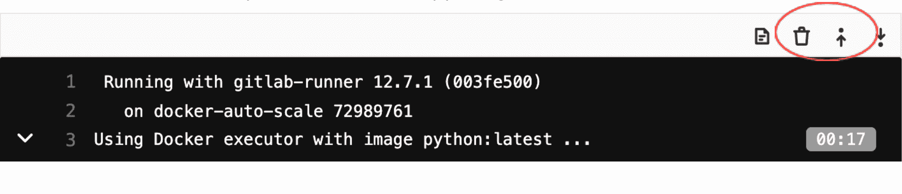
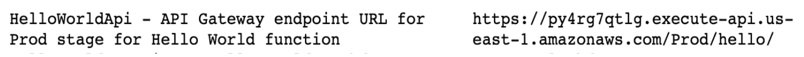

# Deploying AWS Lambda function using GitLab CI/CD

> 原文：[https://docs.gitlab.com/ee/user/project/clusters/serverless/aws.html](https://docs.gitlab.com/ee/user/project/clusters/serverless/aws.html)

*   [Serverless Framework](#serverless-framework)
    *   [Example](#example)
        *   [Steps](#steps)
        *   [Creating a Lambda handler function](#creating-a-lambda-handler-function)
        *   [Creating a `serverless.yml` file](#creating-a-serverlessyml-file)
        *   [Crafting the `.gitlab-ci.yml` file](#crafting-the-gitlab-ciyml-file)
        *   [Setting up your AWS credentials with your GitLab account](#setting-up-your-aws-credentials-with-your-gitlab-account)
        *   [Deploying your function](#deploying-your-function)
        *   [Manually testing your function](#manually-testing-your-function)
    *   [How To](#how-to)
        *   [Running function locally](#running-function-locally)
        *   [Secret variables](#secret-variables)
        *   [Setting up CORS](#setting-up-cors)
        *   [Writing automated tests](#writing-automated-tests)
    *   [Examples and template](#examples-and-template)
*   [AWS Serverless Application Model](#aws-serverless-application-model)
    *   [Deploying AWS Lambda function using AWS SAM and GitLab CI/CD](#deploying-aws-lambda-function-using-aws-sam-and-gitlab-cicd)
    *   [Example](#example-1)
    *   [Steps](#steps-1)
    *   [Installing SAM CLI](#installing-sam-cli)
    *   [Creating an AWS SAM application using SAM CLI](#creating-an-aws-sam-application-using-sam-cli)
    *   [Setting up your AWS credentials with your GitLab account](#setting-up-your-aws-credentials-with-your-gitlab-account-1)
    *   [Crafting the `.gitlab-ci.yml` file](#crafting-the-gitlab-ciyml-file-1)
    *   [Deploying your application](#deploying-your-application)
    *   [Testing the deployed application](#testing-the-deployed-application)
    *   [Testing Locally](#testing-locally)

# Deploying AWS Lambda function using GitLab CI/CD[](#deploying-aws-lambda-function-using-gitlab-cicd "Permalink")

GitLab 允许用户轻松部署 AWS Lambda 函数并创建丰富的无服务器应用程序.

GitLab 支持使用以下无服务器框架通过 GitLab CI / CD 部署 AWS Lambda 功能：

*   [Serverless Framework with AWS](#serverless-framework)
*   [AWS’ Serverless Application Model (SAM)](#aws-serverless-application-model)

## Serverless Framework[](#serverless-framework "Permalink")

The [Serverless Framework can deploy to AWS](https://www.serverless.com/framework/docs/providers/aws/).

我们准备了一个包含分步指南的示例，以创建一个简单功能并将其部署在 AWS 上.

此外，在"操作方法["部分中](#how-to) ，您可以了解不同的用例，例如：

*   在本地运行功能.
*   处理秘密.
*   设置 CORS.

或者，您可以[使用 template](../../../../gitlab-basics/create-project.html#project-templates)快速[创建一个新项目](../../../../gitlab-basics/create-project.html#project-templates) . [`Serverless Framework/JS`模板](https://gitlab.com/gitlab-org/project-templates/serverless-framework/)已经包括下面描述的所有部分.

### Example[](#example "Permalink")

在以下示例中，您将：

1.  创建一个基本的 AWS Lambda Node.js 函数.
2.  将该函数链接到 API Gateway `GET`端点.

#### Steps[](#steps "Permalink")

该示例包括以下步骤：

1.  创建 Lambda 处理函数.
2.  创建一个`serverless.yml`文件.
3.  制作`.gitlab-ci.yml`文件.
4.  使用 GitLab 账户设置 AWS 凭证.
5.  部署您的功能.
6.  测试已部署的功能.

让我们一步一步来.

#### Creating a Lambda handler function[](#creating-a-lambda-handler-function "Permalink")

您的 Lambda 函数将是请求的主要处理程序. 在这种情况下，我们将创建一个非常简单的 Node.js `hello`函数：

```
'use strict';

module.exports.hello = async event => {
  return {
    statusCode: 200,
    body: JSON.stringify(
      {
        message: 'Your function executed successfully!'
      },
      null,
      2
    ),
  };
}; 
```

将此代码放在文件`src/handler.js` .

`src`是无服务器功能的标准位置，但是您可以根据需要进行自定义.

在我们的例子中， `module.exports.hello`定义了`hello` ，这将在以后的引用处理器`serverless.yml`

您可以在此处了解有关 AWS Lambda Node.js 函数处理程序及其所有各种选项的更多信息： [https](https://docs.aws.amazon.com/lambda/latest/dg/nodejs-prog-model-handler.html) : [//docs.aws.amazon.com/lambda/latest/dg/nodejs-prog-model-handler.html](https://docs.aws.amazon.com/lambda/latest/dg/nodejs-prog-model-handler.html)

#### Creating a `serverless.yml` file[](#creating-a-serverlessyml-file "Permalink")

在项目的根目录中，创建一个`serverless.yml`文件，其中将包含 Serverless Framework 的配置详细信息.

将以下代码放入文件中：

```
service: gitlab-example
provider:
  name: aws
  runtime: nodejs10.x

functions:
  hello:
    handler: src/handler.hello
    events:
      - http: GET hello 
```

我们的函数包含一个处理程序和一个事件.

处理程序定义将使用位于`src/handler.hello`的源代码提供 Lambda 函数.

`events`声明将创建一个 AWS API Gateway `GET`终端节点，以接收外部请求并将其通过服务集成传递给 Lambda 函数.

您可以阅读有关无服务器框架的[可用属性和其他配置可能性](https://www.serverless.com/framework/docs/providers/aws/guide/serverless.yml/)的更多信息.

#### Crafting the `.gitlab-ci.yml` file[](#crafting-the-gitlab-ciyml-file "Permalink")

在项目根目录下的`.gitlab-ci.yml`文件中，放置以下代码：

```
image: node:latest

stages:
  - deploy

production:
  stage: deploy
  before_script:
    - npm config set prefix /usr/local
    - npm install -g serverless
  script:
    - serverless deploy --stage production --verbose
  environment: production 
```

此示例代码执行以下操作：

1.  对所有 GitLab CI / CD 版本使用`node:latest`映像
2.  The `deploy` stage:
    *   安装无服务器框架.
    *   使用上面定义的 AWS 凭证将无服务器功能部署到您的 AWS 账户.

#### Setting up your AWS credentials with your GitLab account[](#setting-up-your-aws-credentials-with-your-gitlab-account "Permalink")

为了与您的 AWS 账户进行交互，GitLab CI / CD 管道要求在您的 GitLab 设置中的**设置> CI / CD>变量**下定义`AWS_ACCESS_KEY_ID`和`AWS_SECRET_ACCESS_KEY` . 有关更多信息，请参见[在 UI 中创建自定义变量](../../../../ci/variables/README.html#create-a-custom-variable-in-the-ui) .

**注意：**您提供的 AWS 凭证必须包括 IAM 策略，以提供对 AWS Lambda，API 网关，CloudFormation 和 IAM 资源的正确访问控制.

#### Deploying your function[](#deploying-your-function "Permalink")

`git push` the changes to your GitLab repository and the GitLab build pipeline will automatically deploy your function.

在您的 GitLab 部署阶段日志中，将包含您的 AWS Lambda 端点 URL 的输出. 日志行将类似于以下内容：

```
endpoints:
  GET - https://u768nzby1j.execute-api.us-east-1.amazonaws.com/production/hello 
```

#### Manually testing your function[](#manually-testing-your-function "Permalink")

运行以下`curl`命令将触发您的功能.

**注意：**您的 URL 应该是从 GitLab 部署阶段日志中检索到的 URL.

```
curl https://u768nzby1j.execute-api.us-east-1.amazonaws.com/production/hello 
```

那应该输出：

```
{  "message":  "Your function executed successfully!"  } 
```

万岁！ 现在，您已经通过 GitLab CI / CD 部署了 AWS Lambda 函数.

干得好！

### How To[](#how-to "Permalink")

在本节中，我们向您展示如何在基本示例上构建以下内容：

*   在本地运行该功能.
*   设置秘密变量.
*   设置 CORS.

#### Running function locally[](#running-function-locally "Permalink")

`serverless-offline`插件允许在本地运行代码. 要在本地运行代码：

1.  将以下内容添加到您的`serverless.yml` ：

    ```
    plugins:
      - serverless-offline 
    ```

2.  通过运行以下命令来启动服务：

    ```
    serverless offline 
    ```

运行以下`curl`命令将触发您的功能.

```
curl http://localhost:3000/hello 
```

它应该输出：

```
{  "message":  "Your function executed successfully!"  } 
```

#### Secret variables[](#secret-variables "Permalink")

Secrets are injected into your functions using environment variables.

通过在`serverless.yml`的 provider 部分中定义变量，可以将它们添加到已部署函数的环境中：

```
provider:
  ...
  environment:
    A_VARIABLE: ${env:A_VARIABLE} 
```

从那里，您也可以在函数中引用它们. 请记住，在**设置> CI / CD>**变量下，将`A_VARIABLE`添加到您的 GitLab CI / CD 变量中，它将随您的函数一起被拾取和部署.

**注意：**有权访问 AWS 环境的任何人都可以查看 lambda 定义中保留的那些变量的值.

#### Setting up CORS[](#setting-up-cors "Permalink")

如果您想要建立一个调用函数的网页，就像我们在[模板中](https://gitlab.com/gitlab-org/project-templates/serverless-framework/)所做的那样，则需要处理跨域资源共享（CORS）.

快速的方法来做到这一点是添加`cors: true`标志的 HTTP 端点在你`serverless.yml` ：

```
functions:
  hello:
    handler: src/handler.hello
    events:
      - http: # Rewrite this part to enable CORS
          path: hello
          method: get
          cors: true # <-- CORS here 
```

您还需要在函数响应中返回 CORS 特定的标头：

```
'use strict';

module.exports.hello = async event => {
  return {
    statusCode: 200,
    headers: {
      // Uncomment the line below if you need access to cookies or authentication
      // 'Access-Control-Allow-Credentials': true,
      'Access-Control-Allow-Origin': '*'
    },
    body: JSON.stringify(
      {
        message: 'Your function executed successfully!'
      },
      null,
      2
    ),
  };
}; 
```

有关更多信息，请参阅由无服务器框架团队撰写的《 [您的 CORS 和 API 网关生存指南》](https://www.serverless.com/blog/cors-api-gateway-survival-guide/)博客文章.

#### Writing automated tests[](#writing-automated-tests "Permalink")

[无服务器框架](https://gitlab.com/gitlab-org/project-templates/serverless-framework/)示例项目展示了如何使用 Jest，Axios 和`serverless-offline`插件对本地和已部署的无服务器功能进行自动化测试.

### Examples and template[](#examples-and-template "Permalink")

示例代码可用：

*   作为[可克隆的存储库](https://gitlab.com/gitlab-org/serverless/examples/serverless-framework-js) .
*   在带有[测试和秘密变量](https://gitlab.com/gitlab-org/project-templates/serverless-framework/)的版本中.

您还可以在 GitLab UI 中使用[模板](../../../../gitlab-basics/create-project.html#project-templates) （基于带有测试和秘密变量的版本）（请参阅`Serverless Framework/JS`模板）.

## AWS Serverless Application Model[](#aws-serverless-application-model "Permalink")

AWS 无服务器应用程序模型是用于构建无服务器应用程序的开源框架. 它使构建和部署无服务器应用程序变得更加容易. 有关更多详细信息，请参阅有关[AWS 无服务器应用程序模型的](https://docs.aws.amazon.com/serverless-application-model/) AWS 文档.

### Deploying AWS Lambda function using AWS SAM and GitLab CI/CD[](#deploying-aws-lambda-function-using-aws-sam-and-gitlab-cicd "Permalink")

GitLab 允许开发人员使用以下组合来构建和部署无服务器应用程序：

*   [AWS Serverless Application Model (AWS SAM)](https://aws.amazon.com/serverless/sam/).
*   亚搏体育 app CI / CD.

### Example[](#example-1 "Permalink")

在以下示例中，您将：

*   安装 SAM CLI.
*   创建一个示例 SAM 应用程序，其中包括 Lambda 函数和 API 网关.
*   使用 GitLab CI / CD 将应用程序构建并部署到您的 AWS 账户.

### Steps[](#steps-1 "Permalink")

该示例包括以下步骤：

1.  安装 SAM CLI.
2.  使用 SAM CLI 创建 AWS SAM 应用程序.
3.  制作`.gitlab-ci.yml`文件.
4.  使用 GitLab 账户设置 AWS 凭证.
5.  部署您的应用程序.
6.  测试已部署的功能.

### Installing SAM CLI[](#installing-sam-cli "Permalink")

AWS SAM 提供了一个称为 AWS SAM CLI 的 CLI，可简化创建和管理应用程序的过程.

本文档中的某些步骤使用 SAM CLI. 请按照说明[安装 SAM CLI](https://docs.aws.amazon.com/serverless-application-model/latest/developerguide/serverless-sam-cli-install.html)来安装和配置 SAM CLI.

如果您将[AWS Cloud9](https://aws.amazon.com/cloud9/)用作集成开发环境（IDE），则会为您安装以下软件：

*   [AWS Command Line Interface](https://docs.aws.amazon.com/en_pv/cli/latest/userguide/cli-chap-install.html)
*   [SAM CLI](https://docs.aws.amazon.com/en_pv/serverless-application-model/latest/developerguide/serverless-sam-cli-install.html)
*   [Docker](https://s0docs0docker0com.icopy.site/install/)和必要的 Docker 映像

### Creating an AWS SAM application using SAM CLI[](#creating-an-aws-sam-application-using-sam-cli "Permalink")

要创建新的 AWS SAM 应用程序：

1.  创建一个新的 GitLab 项目.
2.  `git clone`将项目`git clone`到您的本地环境中.
3.  更改为新克隆的项目，并使用以下命令创建新的 SAM 应用程序：

    ```
    sam init -r python3.8 -n gitlabpoc --app-template "hello-world" 
    ```

4.  `git push`应用程序`git push`回到 GitLab 项目.

这将使用默认配置创建一个名为`gitlabpoc`的 SAM 应用程序，该配置是[Amazon API Gateway](https://aws.amazon.com/api-gateway/)端点调用的单个 Python 3.8 函数. 要查看 SAM 支持的其他运行时以及`sam init`选项，请运行：

```
sam init -h 
```

### Setting up your AWS credentials with your GitLab account[](#setting-up-your-aws-credentials-with-your-gitlab-account-1 "Permalink")

为了与您的 AWS 账户进行交互，GitLab CI / CD 管道要求在项目的 CI / CD 变量中同时设置`AWS_ACCESS_KEY_ID`和`AWS_SECRET_ACCESS_KEY` .

设置这些：

1.  导航到项目的 **设置> CI / CD** .
2.  展开**变量**部分，并为`AWS_ACCESS_KEY_ID`和`AWS_SECRET_ACCESS_KEY`创建条目.
3.  屏蔽凭据，以免使用"已**屏蔽"**切换将其显示在日志中.

**注意：**您提供的 AWS 凭证必须包括 IAM 策略，以提供对 AWS Lambda，API 网关，CloudFormation 和 IAM 资源的正确访问控制.

### Crafting the `.gitlab-ci.yml` file[](#crafting-the-gitlab-ciyml-file-1 "Permalink")

在项目根目录中的[`.gitlab-ci.yml`](../../../../ci/yaml/README.html)文件中，添加以下内容，并将`<S3_bucket_name>`替换为要在其中存储软件包的 S3 存储桶的名称：

```
image: python:latest

stages:
  - deploy

production:
  stage: deploy
  before_script:
    - pip3 install awscli --upgrade
    - pip3 install aws-sam-cli --upgrade
  script:
    - sam build
    - sam package --output-template-file packaged.yaml --s3-bucket <S3_bucket_name>
    - sam deploy --template-file packaged.yaml --stack-name gitlabpoc  --s3-bucket <S3_bucket_name> --capabilities CAPABILITY_IAM --region us-east-1
  environment: production 
```

让我们更仔细地检查配置文件：

*   `image`指定用于此构建的 Docker 映像. 由于示例应用程序是用 Python 编写的，因此这是最新的 Python 图像.
*   AWS CLI 和 AWS SAM CLI 安装在`before_script`部分中.
*   SAM 构建，打包和部署命令用于构建，打包和部署应用程序.

### Deploying your application[](#deploying-your-application "Permalink")

Push changes to your GitLab repository and the GitLab build pipeline will automatically deploy your application. If your:

*   构建和部署成功， [测试已部署的应用程序](#testing-the-deployed-application) .
*   生成失败，请查看生成日志以查看生成失败的原因. 构建可能会失败的一些常见原因是：

    *   不兼容的软件版本. 例如，Python 运行时版本可能与构建计算机上的 Python 不同. 通过安装所需的软件版本来解决此问题.
    *   您可能无法从 GitLab 访问您的 AWS 账户. 检查您使用 AWS 凭证设置的环境变量.
    *   您可能没有权限部署无服务器应用程序. 确保提供了部署无服务器应用程序所需的所有权限.

### Testing the deployed application[](#testing-the-deployed-application "Permalink")

要测试您部署的应用程序，请转到构建日志，然后执行以下步骤：

1.  点击右上角的"显示完整的原始数据"：

    [](img/sam-complete-raw.png)

2.  查找 HelloWorldApi –与以下所示类似的 API 网关端点：

    [](img/sam-api-endpoint.png)

3.  使用 curl 测试 API. 例如：

    ```
    curl https://py4rg7qtlg.execute-api.us-east-1.amazonaws.com/Prod/hello/ 
    ```

输出应为：

```
{"message":  "hello world"} 
```

### Testing Locally[](#testing-locally "Permalink")

AWS SAM 提供了在本地测试应用程序的功能. 您必须在本地安装 AWS SAM CLI，才能在本地进行测试.

首先，测试功能.

SAM 在`events/event.json`中提供一个默认事件，其中包括以下消息主体：

```
{\"message\": \"hello world\"} 
```

如果您将该事件传递给`HelloWorldFunction` ，则它应该以相同的主体响应.

通过运行以下命令来调用该函数：

```
sam local invoke HelloWorldFunction -e events/event.json 
```

输出应为：

```
{"message":  "hello world"} 
```

确认 Lambda 函数按预期工作后，请按照以下步骤测试 API 网关.

通过运行以下命令在本地启动 API：

```
sam local start-api 
```

SAM 再次启动 Docker 容器，这一次是在`localhost:3000`上侦听的模拟 Amazon API Gateway.

通过运行以下命令来调用`hello` API：

```
curl http://127.0.0.1:3000/hello 
```

再次输出应为：

```
{"message":  "hello world"} 
```