# Groups

> 原文：[https://docs.gitlab.com/ee/user/group/](https://docs.gitlab.com/ee/user/group/)

*   [Use cases](#use-cases)
*   [Namespaces](#namespaces)
*   [Issues and merge requests within a group](#issues-and-merge-requests-within-a-group)
    *   [Bulk editing issues and merge requests](#bulk-editing-issues-and-merge-requests)
*   [Create a new group](#create-a-new-group)
*   [Add users to a group](#add-users-to-a-group)
*   [Request access to a group](#request-access-to-a-group)
*   [Changing the owner of a group](#changing-the-owner-of-a-group)
*   [Remove a member from the group](#remove-a-member-from-the-group)
*   [Changing the default branch protection of a group](#changing-the-default-branch-protection-of-a-group)
*   [Add projects to a group](#add-projects-to-a-group)
    *   [Default project-creation level](#default-project-creation-level)
*   [View group details](#view-group-details)
    *   [Group activity analytics overview](#group-activity-analytics-overview)
*   [View group activity](#view-group-activity)
*   [Transfer projects into groups](#transfer-projects-into-groups)
*   [Sharing a project with a group](#sharing-a-project-with-a-group)
*   [Sharing a group with another group](#sharing-a-group-with-another-group)
*   [Manage group memberships via LDAP](#manage-group-memberships-via-ldap)
    *   [Creating group links via CN](#creating-group-links-via-cn-starter-only)
    *   [Creating group links via filter](#creating-group-links-via-filter-premium-only)
    *   [Overriding user permissions](#overriding-user-permissions-starter-only)
*   [Epics](#epics-ultimate)
*   [Group Security Dashboard](#group-security-dashboard-ultimate)
*   [Insights](#insights-ultimate)
*   [Transferring groups](#transferring-groups)
*   [Group settings](#group-settings)
    *   [General settings](#general-settings)
        *   [Changing a group’s path](#changing-a-groups-path)
    *   [Remove a group](#remove-a-group)
    *   [Restore a group](#restore-a-group-premium)
        *   [Enforce 2FA to group members](#enforce-2fa-to-group-members)
        *   [Share with group lock](#share-with-group-lock)
        *   [Member Lock](#member-lock-starter)
        *   [IP access restriction](#ip-access-restriction-premium)
        *   [Allowed domain restriction](#allowed-domain-restriction-premium)
        *   [Group file templates](#group-file-templates-premium)
        *   [Group-level project templates](#group-level-project-templates-premium)
        *   [Disabling email notifications](#disabling-email-notifications)
        *   [Disabling group mentions](#disabling-group-mentions)
        *   [Enabling delayed Project removal](#enabling-delayed-project-removal-premium)
    *   [Advanced settings](#advanced-settings)
        *   [Storage usage quota](#storage-usage-quota-starter)
        *   [Group push rules](#group-push-rules-starter)
            *   [Enabling the feature](#enabling-the-feature)
    *   [Maximum artifacts size](#maximum-artifacts-size-core-only)
*   [User contribution analysis](#user-contribution-analysis-starter)
*   [Issues analytics](#issues-analytics-premium)
*   [Dependency Proxy](#dependency-proxy-premium)

# Groups[](#groups "Permalink")

使用 GitLab 组，您可以：

*   将相关项目组装在一起.
*   授予成员一次访问多个项目的权限.

有关 GitLab 组的视频介绍，请参见[GitLab 大学：存储库，项目和组](https://www.youtube.com/watch?v=4TWfh1aKHHw) .

组也可以嵌套在[子组中](subgroups/index.html) .

通过单击顶部导航中的**组>您的组**来找到您的组.

[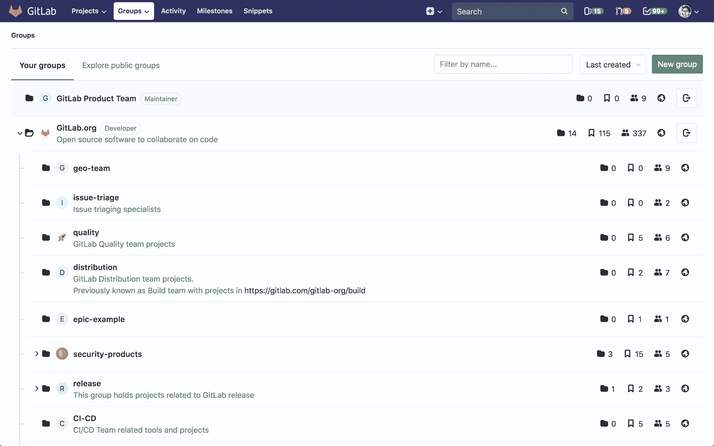](img/groups.png)

[GitLab 11.1](https://about.gitlab.com/releases/2018/07/22/gitlab-11-1-released/#groups-dropdown-in-navigation)中[引入](https://gitlab.com/gitlab-org/gitlab-foss/-/issues/36234)了顶部导航中的" **组"**下拉列表.

" **组"**页面显示：

*   选择**您的组**后， **您将**是**您**所属的所有组.
*   选中" **浏览公共组"**时的公共组列表.

" **组"**页面上的每个组都列出了：

*   它有多少个子组.
*   它包含多少个项目.
*   该组有多少个成员，不包括从父组继承的成员.
*   小组的知名度.
*   如果您具有足够的权限，则指向组设置的链接.
*   如果您是成员，则退出该组的链接.

## Use cases[](#use-cases "Permalink")

您可以出于多种原因创建组. 列举几个：

*   通过在同一[名称空间](#namespaces)下组织相关项目并将成员添加到顶级组，可以以较少的步骤授予对多个项目和多个团队成员的访问权限.
*   通过创建小组并包括适当的成员，可以轻松地`@mention`所有团队中的问题并合并请求.

例如，您可以为公司成员创建一个[组](subgroups/index.html) ，并为每个单独的团队创建一个[子](subgroups/index.html)组. 假设您创建了一个名为`company-team` ，并且在该组中为各个团队`backend-team` ， `frontend-team`和`production-team`创建了子组.

*   从问题开始新的实现时，请添加评论： *" `@company-team` ，让我们开始吧！* *`@company-team/backend-team`您很高兴！"*
*   当您的后端团队需要前端提供帮助时，他们会添加一条评论： *" `@company-team/frontend-team`您能在这里帮助我们吗？"*
*   前端团队完成实施后，他们会评论： *" `@company-team/backend-team` ，它已经完成！* *让我们将其运送到`@company-team/production-team` ！*

## Namespaces[](#namespaces "Permalink")

在 GitLab 中，名称空间是用作用户名，组名或子组名的唯一名称.

*   `http://gitlab.example.com/username`
*   `http://gitlab.example.com/groupname`
*   `http://gitlab.example.com/groupname/subgroup_name`

例如，考虑一个名为 Alex 的用户：

1.  Alex 在 GitLab.com 上使用用户名`alex`创建了一个帐户； 他们的个人资料将在`https://gitlab.example.com/alex`下访问
2.  Alex 为他们的团队创建了一个小组，小组名称为`alex-team` ； 该小组及其项目将在`https://gitlab.example.com/alex-team`下访问
3.  亚历克斯（Alex）创建了一个亚历克斯小组（ `alex-team`子`alex-team` ，其子小组名称为`marketing` ; 该子小组及其项目将在`https://gitlab.example.com/alex-team/marketing`下访问

通过这样做：

*   任何团队成员都使用`@alex`提及 Alex
*   亚历克斯通过`@alex-team`提及了团队中的每个人
*   亚历克斯只提及`@alex-team/marketing`

## Issues and merge requests within a group[](#issues-and-merge-requests-within-a-group "Permalink")

问题和合并请求是项目的一部分. 对于给定的组，您可以在单个列表视图中查看所有[问题](../project/issues/index.html#issues-list)并将该组中所有项目的[请求合并](../project/merge_requests/reviewing_and_managing_merge_requests.html#view-merge-requests-for-all-projects-in-a-group)在一起.

### Bulk editing issues and merge requests[](#bulk-editing-issues-and-merge-requests "Permalink")

有关详细信息，请参阅[批量编辑问题和合并请求](../group/bulk_editing/index.html) .

## Create a new group[](#create-a-new-group "Permalink")

> 有关不允许用作组名的单词列表，请参见[保留名称](../reserved_names.html) .

要创建新组，请执行以下任一操作：

*   在顶部菜单中，依次单击" **组"**和" **您的组"** ，然后单击绿色按钮" **新建组"** .

    [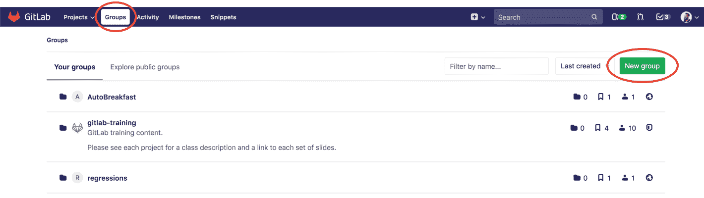](img/new_group_from_groups.png)

*   或者，在顶部菜单中，展开`plus`号并选择**新建组** .

    [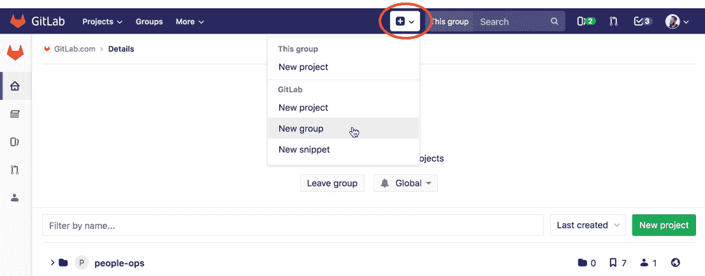](img/new_group_from_other_pages.png)

添加以下信息：

[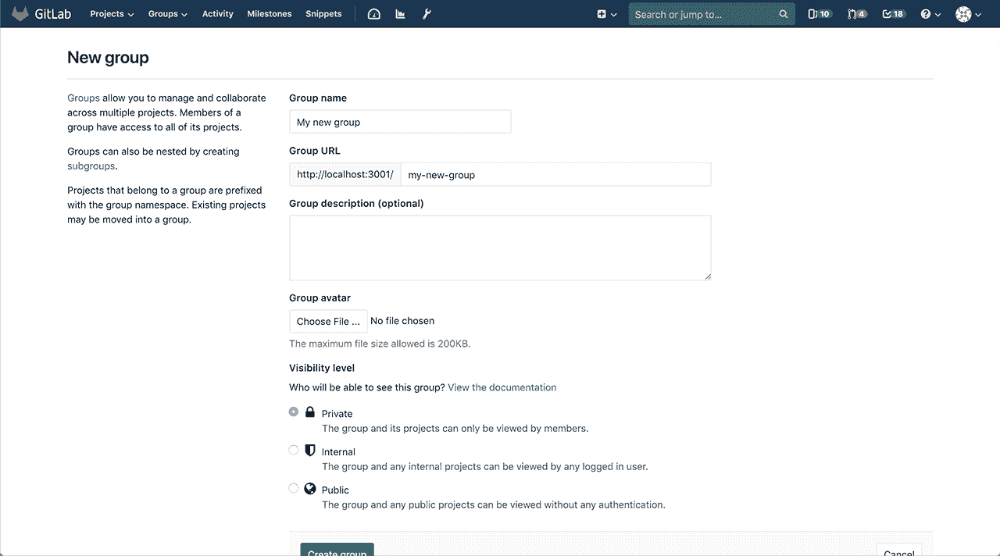](img/create_new_group_info.png)

1.  **组名将**自动填充 URL. （可选）您可以更改它. 这是在组视图中显示的名称. 该名称只能包含：
    *   字母数字字符
    *   下划线
    *   划线和点
    *   空间
2.  **组 URL**是将托管项目的名称空间. 该网址只能包含：
    *   字母数字字符
    *   下划线
    *   破折号和点（不能以破折号开头或以点结尾）
3.  （可选）您可以添加简短说明，以告诉其他人该组的内容.
4.  （可选）为您的群组选择一个头像.
5.  Choose the [visibility level](../../public_access/public_access.html).

有关创建组的更多详细信息，请观看视频[GitLab 命名空间（用户，组和子组）](https://youtu.be/r0sJgjR2f5A) .

## Add users to a group[](#add-users-to-a-group "Permalink")

将多个项目放在一个组中的好处是，您可以通过一个操作就授予用户访问该组中所有项目的权限.

通过导航到组的仪表板并单击**Members**将成员添加到组.

[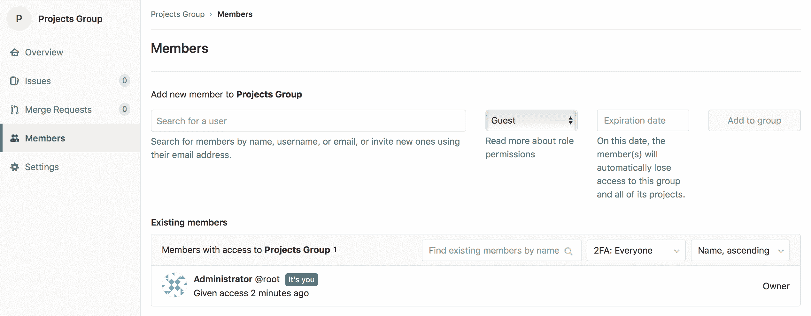](img/add_new_members.png)

选择[权限级别](../permissions.html#permissions) ，然后添加新成员. 您还可以设置该用户的到期日期. 这是他们将不再有权访问您的网上论坛的日期.

考虑一个有两个项目的小组：

*   现在，在" **组成员"**页面上，可以将新用户添加到组中.
*   现在，由于该用户是该组的**开发人员**成员，因此他们自动获得**开发人员**对该组内**所有项目的**访问权限.

要提高特定项目的现有用户的访问级别，请将其作为新成员再次添加到具有所需权限级别的项目中.

## Request access to a group[](#request-access-to-a-group "Permalink")

作为论坛所有者，您可以启用或禁用非会员请求访问您论坛的功能. 转到组设置，然后单击**允许用户请求访问权限** .

作为用户，如果启用了该设置，则可以请求成为组的成员. 转到您要加入的组，然后单击屏幕右侧的" **请求访问**权"按钮.

[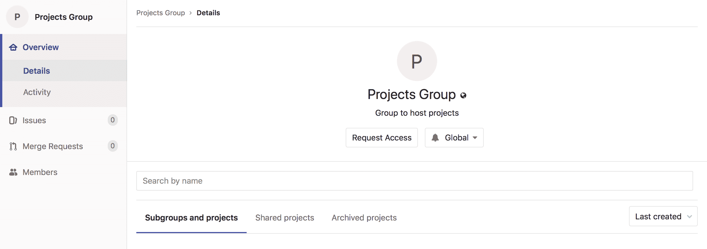](img/request_access_button.png)

请求访问后：

*   通过电子邮件将多达十个群组所有者的通知通知您. 电子邮件将发送给最近活动的组所有者.
*   任何论坛所有者都可以在会员页面上批准或拒绝您的请求.

[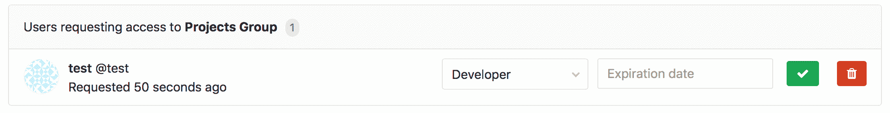](img/access_requests_management.png)

如果您在批准请求之前改变主意，只需单击" **撤回访问请求"**按钮.

[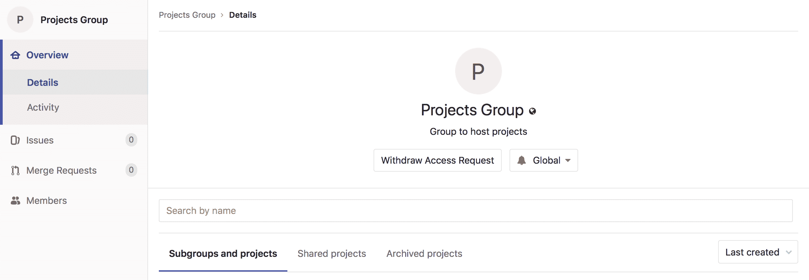](img/withdraw_access_request_button.png)

## Changing the owner of a group[](#changing-the-owner-of-a-group "Permalink")

Ownership of a group means at least one of its members has [Owner permission](../permissions.html#group-members-permissions). Groups must have at least one owner.

可以只更改一个所有者的组所有者. 更改组的唯一所有者：

*   作为管理员：
    1.  前往小组的 **成员**选项卡.
    2.  赋予其他成员**所有者**权限.
    3.  刷新页面. 现在，您可以从原始所有者中删除**所有者**权限.
*   作为当前组的所有者：
    1.  前往小组的 **成员**选项卡.
    2.  赋予其他成员**所有者**权限.
    3.  让新的所有者登录并从您中删除**所有者**权限.

## Remove a member from the group[](#remove-a-member-from-the-group "Permalink")

只有[拥有所有者](../permissions.html#group-members-permissions)权限的[用户](../permissions.html#group-members-permissions)才能管理组成员.

如果给定成员在该组中具有直接成员资格，则可以从该组中删除该成员. 如果成员资格是从父组继承的，则该成员只能从父组本身中删除.

删除成员时，您可以决定是从所有问题中取消分配用户，还是合并当前已分配的请求，还是保留分配.

*   当用户离开私人组并且您希望撤消他们对所有问题的访问并分配他们的合并请求时，从所有问题和合并请求中**取消分配已删除的成员**可能会有所帮助.
*   **保留问题和合并请求的分配**可能对于接受公共贡献的组很有帮助，在这些组中，用户不必是成员就可以为问题和合并请求做出贡献.

要从组中删除成员：

1.  在一个小组中，转到 **成员们** .
2.  点击**删除** 要删除的群组成员旁边的按钮. 出现" **删除成员"**模态.
3.  （可选）选中" **也从相关问题中取消分配此用户并合并请求"**复选框.
4.  Click **删除会员**.

## Changing the default branch protection of a group[](#changing-the-default-branch-protection-of-a-group "Permalink")

在 GitLab 12.9 中[引入](https://gitlab.com/gitlab-org/gitlab/-/issues/7583) .

默认情况下，每个组都继承全局级别的分支保护集.

要为特定组更改此设置：

1.  前往小组的 **设置>常规**页面.
2.  展开" **权限，LFS，2FA"**部分.
3.  在" **默认分支保护"**下拉列表中选择所需的选项.
4.  Click **保存更改**.

要全局更改此设置，请参阅[默认分支保护](../admin_area/settings/visibility_and_access_controls.html#default-branch-protection) .

**注意：**在[GitLab Premium 或更高版本中](https://about.gitlab.com/pricing/) ，GitLab 管理员可以选择[禁止组所有者更新默认的分支保护](../admin_area/settings/visibility_and_access_controls.html#disable-group-owners-from-updating-default-branch-protection-premium-only) .

## Add projects to a group[](#add-projects-to-a-group "Permalink")

有两种方法可以将新项目添加到组中：

*   选择一个组，然后单击" **新建项目"** . 然后，您可以继续[创建您的项目](../../gitlab-basics/create-project.html) .

    [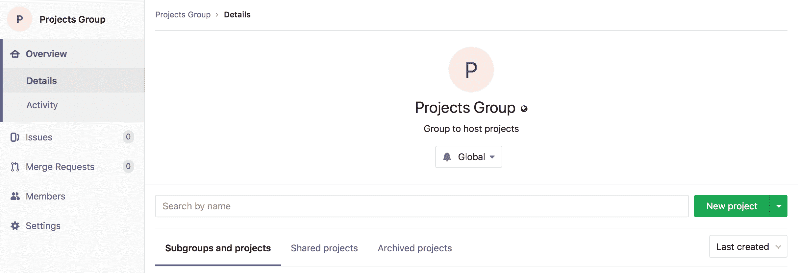](img/create_new_project_from_group.png)

*   在创建项目时，请从下拉菜单中选择已经创建的组名称空间.

    [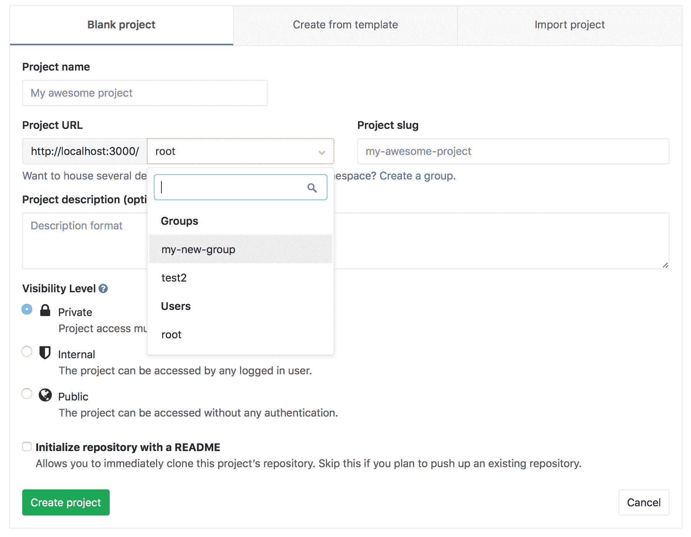](img/select_group_dropdown.png)

### Default project-creation level[](#default-project-creation-level "Permalink")

版本历史

*   在[GitLab Premium](https://about.gitlab.com/pricing/) 10.5 中[引入](https://gitlab.com/gitlab-org/gitlab/-/issues/2534) .
*   在 10.7 中带到[GitLab Starter](https://about.gitlab.com/pricing/) .
*   在 11.10 中[移至](https://gitlab.com/gitlab-org/gitlab-foss/-/merge_requests/25975) [GitLab Core](https://about.gitlab.com/pricing/) .

默认情况下， [开发人员和维护人员](../permissions.html#group-members-permissions)可以在一个组下创建项目.

要为特定组更改此设置：

1.  转到论坛的**设置>常规**页面.
2.  展开" **权限，LFS，2FA"**部分.
3.  在" **允许创建项目"**下拉列表中选择所需的选项.
4.  Click **保存更改**.

要全局更改此设置，请参阅[默认项目创建保护](../admin_area/settings/visibility_and_access_controls.html#default-project-creation-protection) .

## View group details[](#view-group-details "Permalink")

组的" **详细信息"**页面包含以下选项卡：

*   小组和项目.
*   共享的项目.
*   存档的项目.

### Group activity analytics overview[](#group-activity-analytics-overview "Permalink")

版本历史

*   在 GitLab [Starter](https://about.gitlab.com/pricing/) 12.10 中作为[测试版功能](https://about.gitlab.com/handbook/product/#beta) [引入](https://gitlab.com/gitlab-org/gitlab/-/issues/207164)

组详细信息视图还显示最近 90 天内创建的以下项目数：

*   合并请求.
*   Issues.
*   Members.

可以使用`group_activity_analytics` [功能标记](../../development/feature_flags/development.html#enabling-a-feature-flag-in-development)启用这些组活动分析.

[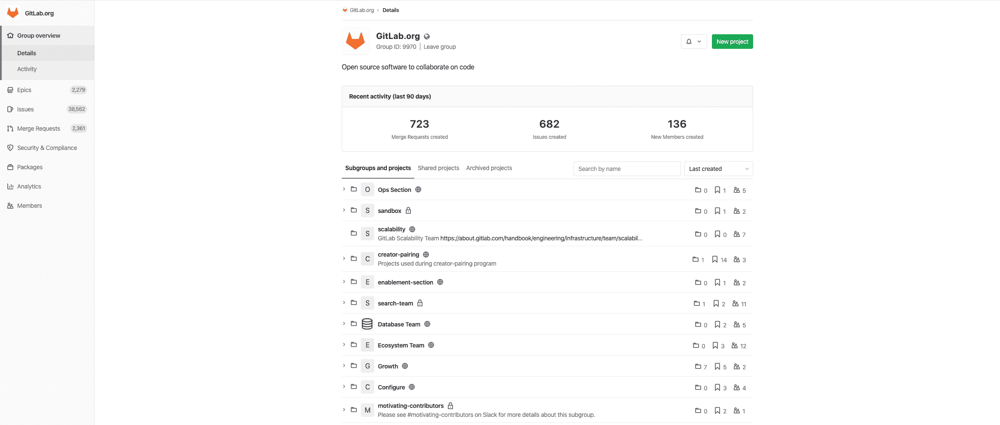](img/group_activity_analytics_v12_10.png)

有关详细信息，请参阅有关如何[查看组活动的部分](#view-group-activity) .

## View group activity[](#view-group-activity "Permalink")

群组的" **活动"**页面显示群组中最近执行的操作，包括：

*   **推送事件** ：最近推送到分支.
*   **合并事件** ：最近合并.
*   **发行事件** ：已发行或已关闭的发行.
*   **史诗般的事件** ：史诗集开启或关闭.
*   **评论** ：评论已打开或关闭.
*   **小组** ：已加入或离开小组的小组成员.
*   **Wiki** ：创建，删除或更新的 Wiki.

单击**RSS**图标，还可以 Atom 格式获得整个活动供稿.

要查看论坛的" **活动"**页面，请执行以下操作：

1.  转到论坛的页面.
2.  在左侧导航菜单中，转到" **组概述"，**然后选择" **活动"** .

## Transfer projects into groups[](#transfer-projects-into-groups "Permalink")

了解如何[将项目转移到小组中](../project/settings/index.html#transferring-an-existing-project-into-another-namespace) .

## Sharing a project with a group[](#sharing-a-project-with-a-group "Permalink")

您可以[与一个小组共享您的项目，](../project/members/share_project_with_groups.html)并向所有小组成员立即授予对该项目的访问权限.

或者，您可以[锁定共享与组功能](#share-with-group-lock) .

## Sharing a group with another group[](#sharing-a-group-with-another-group "Permalink")

在 GitLab 12.7 中[引入](https://gitlab.com/gitlab-org/gitlab/-/issues/18328) .

与[与组共享项目](#sharing-a-project-with-a-group)类似，您可以与另一个组共享一个组，以使直接的组成员可以访问共享的组. 这对于继承的成员无效.

要将给定的组（例如"前端"）与另一个组（例如"工程"）共享：

1.  导航到"前端"群组页面，然后使用左侧的导航菜单转到群组" **成员"** .
2.  Select the **邀请小组** tab.
3.  以您选择的最大访问权限级别添加"工程".
4.  Click **Invite**.

"工程"组的所有成员将被添加到"前端".

## Manage group memberships via LDAP[](#manage-group-memberships-via-ldap "Permalink")

组同步允许将 LDAP 组映射到 GitLab 组. 这样可以更好地控制每组用户的管理. 要配置组同步，请编辑`group_base` **DN** （ `'OU=Global Groups,OU=GitLab INT,DC=GitLab,DC=org'` ）. 该**OU**包含将与 GitLab 组关联的所有组.

可以使用 CN 或过滤器创建组链接. 这些组链接在**组设置-> LDAP 同步**页面上创建. 配置链接后，用户可能需要一个多小时才能与 GitLab 组进行同步.

有关 LDAP 和组同步管理的更多信息，请参阅[LDAP 主文档](../../administration/auth/ldap/index.html#group-sync-starter-only) .

**注意：**如果在添加 LDAP 同步时 LDAP 用户是组成员，并且它们不属于 LDAP 组，则将从该组中将其删除.

### Creating group links via CN[](#creating-group-links-via-cn-starter-only "Permalink")

通过 CN 创建群组链接：

1.  选择**LDAP 服务器**作为链接.
2.  选择`LDAP Group cn`作为**同步方法** .
3.  在" **LDAP 组 cn"**文本输入框中，开始输入组的 CN. 在配置的`group_base`中将有一个带有匹配 CN 的下拉菜单. 从此列表中选择您的 CN.
4.  在" **LDAP 访问"**部分中，选择在该组中同步的用户的[权限级别](../permissions.html) .
5.  单击`Add Synchronization`按钮以保存该组链接.

[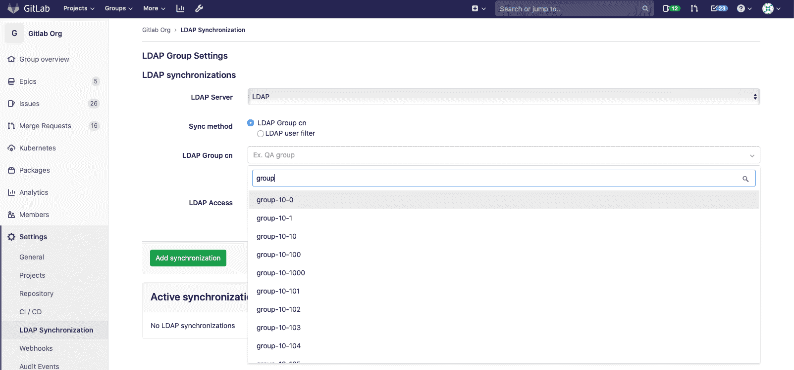](img/ldap_sync_cn_v13_1.png)

### Creating group links via filter[](#creating-group-links-via-filter-premium-only "Permalink")

通过过滤器创建组链接：

1.  选择**LDAP 服务器**作为链接.
2.  选择`LDAP user filter`作为**Sync 方法** .
3.  在" **LDAP 用户"过滤器**框中输入过滤**器** . 请遵循[有关用户过滤器](../../administration/auth/ldap/index.html#set-up-ldap-user-filter-core-only)的[文档](../../administration/auth/ldap/index.html#set-up-ldap-user-filter-core-only) .
4.  在" **LDAP 访问"**部分中，选择在该组中同步的用户的[权限级别](../permissions.html) .
5.  单击`Add Synchronization`按钮以保存该组链接.

[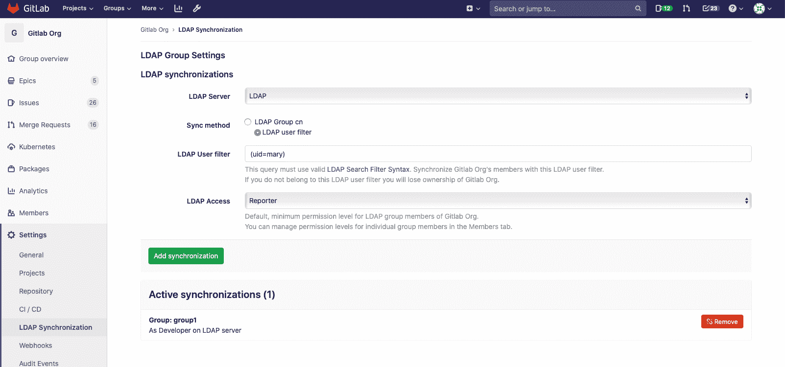](img/ldap_sync_filter_v13_1.png)

### Overriding user permissions[](#overriding-user-permissions-starter-only "Permalink")

从 GitLab [v8.15 开始，](https://gitlab.com/gitlab-org/gitlab/-/merge_requests/822) LDAP 用户权限现在可以由管理员用户手动覆盖. 覆盖用户的权限：

1.  转到您小组的" **成员"**页面.
2.  在您要编辑的用户的行中选择铅笔图标.
3.  选择橙色的`Change permissions`按钮.

[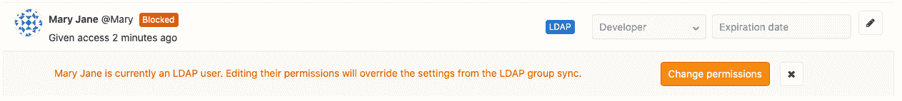](img/manual_permissions_v13_1.png)

现在，您将能够从" **成员"**页面编辑用户的权限.

## Epics[](#epics-ultimate "Permalink")

在[GitLab Ultimate](https://about.gitlab.com/pricing/) 10.2 中引入.

Epics 通过跟踪跨项目和里程碑共享主题的问题组，使您可以更有效，更轻松地管理项目组合.

[Learn more about Epics.](epics/index.html)

## Group Security Dashboard[](#group-security-dashboard-ultimate "Permalink")

概述组及其子组中所有项目的漏洞.

[Learn more about the Group Security Dashboard.](security_dashboard/index.html)

## Insights[](#insights-ultimate "Permalink")

[Introduced](https://gitlab.com/groups/gitlab-org/-/epics/725) in [GitLab Ultimate](https://about.gitlab.com/pricing/) 12.0.

配置对您的组或项目重要的见解，使用户可以浏览以下数据：

*   分诊卫生
*   在给定期间内创建/关闭的问题
*   合并请求的平均合并时间
*   多得多

[Learn more about Insights](insights/index.html).

## Transferring groups[](#transferring-groups "Permalink")

在 GitLab 10.5 中，您可以通过以下方式转移组：

*   将子组转移到新的父组.
*   通过将顶级组转移到所需的组，将其转换为子组.
*   Convert a subgroup into a top-level group by transferring it out of its current group.

转移群组时，请注意：

*   更改组的父母可能会产生意想不到的副作用. 请参阅[更改存储库路径时的重定向](../project/index.html#redirects-when-changing-repository-paths) .
*   您只能将群组转移到您管理的群组中.
*   您必须更新本地存储库以指向新位置.
*   If the immediate parent group’s visibility is lower than the group’s current visibility, visibility levels for subgroups and projects will change to match the new parent group’s visibility.
*   仅传输显式组成员身份，不继承继承成员身份. 如果组的所有者仅继承了成员身份，则该组将没有所有者. 在这种情况下，转移组的用户将成为该组的所有者.

## Group settings[](#group-settings "Permalink")

创建群组后，您可以导航至该群组的信息中心，然后点击**设置**来管理其设置.

[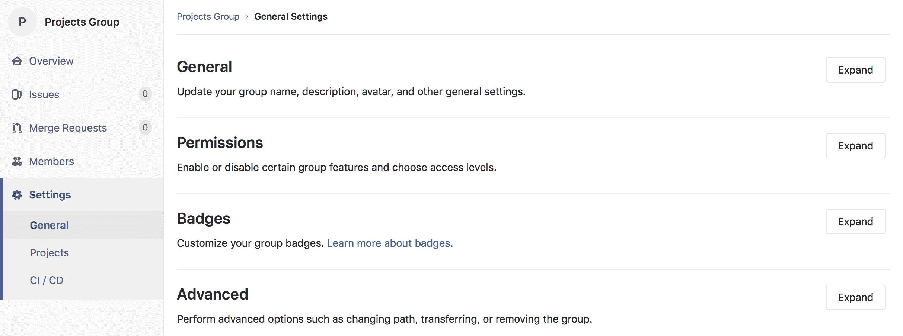](img/group_settings.png)

### General settings[](#general-settings "Permalink")

除了编辑您在[创建组](#create-a-new-group)时先前设置的任何设置之外，您还可以访问[该组的](#create-a-new-group)其他配置.

#### Changing a group’s path[](#changing-a-groups-path "Permalink")

更改组的路径可能会有意想不到的副作用. 在继续之前，请阅读[重定向的行为](../project/index.html#redirects-when-changing-repository-paths) .

如果您要腾出路径，以便其他组或用户可以声明该路径，则由于名称和路径都必须是唯一的，因此您可能也需要重命名该组.

更改组路径：

1.  导航到论坛的**"设置">"常规"**页面.
2.  展开**路径，传输，删除**部分.
3.  在" **更改组路径"**下输入新名称.
4.  Click **变更群组路径**.

**注意：**如果命名空间包含带有[Container Registry](../packages/container_registry/index.html)标记的项目，则当前无法重命名该命名空间，因为该项目无法移动.**提示：**如果要保留对原始名称空间的所有权并保护 URL 重定向，则可以更改一个组并向其传输项目，而无需更改组的路径或重命名用户名.

### Remove a group[](#remove-a-group "Permalink")

删除组及其内容：

1.  导航到您小组的 **设置>常规**页面.
2.  展开**路径，传输，删除**部分.
3.  在"删除组"部分中，单击" **删除组"**按钮.
4.  根据要求确认操作.

此操作要么：

*   删除组，并且将后台作业排队以删除该组中的所有项目.
*   从[GitLab 12.8 开始](https://gitlab.com/gitlab-org/gitlab/-/issues/33257) ，在[Premium 或 Silver](https://about.gitlab.com/pricing/premium/)或更高级别上，将一个组标记为删除. 默认情况下，删除将在 7 天后进行，但是可以在[实例设置中](../admin_area/settings/visibility_and_access_controls.html#default-deletion-adjourned-period-premium-only)进行更改.

### Restore a group[](#restore-a-group-premium "Permalink")

在 GitLab 12.8 中[引入](https://gitlab.com/gitlab-org/gitlab/-/issues/33257) .

要还原标记为删除的组：

1.  导航到您小组的 **设置>常规**页面.
2.  展开**路径，传输，删除**部分.
3.  在"还原组"部分中，单击" **还原组"**按钮.

#### Enforce 2FA to group members[](#enforce-2fa-to-group-members "Permalink")

通过对所有组成员[强制执行两因素身份验证（2FA）](../../security/two_factor_authentication.html#enforcing-2fa-for-all-users-in-a-group) ，将安全层添加到您的组中.

#### Share with group lock[](#share-with-group-lock "Permalink")

防止一个组中[的项目与另一个组共享项目，](../project/members/share_project_with_groups.html)以便对项目访问进行更严格的控制.

例如，假设您有两个不同的团队（A 组和 B 组）在一个项目中一起工作，并且要继承该组成员身份，您可以在 A 组和 B 组之间共享项目. **使用组锁共享**可以防止其中的任何项目该群组不会与其他群组共享，从而确保只有合适的群组成员才能访问这些项目.

要启用此功能，请导航至组设置页面. 选择" **使用组锁定共享"**并**保存组** .

[](img/share_with_group_lock.png)

#### Member Lock[](#member-lock-starter "Permalink")

成员锁定使组所有者可以阻止组中所有项目的任何新项目成员资格，从而可以更严格地控​​制项目成员资格.

例如，如果要为" [审核事件"](../../administration/audit_events.html)锁定组，请启用"成员锁定"以确保在该审核期间不能修改项目成员身份.

要启用此功能：

1.  导航到组的**"设置">"常规"**页面.
2.  展开" **权限，LFS，2FA"**部分，然后选择" **成员锁"** .
3.  Click **保存更改**.

[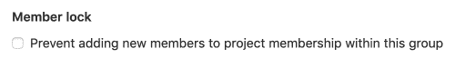](img/member_lock.png)

这将对以前有权操作项目成员资格的所有用户禁用该选项，因此无法添加新用户. 此外，将无法通过 API 向项目添加新用户的任何请求.

#### IP access restriction[](#ip-access-restriction-premium "Permalink")

版本历史

*   在[GitLab Ultimate 和 Gold](https://about.gitlab.com/pricing/) 12.0 中[引入](https://gitlab.com/gitlab-org/gitlab/-/issues/1985) .
*   在 13.1 中[移至](https://gitlab.com/gitlab-org/gitlab/-/issues/215410) [GitLab Premium 和 Silver](https://about.gitlab.com/pricing/) .

为了确保只有组织内的人员可以访问特定资源，您可以选择通过 IP 地址限制对组及其基础项目，问题等的访问. 这可以帮助确保特定内容不会离开场所，同时又不会阻止对整个实例的访问.

使用 CIDR 表示法将一个或多个允许的 IP 子网添加到组设置中，并且来自其他 IP 地址的任何人将无法访问受限制的内容.

目前限制适用于：

*   UI.
*   [从 GitLab 12.3 开始](https://gitlab.com/gitlab-org/gitlab/-/issues/12874) ，可以访问 API.
*   [从 GitLab 12.4 开始](https://gitlab.com/gitlab-org/gitlab/-/issues/32113) ，Git 通过 SSH 进行操作.

为了避免意外锁定，管理员和组所有者可以访问组，而不受 IP 限制.

要启用此功能：

1.  导航到组的**"设置">"常规"**页面.
2.  展开" **权限，LFS，2FA"**部分，然后在" **允许访问以下 IP 地址"**字段中输入 IP 地址范围.
3.  Click **保存更改**.

#### Allowed domain restriction[](#allowed-domain-restriction-premium "Permalink")

版本历史

*   在[GitLab Premium 和 Silver](https://about.gitlab.com/pricing/) 12.2 中[引入](https://gitlab.com/gitlab-org/gitlab/-/issues/7297) .
*   支持指定 GitLab 13.1 中[引入的](https://gitlab.com/gitlab-org/gitlab/-/issues/33143)多个电子邮件域

通过仅将具有特定域中电子邮件地址的用户添加到组中，可以限制对组的访问.

添加您要允许的电子邮件域，并且不允许来自不同域的电子邮件用户添加到该组.

某些域不能被限制. 这些是最受欢迎的公共电子邮件域，例如：

*   `gmail.com`
*   `yahoo.com`
*   `hotmail.com`
*   `aol.com`
*   `msn.com`
*   `hotmail.co.uk`
*   `hotmail.fr`
*   `live.com`
*   `outlook.com`
*   `icloud.com`

要启用此功能：

1.  导航到组的**"设置">"常规"**页面.
2.  展开" **权限，LFS，2FA"**部分，然后在" **通过电子邮件限制成员身份"**字段中输入域名.
3.  Click **保存更改**.

此后，将对所有添加到组中的新用户启用域检查.

#### Group file templates[](#group-file-templates-premium "Permalink")

组文件模板使您可以与组中的每个项目共享一组通用文件类型的模板. 它类似于[实例模板存储库](../admin_area/settings/instance_template_repository.html)功能，所选项目应遵循该页面上记录的相同命名约定.

您只能在组中选择项目作为模板源. 这包括与该组共享的项目，但**不包括**正在配置的组的子组或父组中的项目.

您可以为子组和直接父组配置此功能. 子组中的项目将有权访问该子组以及任何直接父组的模板.

[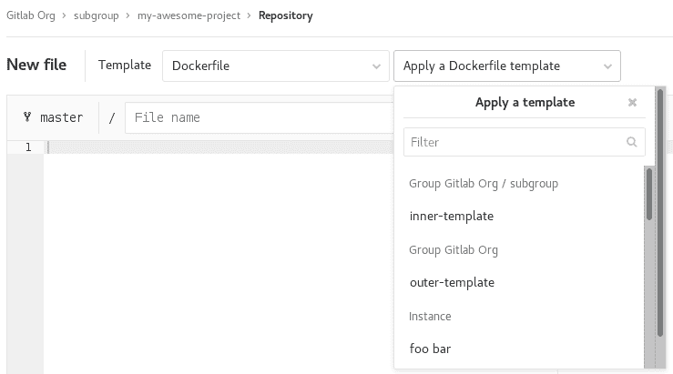](img/group_file_template_dropdown.png)

要启用此功能，请导航至组设置页面，展开" **模板"**部分，选择一个项目作为模板存储库，然后选择" **保存组"** .

[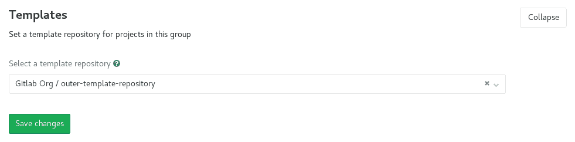](img/group_file_template_settings.png)

#### Group-level project templates[](#group-level-project-templates-premium "Permalink")

通过将组设置为模板源，在组级别定义项目模板. [了解有关组级项目模板的更多信息](custom_project_templates.html) .

#### Disabling email notifications[](#disabling-email-notifications "Permalink")

在 GitLab 12.2 中[引入](https://gitlab.com/gitlab-org/gitlab/-/issues/23585) .

您可以禁用与该组相关的所有电子邮件通知，其中包括其子组和项目.

要启用此功能：

1.  导航到组的**"设置">"常规"**页面.
2.  展开**权限，LFS，2FA**部分，然后选择**禁用电子邮件通知** .
3.  Click **保存更改**.

#### Disabling group mentions[](#disabling-group-mentions "Permalink")

在 GitLab 12.6 中[引入](https://gitlab.com/gitlab-org/gitlab/-/issues/21301) .

您可以防止将用户添加到对话中，并且在任何人提及这些用户所属的组时通知他们.

自动完成下拉列表中会相应地显示提及被禁用的组.

这对于具有大量用户的组特别有用.

要启用此功能：

1.  导航到组的**"设置">"常规"**页面.
2.  展开" **权限"，" LFS，2FA"**部分，然后选择" **禁用组提及"** .
3.  Click **保存更改**.

#### Enabling delayed Project removal[](#enabling-delayed-project-removal-premium "Permalink")

在 GitLab 13.2 中[引入](https://gitlab.com/gitlab-org/gitlab/-/issues/220382) .

默认情况下，组中的项目会立即删除. （可选）在[Premium 或 Silver](https://about.gitlab.com/pricing/)或更高级别上，您可以将组内的项目配置为在延迟间隔后删除.

在此间隔期间，项目将处于只读状态，并且可以根据需要还原. 间隔时间默认为 7 天，可以由管理员在[实例设置中](../admin_area/settings/visibility_and_access_controls.html#default-deletion-adjourned-period-premium-only)进行修改.

要启用延迟删除项目：

1.  导航到组的**"设置">"常规"**页面.
2.  展开" **权限"，" LFS，2FA"**部分，然后选中" **启用延迟的项目删除"** .
3.  Click **保存更改**.

### Advanced settings[](#advanced-settings "Permalink")

*   **项目** ：查看该组中的所有项目，将成员添加到每个项目，访问每个项目的设置，以及删除任何项目，所有操作均在同一屏幕上进行.
*   **Webhooks** ：为您的组配置[webhooks](../project/integrations/webhooks.html) .
*   **Kubernetes 集群集成** ：将您的 GitLab 组与[Kubernetes 集群连接](clusters/index.html) .
*   **审核事件** ：查看该组的[审核事件](../../administration/audit_events.html) .
*   **管道配额** ：跟踪组的[管道配额](../admin_area/settings/continuous_integration.html) .

#### Storage usage quota[](#storage-usage-quota-starter "Permalink")

[Introduced](https://gitlab.com/gitlab-org/gitlab/-/merge_requests/13294) in [GitLab Starter](https://about.gitlab.com/pricing/) 12.0.

组所有者可以在组页面设置列表可用的" **使用配额"**页面的" **存储"**选项卡中，查看一个组（包括子组）中所有项目的聚合存储使用情况.

[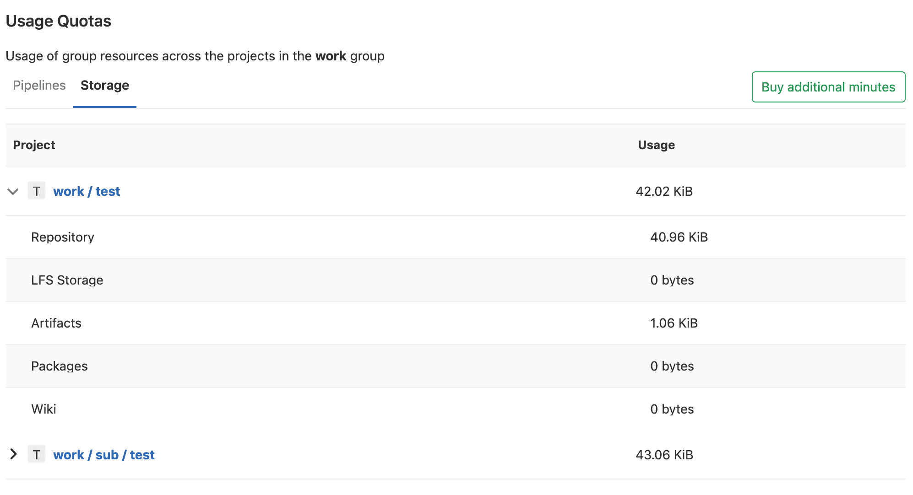](img/group_storage_usage_quota.png)

如果触发了任何会影响其值的相关事件（例如，提交推送），则将更新存储的总使用量. 出于性能原因，我们可能会将更新延迟最多 1 小时 30 分钟.

如果您的名称空间显示`N/A`作为总存储使用量，则可以通过将提交推送到该名称空间中的任何项目来触发重新计算.

#### Group push rules[](#group-push-rules-starter "Permalink")

[Introduced](https://gitlab.com/gitlab-org/gitlab/-/issues/34370) in [GitLab Starter](https://about.gitlab.com/pricing/) 12.8.

组推送规则允许组维护者为特定组内的新创建项目设置[推送规则](../../push_rules/push_rules.html) .

要为组配置推送规则，请导航至 在小组的侧边栏上.

设置后，新的子组将根据以下任一条件为其设置推送规则：

*   定义了推送规则的最接近的父组.
*   如果没有父组定义推送规则，则在实例级别设置推送规则.

##### Enabling the feature[](#enabling-the-feature "Permalink")

默认情况下，此功能带有`:group_push_rules`功能标记. 可以使用功能标记[API 端点](../../api/features.html#set-or-create-a-feature)或通过具有 Rails 控制台访问权限的 GitLab 管理员为特定组启用它，方法是运行：

```
Feature.enable(:group_push_rules) 
```

### Maximum artifacts size[](#maximum-artifacts-size-core-only "Permalink")

有关为组设置最大工件大小的信息，请参见[最大工件大小](../admin_area/settings/continuous_integration.html#maximum-artifacts-size-core-only) .

## User contribution analysis[](#user-contribution-analysis-starter "Permalink")

使用[GitLab Contribution Analytics](contribution_analytics/index.html) ，您可以概述组成员执行的贡献（推送，合并请求和问题）.

## Issues analytics[](#issues-analytics-premium "Permalink")

使用[GitLab Issues Analytics](issues_analytics/index.html) ，您可以查看组中每个月创建的问题数量的条形图.

## Dependency Proxy[](#dependency-proxy-premium "Permalink")

使用 GitLab 作为上游 Docker 映像的[依赖项代理](../packages/dependency_proxy/index.html) .