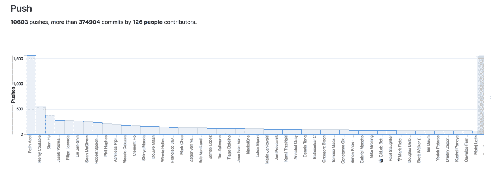
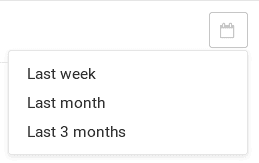
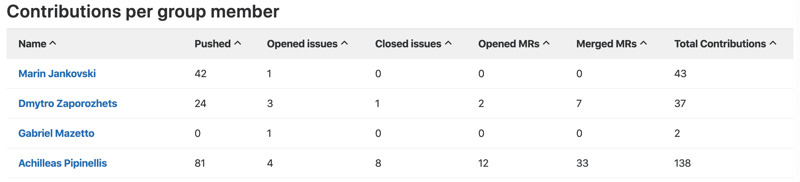

# Contribution Analytics

> 原文：[https://docs.gitlab.com/ee/user/group/contribution_analytics/](https://docs.gitlab.com/ee/user/group/contribution_analytics/)

*   [Overview](#overview)
*   [Use cases](#use-cases)
*   [Using Contribution Analytics](#using-contribution-analytics)
*   [Changing the period time](#changing-the-period-time)
*   [Sorting by different factors](#sorting-by-different-factors)

# Contribution Analytics

版本历史

*   在[GitLab Starter](https://about.gitlab.com/pricing/) 8.3 中引入.
*   在 GitLab 12.2 中针对子组进行了[介绍](https://gitlab.com/gitlab-org/gitlab/-/issues/3090) .

## Overview

借助 Contribution Analytics，您可以大致了解小组中的以下活动：

*   Issues
*   合并要求
*   推送事件

要查看贡献分析，请转至小组的" **分析">"贡献分析"**页面.

## Use cases

*   分析您的团队在一段时间内的贡献，并为杰出贡献者提供奖金.
*   与可以从其他支持中受益的小组成员一起确定改进的机会.

## Using Contribution Analytics

以下是三个主要的条形图，它们说明了每个组成员的贡献数量：

*   推送事件
*   合并要求
*   已解决的问题

将鼠标悬停在每个栏上可以显示特定组成员的事件数.

## Changing the period time

您可以从以下三个期间中选择：

*   上周（默认）
*   上个月
*   最近三个月

从日历下拉列表中选择所需的时间段.

## Sorting by different factors

每个小组成员的贡献也以表格形式显示. 单击列标题以按该列对表进行排序：

*   成员名字
*   推送事件数
*   未解决的问题数
*   已解决的问题数
*   已打开的 MR 数
*   合并的 MR 数
*   总捐款数

