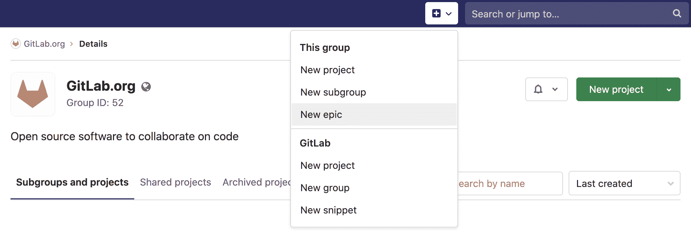
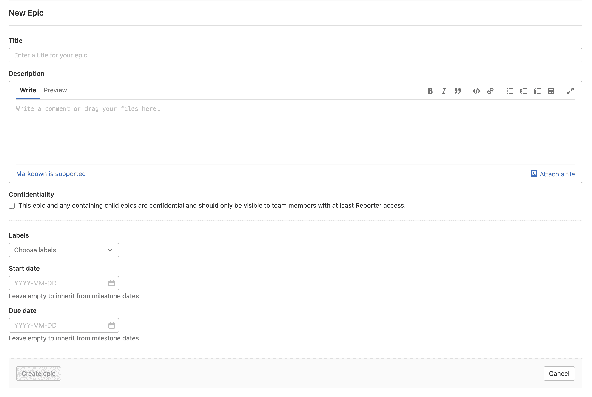
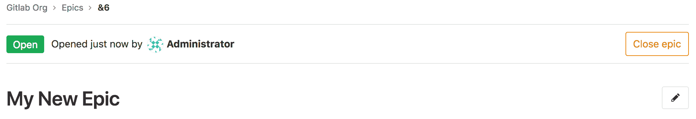
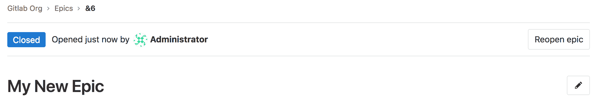
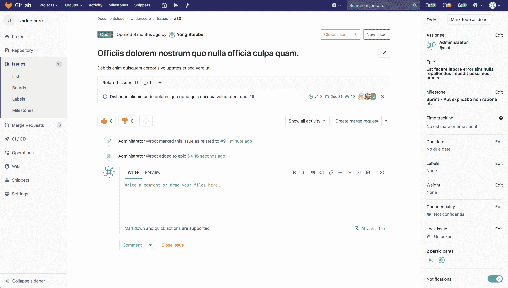
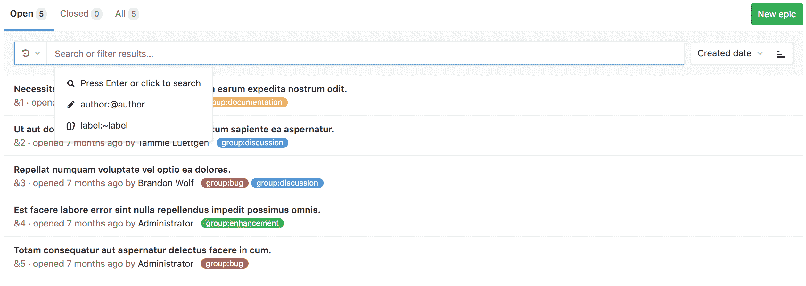
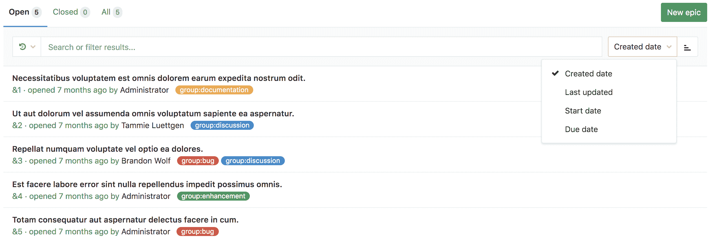

# Manage epics

> 原文：[https://docs.gitlab.com/ee/user/group/epics/manage_epics.html](https://docs.gitlab.com/ee/user/group/epics/manage_epics.html)

*   [Create an epic](#create-an-epic)
    *   [Create an epic from the epic list](#create-an-epic-from-the-epic-list)
    *   [Access the New Epic form](#access-the-new-epic-form)
    *   [Elements of the New Epic form](#elements-of-the-new-epic-form)
*   [Edit an epic](#edit-an-epic)
*   [Bulk-edit epics](#bulk-edit-epics)
*   [Delete an epic](#delete-an-epic)
*   [Close an epic](#close-an-epic)
*   [Reopen a closed epic](#reopen-a-closed-epic)
*   [Go to an epic from an issue](#go-to-an-epic-from-an-issue)
*   [Search for an epic from epics list page](#search-for-an-epic-from-epics-list-page)
*   [Make an epic confidential](#make-an-epic-confidential)
    *   [Disable confidential epics](#disable-confidential-epics-premium-only)
*   [Manage issues assigned to an epic](#manage-issues-assigned-to-an-epic)
    *   [Add an issue to an epic](#add-an-issue-to-an-epic)
        *   [Add an existing issue to an epic](#add-an-existing-issue-to-an-epic)
        *   [Create an issue from an epic](#create-an-issue-from-an-epic)
    *   [Remove an issue from an epic](#remove-an-issue-from-an-epic)
    *   [Reorder issues assigned to an epic](#reorder-issues-assigned-to-an-epic)
    *   [Move issues between epics](#move-issues-between-epics-ultimate)
    *   [Promote an issue to an epic](#promote-an-issue-to-an-epic)
*   [Manage multi-level child epics](#manage-multi-level-child-epics-ultimate)
    *   [Add a child epic to an epic](#add-a-child-epic-to-an-epic)
    *   [Move child epics between epics](#move-child-epics-between-epics)
    *   [Reorder child epics assigned to an epic](#reorder-child-epics-assigned-to-an-epic)
    *   [Remove a child epic from a parent epic](#remove-a-child-epic-from-a-parent-epic)

# Manage epics[](#manage-epics-premium "Permalink")

该页面收集了有关[史诗](index.html)或与[史诗](index.html)有关的所有操作的说明.

## Create an epic[](#create-an-epic "Permalink")

每个组中都有史诗的分页列表，您可以从中创建新的史诗. 史诗列表还包括所选组中所有子组的史诗. 在您的论坛页面中：

### Create an epic from the epic list[](#create-an-epic-from-the-epic-list "Permalink")

要从史诗列表中创建史诗，请分组：

1.  去 **史诗** .
2.  Click **新史诗**.
3.  输入描述性标题.
4.  Click **创造史诗**.

### Access the New Epic form[](#access-the-new-epic-form "Permalink")

[Introduced](https://gitlab.com/gitlab-org/gitlab/-/issues/211533) in [GitLab Premium](https://about.gitlab.com/pricing/) 13.2.

有两种方法可以进入"新史诗"表格并在您所在的小组中创建史诗：

*   在您小组的史诗中，点击**新建史诗** .
*   在任何地方的顶部菜单中，单击**加号** （ ） **>新史诗** .

    [](img/new_epic_from_groups_v13.2.png)

### Elements of the New Epic form[](#elements-of-the-new-epic-form "Permalink")

在创建新的史诗时，您可以填写以下字段：

*   Title
*   Description
*   保密性复选框
*   Labels
*   开始日期
*   截止日期

[](img/new_epic_form_v13.2.png)

## Edit an epic[](#edit-an-epic "Permalink")

创建史诗之后，可以编辑更改以下详细信息：

*   Title
*   Description
*   开始日期
*   截止日期
*   Labels

编辑史诗的标题或说明：

1.  点击**修改标题和说明** 按钮.
2.  进行更改.
3.  Click **保存更改**.

要编辑史诗的开始日期，截止日期或标签，请执行以下操作：

1.  单击史诗侧边栏中每个部分旁边的" **编辑"** .
2.  选择日期或标签为您的史诗.

## Bulk-edit epics[](#bulk-edit-epics "Permalink")

您可以一次编辑多个史诗. 要了解操作方法，请访问[批量编辑问题，史诗和在组级别合并请求](../bulk_editing/index.html#bulk-edit-epics) .

## Delete an epic[](#delete-an-epic "Permalink")

**注意：**要删除史诗，您需要成为组/子组的[所有者](../../permissions.html#group-members-permissions) .

编辑史诗的描述时，单击" **删除"**按钮以删除史诗. 出现一个模态来确认您的动作.

删除史诗会从系统中与其关联的史诗中释放所有现有问题.

## Close an epic[](#close-an-epic "Permalink")

每当您决定不再需要该史诗时，请通过以下方法关闭该史诗：

*   单击**关闭史诗**按钮.

    [](img/button_close_epic.png)

*   使用[快速动作](../../project/quick_actions.html) .

## Reopen a closed epic[](#reopen-a-closed-epic "Permalink")

您可以重新打开因以下原因而关闭的史诗：

*   单击**重新打开史诗**按钮.

    [](img/button_reopen_epic.png)

*   使用[快速动作](../../project/quick_actions.html) .

## Go to an epic from an issue[](#go-to-an-epic-from-an-issue "Permalink")

如果问题属于史诗，则可以使用问题侧栏中的链接导航到包含该史诗.

[](img/containing_epic.png)

## Search for an epic from epics list page[](#search-for-an-epic-from-epics-list-page "Permalink")

版本历史

*   在[GitLab Ultimate](https://about.gitlab.com/pricing/) 10.5 中引入.
*   [已移至](https://gitlab.com/gitlab-org/gitlab/-/issues/37081) GitLab 12.8 中的[Premium](https://about.gitlab.com/pricing/)层.

您可以根据以下参数，使用过滤的搜索栏（类似于"问题和合并请求"的搜索栏）从史诗列表中搜索史诗：

*   标题或说明
*   作者名称/用户名
*   Labels

[](img/epics_search.png)

要进行搜索，请转到史诗列表，然后单击" **搜索或过滤结果** "字段. 它将显示一个下拉菜单，您可以从中添加一个作者. 您也可以输入纯文本以按史诗标题或描述进行搜索. 完成后，按键盘上的`Enter`键过滤列表.

您还可以按以下方式对史诗列表进行排序：

*   创建日期
*   最近更新时间
*   开始日期
*   截止日期

每个选项都包含一个按钮，可以在**升序**和**降序**之间切换顺序. 无论您浏览史诗，包括" [路线图"](../roadmap/index.html) ，都可以保存和使用排序选项和顺序.

[](img/epics_sort.png)

## Make an epic confidential[](#make-an-epic-confidential "Permalink")

版本历史

*   在[GitLab Premium](https://about.gitlab.com/pricing/) 13.0 中在功能标志后面[引入](https://gitlab.com/gitlab-org/gitlab/-/issues/213068) ，默认情况下禁用.
*   在[GitLab Premium](https://about.gitlab.com/pricing/) 13.2 中[默认启用](https://gitlab.com/gitlab-org/gitlab/-/issues/224513) .

创建史诗时，可以选中**"将此史诗设为机密"**复选框，使其成为机密文件.

### Disable confidential epics[](#disable-confidential-epics-premium-only "Permalink")

机密史诗功能部署在**默认情况下启用**的功能标志的后面. [有权访问 GitLab Rails 控制台的 GitLab 管理员](../../../administration/feature_flags.html)可以为您的自我管理实例禁用它.

禁用它：

```
Feature.disable(:confidential_epics) 
```

## Manage issues assigned to an epic[](#manage-issues-assigned-to-an-epic "Permalink")

### Add an issue to an epic[](#add-an-issue-to-an-epic "Permalink")

您可以将现有问题添加到史诗中，也可以创建一个自动添加到史诗中的新问题.

#### Add an existing issue to an epic[](#add-an-existing-issue-to-an-epic "Permalink")

属于史诗组或史诗子组中任何项目的现有问题都可以添加到史诗中. 新添加的问题显示在" **史诗和问题"**选项卡中问题列表的顶部.

史诗包含一个问题列表，一个问题最多可以与一个史诗相关联. 当您添加已链接到史诗的问题时，该问题会自动与其当前父级取消链接.

要将问题添加到史诗中：

1.  点击**添加**下拉按钮.
2.  Click **添加问题**.
3.  使用以下两种方法之一确定要添加的问题：
    *   粘贴问题的链接.
    *   通过输入问题标题的一部分来搜索所需的问题，然后选择所需的匹配项（在[GitLab 12.5 中](https://gitlab.com/gitlab-org/gitlab/-/issues/9126)引入）.

    如果要添加多个问题，请按`空格键` ，然后重复此步骤.

4.  Click **Add**.

#### Create an issue from an epic[](#create-an-issue-from-an-epic "Permalink")

在 GitLab 12.7 中[引入](https://gitlab.com/gitlab-org/gitlab/-/issues/5419) .

从史诗中创建问题使您可以将注意力集中在史诗的更广泛的上下文上，同时将工作划分成较小的部分.

要从史诗中创建问题：

1.  在史诗页面上的" **史诗和问题"下** ，点击**添加**下拉按钮，然后选择**创建新问题** .
2.  在**标题下** ，输入新期刊的标题.
3.  从**项目**下拉列表中，选择应在其中创建问题的项目.
4.  Click **创建问题**.

### Remove an issue from an epic[](#remove-an-issue-from-an-epic "Permalink")

在史诗的详细信息页面上时，可以从史诗中删除问题. 从史诗中删除问题后，该问题将不再与此史诗相关联.

要从史诗中删除问题：

1.  点击**删除** （ ）按钮旁边要删除的问题. 出现**删除问题**警告.
2.  Click **Remove**.

[](img/issue_list_v13_1.png)

### Reorder issues assigned to an epic[](#reorder-issues-assigned-to-an-epic "Permalink")

在 GitLab 12.5 中[引入](https://gitlab.com/gitlab-org/gitlab/-/issues/9367) .

新问题出现在" **史诗和问题"**选项卡中的列表顶部. 您可以通过拖动来重新排列问题列表.

要重新分配分配给史诗的问题：

1.  转到" **史诗和问题"**标签.
2.  将问题拖到所需的顺序.

### Move issues between epics[](#move-issues-between-epics-ultimate "Permalink")

[Introduced](https://gitlab.com/gitlab-org/gitlab/-/issues/33039) in [GitLab Ultimate](https://about.gitlab.com/pricing/) 13.0.

新问题出现在" **史诗和问题"**选项卡中的列表顶部. 您可以将问题从一部史诗转移到另一部史诗.

要将问题移至另一个史诗：

1.  转到" **史诗和问题"**标签.
2.  将问题拖到所需的父级史诗中.

### Promote an issue to an epic[](#promote-an-issue-to-an-epic "Permalink")

版本历史

*   在[GitLab Ultimate](https://about.gitlab.com/pricing/) 11.6 中[引入](https://gitlab.com/gitlab-org/gitlab/-/issues/3777) .
*   在 12.8 中[移至](https://gitlab.com/gitlab-org/gitlab/-/issues/37081) [GitLab Premium](https://about.gitlab.com/pricing/) .

如果您具有关闭问题并在直接父组中创建史诗的必要[权限](../../permissions.html) ，则可以使用`/promote` [快速操作](../../project/quick_actions.html#quick-actions-for-issues-merge-requests-and-epics)将问题升级为史诗. 仅可以促进小组项目中的问题. 尝试提出机密问题时，将显示警告. 向史诗宣传机密问题将使与该问题相关的所有信息公开，因为史诗对小组成员是公开的.

执行快速操作时：

*   在与问题项目所在的组中创建一个史诗.
*   通知该问题的订户该史诗已创建.

以下问题元数据将被复制到史诗中：

*   标题，描述，活动/评论主题.
*   Upvotes/downvotes.
*   Participants.
*   Group labels that the issue already has.

## Manage multi-level child epics[](#manage-multi-level-child-epics-ultimate "Permalink")

### Add a child epic to an epic[](#add-a-child-epic-to-an-epic "Permalink")

要将儿童史诗添加到史诗中：

1.  点击**添加**下拉按钮.
2.  Click **添加史诗**.
3.  使用以下两种方法之一确定要添加的史诗：
    *   粘贴史诗的链接.
    *   通过输入史诗标题的一部分来搜索所需的问题，然后选择所需的匹配项（在[GitLab 12.5 中](https://gitlab.com/gitlab-org/gitlab/-/issues/9126)引入）.

    如果要添加多个史诗，请按`空格键`并重复此步骤.

4.  Click **Add**.

### Move child epics between epics[](#move-child-epics-between-epics "Permalink")

[Introduced](https://gitlab.com/gitlab-org/gitlab/-/issues/33039) in [GitLab Ultimate](https://about.gitlab.com/pricing/) 13.0.

新的儿童史诗出现在" **史诗和问题"**选项卡中的列表顶部. 您可以将儿童史诗从一个史诗转移到另一个史诗. 当您添加已链接到父级史诗的史诗时，到其当前父级的链接将被删除. 问题和儿童史诗不能混在一起.

要将儿童史诗移至另一史诗：

1.  转到" **史诗和问题"**标签.
2.  将史诗拖到所需的父史诗中.

### Reorder child epics assigned to an epic[](#reorder-child-epics-assigned-to-an-epic "Permalink")

在 GitLab 12.5 中[引入](https://gitlab.com/gitlab-org/gitlab/-/issues/9367) .

新的儿童史诗出现在" **史诗和问题"**选项卡中的列表顶部. 您可以对子史诗列表进行重新排序.

要重新分配分配给史诗的子史诗：

1.  转到" **史诗和问题"**标签.
2.  将史诗拖到所需的顺序.

### Remove a child epic from a parent epic[](#remove-a-child-epic-from-a-parent-epic "Permalink")

要从父级史诗中删除子级史诗：

1.  单击父级史诗列表中的`x`按钮.
2.  在**删除史诗**警告消息，请单击**删除** .