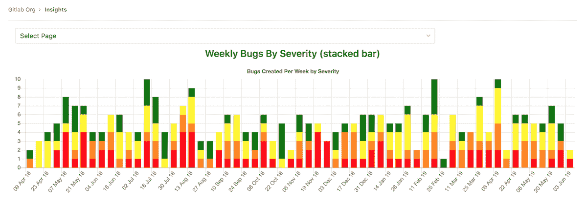
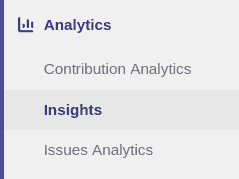
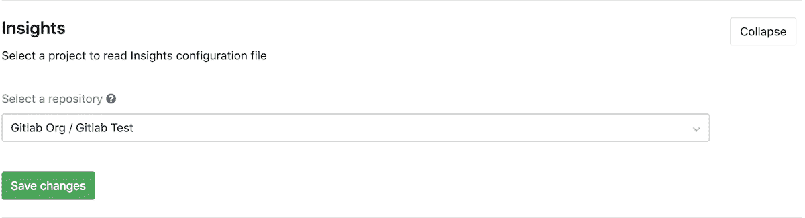

# Insights

> 原文：[https://docs.gitlab.com/ee/user/group/insights/](https://docs.gitlab.com/ee/user/group/insights/)

*   [View your group’s Insights](#view-your-groups-insights)
*   [Configure your Insights](#configure-your-insights)
*   [Permissions](#permissions)

# Insights

[Introduced](https://gitlab.com/groups/gitlab-org/-/epics/725) in [GitLab Ultimate](https://about.gitlab.com/pricing/) 12.0.

配置对您的团队重要的洞察力，以探索数据，例如分类诊断，在给定时间段内创建/关闭的问题，合并请求的平均时间等.

## View your group’s Insights

您可以通过点击左侧边栏中的**Analytics（分析）> Insights**链接来访问组的 Insights：

## Configure your Insights

导航到组的**"设置">"常规"** ，展开" **Insights"** ，然后选择包含`.gitlab/insights.yml`配置文件的项目：

如果未设置任何配置，将使用[默认配置文件](https://gitlab.com/gitlab-org/gitlab/blob/master/ee/fixtures/insights/default.yml) .

有关`.gitlab/insights.yml`配置文件的更多详细信息，请参见[Project 的 Insights 文档](../../project/insights/index.html) .

## Permissions

如果您有权查看组，则可以查看其见解.

**注意：**您无法访问的问题或合并请求（因为您无法访问它们所属的项目，或者因为它们是机密的）会从 Insights 图表中过滤掉.

您也可以查阅[组权限表](../../permissions.html#group-members-permissions) .