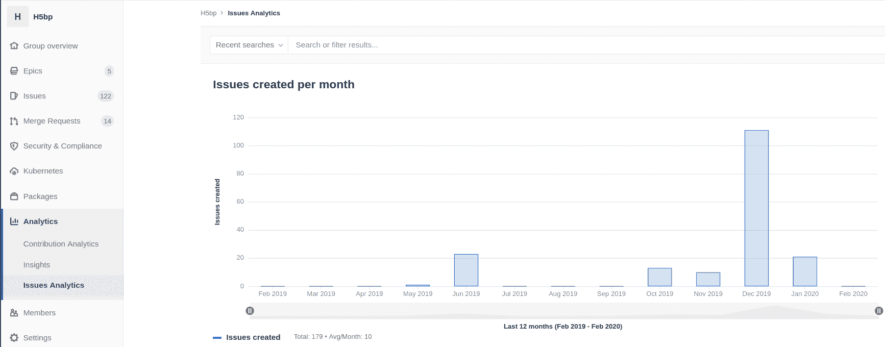
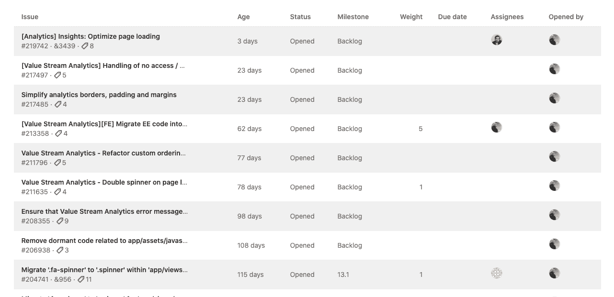

# Issues Analytics

> 原文：[https://docs.gitlab.com/ee/user/group/issues_analytics/](https://docs.gitlab.com/ee/user/group/issues_analytics/)

*   [Drill into the information](#drill-into-the-information)

# Issues Analytics

版本历史

*   在[GitLab Premium](https://about.gitlab.com/pricing/) 11.5 中[引入](https://gitlab.com/gitlab-org/gitlab/-/issues/7478) .
*   在项目级别的[GitLab Premium](https://about.gitlab.com/pricing/) 12.9 中[引入](https://gitlab.com/gitlab-org/gitlab/-/issues/196561) .

问题分析是一个条形图，用于说明每月创建的问题数. 默认时间跨度为 13 个月，其中包括当月以及之前的 12 个月.

要访问图表，请导航至您的组或项目侧边栏，然后选择 **分析>问题分析** .

将鼠标悬停在每个栏上可以查看总数.

要缩小图中包含的问题的范围，请在" **搜索或过滤结果..."**字段中输入您的条件. 可以在以下列表中输入条件或从菜单中选择条件：

*   Author
*   Assignee
*   Milestone
*   Label
*   我的反应
*   Weight

您可以通过设置 URL 参数来更改显示的总月数. 例如， `https://gitlab.com/groups/gitlab-org/-/issues_analytics?months_back=15` //gitlab.com/groups/gitlab-org/-/issues_analytics?months_back `https://gitlab.com/groups/gitlab-org/-/issues_analytics?months_back=15` 15 显示 GitLab.org 组中图表的总计 15 个月.

## Drill into the information

在 GitLab 13.1 中[引入](https://gitlab.com/gitlab-org/gitlab/-/issues/196547) .

您可以通过浏览图表下方的表格来检查各个问题的详细信息.

该图表显示基于全局页面筛选器的前 100 个问题.

