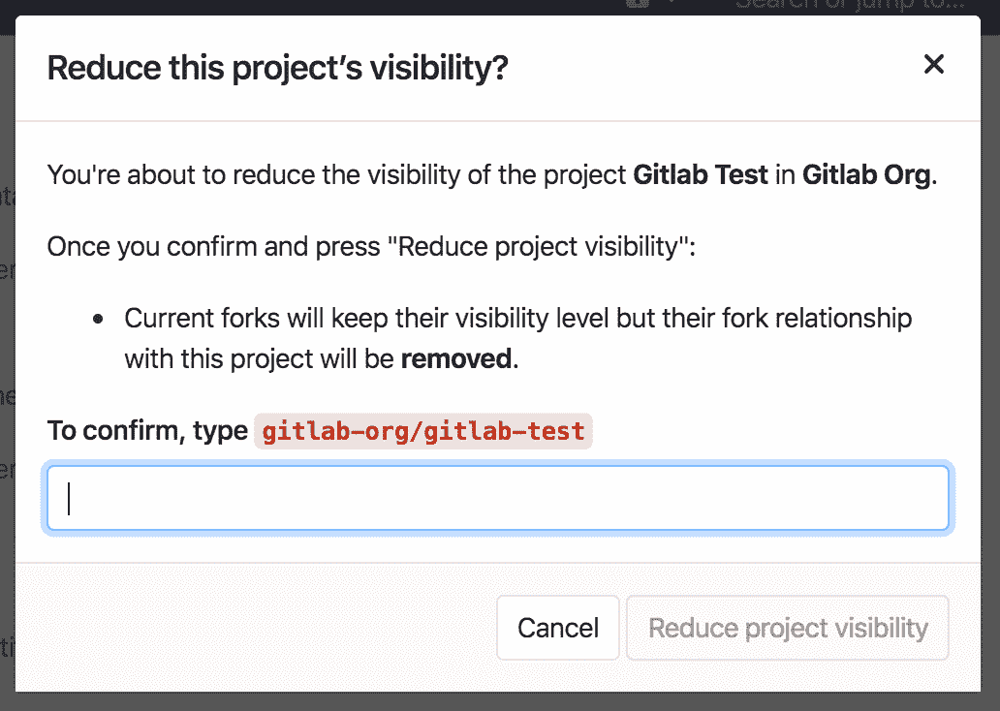

# Public access

> 原文：[https://docs.gitlab.com/ee/public_access/public_access.html](https://docs.gitlab.com/ee/public_access/public_access.html)

*   [Visibility of projects](#visibility-of-projects)
    *   [Public projects](#public-projects)
    *   [Internal projects](#internal-projects)
    *   [Private projects](#private-projects)
    *   [How to change project visibility](#how-to-change-project-visibility)
*   [Visibility of groups](#visibility-of-groups)
*   [Visibility of users](#visibility-of-users)
*   [Visibility of pages](#visibility-of-pages)
*   [Restricting the use of public or internal projects](#restricting-the-use-of-public-or-internal-projects)
*   [Reducing visibility](#reducing-visibility)

# Public access

GitLab 允许[所有者](../user/permissions.html)将项目的可见性设置为**public** ， **internal**或**private** . 这些可见性级别会影响谁可以在公共访问目录（GitLab 实例下的`/public` ）中查看项目，例如[https://gitlab.com/public](https://gitlab.com/public)

## Visibility of projects

### Public projects

可以克隆公共项目， **而无需**通过 HTTPS **进行任何**身份验证.

它们将在所有用户的公共访问目录（ `/public` ）中列出.

**任何登录的用户**都将对存储库具有[来宾权限](../user/permissions.html) .

### Internal projects

任何登录用户都可以克隆内部项目.

它们也将列在公共访问目录（ `/public` ）中，但仅适用于登录用户.

任何登录的用户都将对存储库具有[来宾权限](../user/permissions.html) .

**注意：**从 2019 年 7 月开始，GitLab.com 上的新项目，组和摘要的`` `Internal`可见性''设置被禁用. 使用" `Internal`可见性"设置的现有项目，组和摘录保留此设置. 您可以在[相关问题中](https://gitlab.com/gitlab-org/gitlab/-/issues/12388)阅读有关更改的更多信息.

### Private projects

私人项目只能由项目成员（来宾除外）克隆和查看.

它们将仅出现在项目成员的公共访问目录（ `/public` ）中.

### How to change project visibility

1.  转到项目的**"设置"** .
2.  将**可见性级别**更改为公共，内部或私有.

## Visibility of groups

**注意：** [从](https://gitlab.com/gitlab-org/gitlab-foss/-/merge_requests/3323) GitLab 8.6 [开始](https://gitlab.com/gitlab-org/gitlab-foss/-/merge_requests/3323) ，组的可见性已更改，并且可以与项目相同的方式进行配置. 在以前的版本中，组页面始终对所有用户可见.

与项目一样，可以设置组的可见性来决定匿名用户，所有登录用户还是仅显式组成员可以查看它. 应用程序设置级别对可见性级别的限制也适用于组，因此，如果将其设置为内部，则匿名用户的浏览页面将为空. 现在，组页面上有一个可见性级别图标.

管理员用户不能创建具有比直接父组更高的可见性级别的子组或项目.

## Visibility of users

无论您是否登录，位于`/username`的用户公共页面始终可见.

当访问用户的公共页面时，您只能看到您有权访问的项目.

如果公共级别受到限制，则用户配置文件仅对登录用户可见.

## Visibility of pages

默认情况下，以下目录对未经身份验证的用户可见：

*   公共访问（ `/public` ）.
*   探索（ `/explore` ）.
*   帮助（ `/help` ）.

但是，如果`/public`目录的访问级别受到限制，则这些目录仅对登录用户可见.

## Restricting the use of public or internal projects

您可以限制用户在创建项目或代码段时对可见性级别的使用. 这有助于防止用户意外公开其存储库. 受限的可见性设置不适用于管理员用户.

有关详细信息，请参阅[受限可见性级别](../user/admin_area/settings/visibility_and_access_controls.html#restricted-visibility-levels) .

## Reducing visibility

在 GitLab 12.6 中[引入](https://gitlab.com/gitlab-org/gitlab/-/issues/33358) .

降低项目的可见性级别将删除该项目与任何分叉项目之间的派生关系. 这是一种潜在的破坏性操作，需要先确认才能保存.

