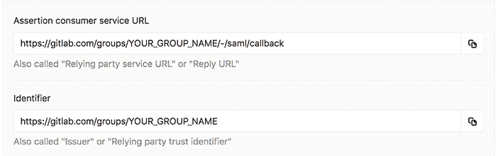
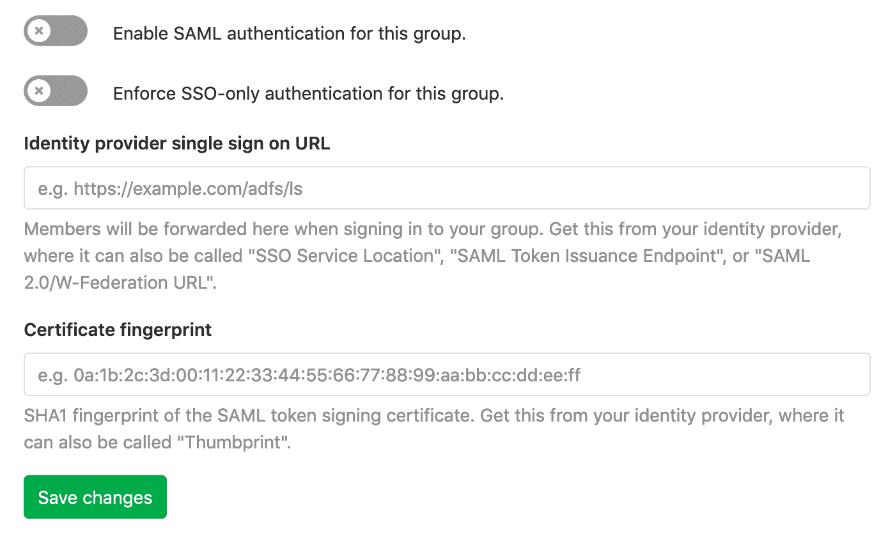

# SAML SSO for GitLab.com groups

> 原文：[https://docs.gitlab.com/ee/user/group/saml_sso/](https://docs.gitlab.com/ee/user/group/saml_sso/)

*   [Configuring your Identity Provider](#configuring-your-identity-provider)
    *   [NameID](#nameid)
        *   [NameID Format](#nameid-format)
    *   [Metadata configuration](#metadata-configuration)
*   [Configuring GitLab](#configuring-gitlab)
    *   [SSO enforcement](#sso-enforcement)
*   [Providers](#providers)
    *   [Azure setup notes](#azure-setup-notes)
    *   [Okta setup notes](#okta-setup-notes)
    *   [OneLogin setup notes](#onelogin-setup-notes)
    *   [Additional providers and setup options](#additional-providers-and-setup-options)
*   [User access and management](#user-access-and-management)
    *   [Linking SAML to your existing GitLab.com account](#linking-saml-to-your-existing-gitlabcom-account)
    *   [Signing in to GitLab.com with SAML](#signing-in-to-gitlabcom-with-saml)
    *   [Role](#role)
    *   [Blocking access](#blocking-access)
    *   [Unlinking accounts](#unlinking-accounts)
*   [Glossary](#glossary)
*   [Configuring on a self-managed GitLab instance](#configuring-on-a-self-managed-gitlab-instance-premium-only)
    *   [Limitations](#limitations)
    *   [Omnibus installations](#omnibus-installations)
    *   [Source installations](#source-installations)
*   [Troubleshooting](#troubleshooting)
    *   [SAML debugging tools](#saml-debugging-tools)
    *   [Verifying configuration](#verifying-configuration)
    *   [Verifying NameID](#verifying-nameid)
    *   [Message: “SAML authentication failed: Extern uid has already been taken”](#message-saml-authentication-failed-extern-uid-has-already-been-taken)
    *   [Message: “SAML authentication failed: User has already been taken”](#message-saml-authentication-failed-user-has-already-been-taken)
    *   [Message: “SAML authentication failed: Email has already been taken”](#message-saml-authentication-failed-email-has-already-been-taken)
    *   [Message: “SAML authentication failed: Extern uid has already been taken, User has already been taken”](#message-saml-authentication-failed-extern-uid-has-already-been-taken-user-has-already-been-taken)
    *   [Message: “Request to link SAML account must be authorized”](#message-request-to-link-saml-account-must-be-authorized)
    *   [Stuck in a login “loop”](#stuck-in-a-login-loop)
    *   [The NameID has changed](#the-nameid-has-changed)
    *   [I need to change my SAML app](#i-need-to-change-my-saml-app)
    *   [I need additional information to configure my identity provider](#i-need-additional-information-to-configure-my-identity-provider)

# SAML SSO for GitLab.com groups[](#saml-sso-for-gitlabcom-groups-premium "Permalink")

在 GitLab 11.0 中引入.

此页面描述了组的 SAML. 有关自我管理的 GitLab 实例上的实例范围内的 SAML，请参阅[SAML OmniAuth Provider](../../../integration/saml.html) .

GitLab.com 上的 SAML 允许用户通过其 SAML 身份提供商进行登录. 如果用户还不是成员，则登录过程会自动将用户添加到适当的组.

如果您遵循我们的指导以使用[SCIM](scim_setup.html)或[组管理的帐户](group_managed_accounts.html)自动执行用户配置，则无需手动创建此类帐户.

通过[SCIM](scim_setup.html)支持 SAML SSO 组的用户同步. SCIM 支持在 GitLab 组中添加和删除用户. 例如，如果您从 SCIM 应用程序中删除用户，则 SCIM 将从 GitLab 组中删除该用户.

## Configuring your Identity Provider[](#configuring-your-identity-provider "Permalink")

1.  导航到该组，然后单击**设置> SAML SSO** .
2.  使用**Assertion 使用者服务 URL** ， **Identifier**和**GitLab 单一登录** **URL**来配置 SAML 服务器. 另外，GitLab 还提供[元数据 XML 配置](#metadata-configuration) . 有关更多详细信息，请参见[特定的身份提供者文档](#providers) .
3.  配置 SAML 响应以包括唯一标识每个用户的 NameID.
4.  如果使用[组托管帐户，请](group_managed_accounts.html)配置[必需的断言](group_managed_accounts.html#assertions) .
5.  设置身份提供者后，继续[配置 GitLab](#configuring-gitlab) .

[](img/group_saml_configuration_information.png)

### NameID[](#nameid "Permalink")

GitLab.com 使用 SAML NameID 来识别用户. NameID 元素：

*   是 SAML 响应中的必填字段.
*   每个用户必须唯一.
*   必须是永久不变的值，例如随机生成的唯一用户 ID.
*   区分大小写. NameID 必须在随后的登录尝试中完全匹配，因此不应依赖可能在大小写之间变化的用户输入.
*   不应是电子邮件地址或用户名. 我们强烈建议您反对这些，因为很难保证它们永远不会改变，例如当一个人的名字改变时. 电子邮件地址也不区分大小写，这可能导致用户无法登录.

支持的提供程序的相关字段名称和建议值在[提供程序特定的注释中](#providers) . 适当的相应字段.

**警告：**用户使用 SSO SAML 设置登录到 GitLab 后，更改`NameID`将破坏配置，并有可能将用户锁定在 GitLab 组之外.

#### NameID Format[](#nameid-format "Permalink")

我们建议将 NameID 格式设置为`Persistent`除非使用要求其他格式的字段（例如电子邮件）.

### Metadata configuration[](#metadata-configuration "Permalink")

GitLab 提供了可用于配置身份提供者的元数据 XML.

1.  导航到该组，然后单击**设置> SAML SSO** .
2.  复制提供的**GitLab 元数据 URL** .
3.  请遵循身份提供者的文档，并在请求时粘贴元数据 URL.

## Configuring GitLab[](#configuring-gitlab "Permalink")

设置好身份提供程序以与 GitLab 一起使用后，您需要配置 GitLab 以使用它进行身份验证：

1.  导航到组的**"设置">" SAML SSO"** .
2.  从您的身份提供者中找到 SSO URL，然后在**身份提供者单点登录 URL**字段中输入 SSO URL.
3.  在" **证书"**字段中找到并输入 SAML 令牌签名证书的指纹.
4.  单击" **为此组启用 SAML 身份验证"**切换开关.
5.  点击**保存更改**按钮.

[](img/group_saml_settings.png)

**注意：**请注意，证书[指纹算法](#additional-providers-and-setup-options)必须在 SHA1 中. 配置身份提供者时，请使用安全签名算法.

### SSO enforcement[](#sso-enforcement "Permalink")

*   在 GitLab 11.8 中[引入](https://gitlab.com/gitlab-org/gitlab/-/issues/5291) .
*   在 GitLab 11.11 中进行了[改进](https://gitlab.com/gitlab-org/gitlab/-/issues/9255) ，并在 GitLab UI 中不断实施.

启用此选项后，用户必须浏览您组的 GitLab 单一登录 URL. 如果已配置，也可以通过 SCIM 添加它们. 无法手动添加用户，只能通过 UI 通过 SSO URL 登录来访问项目/组资源.

但是，每次访问时都不会提示用户通过 SSO 登录. GitLab 将检查用户是否已通过 SSO 进行身份验证，并且仅在会话过期时提示用户通过 SSO 登录.

我们打算为[Git 和 API 活动](https://gitlab.com/gitlab-org/gitlab/-/issues/9152)添加类似的 SSO 要求.

为组启用 SSO 强制后，即使分叉了项目，用户也无法在顶级组之外的组中共享项目.

要禁止用户在顶级组之外进行贡献，请参阅" [组管理帐户"](group_managed_accounts.html) .

## Providers[](#providers "Permalink")

**注意：** GitLab 无法为未在此处列出的 IdP 提供支持.

| Provider | Documentation |
| --- | --- |
| ADFS（Active Directory 联合身份验证服务） | [Create a Relying Party Trust](https://docs.microsoft.com/en-us/windows-server/identity/ad-fs/operations/create-a-relying-party-trust) |
| Azure | [Configuring single sign-on to applications](https://docs.microsoft.com/en-us/azure/active-directory/manage-apps/configure-single-sign-on-non-gallery-applications) |
| Okta | [Setting up a SAML application in Okta](https://developer.okta.com/docs/guides/build-sso-integration/saml2/overview/) |
| OneLogin | [Use the OneLogin SAML Test Connector](https://onelogin.service-now.com/support?id=kb_article&sys_id=93f95543db109700d5505eea4b96198f) |

在[配置标识提供程序时](#configuring-your-identity-provider) ，请考虑以下有关特定提供程序的注意事项，以帮助避免常见问题，并作为所用术语的指南.

### Azure setup notes[](#azure-setup-notes "Permalink")

有关包括 SCIM 在内的 Azure SAML 设置的演示，请参阅《 [使用针对组的 SAML SSO 的 Azure 上的 SCIM 置备》演示](https://youtu.be/24-ZxmTeEBU) .

| 亚搏体育 app 设置 | 蔚蓝领域 |
| --- | --- |
| Identifier | 标识符（实体 ID） |
| 断言消费者服务 URL | 回复 URL（断言消费者服务 URL） |
| GitLab 单一登录 URL | 登录 URL |
| 身份提供者单点登录 URL | 登录网址 |
| 证书指纹 | Thumbprint |

我们推荐：

*   **唯一用户标识符（名称标识符）**设置为`user.objectID` .
*   **nameid-format**设置为持久.

### Okta setup notes[](#okta-setup-notes "Permalink")

有关 Okta SAML 设置（包括 SCIM）的[演示](https://youtu.be/0ES9HsZq0AQ) ，请参见[演示：Okta Group SAML 和 SCIM 设置](https://youtu.be/0ES9HsZq0AQ) .

| 亚搏体育 app 设置 | Okta 场 |
| --- | --- |
| Identifier | 目标对象 URI |
| 断言消费者服务 URL | 单一登录网址 |
| GitLab 单一登录 URL | 登录页面 URL（在" **应用程序登录页面"**设置下） |
| 身份提供者单点登录 URL | 身份提供者单一登录 URL |

在 Okta 的" **单一登录 URL"**字段下，选中" **将此用于收件人 URL 和目标 URL** "选项.

我们推荐：

*   **应用程序用户名** （NameID）设置为**Custom** `user.getInternalProperty("id")` .
*   **名称 ID 格式**设置为**Persistent** .

### OneLogin setup notes[](#onelogin-setup-notes "Permalink")

OneLogin 应用目录中列出的 GitLab 应用适用于自我管理的 GitLab 实例. 对于 GitLab.com，请使用通用 SAML 测试连接器，例如 SAML 测试连接器（高级）.

| 亚搏体育 app 设置 | OneLogin Field |
| --- | --- |
| Identifier | Audience |
| 断言消费者服务 URL | Recipient |
| 断言消费者服务 URL | ACS（消费者）网址 |
| 断言消费者服务 URL（转义版本） | ACS（消费者）URL 验证器 |
| GitLab 单一登录 URL | 登录网址 |
| 身份提供者单点登录 URL | SAML 2.0 端点 |

Recommended `NameID` value: `OneLogin ID`.

### Additional providers and setup options[](#additional-providers-and-setup-options "Permalink")

SAML 标准意味着广泛的身份提供者将与 GitLab 一起使用. 不幸的是，我们尚未验证与所有 SAML 提供程序的连接. 有关更多信息，请参见[关于提供程序](#providers)的[讨论](#providers) .

您的身份提供者可能具有相关的文档. 它可能是通用的 SAML 文档，也可能是专门针对 GitLab 的. 例子：

*   [Auth0](https://auth0.com/docs/protocols/saml/saml-idp-generic)
*   [G Suite](https://support.google.com/a/answer/6087519?hl=en)
*   [JumpCloud](https://support.jumpcloud.com/support/s/article/single-sign-on-sso-with-gitlab-2019-08-21-10-36-47)
*   [PingOne by Ping Identity](https://docs.pingidentity.com/bundle/pingone/page/xsh1564020480660-1.html)

您的身份提供商可能需要其他配置，例如：

| Field | Value | Notes |
| --- | --- | --- |
| SAML 配置文件 | Web 浏览器 SSO 配置文件 | GitLab 使用 SAML 通过用户的浏览器登录. 我们不会直接向身份提供者发出请求. |
| SAML 请求绑定 | HTTP 重定向 | GitLab（服务提供商）使用 base64 编码的`SAMLRequest` HTTP 参数将用户重定向到您的身份提供商. |
| SAML 响应绑定 | HTTP POST | 您的身份提供者使用 HTTP 表单（包括`SAMLResponse`响应用户，该表单由用户的浏览器提交回 GitLab. |
| 签署 SAML 回应 | Yes | 我们要求这样做以防止篡改. |
| X.509 证书作为回应 | Yes | 这用于签署响应并对照提供的指纹进行检查. |
| 指纹算法 | SHA-1 | 我们需要用于签名 SAML 响应的证书的 SHA-1 哈希. |
| 签名算法 | SHA-1/SHA-256/SHA-384/SHA-512 | 也称为摘要方法，可以在 SAML 响应中指定此方法. 它确定响应的签名方式. |
| 加密 SAML 断言 | No | 在您的身份提供者，用户的浏览器和 GitLab 之间使用 TLS. |
| 签署 SAML 声明 | Optional | 我们不需要签署声明. 我们要求签署完整的回复以验证其完整性. |
| 检查 SAML 请求签名 | No | GitLab 不会对 SAML 请求进行签名，但是会检查 SAML 响应上的签名. |
| 默认 RelayState | Optional | 通过身份提供者上的按钮登录后，URL 用户应最终打开. |
| NameID 格式 | `Persistent` | See [details above](#nameid-format). |
| 其他网址 |   | 您可能需要在某些提供程序的其他字段中使用" `Identifier`或" `Assertion consumer service URL` . |
| 单一登出网址 |   | 不支持 |

如果上面没有列出您需要的信息，则不妨查看[下面](#i-need-additional-information-to-configure-my-identity-provider)的[故障排除文档](#i-need-additional-information-to-configure-my-identity-provider) .

## User access and management[](#user-access-and-management "Permalink")

一旦配置并启用了 Group SSO，用户就可以通过身份提供商的仪表板访问 GitLab.com 组. 如果配置了[SCIM](scim_setup.html) ，请参阅[SCIM 页面上的](scim_setup.html#user-access-and-linking-setup) " [用户访问和链接设置"部分](scim_setup.html#user-access-and-linking-setup) .

当用户尝试使用 Group SSO 登录时，他们将需要一个配置了以下内容之一的帐户：

*   [SCIM](scim_setup.html).
*   [Group-managed accounts](group_managed_accounts.html).
*   一个 GitLab.com 帐户.

### Linking SAML to your existing GitLab.com account[](#linking-saml-to-your-existing-gitlabcom-account "Permalink")

要将 SAML 链接到您现有的 GitLab.com 帐户：

1.  登录到您的 GitLab.com 帐户.
2.  找到并访问您要登录的组的**GitLab 单一登录 URL** . 群组管理员可以在群组的**"设置">" SAML SSO"**页面上找到此内容. 如果配置了登录 URL，则用户可以从身份提供者连接到 GitLab 应用.
3.  Click **Authorize**.
4.  如果出现提示，请在身份提供者上输入您的凭据.
5.  您将被重定向回 GitLab.com，现在应该可以访问该组了. 将来，您可以使用 SAML 登录到 GitLab.com.

在随后的访问中，您应该能够[使用 SAML](#signing-in-to-gitlabcom-with-saml)或直接访问链接来[登录 GitLab.com](#signing-in-to-gitlabcom-with-saml) . 如果**强制 SSO**选项已打开，您将被重定向到通过身份提供者登录.

### Signing in to GitLab.com with SAML[](#signing-in-to-gitlabcom-with-saml "Permalink")

1.  登录到您的身份提供商.
2.  从应用程序列表中，单击" GitLab.com"应用程序（名称由身份提供者的管理员设置）.
3.  您将登录到 GitLab.com，并重定向到该组.

### Role[](#role "Permalink")

首次登录时，GitLab 会将您添加到具有 Guest 角色的顶级父组中. 具有适当特权的现有成员可以提升该新用户.

如果用户已经是组的成员，则链接 SAML 身份不会更改其角色.

### Blocking access[](#blocking-access "Permalink")

要取消对该组的访问，请按顺序执行以下步骤：

1.  从身份提供者上的用户数据存储中删除用户，或从特定应用程序上的用户列表中删除用户.
2.  从 GitLab.com 组中删除用户.

### Unlinking accounts[](#unlinking-accounts "Permalink")

用户可以从其个人资料页面取消链接组的 SAML. 在以下情况下这可能会有所帮助：

*   您不再希望某个群组能够登录 GitLab.com.
*   您的 SAML NameID 已更改，因此 GitLab 无法再找到您的用户.

例如，要取消链接`MyOrg`帐户，以下" **断开连接"**按钮将在" **配置文件">"帐户"**下可用：

[](img/unlink_group_saml.png)

## Glossary[](#glossary "Permalink")

| Term | Description |
| --- | --- |
| 身份提供者 | 管理您的用户身份的服务，例如 ADFS，Okta，Onelogin 或 Ping 身份. |
| 服务提供者 | SAML 认为 GitLab 是服务提供商. |
| Assertion | 有关用户身份的一条信息，例如他们的姓名或角色. 也称为声明或属性. |
| SSO | 单一登录. |
| 断言消费者服务 URL | 在 GitLab 上的回调，在通过身份提供商成功进行身份验证后，将重定向用户. |
| Issuer | manbetx 客户端打不开如何向身份提供商识别自己. 也称为"信赖方信任标识符". |
| 证书指纹 | 用于通过检查服务器是否使用正确的证书对通信进行签名来确认通过 SAML 进行的通信是否安全. 也称为证书指纹. |

## Configuring on a self-managed GitLab instance[](#configuring-on-a-self-managed-gitlab-instance-premium-only "Permalink")

对于自我管理的 GitLab 实例，我们强烈建议改用[实例范围的 SAML OmniAuth Provider](../../../integration/saml.html) .

如果您需要允许通过多个 SAML 身份提供者进行访问，Group SAML SSO 可以提供帮助，但是作为多租户解决方案，它不太适合您管理自己的 GitLab 实例的情况.

要改为继续配置 Group SAML SSO，您需要启用`group_saml` OmniAuth 提供程序. 这可以通过以下方式完成：

*   `gitlab.rb`用于 GitLab [Omnibus 安装](#omnibus-installations) .
*   `gitlab/config/gitlab.yml` for [source installations](#source-installations).

### Limitations[](#limitations "Permalink")

与建议的[实例范围的 SAML](../../../integration/saml.html)相比，自管理实例上的组 SAML 受到限制. 推荐的解决方案使您可以利用：

*   [LDAP compatibility](../../../administration/auth/ldap/index.html).
*   [LDAP Group Sync](../index.html#manage-group-memberships-via-ldap).
*   [Required groups](../../../integration/saml.html#required-groups-starter-only).
*   [Admin groups](../../../integration/saml.html#admin-groups-starter-only).
*   [Auditor groups](../../../integration/saml.html#auditor-groups-starter-only).

### Omnibus installations[](#omnibus-installations "Permalink")

1.  确保为 GitLab [配置了 HTTPS](../../../install/installation.html#using-https) .
2.  启用 OmniAuth 和`group_saml`在提供`gitlab.rb` ：

    ```
    gitlab_rails['omniauth_enabled'] = true
    gitlab_rails['omniauth_providers'] = [{ name: 'group_saml' }] 
    ```

### Source installations[](#source-installations "Permalink")

1.  确保为 GitLab [配置了 HTTPS](../../../install/installation.html#using-https) .
2.  在`gitlab/config/gitlab.yml`启用 OmniAuth 和`group_saml`提供程序：

    ```
     omniauth:
         enabled: true
         providers:
           - { name: 'group_saml' } 
    ```

## Troubleshooting[](#troubleshooting "Permalink")

本节包含可能遇到的问题的可能解决方案.

### SAML debugging tools[](#saml-debugging-tools "Permalink")

SAML 响应是 base64 编码的，因此我们建议使用以下浏览器插件即时对其进行解码：

*   [SAML tracer for Firefox](https://addons.mozilla.org/en-US/firefox/addon/saml-tracer/)
*   [Chrome SAML Panel](https://chrome.google.com/webstore/detail/saml-chrome-panel/paijfdbeoenhembfhkhllainmocckace?hl=en)

应特别注意：

*   [NameID](#nameid) （我们用来标识正在登录的用户）.如果该用户先前已登录，则该[ID 必须与我们存储的值匹配](#verifying-nameid) .
*   `X509Certificate`的存在，我们需要使用它来验证响应签名.
*   `SubjectConfirmation`和`Conditions` ，如果配置错误，可能会导致错误.

### Verifying configuration[](#verifying-configuration "Permalink")

For convenience, we’ve included some [example resources](../../../administration/troubleshooting/group_saml_scim.html) used by our Support Team. While they may help you verify the SAML app configuration, they are not guaranteed to reflect the current state of third-party products.

### Verifying NameID[](#verifying-nameid "Permalink")

在对组 SAML 设置进行故障排除时，任何经过身份验证的用户都可以通过访问[https://gitlab.com/api/v4/user](https://gitlab.com/api/v4/user)并检查身份下的`extern_uid`来使用 API​​来验证 NameID GitLab 是否已链接到该用户.

同样，具有适当权限的角色的组成员可以使用[成员 API](../../../api/members.html)来查看该组成员的组 SAML 身份信息.

然后可以通过使用[SAML 调试工具](#saml-debugging-tools)解码消息，将其与身份提供者发送的[NameID](#nameid)进行比较. 我们要求这些匹配项以识别用户.

### Message: “SAML authentication failed: Extern uid has already been taken”[](#message-saml-authentication-failed-extern-uid-has-already-been-taken "Permalink")

此错误表明您已以 GitLab 用户身份登录，但已将 SAML 身份链接到其他 GitLab 用户. 退出，然后尝试使用 SSO SAML 链接再次登录，该链接应使用链接的用户帐户将您登录到 GitLab.

如果您不希望通过 SAML 登录使用该 GitLab 用户，则可以[取消 GitLab 帐户与该组的 SAML 的链接](#unlinking-accounts) .

### Message: “SAML authentication failed: User has already been taken”[](#message-saml-authentication-failed-user-has-already-been-taken "Permalink")

与您登录的用户已经将 SAML 链接到另一个身份. 以下是可能的原因和解决方案：

| Cause | Solution |
| --- | --- |
| You’ve tried to link multiple SAML identities to the same user, for a given Identity Provider. | 更改用于登录的身份. 为此，请先从此 GitLab 帐户[取消链接先前的 SAML 身份](#unlinking-accounts) ，然后再尝试登录. |

### Message: “SAML authentication failed: Email has already been taken”[](#message-saml-authentication-failed-email-has-already-been-taken "Permalink")

| Cause | Solution |
| --- | --- |
| 当具有电子邮件地址的用户帐户已经存在于 GitLab 中时，但该用户没有绑定到其帐户的 SAML 身份. | 用户将需要[链接他们的帐户](#user-access-and-management) . |

### Message: “SAML authentication failed: Extern uid has already been taken, User has already been taken”[](#message-saml-authentication-failed-extern-uid-has-already-been-taken-user-has-already-been-taken "Permalink")

同时获得这两个错误表明，身份提供者提供的 NameID 大写字母与该用户的先前值不完全匹配.

可以通过配置[NameID](#nameid)返回一致的值来防止这种情况. 为单个用户解决此问题涉及[取消 GitLab 帐户中的 SAML 链接](#unlinking-accounts) ，尽管这将导致组成员身份和 Todos 丢失.

### Message: “Request to link SAML account must be authorized”[](#message-request-to-link-saml-account-must-be-authorized "Permalink")

确保尝试链接其 GitLab 帐户的用户已添加为身份提供者的 SAML 应用中的用户.

### Stuck in a login “loop”[](#stuck-in-a-login-loop "Permalink")

确保在身份提供者的 SAML 应用中将**GitLab 单一登录 URL**配置为"登录 URL"（或类似命名的字段）.

另外，当用户需要[将 SAML 链接到其现有的 GitLab.com 帐户时](#linking-saml-to-your-existing-gitlabcom-account) ，请提供**GitLab 单一登录 URL，**并指示用户不要在首次登录时使用 SAML 应用.

### The NameID has changed[](#the-nameid-has-changed "Permalink")

| Cause | Solution |
| --- | --- |
| 如[NameID](#nameid)部分所述，如果 NameID 对于任何用户都发生了更改，则可以将用户锁定. 当电子邮件地址用作标识符时，这是一个常见问题. | 请按照[" SAML 身份验证失败：用户已被使用"](#message-saml-authentication-failed-user-has-already-been-taken)部分中概述的步骤进行操作. 如果许多用户受到影响，建议您使用适当的 API. |

### I need to change my SAML app[](#i-need-to-change-my-saml-app "Permalink")

用户将需要[取消链接当前的 SAML 身份](#unlinking-accounts) ， [并将其身份链接](#user-access-and-management)到新的 SAML 应用.

### I need additional information to configure my identity provider[](#i-need-additional-information-to-configure-my-identity-provider "Permalink")

提供商之间的许多 SAML 术语可能会有所不同. 您正在查找的信息可能以其他名称列出.

有关更多信息，请从您的身份提供商的文档开始. 查找他们的选项和示例，以了解他们如何配置 SAML. 这可以提供有关配置 GitLab 以便与这些提供程序一起使用所需的提示.

它也有助于查看我们[有关自管理 GitLab 的更详细的文档](../../../integration/saml.html) . GitLab.com 的 SAML 配置与自我管理实例的 SAML 配置基本相同. 但是，自我管理的 GitLab 实例使用支持更多选项的配置文件，如外部[OmniAuth SAML 文档中所述](https://github.com/omniauth/omniauth-saml/) . 在内部使用[`ruby-saml`库](https://github.com/onelogin/ruby-saml) ，因此我们有时在此处检查以验证不常用选项的低级详细信息.

它还可以帮助将提供商的 XML 响应与我们[用于内部测试的 XML 示例进行比较](https://gitlab.com/gitlab-org/gitlab/blob/master/ee/spec/fixtures/saml/response.xml) .