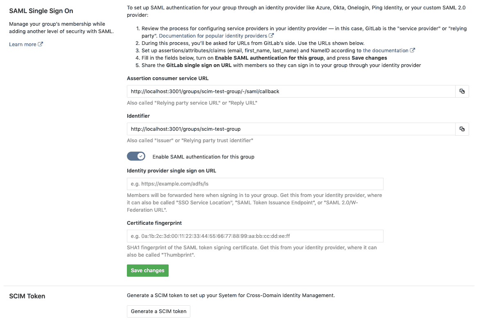
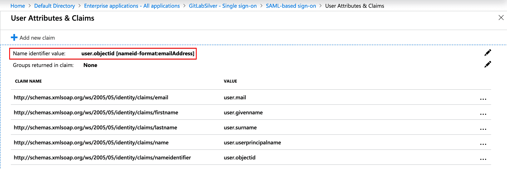
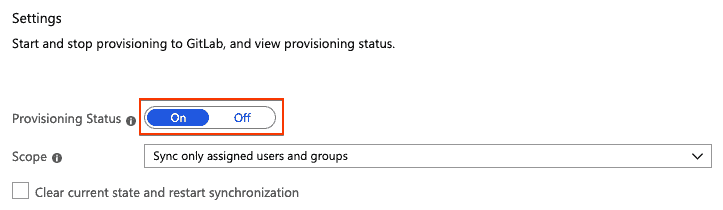

# SCIM provisioning using SAML SSO for GitLab.com groups

> 原文：[https://docs.gitlab.com/ee/user/group/saml_sso/scim_setup.html](https://docs.gitlab.com/ee/user/group/saml_sso/scim_setup.html)

*   [Features](#features)
*   [Requirements](#requirements)
*   [GitLab configuration](#gitlab-configuration)
*   [Identity Provider configuration](#identity-provider-configuration)
    *   [Azure configuration steps](#azure-configuration-steps)
        *   [Configure attribute mapping](#configure-attribute-mapping)
    *   [Okta configuration steps](#okta-configuration-steps)
        *   [Okta Known Issues](#okta-known-issues)
*   [User access and linking setup](#user-access-and-linking-setup)
    *   [Blocking access](#blocking-access)
*   [Troubleshooting](#troubleshooting)
    *   [Azure](#azure)
        *   [How do I verify my SCIM configuration is correct?](#how-do-i-verify-my-scim-configuration-is-correct)
        *   [Testing Azure connection: invalid credentials](#testing-azure-connection-invalid-credentials)
        *   [Azure: (Field) can’t be blank sync error](#azure-field-cant-be-blank-sync-error)
        *   [How do I diagnose why a user is unable to sign in](#how-do-i-diagnose-why-a-user-is-unable-to-sign-in)
        *   [How do I verify user’s SAML NameId matches the SCIM externalId](#how-do-i-verify-users-saml-nameid-matches-the-scim-externalid)
        *   [Update or fix mismatched SCIM externalId and SAML NameId](#update-or-fix-mismatched-scim-externalid-and-saml-nameid)
        *   [I need to change my SCIM app](#i-need-to-change-my-scim-app)

# SCIM provisioning using SAML SSO for GitLab.com groups[](#scim-provisioning-using-saml-sso-for-gitlabcom-groups-silver-only "Permalink")

[Introduced](https://gitlab.com/gitlab-org/gitlab/-/merge_requests/9388) in [GitLab.com Silver](https://about.gitlab.com/pricing/) 11.10.

跨域身份管理系统（SCIM）是一种开放标准，可实现用户自动配置. 当为 GitLab 组配置 SCIM 时，该组的成员资格将在 GitLab 和身份提供者之间同步.

GitLab 的[SCIM API](../../../api/scim.html)实现[了 RFC7644 协议的](https://tools.ietf.org/html/rfc7644)一部分.

## Features[](#features "Permalink")

当前，可以执行以下操作：

*   建立使用者
*   更新用户（仅限 Azure）
*   停用用户

支持以下身份提供者：

*   Azure
*   Okta

## Requirements[](#requirements "Permalink")

*   必须配置[组单一登录](index.html) .

## GitLab configuration[](#gitlab-configuration "Permalink")

配置[组单一登录后](index.html) ，我们可以：

1.  导航到该组，然后单击**管理> SAML SSO** .
2.  单击**生成 SCIM 令牌**按钮.
3.  保存令牌和 URL，以便可以在下一步中使用它们.

[](img/scim_token.png)

## Identity Provider configuration[](#identity-provider-configuration "Permalink")

*   [Azure](#azure-configuration-steps)
*   [Okta](#okta-configuration-steps)

### Azure configuration steps[](#azure-configuration-steps "Permalink")

现在需要为 SCIM 设置在[Azure 的](https://docs.microsoft.com/en-us/azure/active-directory/manage-apps/configure-single-sign-on-non-gallery-applications) [单点登录](index.html)安装过程中创建的 SAML 应用程序.

1.  检查您的 GitLab SAML 应用程序的配置，并确保**名称标识符值** （NameID）指向`user.objectid`或另一个唯一标识符. 这将与 GitLab 上使用的`extern_uid`匹配.

    [](img/scim_name_identifier_mapping.png)

2.  通过遵循针对 Azure [支持](https://docs.microsoft.com/en-us/azure/active-directory/app-provisioning/use-scim-to-provision-users-and-groups#provisioning-users-and-groups-to-applications-that-support-scim)的 SCIM 安装文档[中支持 SCIM 的应用程序](https://docs.microsoft.com/en-us/azure/active-directory/app-provisioning/use-scim-to-provision-users-and-groups#provisioning-users-and-groups-to-applications-that-support-scim)的[供应用户和组，来](https://docs.microsoft.com/en-us/azure/active-directory/app-provisioning/use-scim-to-provision-users-and-groups#provisioning-users-and-groups-to-applications-that-support-scim)设置自动供应和管理凭据.

During this configuration, note the following:

*   `Tenant URL`和`secret token`是在[上一步中](#gitlab-configuration)检索到的.
*   如果 GitLab 的可用性有任何问题或类似错误，则通知电子邮件集将获得这些信息.
*   建议设置通知电子邮件并选中**发生故障时发送电子邮件通知**复选框.
*   对于映射，我们将仅启用"将`Synchronize Azure Active Directory Users to AppName`启用状态.

然后，您可以通过单击" **测试连接"**来**测试连接** . 如果连接成功，请确保在继续操作之前保存配置. 请参阅下面的[疑难解答](#troubleshooting) .

#### Configure attribute mapping[](#configure-attribute-mapping "Permalink")

1.  单击"将`Synchronize Azure Active Directory Users to AppName`以配置属性映射.
2.  单击`mail`映射旁边的**删除** .
3.  将`userPrincipalName`映射到`emails[type eq "work"].value`并将其**Matching 优先级**更改为`2` .
4.  Map `mailNickname` to `userName`.
5.  确定 GitLab 如何唯一标识用户.

    *   除非用户已经为您的组链接了 SAML，否则请使用`objectId` .
    *   如果已经有链接 SAML 的用户，则使用[SAML 配置中](#azure)的" `Name ID`值. 使用其他值可能会导致用户重复并阻止用户访问 GitLab 组.
6.  创建一个新的映射：
    1.  单击**添加新映射** .
    2.  组：
        *   上面确定的唯一标识符的**Source 属性** ，通常是`objectId` .
        *   **目标属性**为`externalId` .
        *   **使用此属性**将**对象匹配**为`Yes` .
        *   **匹配优先级**为`1` .
7.  单击`userPrincipalName`映射，然后**使用此属性**将**Match 对象**更改为`No`

8.  保存您的更改. 作为参考，您可以[在故障排除参考中](../../../administration/troubleshooting/group_saml_scim.html#azure-active-directory)查看[示例配置](../../../administration/troubleshooting/group_saml_scim.html#azure-active-directory) .

    **注意：**如果您使用**除** `objectId` **之外**的唯一标识符，请确保将其映射到`externalId` .
9.  在映射列表下，单击**显示高级选项>编辑 AppName 的属性列表** .

10.  确保`id`是主要字段和必填字段，并且还需要`externalId` .

    **注意：** `username`既不是主要`username`也不是必需的，因为我们尚不支持 GitLab SCIM 上的该字段.
11.  保存所有屏幕，然后在**Provisioning**步骤中将`Provisioning Status`设置为`On` .

    [](img/scim_provisioning_status.png)

    **注意：**您可以通过选择`Scope`来控制实际同步的内容. 例如， `Sync only assigned users and groups`将仅同步分配给应用程序的`Users and groups` （ `Users and groups` ），否则，它将同步整个 Active Directory.

一旦启用，同步细节的任何错误都出现在**供应**屏幕的底部，有一个链接到审计日志在一起.

**警告：**同步后，将映射到`id`和`externalId`的字段更改可能会导致配置错误，用户重复，并阻止现有用户访问 GitLab 组.

### Okta configuration steps[](#okta-configuration-steps "Permalink")

现在需要为 SCIM 设置在[Okta 的](https://developer.okta.com/docs/guides/build-sso-integration/saml2/overview/) [单点登录](index.html#okta-setup-notes)安装过程中创建的 SAML 应用程序. 在继续之前，请确保完成[GitLab 配置](#gitlab-configuration)过程.

1.  登录到 Okta.
2.  如果您在右上角看到一个**管理**按钮，请单击该按钮. 这将确保您位于"管理"区域.

    **提示：**如果您在使用开发者控制台，点击**开发者控制台**顶部栏并选择**经典的 UI.** 否则，您可能看不到以下步骤中描述的按钮：
3.  在" **应用程序"**选项卡中，单击" **添加应用程序"** .
4.  Search for **GitLab**, find and click on the ‘GitLab’ application.
5.  在 GitLab 应用程序概述页面上，单击**添加** .
6.  在" **应用程序可见性"下，**选中两个复选框. 当前，GitLab 应用程序不支持 SAML 身份验证，因此不应向用户显示该图标.
7.  单击**"完成"**以完成添加应用程序.
8.  在**供应**标签中，点击**配置 API 集成** .
9.  Select **启用 API 集成**.
    *   对于**基本 URL，**输入从 GitLab SCIM 配置页面获得的 URL.
    *   对于**API 令牌，**输入从 GitLab SCIM 配置页面获得的 SCIM 令牌.
10.  点击"测试 API 凭据"以验证配置.
11.  单击**保存**以应用设置.
12.  After saving the API integration details, new settings tabs will appear on the left. Choose **到应用**.
13.  Click **Edit**.
14.  选中"为**创建用户**和**停用用户** **启用** "复选框.
15.  Click **Save**.
16.  在" **分配"**选项卡中分配用户. 分配的用户将在您的 GitLab 组中创建和管理.

#### Okta Known Issues[](#okta-known-issues "Permalink")

Okta GitLab 应用程序当前仅支持 SCIM. 继续使用单独的 Okta [SAML SSO](index.html)配置以及上述新的 SCIM 应用程序.

## User access and linking setup[](#user-access-and-linking-setup "Permalink")

只要已经配置了[Group SAML](index.html) ，就可以在启用同步之前，在激活同步之前，现有的 GitLab.com 用户可以通过以下方式之一链接到其帐户：

*   通过更新其 GitLab.com 用户帐户中的*主要*电子邮件地址以匹配其身份提供商的用户个人资料电子邮件地址.
*   通过执行以下步骤：

    1.  如果需要，登录到 GitLab.com.
    2.  在身份提供商的仪表板上单击 GitLab 应用程序，或访问**GitLab 单一登录 URL** .
    3.  单击**授权**按钮.

后续访问中的新用户和现有用户可以通过身份提供商的仪表板或直接访问链接来访问组.

有关角色信息，请参阅[组 SAML 页面](index.html#user-access-and-management)

### Blocking access[](#blocking-access "Permalink")

要取消对该组的访问，我们建议从身份提供商或特定应用程序的用户列表中删除该用户.

在下一次同步时，将取消提供该用户，这意味着该用户将从组中删除. 除非使用[组托管帐户，](group_managed_accounts.html)否则不会删除该用户帐户.

## Troubleshooting[](#troubleshooting "Permalink")

本节包含可能遇到的问题的可能解决方案.

### Azure[](#azure "Permalink")

#### How do I verify my SCIM configuration is correct?[](#how-do-i-verify-my-scim-configuration-is-correct "Permalink")

查看以下内容：

*   确保`id`的 SCIM 值与`NameId`的 SAML 值匹配.
*   确保`externalId`的 SCIM 值与`NameId`的 SAML 值匹配.

查看以下 SCIM 参数以获取合理的值：

*   `userName`
*   `displayName`
*   `emails[type eq "work"].value`

#### Testing Azure connection: invalid credentials[](#testing-azure-connection-invalid-credentials "Permalink")

测试连接时，您可能会遇到错误： **您似乎输入了无效的凭据.** **请确认您使用的管理帐户信息正确** . 如果`Tenant URL`和`secret token`正确，请检查您的组路径中是否包含可能被视为无效 JSON 原语的字符（例如`.` ）. 从组路径中删除此类字符通常可以解决该错误.

#### Azure: (Field) can’t be blank sync error[](#azure-field-cant-be-blank-sync-error "Permalink")

在检查供应的审核日志时，有时您会看到错误`Namespace can't be blank, Name can't be blank, and User can't be blank.`

这可能是由于没有为所有要映射的用户提供所有必填字段（例如名字和姓氏）.

作为解决方法，请尝试其他映射：

1.  请按照上面的 Azure 映射说明进行操作.
2.  删除`name.formatted`目标属性条目.
3.  将`displayName`源属性更改为具有`name.formatted`目标属性.

#### How do I diagnose why a user is unable to sign in[](#how-do-i-diagnose-why-a-user-is-unable-to-sign-in "Permalink")

每当`id`或`externalId`更改时，SCIM 都会更新 GitLab 存储的**Identity** （ `extern_uid` ）值. 除非 GitLab 标识（ `extern_uid` ）值与 SAML 发送的`NameId`匹配，否则用户将无法登录.

SCIM 还将使用此值来匹配`id`上的用户，并且只要`id`或`externalId`值发生更改，SCIM 就会更新此值.

将此 SCIM `id`和 SCIM `externalId`配置为与 SAML `NameId`相同的值很重要. 可以使用[调试工具](./index.html#saml-debugging-tools)跟踪 SAML 响应，并且可以根据我们的[SAML 故障排除文档](./index.html#troubleshooting)检查任何错误.

#### How do I verify user’s SAML NameId matches the SCIM externalId[](#how-do-i-verify-users-saml-nameid-matches-the-scim-externalid "Permalink")

组所有者可以在组 SAML SSO 设置页面中查看用户列表和为每个用户存储的`externalId` .

另外，在[SCIM API](../../../api/scim.html#get-a-list-of-saml-users)可用于手动检索`externalId` ，我们已经存储了用户，也被称为`external_uid`或`NameId` .

例如：

```
curl 'https://example.gitlab.com/api/scim/v2/groups/GROUP_NAME/Users?startIndex=1"' --header "Authorization: Bearer <your_scim_token>" --header "Content-Type: application/scim+json" 
```

要查看它与作为 SAML NameId 返回的值的比较，可以让用户使用[SAML Tracer](index.html#saml-debugging-tools) .

#### Update or fix mismatched SCIM externalId and SAML NameId[](#update-or-fix-mismatched-scim-externalid-and-saml-nameid "Permalink")

无论是更改值还是需要映射到其他字段，请确保`id` ， `externalId`和`NameId`都映射到同一字段.

如果 GitLab 的`externalId`与 SAML NameId 不匹配，则需要对其进行更新才能使用户登录.理想情况下，将身份标识提供者配置为进行此类更新，但是在某些情况下，它可能无法这样做. ，例如在查找用户时由于 ID 更改而失败.

如果您修改 SCIM 身份提供程序使用的字段，请务必谨慎，通常为`id`和`externalId` . 我们使用这些 ID 查找用户. 如果身份提供者不知道这些字段的当前值，则该提供者可以创建重复的用户.

如果用户的`externalId`不正确，并且也与 SAML NameID 不匹配，则可以通过以下方式解决该问题：

*   您可以根据[" SAML 身份验证失败：用户已被使用"](./index.html#message-saml-authentication-failed-user-has-already-been-taken)部分，使用户取消链接并重新链接自己.
*   通过在启用预配置的同时从 SAML 应用中删除所有用户，可以同时取消所有用户的链接.
*   您可以使用[SCIM API](../../../api/scim.html#update-a-single-saml-user)手动更正为用户存储的`externalId`以匹配 SAML `NameId` . 要查找用户，您需要知道与`NameId`以及当前`externalId`匹配的`NameId` .

然后可以发出手动 SCIM＃update 请求，例如：

```
curl --verbose --request PATCH 'https://gitlab.com/api/scim/v2/groups/YOUR_GROUP/Users/OLD_EXTERNAL_UID' --data '{ "Operations": [{"op":"Replace","path":"externalId","value":"NEW_EXTERNAL_UID"}] }' --header "Authorization: Bearer <your_scim_token>" --header "Content-Type: application/scim+json" 
```

重要的是不要将这些值更新为不正确的值，因为这将导致用户无法登录.也不要将值分配给错误的用户，这也很重要，因为这将导致用户登录到错误的帐户.

#### I need to change my SCIM app[](#i-need-to-change-my-scim-app "Permalink")

各个用户可以按照[" SAML 身份验证失败：用户已被使用"](./index.html#i-need-to-change-my-saml-app)部分中的说明进行操作.

或者，可以从 SCIM 应用程序中删除用户，这将取消所有已删除用户的链接. 然后可以为新的 SCIM 应用打开同步，以[链接现有用户](#user-access-and-linking-setup) .