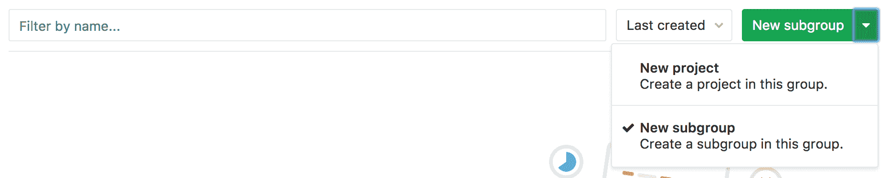
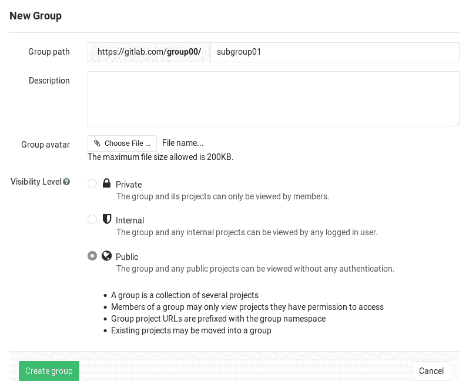
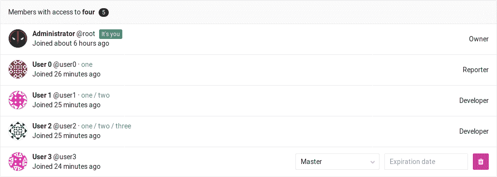
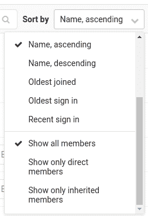
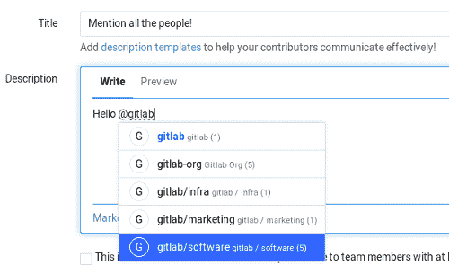

# Subgroups

> 原文：[https://docs.gitlab.com/ee/user/group/subgroups/](https://docs.gitlab.com/ee/user/group/subgroups/)

*   [Overview](#overview)
*   [Creating a subgroup](#creating-a-subgroup)
*   [Membership](#membership)
    *   [Overriding the ancestor group membership](#overriding-the-ancestor-group-membership)
*   [Mentioning subgroups](#mentioning-subgroups)
*   [Limitations](#limitations)

# Subgroups

在 GitLab 9.0 中[引入](https://gitlab.com/gitlab-org/gitlab-foss/-/issues/2772) .

GitLab 支持多达 20 个级别的子组，也称为嵌套组或层次结构组. 组的级别.

通过使用子组，您可以执行以下操作：

*   **独立的内部/外部组织.** 由于每个组都有自己的可见性级别，因此您可以在同一保护范围内为不同目的托管组.
*   **组织大型项目.** 对于大型项目，子组可能会更容易分隔部分源代码的权限.
*   **使管理人员和控制可见性变得更加容易.** 根据人们的组[成员身份，](#membership)赋予他们不同的[权限](../../permissions.html#group-members-permissions) .

有关组和项目中允许的权限的更多信息，请参见[可见性级别](../../../development/permissions.html#general-permissions) .

## Overview

一个组中可以有许多子组，而同一组中只能有一个直接父组. 它类似于目录行为或嵌套项目列表：

*   第一组
    *   1.1 组
    *   1.2 组
        *   1.2.1 组
        *   1.2.2 组
            *   组 1.2.2.1

在一个真实的示例中，设想维护一个 GNU / Linux 发行版，其中第一个组是发行版的名称，随后的组按如下所示拆分：

*   Organization Group - GNU/Linux distro
    *   类别子组-包
        *   （项目）配套 01
        *   （项目）配套 02
    *   类别子组-软件
        *   （项目）核心
        *   （项目）CLI
        *   （项目）Android 应用
        *   （项目）iOS 应用
    *   类别子组-红外线工具
        *   （项目）Ansible 剧本

Another example of GitLab as a company would be the following:

*   组织组-GitLab
    *   类别子组-市场营销
        *   （项目）设计
        *   （项目）一般
    *   类别子组-软件
        *   （项目）GitLab CE
        *   （项目）GitLab EE
        *   （项目）Omnibus GitLab
        *   （项目）GitLab Runner
        *   （项目）GitLab Pages 守护程序
    *   类别子组-红外线工具
        *   （项目）厨师食谱
    *   类别子组-执行团队

* * *

当执行诸如在子组之间转移或导入项目的操作时，其行为与在`group/project`级别执行这些操作时的行为相同.

## Creating a subgroup

要创建子组，您必须是该组的所有者或维护者，具体取决于该组的设置.

默认情况下，在以下位置创建的组：

*   GitLab 12.2 或更高版本允许所有者和维护者创建子组.
*   GitLab 12.1 或更早版本仅允许所有者创建子组.

此设置可以是所有者或管理员的任何组.

有关更多信息，请检查[权限表](../../permissions.html#group-members-permissions) . 有关不允许用作组名的单词列表，请参见[保留名称](../../reserved_names.html) .

如果将子组明确地作为所有者（或维护者，如果启用了此设置）添加到直接父组，则用户始终可以创建子组，即使管理员在其设置中禁用了组创建也是如此.

要创建一个子组：

1.  在组的仪表板中，展开" **新建项目**拆分"按钮，选择" **新建子组"** ，然后单击" **新建子组"**按钮.

    

2.  像平常一样创建一个新组. 请注意，直接父组名称空间在" **组路径"**下是固定的. 可见性级别可以与直接父组不同.

    

3.  单击**创建组**按钮，您将被带到新组的仪表板页面.

按照相同的过程创建任何后续组.

## Membership

将成员添加到子组时，它们将从父组继承成员资格和权限级别. 如果您是其父级成员之一，则该模型允许访问嵌套组.

在亚组可以用乔布斯的管道[运动员](../../../ci/runners/README.html)注册到父组（S）. 这意味着为父组配置的机密可用于子组作业.

此外，属于子组的项目的维护者可以查看注册到父组的 Runner 的详细信息.

成员的组权限只能由所有者更改，并且只能在添加成员的组的" **成员"**页面上进行.

您可以通过查看组的" **成员"**页面来确定成员是否从父组继承了权限.

从上图可以得出以下几点：

*   有 5 位成员可以访问第`four`组.
*   User0 是一个 Reporter，已从组`four`的层次结构上方的组`one`继承了其权限.
*   用户 1 是一个开发并已继承组他们的权限`one/two`其是组的层级以上`four` .
*   用户 2 是一个开发并已继承组他们的权限`one/two/three`这是组的层级以上`four` .
*   对于 User3，没有任何父组的指示，因此它们属于`four`组，即我们正在检查的组.
*   管理员是**所有**子组的所有者和成员，因此，与 User3 一样，没有任何祖先组的迹象.

[在](https://gitlab.com/gitlab-org/gitlab/-/issues/21727) GitLab 12.6 中，您可以使用右侧的下拉列表过滤此列表：

*   **仅显示直接成员**仅显示 Administrator 和 User3，因为这是属于`four`组的唯一用户，这是我们正在检查的用户.
*   **仅显示继承的成员将**显示 User0，User1 和 User2，无论层次结构上方的哪个组都是继承权限的来源.

### Overriding the ancestor group membership

**注意：**您必须是网上论坛的所有者，才能向其中添加成员.**注意：**子组中的用户权限不能低于其任何祖先组中的权限. 因此，您不能针对子组的祖先组减少用户的权限.

要覆盖用户的祖先组（他们被添加到的第一个组）的成员资格，请将该用户再次以更高的权限集添加到新的子组中.

例如，如果首先使用具有开发者权限将 User0 添加到组`group-1/group-1-1` ，则它们将在组`group-1/group-1-1`每个其他子`group-1/group-1-1`继承这些权限. 要为他们提供维护者访问`group-1/group-1-1/group1-1-1` ，您可以将他们再次添加为该维护者. 从该组中删除它们，权限将回退到祖先组的权限.

## Mentioning subgroups

在问题，提交和合并请求中提及组（ `@group` ）将通知该组的所有成员. 现在有了子组，如果您想拆分组的结构，将有更精细的支持. 提及方式与以前一样，您可以选择要通知的人群.

## Limitations

以下是您无法对子组进行操作的列表：

*   [GitLab 页面](../../project/pages/index.html)支持在一个子组下托管的项目，但不支持子组网站下的项目. 这意味着，尽管您可以在子组下拥有项目网站，但是只有最高级别的组才支持[组网站](../../project/pages/getting_started_part_one.html#gitlab-pages-default-domain-names) .
*   不能与作为该项目所属组的祖先的组共享项目.这意味着您只能在沿层次结构走时共享. 例如， `group/subgroup01/project` **不能**与`group`共享，但是可以与`group/subgroup02`或`group/subgroup01/subgroup03`共享.