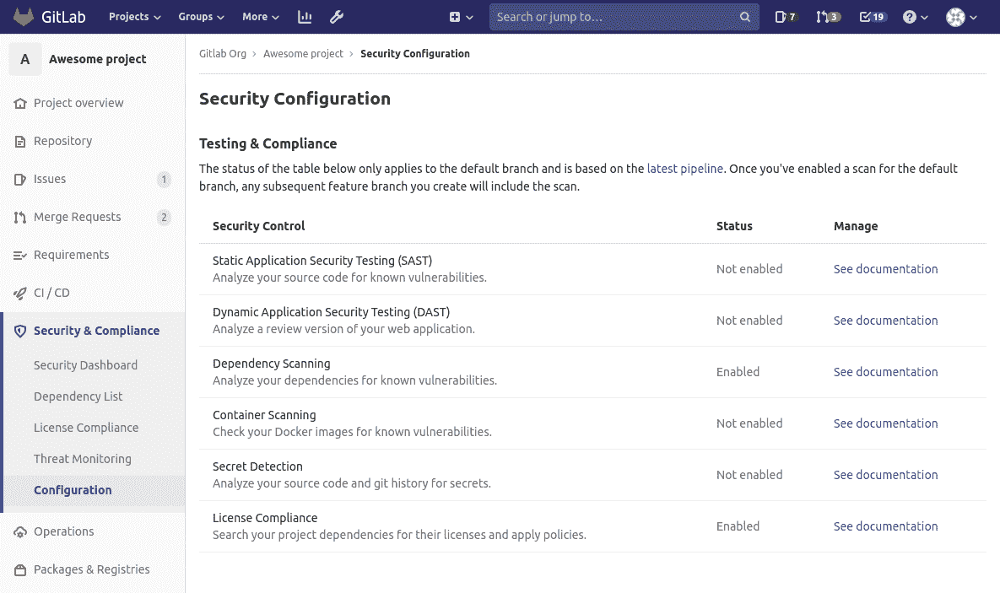

# Security Configuration

> 原文：[https://docs.gitlab.com/ee/user/application_security/configuration/](https://docs.gitlab.com/ee/user/application_security/configuration/)

*   [Overview](#overview)
*   [Limitations](#limitations)

# Security Configuration

[Introduced](https://gitlab.com/gitlab-org/gitlab/-/merge_requests/20711) in [GitLab Ultimate](https://about.gitlab.com/pricing/) 12.6.

## Overview

安全配置页面显示每个安全功能的配置状态，可以通过项目的侧边栏导航来访问.

该页面使用项目的最新默认分支[CI 管道](../../../ci/pipelines/index.html)来确定每个功能部件的配置状态. 如果管道中存在具有预期安全报告工件的作业，则认为该功能已配置.

**注意：**如果最新的管道使用了[Auto DevOps](../../../topics/autodevops/index.html) ，则默认情况下将配置所有安全功能.

## Limitations

尚无法使用配置页启用或禁用大多数功能. 但是，可以通过该页面上每个功能旁边的链接找到有关如何启用或禁用功能的说明.

如果项目没有现有的 CI 配置，则可以通过单击"管理"列下的"启用合并请求"按钮来启用 SAST 功能. 将来的工作会将其扩展到编辑*现有* CI 配置以及其他安全功能.