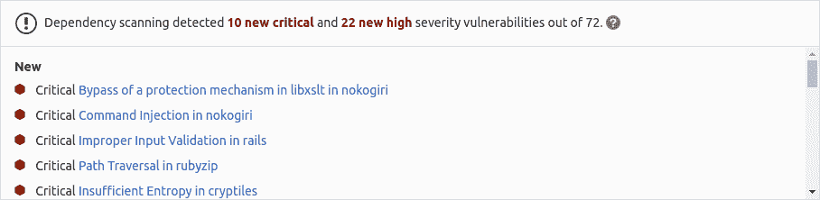

# Dependency Scanning

> 原文：[https://docs.gitlab.com/ee/user/application_security/dependency_scanning/](https://docs.gitlab.com/ee/user/application_security/dependency_scanning/)

*   [Overview](#overview)
*   [Requirements](#requirements)
*   [Supported languages and package managers](#supported-languages-and-package-managers)
*   [Contribute your scanner](#contribute-your-scanner)
*   [Configuration](#configuration)
    *   [Customizing the Dependency Scanning settings](#customizing-the-dependency-scanning-settings)
    *   [Overriding Dependency Scanning jobs](#overriding-dependency-scanning-jobs)
    *   [Available variables](#available-variables)
        *   [Configuring Dependency Scanning](#configuring-dependency-scanning)
        *   [Configuring Docker-in-Docker orchestrator](#configuring-docker-in-docker-orchestrator)
        *   [Configuring specific analyzers used by Dependency Scanning](#configuring-specific-analyzers-used-by-dependency-scanning)
    *   [Using private Maven repos](#using-private-maven-repos)
    *   [Enabling Docker-in-Docker](#enabling-docker-in-docker)
*   [Interacting with the vulnerabilities](#interacting-with-the-vulnerabilities)
*   [Solutions for vulnerabilities (auto-remediation)](#solutions-for-vulnerabilities-auto-remediation)
*   [Security Dashboard](#security-dashboard)
*   [Vulnerabilities database update](#vulnerabilities-database-update)
*   [Dependency List](#dependency-list)
*   [Reports JSON format](#reports-json-format)
*   [Versioning and release process](#versioning-and-release-process)
*   [Contributing to the vulnerability database](#contributing-to-the-vulnerability-database)
*   [Running Dependency Scanning in an offline environment](#running-dependency-scanning-in-an-offline-environment)
    *   [Requirements for offline Dependency Scanning](#requirements-for-offline-dependency-scanning)
    *   [Make GitLab Dependency Scanning analyzer images available inside your Docker registry](#make-gitlab-dependency-scanning-analyzer-images-available-inside-your-docker-registry)
    *   [Set Dependency Scanning CI job variables to use local Dependency Scanning analyzers](#set-dependency-scanning-ci-job-variables-to-use-local-dependency-scanning-analyzers)
    *   [Specific settings for languages and package managers](#specific-settings-for-languages-and-package-managers)
        *   [JavaScript (npm and yarn) projects](#javascript-npm-and-yarn-projects)
        *   [Ruby (gem) projects](#ruby-gem-projects)
        *   [Python (setuptools)](#python-setuptools)
*   [Limitations](#limitations)
    *   [Referencing local dependencies using a path in JavaScript projects](#referencing-local-dependencies-using-a-path-in-javascript-projects)
*   [Troubleshooting](#troubleshooting)
    *   [`Error response from daemon: error processing tar file: docker-tar: relocation error`](#error-response-from-daemon-error-processing-tar-file-docker-tar-relocation-error)

# Dependency Scanning[](#dependency-scanning-ultimate "Permalink")

[Introduced](https://gitlab.com/gitlab-org/gitlab/-/issues/5105) in [GitLab Ultimate](https://about.gitlab.com/pricing/) 10.7.

在开发和测试应用程序时，例如当应用程序使用已知的易受攻击的外部（开源）库时，"依赖关系扫描"有助于自动在依赖项中查找安全漏洞.

## Overview[](#overview "Permalink")

如果您使用的是[GitLab CI / CD](../../../ci/README.html) ，则可以使用"依赖关系扫描"来分析依赖关系中的已知漏洞. 扫描所有依赖项，包括传递性依赖项（也称为嵌套依赖项）. 您可以通过在现有`.gitlab-ci.yml`文件中[包括依赖扫描模板](#configuration) ，或通过隐式使用[Auto DevOps](../../../topics/autodevops/index.html)提供的[自动依赖扫描](../../../topics/autodevops/stages.html#auto-dependency-scanning-ultimate)来利用[依赖扫描](../../../topics/autodevops/stages.html#auto-dependency-scanning-ultimate) .

GitLab 检查"依赖性扫描"报告，比较发现的源分支和目标分支之间的漏洞，并显示有关合并请求的信息.

[](img/dependency_scanning_v13_2.png)

结果按漏洞的严重性排序：

1.  Critical
2.  High
3.  Medium
4.  Low
5.  Unknown
6.  其他一切

## Requirements[](#requirements "Permalink")

要运行依赖扫描作业，默认情况下，你需要 GitLab 亚军与[`docker`](https://docs.gitlab.com/runner/executors/docker.html)或[`kubernetes`](https://docs.gitlab.com/runner/install/kubernetes.html)执行. 如果您在 GitLab.com 上使用共享的 Runners，则默认启用该功能.

**注意：**如果使用自己的 Runners，请确保已安装的 Docker 版本**不是** `19.03.0` . 有关详细[信息](#error-response-from-daemon-error-processing-tar-file-docker-tar-relocation-error) ，请参见[故障排除信息](#error-response-from-daemon-error-processing-tar-file-docker-tar-relocation-error) .

从 GitLab 13.0 开始，仅当您已[启用 Docker-in-Docker 进行依赖项扫描](#enabling-docker-in-docker)时，才需要 Docker 特权模式.

## Supported languages and package managers[](#supported-languages-and-package-managers "Permalink")

GitLab 依赖于[`rules`](../../../ci/yaml/README.html#rules)来启动相关分析器，具体取决于存储库中检测到的语言. 当前的检测逻辑将最大搜索深度限制为两个级别. 例如，如果存储库包含`Gemfile`或`api/Gemfile`文件，则启用`gemnasium-dependency_scanning`作业，但如果唯一受支持的依赖性文件是`api/client/Gemfile` .

支持以下语言和依赖项管理器：

| 语言（程序包管理器） | 支援的档案 | 扫描工具 |
| --- | --- | --- |
| Java ([Gradle](https://s0gradle0org.icopy.site/), [Maven](https://maven.apache.org/)) | `build.gradle`, `build.gradle.kts`, `pom.xml` | [Gemnasium](https://gitlab.com/gitlab-org/security-products/gemnasium) |
| JavaScript（ [npm](https://s0www0npmjs0com.icopy.site/) ， [yarn](https://classic.yarnpkg.com/en/) ） | `package-lock.json`, `npm-shrinkwrap.json`, `yarn.lock` | [Gemnasium](https://gitlab.com/gitlab-org/security-products/gemnasium), [Retire.js](https://retirejs.github.io/retire.js/) |
| 去（ [Golang](https://s0golang0org.icopy.site/) ） | `go.sum` | [Gemnasium](https://gitlab.com/gitlab-org/security-products/gemnasium) |
| PHP（ [作曲家](https://s0getcomposer0org.icopy.site/) ） | `composer.lock` | [Gemnasium](https://gitlab.com/gitlab-org/security-products/gemnasium) |
| Python（ [setuptools](https://setuptools.readthedocs.io/en/latest/) ， [pip](https://pip.pypa.io/en/stable/) ， [Pipenv](https://pipenv.pypa.io/en/latest/) ） | `setup.py`, `requirements.txt`, `requirements.pip`, `requires.txt`, `Pipfile` | [Gemnasium](https://gitlab.com/gitlab-org/security-products/gemnasium) |
| 红宝石（ [Bundler](https://bundler.io/) ） | `Gemfile.lock`, `gems.locked` | [Gemnasium](https://gitlab.com/gitlab-org/security-products/gemnasium), [bundler-audit](https://github.com/rubysec/bundler-audit) |
| Scala（ [sbt](https://www.scala-sbt.org/) ） | `build.sbt` | [Gemnasium](https://gitlab.com/gitlab-org/security-products/gemnasium) |

正在制定支持以下语言，依赖性管理器和依赖性文件的计划. 有关详细信息，请参见每个的问题链接.

| 语言（程序包管理器） | 支援的档案 | 扫描工具 | Issue |
| --- | --- | --- | --- |
| Python（ [诗歌](https://python-poetry.org/) ） | `poetry.lock` | [Gemnasium](https://gitlab.com/gitlab-org/security-products/gemnasium) | [GitLab#7006](https://gitlab.com/gitlab-org/gitlab/-/issues/7006) |
| Python（ [Pipenv](https://pipenv.pypa.io/en/latest/) ） | `Pipfile.lock` | [Gemnasium](https://gitlab.com/gitlab-org/security-products/gemnasium) | [GitLab#11756](https://gitlab.com/gitlab-org/gitlab/-/issues/11756) |

## Contribute your scanner[](#contribute-your-scanner "Permalink")

[安全扫描程序集成](../../../development/integrations/secure.html)文档说明了如何将其他安全扫描[程序集成](../../../development/integrations/secure.html)到 GitLab 中.

## Configuration[](#configuration "Permalink")

To enable Dependency Scanning for GitLab 11.9 and later, you must [include](../../../ci/yaml/README.html#includetemplate) the [`Dependency-Scanning.gitlab-ci.yml` template](https://gitlab.com/gitlab-org/gitlab/blob/master/lib/gitlab/ci/templates/Security/Dependency-Scanning.gitlab-ci.yml) that’s provided as a part of your GitLab installation. For GitLab versions earlier than 11.9, you can copy and use the job as defined that template.

将以下内容添加到您的`.gitlab-ci.yml`文件中：

```
include:
  - template: Dependency-Scanning.gitlab-ci.yml 
```

随附的模板将在 CI / CD 管道中创建"依赖关系扫描"作业，并扫描项目的源代码以查找可能的漏洞. 结果将保存为" [依赖关系扫描"报告工件](../../../ci/pipelines/job_artifacts.html#artifactsreportsdependency_scanning-ultimate) ，您以后可以下载和分析该[工件](../../../ci/pipelines/job_artifacts.html#artifactsreportsdependency_scanning-ultimate) . 由于实施限制，我们始终采用最新的"依赖关系扫描"工件.

### Customizing the Dependency Scanning settings[](#customizing-the-dependency-scanning-settings "Permalink")

可以使用`.gitlab-ci.yml`的[`variables`](../../../ci/yaml/README.html#variables)参数通过[环境变量](#available-variables)来更改"依赖项扫描"设置. 例如：

```
include:
  - template: Dependency-Scanning.gitlab-ci.yml

variables:
  DS_PYTHON_VERSION: 2 
```

因为模板是[在](../../../ci/yaml/README.html#include)管道配置[之前评估](../../../ci/yaml/README.html#include)的，所以最后提到的变量将具有优先权.

### Overriding Dependency Scanning jobs[](#overriding-dependency-scanning-jobs "Permalink")

**弃用：**从 GitLab 13.0 开始，不再支持[`only`和`except`](../../../ci/yaml/README.html#onlyexcept-basic)的使用. 覆盖模板时，必须使用[`rules`](../../../ci/yaml/README.html#rules) .

要覆盖作业定义（例如，更改诸如`variables`或`dependencies`类的属性），请声明一个与要覆盖的作业同名的新作业. 将此新作业放置在包含模板之后，并在其下指定其他任何键. 例如，这将禁用`DS_REMEDIATE`为`gemnasium`分析器：

```
include:
  - template: Dependency-Scanning.gitlab-ci.yml

gemnasium-dependency_scanning:
  variables:
    DS_REMEDIATE: "false" 
```

### Available variables[](#available-variables "Permalink")

可以使用环境变量[配置](#customizing-the-dependency-scanning-settings)依赖性扫描.

#### Configuring Dependency Scanning[](#configuring-dependency-scanning "Permalink")

以下变量允许配置全局依赖项扫描设置.

| 环境变量 | Description |
| --- | --- |
| `SECURE_ANALYZERS_PREFIX` | 覆盖提供正式默认映像（代理）的 Docker 注册表名称. 阅读有关[自定义分析器的](analyzers.html)更多信息. |
| `DS_DEFAULT_ANALYZERS` | 覆盖正式默认图像的名称. 阅读有关[自定义分析器的](analyzers.html)更多信息. |
| `DS_DISABLE_DIND` | 禁用 Docker-in-Docker 并[单独](#enabling-docker-in-docker)运行分析器. 默认情况下，此变量为`true` . |
| `ADDITIONAL_CA_CERT_BUNDLE` | 捆绑的 CA 证书可信任. |
| `DS_EXCLUDED_PATHS` | 根据路径从输出中排除漏洞. 以逗号分隔的模式列表. 模式可以是全局变量，也可以是文件或文件夹路径（例如`doc,spec` ）. 父目录也匹配模式. 默认值： `"spec, test, tests, tmp"` |
| `SECURE_LOG_LEVEL` | 默认日志级别为`info` ，您可以将其设置为以下任意字符串： `fatal` ， `error` ， `warn` ， `info` ， `debug` . |

#### Configuring Docker-in-Docker orchestrator[](#configuring-docker-in-docker-orchestrator "Permalink")

以下变量配置 Docker-in-Docker 协调器，因此仅在[启用](#enabling-docker-in-docker) Docker-in-Docker 模式时才使用.

| 环境变量 | Default | Description |
| --- | --- | --- |
| `DS_ANALYZER_IMAGES` |   | 以逗号分隔的自定义图像列表. 官方默认图像仍处于启用状态. 阅读有关[自定义分析器的](analyzers.html)更多信息. |
| `DS_ANALYZER_IMAGE_TAG` |   | 覆盖官方默认映像的 Docker 标签. 阅读有关[自定义分析器的](analyzers.html)更多信息. |
| `DS_PULL_ANALYZER_IMAGES` |   | 从 Docker 注册表中提取映像（设置为`0`以禁用）. |
| `DS_DOCKER_CLIENT_NEGOTIATION_TIMEOUT` | 2m | Docker 客户端协商的时间限制. 使用 Go 的[`ParseDuration`](https://s0golang0org.icopy.site/pkg/time/)解析超时. 有效时间单位为`ns` ， `us` （或`µs` ）， `ms` ， `s` ， `m`或`h` . 例如`300ms` ， `1.5h`或`2h45m` . |
| `DS_PULL_ANALYZER_IMAGE_TIMEOUT` | 5m | 拉取分析仪图像的时间限制. 使用 Go 的[`ParseDuration`](https://s0golang0org.icopy.site/pkg/time/)解析超时. 有效时间单位为`ns` ， `us` （或`µs` ）， `ms` ， `s` ， `m`或`h` . 例如`300ms` ， `1.5h`或`2h45m` . |
| `DS_RUN_ANALYZER_TIMEOUT` | 20m | 运行分析仪的时间限制. 使用 Go 的[`ParseDuration`](https://s0golang0org.icopy.site/pkg/time/)解析超时. 有效时间单位为`ns` ， `us` （或`µs` ）， `ms` ， `s` ， `m`或`h` . 例如`300ms` ， `1.5h`或`2h45m` . |

#### Configuring specific analyzers used by Dependency Scanning[](#configuring-specific-analyzers-used-by-dependency-scanning "Permalink")

以下变量用于配置特定的分析器（用于特定的语言/框架）.

| Environment variable | Analyzer | Default | Description |
| --- | --- | --- | --- |
| `GEMNASIUM_DB_LOCAL_PATH` | `gemnasium` | `/gemnasium-db` | 本地 Gemnasium 数据库的路径. |
| `GEMNASIUM_DB_REMOTE_URL` | `gemnasium` | `https://gitlab.com/gitlab-org/security-products/gemnasium-db.git` | 用于获取 Gemnasium 数据库的存储库 URL. |
| `GEMNASIUM_DB_REF_NAME` | `gemnasium` | `master` | 远程存储库数据库的分支名称. 需要`GEMNASIUM_DB_REMOTE_URL` . |
| `DS_REMEDIATE` | `gemnasium` | `"true"` | 启用对弱势依赖项的自动修复. |
| `PIP_INDEX_URL` | `gemnasium-python` | `https://pypi.org/simple` | Python 软件包索引的基本 URL. |
| `PIP_EXTRA_INDEX_URL` | `gemnasium-python` |   | 除`PIP_INDEX_URL`之外， `PIP_INDEX_URL`使用包索引的其他[URL](https://pip.pypa.io/en/stable/reference/pip_install/#cmdoption-extra-index-url)数组. 以逗号分隔. |
| `PIP_REQUIREMENTS_FILE` | `gemnasium-python` |   | 要扫描的点子要求文件. |
| `DS_PIP_VERSION` | `gemnasium-python` |   | 强制安装特定的 pip 版本（例如： `"19.3"` ），否则将使用 Docker 映像中安装的 pip. （在 GitLab 12.7 中[引入](https://gitlab.com/gitlab-org/gitlab/-/issues/12811) ） |
| `DS_PIP_DEPENDENCY_PATH` | `gemnasium-python` |   | 从中加载 Python pip 依赖项的路径. （在 GitLab 12.2 中[引入](https://gitlab.com/gitlab-org/gitlab/-/issues/12412) ） |
| `DS_PYTHON_VERSION` | `retire.js` |   | Python 版本. 如果设置为 2，则将使用 Python 2.7 而非 Python 3.6 安装依赖项. （在 GitLab 12.1 中[引入](https://gitlab.com/gitlab-org/gitlab/-/issues/12296) ） |
| `DS_JAVA_VERSION` | `gemnasium-maven` | `11` | Java 版本. 可用版本： `8` ， `11` ， `13` ， `14` . Maven 和 Gradle 将使用此值指定的 Java 版本. |
| `MAVEN_CLI_OPTS` | `gemnasium-maven` | `"-DskipTests --batch-mode"` | 分析器将传递给`maven`的命令行参数列表. 请参阅[使用私有存储库](../index.html#using-private-maven-repos)的示例. |
| `GRADLE_CLI_OPTS` | `gemnasium-maven` |   | 分析器将传递给`gradle`的命令行参数列表. |
| `SBT_CLI_OPTS` | `gemnasium-maven` |   | 分析器将传递给`sbt`的命令行参数列表. |
| `BUNDLER_AUDIT_UPDATE_DISABLED` | `bundler-audit` | `"false"` | 禁用`bundler-audit`分析器的自动更新. 如果您在脱机的空白环境中运行"依赖性扫描"，则很有用. |
| `BUNDLER_AUDIT_ADVISORY_DB_URL` | `bundler-audit` | `https://github.com/rubysec/ruby-advisory-db` | bundler-audit 使用的咨询数据库的 URL. |
| `BUNDLER_AUDIT_ADVISORY_DB_REF_NAME` | `bundler-audit` | `master` | `BUNDLER_AUDIT_ADVISORY_DB_URL`指定的咨询数据库的 Git ref. |
| `RETIREJS_JS_ADVISORY_DB` | `retire.js` | `https://raw.githubusercontent.com/RetireJS/retire.js/master/repository/jsrepository.json` | `retire.js` JS 漏洞数据文件的路径或 URL. 请注意，如果托管数据文件的 URL 使用自定义 SSL 证书（例如在脱机安装中），则可以在`ADDITIONAL_CA_CERT_BUNDLE`环境变量中传递证书. |
| `RETIREJS_NODE_ADVISORY_DB` | `retire.js` | `https://raw.githubusercontent.com/RetireJS/retire.js/master/repository/npmrepository.json` | `retire.js`节点漏洞数据文件的路径或 URL. 请注意，如果托管数据文件的 URL 使用自定义 SSL 证书（例如在脱机安装中），则可以在`ADDITIONAL_CA_CERT_BUNDLE`环境变量中传递证书. |
| `RETIREJS_ADVISORY_DB_INSECURE` | `retire.js` | `false` | 启用使用不安全或自签名 SSL（TLS）证书从主机获取远程 JS 和 Node 漏洞数据文件（由`RETIREJS_JS_ADVISORY_DB`和`RETIREJS_NODE_ADVISORY_DB`变量定义）的功能. |

### Using private Maven repos[](#using-private-maven-repos "Permalink")

如果您的私有 Maven 存储库需要登录凭据，则可以使用`MAVEN_CLI_OPTS`环境变量.

阅读有关[如何使用私有 Maven 存储库的](../index.html#using-private-maven-repos)更多[信息](../index.html#using-private-maven-repos) .

### Enabling Docker-in-Docker[](#enabling-docker-in-docker "Permalink")

在 GitLab Ultimate 12.5 中[引入](https://gitlab.com/gitlab-org/gitlab/-/issues/12487) .

如果需要，可以启用 Docker-in-Docker 来还原 GitLab 13.0 之前存在的 Dependency Scanning 行为. 请按照以下步骤操作：

1.  在[特权模式下](https://docs.gitlab.com/runner/executors/docker.html)使用 Docker-in-Docker 配置 GitLab Runner.
2.  Set the `DS_DISABLE_DIND` variable to `false`:

    ```
    include:
      - template: Dependency-Scanning.gitlab-ci.yml

    variables:
      DS_DISABLE_DIND: "false" 
    ```

这将在您的 CI / CD 管道中创建一个`dependency_scanning`作业，而不是多个`<analyzer-name>-dependency_scanning`作业.

## Interacting with the vulnerabilities[](#interacting-with-the-vulnerabilities "Permalink")

一旦发现漏洞，便可以与其进行交互. 阅读有关如何[与漏洞](../index.html#interacting-with-the-vulnerabilities)进行[交互的](../index.html#interacting-with-the-vulnerabilities)更多信息.

## Solutions for vulnerabilities (auto-remediation)[](#solutions-for-vulnerabilities-auto-remediation "Permalink")

可以通过应用 GitLab 自动生成的解决方案来修复某些漏洞. 阅读有关[漏洞解决方案的](../index.html#solutions-for-vulnerabilities-auto-remediation)更多信息.

## Security Dashboard[](#security-dashboard "Permalink")

在"安全仪表板"中，您可以概览您的组，项目和管道中的所有安全漏洞. 阅读有关[安全仪表板的](../security_dashboard/index.html)更多[信息](../security_dashboard/index.html) .

## Vulnerabilities database update[](#vulnerabilities-database-update "Permalink")

有关漏洞数据库更新的更多信息，请查看[维护表](../index.html#maintenance-and-update-of-the-vulnerabilities-database) .

## Dependency List[](#dependency-list "Permalink")

依赖项扫描的另一个好处是能够查看项目的依赖项及其已知漏洞. 阅读有关[依赖列表的](../dependency_list/index.html)更多信息.

## Reports JSON format[](#reports-json-format "Permalink")

依赖关系扫描工具将发出 JSON 报告文件. 有关更多信息，请参见此[报告](https://gitlab.com/gitlab-org/security-products/security-report-schemas/-/blob/master/dist/dependency-scanning-report-format.json)的[架构](https://gitlab.com/gitlab-org/security-products/security-report-schemas/-/blob/master/dist/dependency-scanning-report-format.json) .

这是一个示例依赖性扫描报告：

```
{  "version":  "2.0",  "vulnerabilities":  [  {  "id":  "51e83874-0ff6-4677-a4c5-249060554eae",  "category":  "dependency_scanning",  "name":  "Regular Expression Denial of Service",  "message":  "Regular Expression Denial of Service in debug",  "description":  "The debug module is vulnerable to regular expression denial of service when untrusted user input is passed into the `o` formatter. It takes around 50k characters to block for 2 seconds making this a low severity issue.",  "severity":  "Unknown",  "solution":  "Upgrade to latest versions.",  "scanner":  {  "id":  "gemnasium",  "name":  "Gemnasium"  },  "location":  {  "file":  "yarn.lock",  "dependency":  {  "package":  {  "name":  "debug"  },  "version":  "1.0.5"  }  },  "identifiers":  [  {  "type":  "gemnasium",  "name":  "Gemnasium-37283ed4-0380-40d7-ada7-2d994afcc62a",  "value":  "37283ed4-0380-40d7-ada7-2d994afcc62a",  "url":  "https://deps.sec.gitlab.com/packages/npm/debug/versions/1.0.5/advisories"  }  ],  "links":  [  {  "url":  "https://nodesecurity.io/advisories/534"  },  {  "url":  "https://github.com/visionmedia/debug/issues/501"  },  {  "url":  "https://github.com/visionmedia/debug/pull/504"  }  ]  },  {  "id":  "5d681b13-e8fa-4668-957e-8d88f932ddc7",  "category":  "dependency_scanning",  "name":  "Authentication bypass via incorrect DOM traversal and canonicalization",  "message":  "Authentication bypass via incorrect DOM traversal and canonicalization in saml2-js",  "description":  "Some XML DOM traversal and canonicalization APIs may be inconsistent in handling of comments within XML nodes. Incorrect use of these APIs by some SAML libraries results in incorrect parsing of the inner text of XML nodes such that any inner text after the comment is lost prior to cryptographically signing the SAML message. Text after the comment therefore has no impact on the signature on the SAML message.\r\n\r\nA remote attacker can modify SAML content for a SAML service provider without invalidating the cryptographic signature, which may allow attackers to bypass primary authentication for the affected SAML service provider.",  "severity":  "Unknown",  "solution":  "Upgrade to fixed version.\r\n",  "scanner":  {  "id":  "gemnasium",  "name":  "Gemnasium"  },  "location":  {  "file":  "yarn.lock",  "dependency":  {  "package":  {  "name":  "saml2-js"  },  "version":  "1.5.0"  }  },  "identifiers":  [  {  "type":  "gemnasium",  "name":  "Gemnasium-9952e574-7b5b-46fa-a270-aeb694198a98",  "value":  "9952e574-7b5b-46fa-a270-aeb694198a98",  "url":  "https://deps.sec.gitlab.com/packages/npm/saml2-js/versions/1.5.0/advisories"  },  {  "type":  "cve",  "name":  "CVE-2017-11429",  "value":  "CVE-2017-11429",  "url":  "https://cve.mitre.org/cgi-bin/cvename.cgi?name=CVE-2017-11429"  }  ],  "links":  [  {  "url":  "https://github.com/Clever/saml2/commit/3546cb61fd541f219abda364c5b919633609ef3d#diff-af730f9f738de1c9ad87596df3f6de84R279"  },  {  "url":  "https://github.com/Clever/saml2/issues/127"  },  {  "url":  "https://www.kb.cert.org/vuls/id/475445"  }  ]  }  ],  "remediations":  [  {  "fixes":  [  {  "id":  "5d681b13-e8fa-4668-957e-8d88f932ddc7",  }  ],  "summary":  "Upgrade saml2-js",  "diff":  "ZGlmZiAtLWdpdCBhL...OR0d1ZUc2THh3UT09Cg=="  // some content is omitted for brevity  }  ]  } 
```

## Versioning and release process[](#versioning-and-release-process "Permalink")

请检查[发布过程文档](https://gitlab.com/gitlab-org/security-products/release/blob/master/docs/release_process.md) .

## Contributing to the vulnerability database[](#contributing-to-the-vulnerability-database "Permalink")

您可以搜索[gemnasium-db](https://gitlab.com/gitlab-org/security-products/gemnasium-db)项目，以在 Gemnasium 数据库中找到漏洞. 您还可以[提交新漏洞](https://gitlab.com/gitlab-org/security-products/gemnasium-db/blob/master/CONTRIBUTING.md) .

## Running Dependency Scanning in an offline environment[](#running-dependency-scanning-in-an-offline-environment "Permalink")

对于在通过 Internet 限制，限制或间歇性访问外部资源的环境中进行自我管理的 GitLab 实例，需要进行一些调整才能使"依赖关系扫描"作业成功运行. 有关更多信息，请参阅[脱机环境](../offline_deployments/index.html) .

### Requirements for offline Dependency Scanning[](#requirements-for-offline-dependency-scanning "Permalink")

以下是在脱机环境中使用依赖关系扫描的要求：

*   Keep Docker-In-Docker disabled (default).
*   GitLab 亚军与[`docker`或`kubernetes`执行](#requirements) .
*   Docker 容器注册表以及 Dependency Scanning [分析器](https://gitlab.com/gitlab-org/security-products/analyzers)映像的本地可用副本.
*   托管[gemnasium-db 咨询数据库](https://gitlab.com/gitlab-org/security-products/gemnasium-db/)的脱机 Git 副本
*   *仅在扫描 Ruby 项目时* ：托管[咨询数据库](https://github.com/rubysec/ruby-advisory-db)的脱机 Git 副本.
*   *仅在扫描 npm / yarn 项目时* ：托管[retire.js](https://github.com/RetireJS/retire.js/) [节点](https://github.com/RetireJS/retire.js/blob/master/repository/npmrepository.json)和[js](https://github.com/RetireJS/retire.js/blob/master/repository/jsrepository.json)咨询数据库的脱机副本.

**注意：** GitLab Runner 的[默认`pull policy`为`always`](https://docs.gitlab.com/runner/executors/docker.html) ，这意味着即使本地副本可用，Runner 也会尝试从 GitLab 容器注册表中拉取 Docker 映像. 如果您只喜欢使用本地可用的 Docker 映像，则可以在离线环境[`pull_policy`](https://docs.gitlab.com/runner/executors/docker.html) GitLab Runner 的[`pull_policy`设置为`if-not-present`](https://docs.gitlab.com/runner/executors/docker.html) . 但是，如果不在离线环境中，我们建议将拉取策略设置保持为`always` ，因为这样可以在 CI / CD 管道中使用更新的扫描仪.

### Make GitLab Dependency Scanning analyzer images available inside your Docker registry[](#make-gitlab-dependency-scanning-analyzer-images-available-inside-your-docker-registry "Permalink")

对于具有所有[受支持的语言和框架的](#supported-languages-and-package-managers)依赖关系扫描，请将以下默认的依赖关系扫描分析器映像从`registry.gitlab.com`导入[本地 Docker 容器注册表](../../packages/container_registry/index.html) ：

```
registry.gitlab.com/gitlab-org/security-products/analyzers/gemnasium:2
registry.gitlab.com/gitlab-org/security-products/analyzers/gemnasium-maven:2
registry.gitlab.com/gitlab-org/security-products/analyzers/gemnasium-python:2
registry.gitlab.com/gitlab-org/security-products/analyzers/retire.js:2
registry.gitlab.com/gitlab-org/security-products/analyzers/bundler-audit:2 
```

将 Docker 映像导入本地脱机 Docker 注册表的过程取决于**您的网络安全策略** . 请咨询您的 IT 员工，以找到可以导入或临时访问外部资源的已接受和批准的流程. 请注意，这些扫描程序会[定期](../index.html#maintenance-and-update-of-the-vulnerabilities-database)使用新定义进行[更新](../index.html#maintenance-and-update-of-the-vulnerabilities-database) ，因此请考虑是否可以自己进行定期更新.

有关将 Docker 映像保存和传输为文件的详细信息，请参阅 Docker 有关[`docker save`](https://s0docs0docker0com.icopy.site/engine/reference/commandline/save/) ， [`docker load`](https://s0docs0docker0com.icopy.site/engine/reference/commandline/load/) ， [`docker export`](https://s0docs0docker0com.icopy.site/engine/reference/commandline/export/)和[`docker import`](https://s0docs0docker0com.icopy.site/engine/reference/commandline/import/)的文档.

### Set Dependency Scanning CI job variables to use local Dependency Scanning analyzers[](#set-dependency-scanning-ci-job-variables-to-use-local-dependency-scanning-analyzers "Permalink")

将以下配置添加到您的`.gitlab-ci.yml`文件. 您必须替换`SECURE_ANALYZERS_PREFIX`才能引用本地 Docker 容器注册表：

```
include:
  - template: Dependency-Scanning.gitlab-ci.yml

variables:
  SECURE_ANALYZERS_PREFIX: "docker-registry.example.com/analyzers"
  GEMNASIUM_DB_REMOTE_URL: "gitlab.example.com/gemnasium-db.git"
  GIT_SSL_NO_VERIFY: "true" 
```

请参阅[配置部分中](#configuration)以上变量的说明.

### Specific settings for languages and package managers[](#specific-settings-for-languages-and-package-managers "Permalink")

请参阅以下各节，以配置特定的语言和程序包管理器.

#### JavaScript (npm and yarn) projects[](#javascript-npm-and-yarn-projects "Permalink")

将以下内容添加到`.gitlab-ci.yml`的变量部分：

```
RETIREJS_JS_ADVISORY_DB: "example.com/jsrepository.json"
RETIREJS_NODE_ADVISORY_DB: "example.com/npmrepository.json" 
```

#### Ruby (gem) projects[](#ruby-gem-projects "Permalink")

将以下内容添加到`.gitlab-ci.yml`的变量部分：

```
BUNDLER_AUDIT_ADVISORY_DB_REF_NAME: "master"
BUNDLER_AUDIT_ADVISORY_DB_URL: "gitlab.example.com/ruby-advisory-db.git" 
```

#### Python (setuptools)[](#python-setuptools "Permalink")

当为私有 PyPi 存储库使用自签名证书时，不需要额外的作业配置（除了上面的模板`.gitlab-ci.yml` ）. 但是，您必须更新`setup.py`以确保它可以到达您的私有存储库. 这是一个示例配置：

1.  更新`setup.py` ，以为`install_requires`列表中的每个依赖项创建一个指向您的私有存储库的`dependency_links`属性：

    ```
    install_requires=['pyparsing>=2.0.3'],
    dependency_links=['https://pypi.example.com/simple/pyparsing'], 
    ```

2.  从存储库 URL 中获取证书并将其添加到项目中：

    ```
    echo -n | openssl s_client -connect pypi.example.com:443 | sed -ne '/-BEGIN CERTIFICATE-/,/-END CERTIFICATE-/p' > internal.crt 
    ```

3.  将`setup.py`指向新下载的证书：

    ```
    import setuptools.ssl_support
    setuptools.ssl_support.cert_paths = ['internal.crt'] 
    ```

## Limitations[](#limitations "Permalink")

### Referencing local dependencies using a path in JavaScript projects[](#referencing-local-dependencies-using-a-path-in-javascript-projects "Permalink")

[Retire.js](https://gitlab.com/gitlab-org/security-products/analyzers/retire.js)分析器不支持使用 JavaScript 项目的`package.json`的[本地路径](https://s0docs0npmjs0com.icopy.site/files/package.json)进行的依赖项引用. 依赖项扫描针对此类引用输出以下错误：

```
ERROR: Could not find dependencies: <dependency-name>. You may need to run npm install 
```

解决方法是，从[DS_DEFAULT_ANALYZERS](#configuring-dependency-scanning)删除[`retire.js`](analyzers.html#selecting-specific-analyzers)分析器.

## Troubleshooting[](#troubleshooting "Permalink")

### `Error response from daemon: error processing tar file: docker-tar: relocation error`[](#error-response-from-daemon-error-processing-tar-file-docker-tar-relocation-error "Permalink")

当运行 Dependency Scanning 作业的 Docker 版本为`19.03.00`时，会发生此错误. 考虑更新到 Docker `19.03.1`或更高版本. 旧版本不受影响. 阅读[本期的](https://gitlab.com/gitlab-org/gitlab/-/issues/13830#note_211354992 "当前的 SAST 容器失败")更多内容.