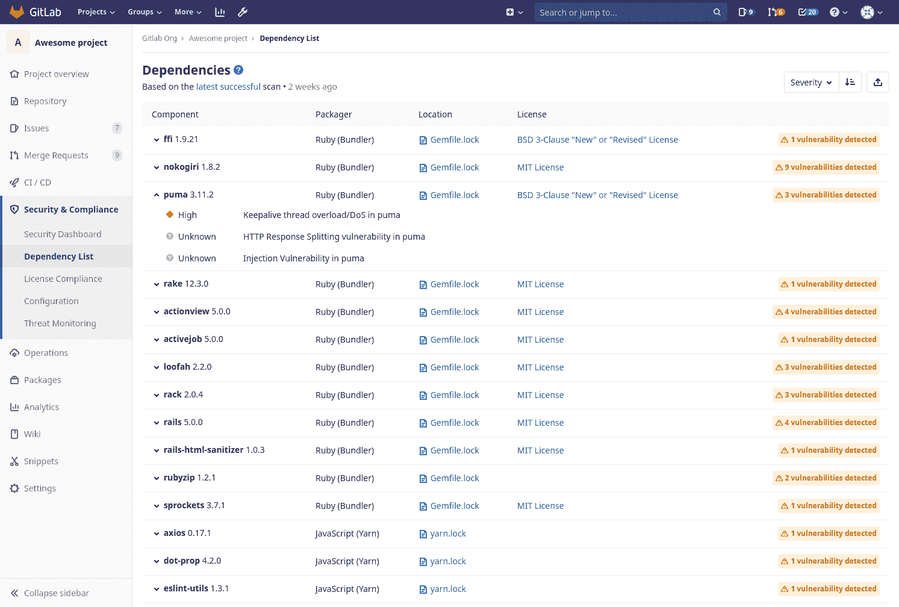

# Dependency List

> 原文：[https://docs.gitlab.com/ee/user/application_security/dependency_list/](https://docs.gitlab.com/ee/user/application_security/dependency_list/)

*   [Requirements](#requirements)
*   [Viewing dependencies](#viewing-dependencies)
    *   [Vulnerabilities](#vulnerabilities)
*   [Licenses](#licenses)
*   [Downloading the Dependency List](#downloading-the-dependency-list)

# Dependency List

[Introduced](https://gitlab.com/gitlab-org/gitlab/-/issues/10075) in [GitLab Ultimate](https://about.gitlab.com/pricing/) 12.0.

"依赖关系"列表使您可以查看项目的依赖关系以及有关它们的关键详细信息，包括已知漏洞. 要查看它，请导航至项目侧栏中的" **安全性和合规性">"依赖项列表"** . 该信息有时被称为软件物料清单或 SBoM / BOM.

## Requirements

1.  必须为您的项目配置" [依赖项扫描](../dependency_scanning/index.html) CI"作业.
2.  您的项目至少使用 Gemnasium 支持的一种[语言和包管理器](../dependency_scanning/index.html#supported-languages-and-package-managers) .

## Viewing dependencies

依存关系显示以下信息：

| Field | Description |
| --- | --- |
| Component | 依赖项的名称和版本 |
| Packager | 打包程序用于安装依赖项 |
| Location | 指向项目中特定于包装程序的锁定文件的链接，该文件声明了依赖性 |
| License | 链接到依赖项的软件许可证 |

最初显示的依赖项是按其已知漏洞的严重性（如果有）进行排序的. 也可以按名称或安装它们的打包程序对它们进行排序.

### Vulnerabilities

如果依赖项具有已知漏洞，则可以通过单击依赖项名称旁边的箭头或指示存在多少已知漏洞的标志来查看它们. 对于每个漏洞，其严重性和描述将显示在其下方.

## Licenses

在 GitLab Ultimate 12.3 中[引入](https://gitlab.com/gitlab-org/gitlab/-/issues/10536) .

如果配置了" [许可证合规性](../../compliance/license_compliance/index.html) CI"作业，则[发现的许可证](../../compliance/license_compliance/index.html#supported-languages-and-package-managers)将显示在此页面上.

## Downloading the Dependency List

您可以通过单击下载按钮以`JSON`格式下载项目的依赖关系及其详细信息的完整列表.