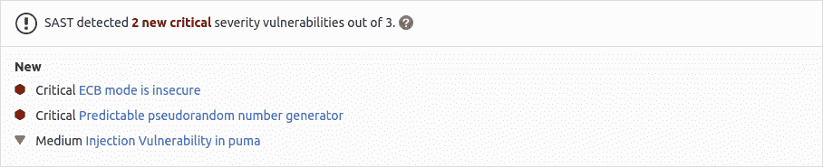

# Static Application Security Testing (SAST)

> 原文：[https://docs.gitlab.com/ee/user/application_security/sast/](https://docs.gitlab.com/ee/user/application_security/sast/)

*   [Overview](#overview)
*   [Use cases](#use-cases)
*   [Requirements](#requirements)
*   [Supported languages and frameworks](#supported-languages-and-frameworks)
    *   [Making SAST analyzers available to all GitLab tiers](#making-sast-analyzers-available-to-all-gitlab-tiers)
        *   [Summary of features per tier](#summary-of-features-per-tier)
*   [Contribute your scanner](#contribute-your-scanner)
*   [Configuration](#configuration)
    *   [Customizing the SAST settings](#customizing-the-sast-settings)
    *   [Overriding SAST jobs](#overriding-sast-jobs)
    *   [Using environment variables to pass credentials for private repositories](#using-environment-variables-to-pass-credentials-for-private-repositories)
        *   [Using a variable to pass username and password to a private Maven repository](#using-a-variable-to-pass-username-and-password-to-a-private-maven-repository)
    *   [Enabling Docker-in-Docker](#enabling-docker-in-docker)
        *   [Enabling Kubesec analyzer](#enabling-kubesec-analyzer)
        *   [Pre-compilation](#pre-compilation)
    *   [Available variables](#available-variables)
        *   [Logging Level](#logging-level)
        *   [Custom Certificate Authority](#custom-certificate-authority)
        *   [Docker images](#docker-images)
        *   [Vulnerability filters](#vulnerability-filters)
        *   [Docker-in-Docker orchestrator](#docker-in-docker-orchestrator)
        *   [Analyzer settings](#analyzer-settings)
        *   [Custom environment variables](#custom-environment-variables)
*   [Reports JSON format](#reports-json-format)
*   [Secret detection](#secret-detection)
*   [Security Dashboard](#security-dashboard)
*   [Interacting with the vulnerabilities](#interacting-with-the-vulnerabilities)
*   [Vulnerabilities database](#vulnerabilities-database)
    *   [Vulnerabilities database update](#vulnerabilities-database-update)
*   [Running SAST in an offline environment](#running-sast-in-an-offline-environment)
    *   [Requirements for offline SAST](#requirements-for-offline-sast)
    *   [Make GitLab SAST analyzer images available inside your Docker registry](#make-gitlab-sast-analyzer-images-available-inside-your-docker-registry)
    *   [Set SAST CI job variables to use local SAST analyzers](#set-sast-ci-job-variables-to-use-local-sast-analyzers)
*   [Troubleshooting](#troubleshooting)
    *   [`Error response from daemon: error processing tar file: docker-tar: relocation error`](#error-response-from-daemon-error-processing-tar-file-docker-tar-relocation-error)

# Static Application Security Testing (SAST)[](#static-application-security-testing-sast-ultimate "Permalink")

[Introduced](https://gitlab.com/gitlab-org/gitlab/-/issues/3775) in [GitLab Ultimate](https://about.gitlab.com/pricing/) 10.3.

**注意：**白皮书["应用程序安全性发生](https://about.gitlab.com/resources/whitepaper-seismic-shift-application-security/)了[地震变化"](https://about.gitlab.com/resources/whitepaper-seismic-shift-application-security/)说明**了前 6 种攻击中有 4 种是基于应用程序的** . 下载它以了解如何保护您的组织.

## Overview[](#overview "Permalink")

如果您使用的是[GitLab CI / CD](../../../ci/README.html) ，则可以使用静态应用程序安全性测试（SAST）分析源代码中的已知漏洞.

您可以通过执行以下任一操作来利用 SAST：

*   在现有的`.gitlab-ci.yml`文件中[包括 SAST 模板](#configuration) .
*   隐式使用[Auto DevOps](../../../topics/autodevops/stages.html#auto-sast-ultimate)提供的[Auto](../../../topics/autodevops/index.html) [SAST](../../../topics/autodevops/stages.html#auto-sast-ultimate) .

GitLab 检查 SAST 报告，比较发现的源分支和目标分支之间的漏洞，并在合并请求中显示信息.

[](img/sast_v13_2.png)

结果按漏洞的优先级排序：

1.  Critical
2.  High
3.  Medium
4.  Low
5.  Unknown
6.  其他一切

**注意：**管道包含多个作业，包括 SAST 和 DAST 扫描. 如果任何作业由于任何原因未能完成，则安全信息中心将不会显示 SAST 扫描仪输出. 例如，如果 SAST 作业完成但 DAST 作业失败，则安全性仪表板将不会显示 SAST 结果. 分析器将在失败时输出[退出代码](../../../development/integrations/secure.html#exit-code) .

## Use cases[](#use-cases "Permalink")

*   您的代码在类中具有潜在的危险属性，或者不安全的代码可能导致意外的代码执行.
*   您的应用程序容易受到跨站点脚本（XSS）攻击的攻击，这些攻击可用于未经授权访问会话数据.

## Requirements[](#requirements "Permalink")

要运行 SAST 工作，默认情况下，你需要 GitLab 亚军与[`docker`](https://docs.gitlab.com/runner/executors/docker.html)或[`kubernetes`](https://docs.gitlab.com/runner/install/kubernetes.html)执行. 如果您在 GitLab.com 上使用共享的 Runners，则默认启用该功能.

从 GitLab 13.0 开始，仅当您已[为 SAST 启用 Docker-in-Docker 时，才](#enabling-docker-in-docker)需要 Docker 特权模式.

**警告：**目前，我们的 SAST 作业需要 Linux 容器类型. Windows 容器尚不支持.**注意：**如果使用自己的 Runners，请确保安装的 Docker 版本**不是** `19.03.0` . 有关详细[信息](#error-response-from-daemon-error-processing-tar-file-docker-tar-relocation-error) ，请参见[故障排除信息](#error-response-from-daemon-error-processing-tar-file-docker-tar-relocation-error) .

## Supported languages and frameworks[](#supported-languages-and-frameworks "Permalink")

下表显示了支持的语言，程序包管理器和框架以及使用了哪些工具.

| 语言（包管理器）/框架 | 扫描工具 | 在 GitLab 版本中引入 |
| --- | --- | --- |
| .NET Core | [Security Code Scan](https://security-code-scan.github.io) | 11.0 |
| .NET Framework | [Security Code Scan](https://security-code-scan.github.io) | 13.0 |
| Any | [Gitleaks](https://github.com/zricethezav/gitleaks) and [TruffleHog](https://github.com/dxa4481/truffleHog) | 11.9 |
| Apex（Salesforce） | [PMD](https://pmd.github.io/pmd/index.html) | 12.1 |
| C/C++ | [Flawfinder](https://github.com/david-a-wheeler/flawfinder) | 10.7 |
| 长生不老药（凤凰城） | [Sobelow](https://github.com/nccgroup/sobelow) | 11.10 |
| Go | [Gosec](https://github.com/securego/gosec) | 10.7 |
| Groovy（ [Ant](https://ant.apache.org/) ， [Gradle](https://s0gradle0org.icopy.site/) ， [Maven](https://maven.apache.org/)和[SBT](https://www.scala-sbt.org/) ） | 带有[find-sec-bugs](https://find-sec-bugs.github.io/)插件的[SpotBugs](https://spotbugs.github.io/) | 11.3（Gradle）和 11.9（Ant，Maven，SBT） |
| 头盔图 | [Kubesec](https://github.com/controlplaneio/kubesec) | 13.1 |
| Java（ [Ant](https://ant.apache.org/) ， [Gradle](https://s0gradle0org.icopy.site/) ， [Maven](https://maven.apache.org/)和[SBT](https://www.scala-sbt.org/) ） | 带有[find-sec-bugs](https://find-sec-bugs.github.io/)插件的[SpotBugs](https://spotbugs.github.io/) | 10.6（Maven），10.8（Grade）和 11.9（Ant，SBT） |
| JavaScript | [ESLint security plugin](https://github.com/nodesecurity/eslint-plugin-security) | 11.8，在 13.2 中移至[GitLab Core](https://about.gitlab.com/pricing/) |
| 州长宣言 | [Kubesec](https://github.com/controlplaneio/kubesec) | 12.6 |
| Node.js | [NodeJsScan](https://github.com/ajinabraham/NodeJsScan) | 11.1 |
| PHP | [phpcs-security-audit](https://github.com/FloeDesignTechnologies/phpcs-security-audit) | 10.8 |
| Python（ [点子](https://pip.pypa.io/en/stable/) ） | [bandit](https://github.com/PyCQA/bandit) | 10.3 |
| React | [ESLint react plugin](https://github.com/yannickcr/eslint-plugin-react) | 12.5 |
| Ruby on Rails | [brakeman](https://brakemanscanner.org) | 10.3，于 13.1 中移至[GitLab Core](https://about.gitlab.com/pricing/) |
| Scala（ [Ant](https://ant.apache.org/) ， [Gradle](https://s0gradle0org.icopy.site/) ， [Maven](https://maven.apache.org/)和[SBT](https://www.scala-sbt.org/) ） | 带有[find-sec-bugs](https://find-sec-bugs.github.io/)插件的[SpotBugs](https://spotbugs.github.io/) | 11.0（SBT）和 11.9（Ant，Gradle，Maven） |
| TypeScript | [ESLint security plugin](https://github.com/nodesecurity/eslint-plugin-security) | 11.9，在 13.2 中与 ESLint 合并 |

**注意：** Java 分析器还可以用于[Gradle 包装器](https://s0docs0gradle0org.icopy.site/current/userguide/gradle_wrapper.html) ， [Grails](https://grails.org/)和[Maven 包装器](https://github.com/takari/maven-wrapper)等变体.

### Making SAST analyzers available to all GitLab tiers[](#making-sast-analyzers-available-to-all-gitlab-tiers "Permalink")

所有开放源代码（OSS）分析器都正在接受审核，并有可能移至 GitLab 核心层. 可以在相应的[史诗中](https://gitlab.com/groups/gitlab-org/-/epics/2098)跟踪进度.

请注意，对[Docker-in-Docker 的](#enabling-docker-in-docker)支持不会扩展到 GitLab 核心层.

#### Summary of features per tier[](#summary-of-features-per-tier "Permalink")

下表列出了在不同的[GitLab 层](https://about.gitlab.com/pricing/)中可用的不同功能：

| Capability | 在核心 | 终极 |
| --- | --- | --- |
| [Configure SAST Scanners](#configuration) |  |  |
| [Customize SAST Settings](#customizing-the-sast-settings) |  |  |
| View [JSON Report](#reports-json-format) |  |  |
| [Presentation of JSON Report in Merge Request](#overview) |  |  |
| [Interaction with Vulnerabilities](#interacting-with-the-vulnerabilities) |  |  |
| [Access to Security Dashboard](#security-dashboard) |  |  |

## Contribute your scanner[](#contribute-your-scanner "Permalink")

[安全扫描程序集成](../../../development/integrations/secure.html)文档说明了如何将其他安全扫描[程序集成](../../../development/integrations/secure.html)到 GitLab 中.

## Configuration[](#configuration "Permalink")

**注意：**如果您使用的是[Auto DevOps](../../../topics/autodevops/index.html)提供的[Auto](../../../topics/autodevops/index.html) [SAST，则不必](../../../topics/autodevops/stages.html#auto-sast-ultimate)按照本节中的说明手动配置 SAST.

对于 GitLab 11.9 和更高版本，要启用 SAST，您必须[包括](../../../ci/yaml/README.html#includetemplate)作为 GitLab 安装的一部分提供的[`SAST.gitlab-ci.yml`模板](https://gitlab.com/gitlab-org/gitlab/blob/master/lib/gitlab/ci/templates/Security/SAST.gitlab-ci.yml) . 对于 11.9 之前的 GitLab 版本，您可以复制和使用该模板中定义的作业.

将以下内容添加到您的`.gitlab-ci.yml`文件中：

```
include:
  - template: SAST.gitlab-ci.yml 
```

随附的模板将在 CI / CD 管道中创建 SAST 作业，并扫描项目的源代码以查找可能的漏洞.

结果将保存为[SAST 报告工件](../../../ci/pipelines/job_artifacts.html#artifactsreportssast-ultimate) ，您可以稍后下载和分析. 由于实施限制，我们始终采用最新的 SAST 工件.

### Customizing the SAST settings[](#customizing-the-sast-settings "Permalink")

可以使用`.gitlab-ci.yml`的[`variables`](../../../ci/yaml/README.html#variables)参数通过[环境变量](#available-variables)更改 SAST 设置. 在下面的示例中，我们包括 SAST 模板，同时将`SAST_GOSEC_LEVEL`变量设置为`2` ：

```
include:
  - template: SAST.gitlab-ci.yml

variables:
  SAST_GOSEC_LEVEL: 2 
```

因为模板是[在](../../../ci/yaml/README.html#include)管道配置[之前进行评估](../../../ci/yaml/README.html#include)的，所以最后提到的变量优先.

### Overriding SAST jobs[](#overriding-sast-jobs "Permalink")

**弃用：**从 GitLab 13.0 开始，不再支持[`only`和`except`](../../../ci/yaml/README.html#onlyexcept-basic)的使用. 覆盖模板时，必须使用[`rules`](../../../ci/yaml/README.html#rules) .

要覆盖作业定义（例如，更改`variables`或`dependencies`类的属性），请声明与要覆盖的 SAST 作业同名的作业. 将此新作业放置在包含模板之后，并在其下指定其他任何键. 例如，这使得能够`FAIL_NEVER`为`spotbugs`分析器：

```
include:
  - template: SAST.gitlab-ci.yml

spotbugs-sast:
  variables:
    FAIL_NEVER: 1 
```

### Using environment variables to pass credentials for private repositories[](#using-environment-variables-to-pass-credentials-for-private-repositories "Permalink")

一些分析器需要下载项目的依赖项才能执行分析. 反过来，此类依赖项可能存在于私有 Git 存储库中，因此需要诸如用户名和密码之类的凭据才能下载它们. 根据分析器的不同，可以通过[自定义环境变量](#custom-environment-variables)向其提供此类凭据.

#### Using a variable to pass username and password to a private Maven repository[](#using-a-variable-to-pass-username-and-password-to-a-private-maven-repository "Permalink")

如果您的私有 Maven 存储库需要登录凭据，则可以使用`MAVEN_CLI_OPTS`环境变量.

阅读有关[如何使用私有 Maven 存储库的](../index.html#using-private-maven-repos)更多[信息](../index.html#using-private-maven-repos) .

### Enabling Docker-in-Docker[](#enabling-docker-in-docker "Permalink")

如果需要，您可以启用 Docker-in-Docker 来还原 GitLab 13.0 之前存在的 SAST 行为. 请按照以下步骤操作：

1.  在[特权模式下](https://docs.gitlab.com/runner/executors/docker.html)使用 Docker-inDocker 配置 GitLab Runner.
2.  将变量`SAST_DISABLE_DIND`设置为`false` ：

    ```
    include:
      - template: SAST.gitlab-ci.yml

    variables:
      SAST_DISABLE_DIND: "false" 
    ```

这将创建一个单一的`sast`在你的 CI / CD 管道，而不是多个作业`<analyzer-name>-sast`工作.

#### Enabling Kubesec analyzer[](#enabling-kubesec-analyzer "Permalink")

在 GitLab Ultimate 12.6 中[引入](https://gitlab.com/gitlab-org/gitlab/-/issues/12752) .

您需要将`SCAN_KUBERNETES_MANIFESTS`设置为`"true"`才能启用 Kubesec 分析器. 在`.gitlab-ci.yml` ，定义：

```
include:
  - template: SAST.gitlab-ci.yml

variables:
  SCAN_KUBERNETES_MANIFESTS: "true" 
```

#### Pre-compilation[](#pre-compilation "Permalink")

如果您的项目需要自定义构建配置，则最好避免在 SAST 执行期间进行编译，而应将管道中较早阶段的所有作业工件传递出去. 当需要执行`before_script`来准备扫描作业时，这是当前的策略.

要将项目的依赖项作为工件传递，这些依赖项必须包含在项目的工作目录中，并使用`artifacts:path`配置进行指定. 如果存在所有依赖项，则可以将`COMPILE=false`变量提供给分析器，并且将跳过编译：

```
image: maven:3.6-jdk-8-alpine

stages:
 - build
 - test

include:
  - template: SAST.gitlab-ci.yml

build:
  stage: build
  script:
    - mvn package -Dmaven.repo.local=./.m2/repository
  artifacts:
    paths:
      - .m2/
      - target/

spotbugs-sast:
  dependencies:
    - build
  variables:
    MAVEN_REPO_PATH: ./.m2/repository
    COMPILE: false
  artifacts:
    reports:
      sast: gl-sast-report.json 
```

**注意：**必须显式指定供应商目录的路径，以允许分析器识别已编译的工件. 每个分析器的配置可能有所不同，但在上述 Java 的情况下，可以使用`MAVEN_REPO_PATH` . 有关可用选项的完整列表，请参见[分析器设置](#analyzer-settings) .

### Available variables[](#available-variables "Permalink")

可以使用环境变量[配置](#customizing-the-sast-settings) SAST.

#### Logging Level[](#logging-level "Permalink")

您可以通过设置`SECURE_LOG_LEVEL` env var 来控制日志的详细程度. 默认设置为`info` ，您可以将其设置为以下任意级别：

*   `fatal`
*   `error`
*   `warn`
*   `info`
*   `debug`

#### Custom Certificate Authority[](#custom-certificate-authority "Permalink")

要信任自定义证书颁发机构，请将`ADDITIONAL_CA_CERT_BUNDLE`变量设置为要在 SAST 环境中信任的 CA 证书包.

#### Docker images[](#docker-images "Permalink")

以下是与 Docker 映像相关的变量.

| Environment variable | Description |
| --- | --- |
| `SECURE_ANALYZERS_PREFIX` | 覆盖提供默认映像（代理）的 Docker 注册表名称. 阅读有关[自定义分析器的](analyzers.html)更多信息. |
| `SAST_ANALYZER_IMAGE_TAG` | **已弃用：**覆盖默认映像的 Docker 标签. 阅读有关[自定义分析器的](analyzers.html)更多信息. |
| `SAST_DEFAULT_ANALYZERS` | 覆盖默认图像的名称. 阅读有关[自定义分析器的](analyzers.html)更多信息. |
| `SAST_DISABLE_DIND` | 禁用 Docker-in-Docker 并[单独](#enabling-docker-in-docker)运行分析器. 默认情况下，此变量为`true` . |

#### Vulnerability filters[](#vulnerability-filters "Permalink")

一些分析器可以过滤掉给定阈值以下的漏洞.

| 环境变量 | 默认值 | Description |
| --- | --- | --- |
| `SAST_EXCLUDED_PATHS` | `spec, test, tests, tmp` | 根据路径从输出中排除漏洞. 这是逗号分隔的模式列表. 模式可以是全局变量，也可以是文件或文件夹路径（例如`doc,spec` ）. 父目录也将匹配模式. |
| `SAST_BANDIT_EXCLUDED_PATHS` |   | 逗号分隔的路径列表，可从扫描中排除. 使用 Python 的[`fnmatch`语法](https://s0docs0python0org.icopy.site/2/library/fnmatch.html) ； 例如： `'*/tests/*, */venv/*'` |
| `SAST_BRAKEMAN_LEVEL` | 1 | 在给定的置信度下忽略 Brakeman 漏洞. 整数，1 =低 3 =高. |
| `SAST_DISABLE_BABEL` | `false` | 禁用 NodeJsScan 扫描仪的 Babel 处理. 设置为`true`将禁用 Babel 处理. 在 GitLab 13.2 中[引入](https://gitlab.com/gitlab-org/gitlab/-/issues/33065) . |
| `SAST_FLAWFINDER_LEVEL` | 1 | 在给定风险级别下忽略 Flawfinder 漏洞. 整数，0 =无风险，5 =高风险. |
| `SAST_GITLEAKS_ENTROPY_LEVEL` | 8.0 | 秘密检测的最小熵. 浮动，0.0 =低，8.0 =高. |
| `SAST_GOSEC_LEVEL` | 0 | 在给定的置信度下忽略 Gosec 漏洞. 整数，0 =未定义，1 =低，2 =中，3 =高. |
| `SAST_GITLEAKS_COMMIT_FROM` |   | 提交 Gitleaks 扫描始于. |
| `SAST_GITLEAKS_COMMIT_TO` |   | Gitleaks 扫描的提交结束于. |
| `SAST_GITLEAKS_HISTORIC_SCAN` | `false` | 标记以启用历史性的 Gitleaks 扫描. |

#### Docker-in-Docker orchestrator[](#docker-in-docker-orchestrator "Permalink")

以下变量配置 Docker-in-Docker 协调器，因此仅在[启用](#enabling-docker-in-docker) Docker-in-Docker 模式时才使用.

| 环境变量 | 默认值 | Description |
| --- | --- | --- |
| `SAST_ANALYZER_IMAGES` |   | 以逗号分隔的自定义图像列表. 默认图像仍处于启用状态. 阅读有关[自定义分析器的](analyzers.html)更多信息. |
| `SAST_PULL_ANALYZER_IMAGES` | 1 | 从 Docker 注册表中提取映像（设置为 0 以禁用）. 阅读有关[自定义分析器的](analyzers.html)更多信息. |
| `SAST_DOCKER_CLIENT_NEGOTIATION_TIMEOUT` | 2m | Docker 客户端协商的时间限制. 使用 Go 的[`ParseDuration`](https://s0golang0org.icopy.site/pkg/time/)解析超时. 有效时间单位为`ns` ， `us` （或`µs` ）， `ms` ， `s` ， `m` ， `h` . 例如`300ms` ， `1.5h`或`2h45m` . |
| `SAST_PULL_ANALYZER_IMAGE_TIMEOUT` | 5m | Time limit when pulling the image of an analyzer. Timeouts are parsed using Go’s [`ParseDuration`](https://s0golang0org.icopy.site/pkg/time/). Valid time units are `ns`, `us` (or `µs`), `ms`, `s`, `m`, `h`. For example, `300ms`, `1.5h` or `2h45m`. |
| `SAST_RUN_ANALYZER_TIMEOUT` | 20m | 运行分析仪的时间限制. 使用 Go 的[`ParseDuration`](https://s0golang0org.icopy.site/pkg/time/)解析超时. 有效时间单位为`ns` ， `us` （或`µs` ）， `ms` ， `s` ， `m` ， `h` . 例如`300ms` ， `1.5h`或`2h45m` . |

#### Analyzer settings[](#analyzer-settings "Permalink")

某些分析仪可以使用环境变量进行自定义.

| Environment variable | Analyzer | Description |
| --- | --- | --- |
| `SCAN_KUBERNETES_MANIFESTS` | Kubesec | 设置为`"true"`以扫描 Kubernetes 清单. |
| `KUBESEC_HELM_CHARTS_PATH` | Kubesec | `helm`将用于生成`kubesec`将扫描的 Kubernetes 清单的舵图的可选路径. 如果定义了`helm dependency build`则应在`before_script`运行`helm dependency build`以获取必要的依赖关系. |
| `KUBESEC_HELM_OPTIONS` | Kubesec | `helm`可执行文件的其他参数. |
| `COMPILE` | SpotBugs | 设置为`false`可禁用项目编译和依赖项获取. 在 GitLab 13.1 中[引入](https://gitlab.com/gitlab-org/gitlab/-/issues/195252) . |
| `ANT_HOME` | SpotBugs | `ANT_HOME`环境变量. |
| `ANT_PATH` | SpotBugs | `ant`可执行文件的路径. |
| `GRADLE_PATH` | SpotBugs | `gradle`可执行文件的路径. |
| `JAVA_OPTS` | SpotBugs | `java`可执行文件的附加参数. |
| `JAVA_PATH` | SpotBugs | `java`可执行文件的路径. |
| `SAST_JAVA_VERSION` | SpotBugs | 使用哪个 Java 版本. 支持的版本是`8`和`11` . 默认为`8` . |
| `MAVEN_CLI_OPTS` | SpotBugs | `mvn`或`mvnw`可执行文件的其他参数. |
| `MAVEN_PATH` | SpotBugs | `mvn`可执行文件的路径. |
| `MAVEN_REPO_PATH` | SpotBugs | Maven 本地存储库的路径（ `maven.repo.local`属性的快捷方式）. |
| `SBT_PATH` | SpotBugs | `sbt`可执行文件的路径. |
| `FAIL_NEVER` | SpotBugs | 设置为`1`可忽略编译失败. |
| `SAST_GOSEC_CONFIG` | Gosec | Gosec 的配置路径（可选）. |
| `PHPCS_SECURITY_AUDIT_PHP_EXTENSIONS` | phpcs-security-audit | 以逗号分隔的其他 PHP 扩展列表. |
| `SEARCH_MAX_DEPTH` | any | 搜索源代码文件时遍历的最大目录数. 默认值： `4` . |

#### Custom environment variables[](#custom-environment-variables "Permalink")

在 GitLab Ultimate 12.5 中[引入](https://gitlab.com/gitlab-org/gitlab/-/merge_requests/18193) .

除上述 SAST 配置变量外，如果[使用 SAST 供应商模板](#configuration) ，则所有[自定义环境变量](../../../ci/variables/README.html#custom-environment-variables)都将传播到基础 SAST 分析器映像.

**警告：**名称以这些前缀开头的变量将**不会**传播到 SAST Docker 容器和/或分析器容器： `DOCKER_` ， `CI` ， `GITLAB_` ， `FF_` ， `HOME` ， `PWD` ， `OLDPWD` ， `PATH` ， `SHLVL` ， `HOSTNAME` .

## Reports JSON format[](#reports-json-format "Permalink")

SAST 工具会发出 JSON 报告文件. 有关更多信息，请参见此[报告](https://gitlab.com/gitlab-org/security-products/security-report-schemas/-/blob/master/dist/sast-report-format.json)的[架构](https://gitlab.com/gitlab-org/security-products/security-report-schemas/-/blob/master/dist/sast-report-format.json) .

这是一个示例 SAST 报告：

```
{  "version":  "2.0",  "vulnerabilities":  [  {  "id":  "9e96e0ab-23da-4d7d-a09e-0acbaa5e83ca",  "category":  "sast",  "name":  "Predictable pseudorandom number generator",  "message":  "Predictable pseudorandom number generator",  "description":  "The use of java.util.Random is predictable",  "severity":  "Medium",  "confidence":  "Medium",  "scanner":  {  "id":  "find_sec_bugs",  "name":  "Find Security Bugs"  },  "location":  {  "file":  "groovy/src/main/groovy/com/gitlab/security_products/tests/App.groovy",  "start_line":  47,  "end_line":  47,  "class":  "com.gitlab.security_products.tests.App",  "method":  "generateSecretToken2",  "dependency":  {  "package":  {}  }  },  "identifiers":  [  {  "type":  "find_sec_bugs_type",  "name":  "Find Security Bugs-PREDICTABLE_RANDOM",  "value":  "PREDICTABLE_RANDOM",  "url":  "https://find-sec-bugs.github.io/bugs.htm#PREDICTABLE_RANDOM"  },  {  "type":  "cwe",  "name":  "CWE-330",  "value":  "330",  "url":  "https://cwe.mitre.org/data/definitions/330.html"  }  ]  },  {  "id":  "e6dbf91f-4c07-46f7-a365-0169489c27d1",  "category":  "sast",  "message":  "Probable insecure usage of temp file/directory.",  "severity":  "Medium",  "confidence":  "Medium",  "scanner":  {  "id":  "bandit",  "name":  "Bandit"  },  "location":  {  "file":  "python/hardcoded/hardcoded-tmp.py",  "start_line":  10,  "end_line":  10,  "dependency":  {  "package":  {}  }  },  "identifiers":  [  {  "type":  "bandit_test_id",  "name":  "Bandit Test ID B108",  "value":  "B108",  "url":  "https://docs.openstack.org/bandit/latest/plugins/b108_hardcoded_tmp_directory.html"  }  ]  },  ],  "remediations":  []  } 
```

## Secret detection[](#secret-detection "Permalink")

了解有关[秘密检测的](../secret_detection)更多信息.

## Security Dashboard[](#security-dashboard "Permalink")

在"安全仪表板"中，您可以概览您的组，项目和管道中的所有安全漏洞. 阅读有关[安全仪表板的](../security_dashboard/index.html)更多[信息](../security_dashboard/index.html) .

## Interacting with the vulnerabilities[](#interacting-with-the-vulnerabilities "Permalink")

一旦发现漏洞，便可以与其进行交互. 阅读有关如何[与漏洞](../index.html#interacting-with-the-vulnerabilities)进行[交互的](../index.html#interacting-with-the-vulnerabilities)更多信息.

## Vulnerabilities database[](#vulnerabilities-database "Permalink")

Vulnerabilities contained within the vulnerability database can be searched and viewed at the [GitLab vulnerability advisory database](https://advisories.gitlab.com).

### Vulnerabilities database update[](#vulnerabilities-database-update "Permalink")

有关漏洞数据库更新的更多信息，请查看[维护表](../index.html#maintenance-and-update-of-the-vulnerabilities-database) .

## Running SAST in an offline environment[](#running-sast-in-an-offline-environment "Permalink")

对于在通过 Internet 限制，限制或间歇性访问外部资源的环境中进行自我管理的 GitLab 实例，需要进行一些调整才能使 SAST 作业成功运行. 有关更多信息，请参阅[脱机环境](../offline_deployments/index.html) .

### Requirements for offline SAST[](#requirements-for-offline-sast "Permalink")

要在离线环境中使用 SAST，您需要：

*   保持 Docker-In-Docker 禁用（默认）.
*   GitLab 亚军与[`docker`或`kubernetes`执行](#requirements) .
*   Docker Container Registry，带有本地可用的 SAST [分析器](https://gitlab.com/gitlab-org/security-products/analyzers)映像副本.

**注意：** GitLab Runner 的[默认`pull policy`为`always`](https://docs.gitlab.com/runner/executors/docker.html) ，这意味着即使本地副本可用，Runner 也会尝试从 GitLab 容器注册表中拉取 Docker 映像. 如果您只喜欢使用本地可用的 Docker 映像，则可以在离线环境[`pull_policy`](https://docs.gitlab.com/runner/executors/docker.html) GitLab Runner 的[`pull_policy`设置为`if-not-present`](https://docs.gitlab.com/runner/executors/docker.html) . 但是，如果不在离线环境中，我们建议将拉取策略设置保持为`always` ，因为这样可以在 CI / CD 管道中使用更新的扫描仪.

### Make GitLab SAST analyzer images available inside your Docker registry[](#make-gitlab-sast-analyzer-images-available-inside-your-docker-registry "Permalink")

对于具有所有[受支持的语言和框架的](#supported-languages-and-frameworks) SAST，请将以下默认 SAST 分析器图像从`registry.gitlab.com`导入[本地 Docker 容器注册表](../../packages/container_registry/index.html) ：

```
registry.gitlab.com/gitlab-org/security-products/analyzers/bandit:2
registry.gitlab.com/gitlab-org/security-products/analyzers/brakeman:2
registry.gitlab.com/gitlab-org/security-products/analyzers/eslint:2
registry.gitlab.com/gitlab-org/security-products/analyzers/flawfinder:2
registry.gitlab.com/gitlab-org/security-products/analyzers/gosec:2
registry.gitlab.com/gitlab-org/security-products/analyzers/kubesec:2
registry.gitlab.com/gitlab-org/security-products/analyzers/nodejs-scan:2
registry.gitlab.com/gitlab-org/security-products/analyzers/phpcs-security-audit:2
registry.gitlab.com/gitlab-org/security-products/analyzers/pmd-apex:2
registry.gitlab.com/gitlab-org/security-products/analyzers/secrets:2
registry.gitlab.com/gitlab-org/security-products/analyzers/security-code-scan:2
registry.gitlab.com/gitlab-org/security-products/analyzers/sobelow:2
registry.gitlab.com/gitlab-org/security-products/analyzers/spotbugs:2 
```

将 Docker 映像导入本地脱机 Docker 注册表的过程取决于**您的网络安全策略** . 请咨询您的 IT 员工，以找到可以导入或临时访问外部资源的已接受和批准的流程. 请注意，这些扫描程序会[定期](../index.html#maintenance-and-update-of-the-vulnerabilities-database)使用新定义进行[更新](../index.html#maintenance-and-update-of-the-vulnerabilities-database) ，因此请考虑您是否能够自己进行定期更新.

有关将 Docker 映像保存和传输为文件的详细信息，请参阅 Docker 有关[`docker save`](https://s0docs0docker0com.icopy.site/engine/reference/commandline/save/) ， [`docker load`](https://s0docs0docker0com.icopy.site/engine/reference/commandline/load/) ， [`docker export`](https://s0docs0docker0com.icopy.site/engine/reference/commandline/export/)和[`docker import`](https://s0docs0docker0com.icopy.site/engine/reference/commandline/import/)的文档.

### Set SAST CI job variables to use local SAST analyzers[](#set-sast-ci-job-variables-to-use-local-sast-analyzers "Permalink")

将以下配置添加到您的`.gitlab-ci.yml`文件. 您必须替换`SECURE_ANALYZERS_PREFIX`才能引用本地 Docker 容器注册表：

```
include:
  - template: SAST.gitlab-ci.yml

variables:
  SECURE_ANALYZERS_PREFIX: "localhost:5000/analyzers" 
```

现在，SAST 作业应使用 SAST 分析器的本地副本来扫描您的代码并生成安全报告，而无需访问 Internet.

## Troubleshooting[](#troubleshooting "Permalink")

### `Error response from daemon: error processing tar file: docker-tar: relocation error`[](#error-response-from-daemon-error-processing-tar-file-docker-tar-relocation-error "Permalink")

当运行 SAST 作业的码头工人的版本是出现此错误`19.03.0` . 考虑更新到 Docker `19.03.1`或更高版本. 旧版本不受影响. 阅读[本期的](https://gitlab.com/gitlab-org/gitlab/-/issues/13830#note_211354992 "当前的 SAST 容器失败")更多内容.