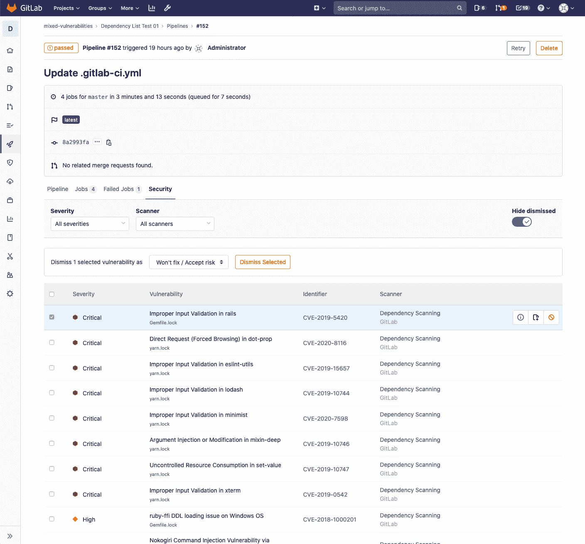
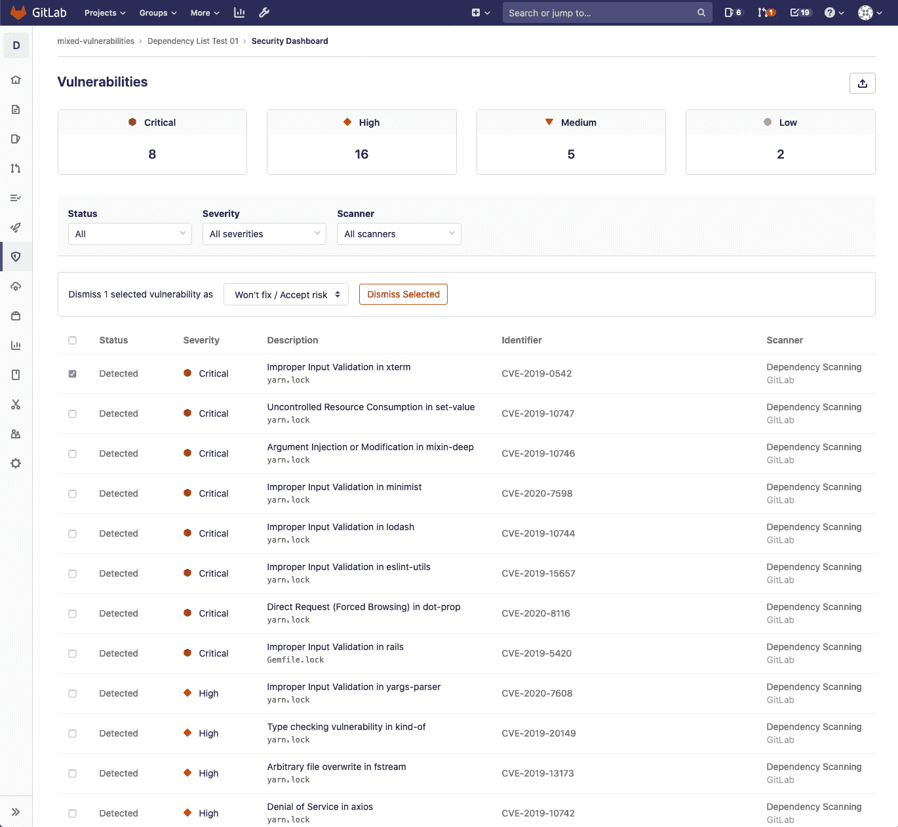
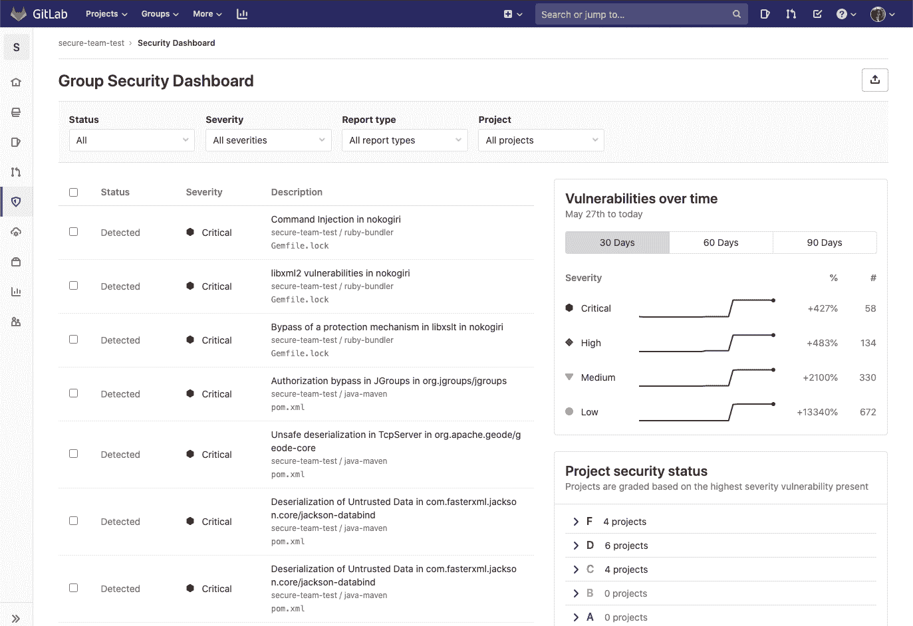
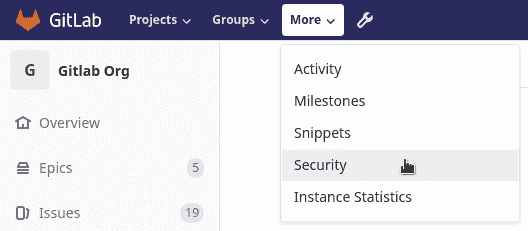
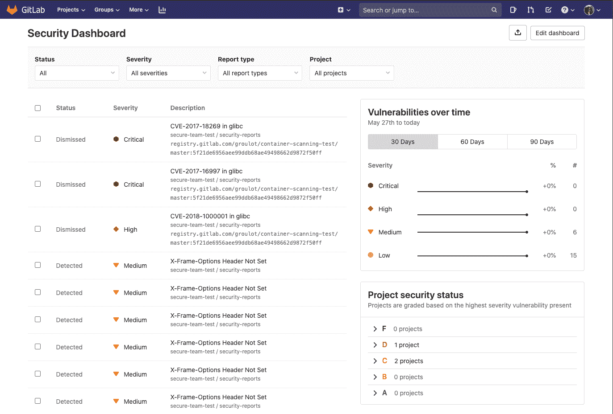
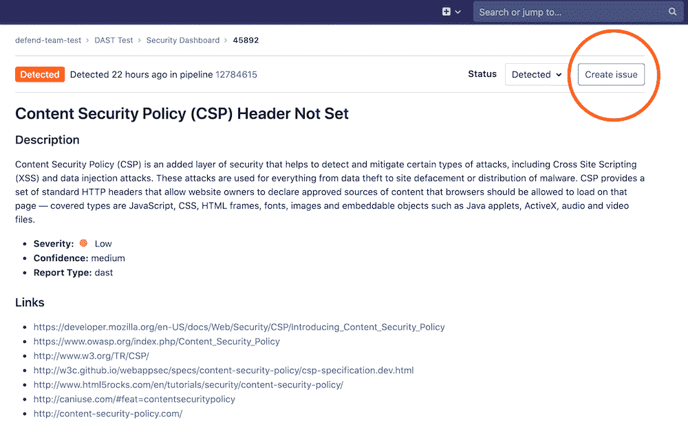
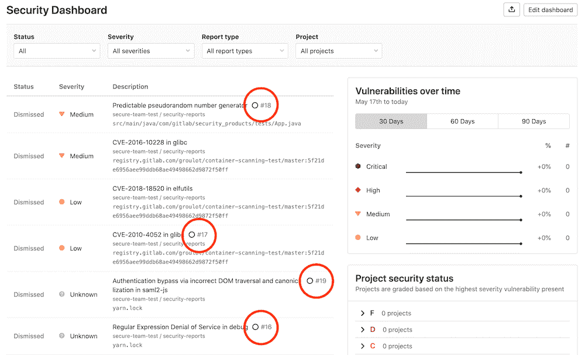

# GitLab Security Dashboard

> 原文：[https://docs.gitlab.com/ee/user/application_security/security_dashboard/](https://docs.gitlab.com/ee/user/application_security/security_dashboard/)

*   [Supported reports](#supported-reports)
*   [Requirements](#requirements)
*   [Pipeline Security](#pipeline-security)
*   [Project Security Dashboard](#project-security-dashboard)
*   [Group Security Dashboard](#group-security-dashboard)
*   [Instance Security Dashboard](#instance-security-dashboard)
    *   [Adding projects to the dashboard](#adding-projects-to-the-dashboard)
*   [Export vulnerabilities](#export-vulnerabilities)
*   [Keeping the dashboards up to date](#keeping-the-dashboards-up-to-date)
*   [Security scans using Auto DevOps](#security-scans-using-auto-devops)
*   [Vulnerability list](#vulnerability-list)

# GitLab Security Dashboard

在"安全仪表板"中，您可以概览您的组，项目和管道中的所有安全漏洞.

您还可以深入研究漏洞并获得更多信息，查看其来源，项目所在的文件以及各种元数据，以帮助您分析风险. 您也可以通过为漏洞创建问题或消除漏洞来对漏洞采取措施.

要从"安全仪表板"中受益，您必须首先配置其中一份[安全报告](../index.html) .

## Supported reports

安全仪表板支持以下报告：

*   [Container Scanning](../container_scanning/index.html)
*   [Dynamic Application Security Testing](../dast/index.html)
*   [Dependency Scanning](../dependency_scanning/index.html)
*   [Static Application Security Testing](../sast/index.html)

## Requirements

要使用实例，组，项目或管道安全性仪表板，请执行以下操作：

1.  组中的至少一个项目必须配置有至少一个[受支持的报告](#supported-reports) .
2.  配置的作业必须使用[新的`reports`语法](../../../ci/pipelines/job_artifacts.html#artifactsreports) .
3.  必须使用[GitLab Runner](https://docs.gitlab.com/runner/) 11.5 或更高版本. 如果您在 GitLab.com 上使用共享的 Runners，那么情况已经如此.

## Pipeline Security

[Introduced](https://gitlab.com/gitlab-org/gitlab/-/issues/13496) in [GitLab Ultimate](https://about.gitlab.com/pricing/) 12.3.

在管道级别，"安全性"部分显示了运行管道所针对的项目分支中存在的漏洞.

访问页面以查看运行了任何[受支持报告的](#supported-reports)任何管道. 单击**安全性**选项卡以查看安全性发现.

**注意：**管道包含多个作业，包括 SAST 和 DAST 扫描. 如果任何作业由于任何原因无法完成，则安全信息中心将不会显示 SAST 扫描仪输出. 例如，如果 SAST 作业完成但 DAST 作业失败，则安全性仪表板将不会显示 SAST 结果. 分析器将在失败时输出[退出代码](../../../development/integrations/secure.html#exit-code) .

## Project Security Dashboard

[Introduced](https://gitlab.com/gitlab-org/gitlab/-/issues/6165) in [GitLab Ultimate](https://about.gitlab.com/pricing/) 11.1.

在项目级别，安全性仪表板显示合并到项目的[默认分支中](../../project/repository/branches/index.html#default-branch)的漏洞. 通过导航到" **安全与合规性">"安全仪表板"**来访问它.

安全仪表板首先按严重性显示漏洞的总数（例如，严重，高，中，低）. 在此下方，有一个表显示每个漏洞的状态，严重性和描述. 单击漏洞会将您带到其" [漏洞详细信息"](../vulnerabilities)页面，以查看有关该漏洞的更多信息.

您可以通过以下方式过滤漏洞：

*   Status
*   Severity
*   报告类型

您还可以消除表中的漏洞：

1.  选择要消除的每个漏洞的复选框.
2.  在出现的菜单中，选择**退出**的原因，然后点击**取消选中** .

## Group Security Dashboard

[Introduced](https://gitlab.com/gitlab-org/gitlab/-/issues/6709) in [GitLab Ultimate](https://about.gitlab.com/pricing/) 11.5.

组安全仪表板概述了组及其子组中项目的默认分支中的漏洞. 通过导航至组的" **安全性">"安全性仪表板"**来访问它.

**注意：** "安全仪表板"仅显示在组中启用了[安全报告的](#supported-reports)项目.

您可以通过以下方式过滤安全仪表板显示的漏洞：

*   Status
*   Severity
*   报告类型
*   Project

表格列出了漏洞，并按严重性排序. 该表显示了每个漏洞的状态，严重性和描述. 单击漏洞会将您带到其" [漏洞详细信息"](../vulnerabilities)页面，以查看有关该漏洞的更多信息.

列表旁边是时间线图，该图显示了您的项目在不同时间点有多少个未解决的漏洞. 您可以在 30 天，60 天和 90 天之间进行过滤，默认值为 90 天.将鼠标悬停在图表上可获得有关特定时间未解决漏洞的更多详细信息.

时间线图表下方是项目列表，按发现的漏洞的严重程度进行分组和排序：

*   F：1 个或更多"关键"
*   D：1 个或多个"高"或"未知"
*   C: 1 or more “medium”
*   B：1 个或多个"低"
*   答：0 个漏洞

未配置漏洞测试的项目不会出现在列表中. 此外，也不包含已消除的漏洞.

阅读有关如何[与漏洞](../index.html#interacting-with-the-vulnerabilities)进行[交互的](../index.html#interacting-with-the-vulnerabilities)更多信息.

## Instance Security Dashboard

[Introduced](https://gitlab.com/gitlab-org/gitlab/-/issues/6953) in [GitLab Ultimate](https://about.gitlab.com/pricing/) 12.8.

在实例级别，安全仪表板显示您配置为显示在仪表板上的所有项目的默认分支中存在的漏洞. 它包括[组"安全仪表板"的](#group-security-dashboard)所有功能.

您可以从页面顶部的菜单栏中访问 Instance Security 仪表板. 在" **更多"下** ，选择" **安全性"** .

### Adding projects to the dashboard

要将项目添加到仪表板：

1.  单击"实例安全性仪表板"页面上的**编辑仪表板**按钮.
2.  使用" **搜索您的项目"**字段搜索并添加一个或多个项目.
3.  单击**添加项目**按钮.

添加后，安全仪表板将显示在所选项目的默认分支中发现的漏洞.

## Export vulnerabilities

[Introduced](https://gitlab.com/gitlab-org/gitlab/-/issues/213014) in [GitLab Ultimate](https://about.gitlab.com/pricing/) 12.10.

您可以通过以下方式将所有漏洞导出为 CSV 格式： 位于**安全仪表板**右上方的" **导出"**按钮. 生成报告后，CSV 报告将下载到本地计算机. 该报告包含" **安全性仪表板"中**定义的项目的所有漏洞，因为过滤器不适用于导出功能.

**注意：**如果您的项目包含成千上万个漏洞，下载可能需要几分钟的时间才能开始. 下载完成之前，请不要关闭页面.

## Keeping the dashboards up to date

安全仪表板在[默认分支](../../project/repository/branches/index.html#default-branch)上显示来自最新安全扫描结果的信息，这意味着每次更新分支时都会执行安全扫描.

如果不经常更新默认分支，则不经常运行扫描，并且随着发现新漏洞，安全仪表板上的信息可能会过时.

为确保安全仪表板上的信息得到定期更新，请[配置计划的管道](../../../ci/pipelines/schedules.html)以运行每日安全扫描. 不管默认分支的更新频率如何，这都会更新"安全性"仪表板上显示的信息.

这样，即使没有代码更改也不会创建报告.

## Security scans using Auto DevOps

使用[Auto DevOps 时](../../../topics/autodevops/index.html) ，请使用[特殊的环境变量](../../../topics/autodevops/customize.html#environment-variables)来配置每日安全扫描.

## Vulnerability list

Each dashboard’s vulnerability list contains vulnerabilities from the latest scans that were merged into the default branch. Click any vulnerability in the table to see more information on that vulnerability. To create an issue associated with the vulnerability, click the **创建问题** button.

创建问题后，漏洞列表将包含该问题的链接和一个图标，其颜色指示该问题的状态（绿色代表未解决的问题，蓝色代表未解决的问题）.

