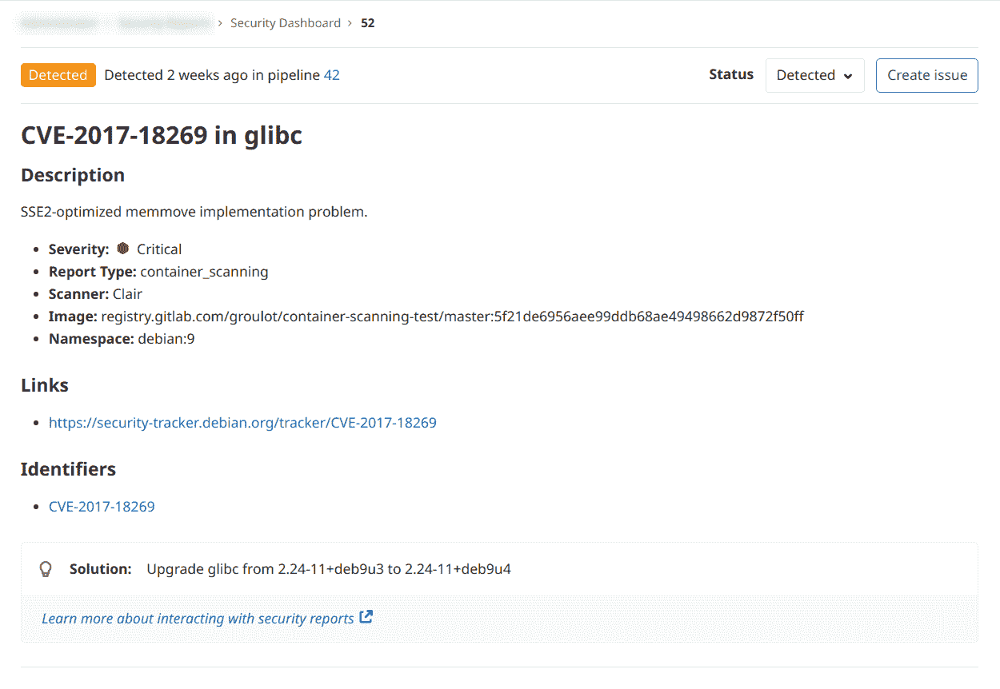
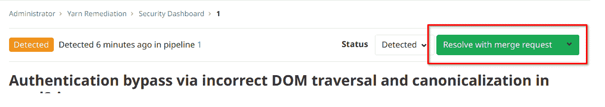
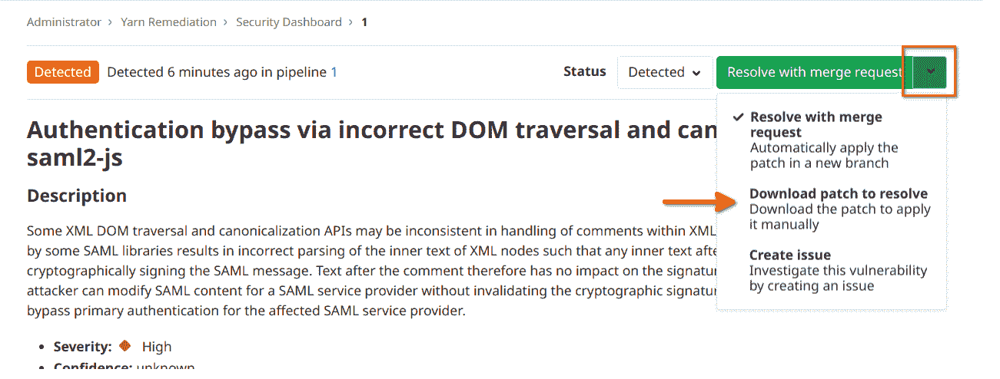
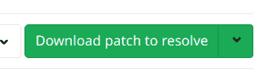

# Standalone Vulnerability pages

> 原文：[https://docs.gitlab.com/ee/user/application_security/vulnerabilities/](https://docs.gitlab.com/ee/user/application_security/vulnerabilities/)

*   [Changing vulnerability status](#changing-vulnerability-status)
*   [Creating an issue for a vulnerability](#creating-an-issue-for-a-vulnerability)
*   [Automatic remediation solutions for vulnerabilities](#automatic-remediation-solutions-for-vulnerabilities)
    *   [Manually applying a suggested patch](#manually-applying-a-suggested-patch)

# Standalone Vulnerability pages

[Introduced](https://gitlab.com/gitlab-org/gitlab/-/issues/13561) in [GitLab Ultimate](https://about.gitlab.com/pricing/) 13.0.

[安全仪表板](../security_dashboard/index.html#project-security-dashboard)中的每个安全漏洞都有其自己的独立页面.

在独立漏洞页面上，您可以通过几种不同方式与漏洞进行交互：

*   [变化的脆弱性状态](#changing-vulnerability-status) -您可以将漏洞的状态更改为**检测** ， **确认** ， **驳回**或**解决** .
*   [创建问题](#creating-an-issue-for-a-vulnerability) -创建一个新问题，其标题和说明已预先填充了漏洞报告中的信息. 默认情况下，此类问题是[机密的](../../project/issues/confidential_issues.html) .
*   [解决方案](#automatic-remediation-solutions-for-vulnerabilities) -对于某些漏洞，提供了有关如何修复该漏洞的解决方案.

## Changing vulnerability status

您可以使用" **状态"**下拉列表将漏洞的**状态**切换为以下值之一：

| Status | Description |
| --- | --- |
| Detected | 新发现漏洞的默认状态 |
| Confirmed | 用户已经看到此漏洞并确认它是真实的 |
| Dismissed | 用户已经看到此漏洞并将其消除 |
| Resolved | 该漏洞已修复，不再存在于代码库中 |

## Creating an issue for a vulnerability

您可以通过选择**创建问题**按钮来**创建**漏洞**问题** .

这会在漏洞来自的项目中创建一个[机密问题](../../project/issues/confidential_issues.html) ，并使用漏洞报告中的有用信息对其进行预填充. 创建问题后，GitLab 会将您重定向到问题页面，以便您可以编辑，分配或评论问题.

## Automatic remediation solutions for vulnerabilities

您可以通过应用 GitLab 为您自动生成的解决方案来修复某些漏洞. GitLab 支持以下扫描仪：

*   [依赖项扫描](../dependency_scanning/index.html) ：自动补丁创建仅适用于使用`yarn`管理的 Node.js 项目.
*   [Container Scanning](../container_scanning/index.html).

When an automatic solution is available, the button in the header will show “Resolve with merge request”:

选择该按钮将创建带有自动解决方案的合并请求.

### Manually applying a suggested patch

要手动应用由 GitLab 生成的漏洞补丁，请选择"使用合并请求解决"按钮上的下拉箭头，然后选择"下载要解决的补丁"选项：

这会将按钮文本更改为"下载修补程序以解决". 单击它下载补丁：

