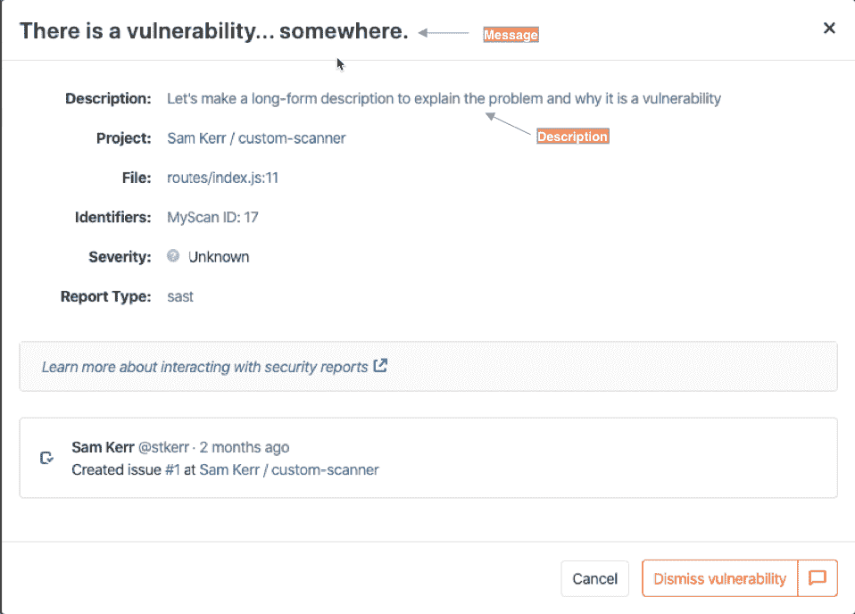

# Security scanner integration

> 原文：[https://docs.gitlab.com/ee/development/integrations/secure.html](https://docs.gitlab.com/ee/development/integrations/secure.html)

*   [Job definition](#job-definition)
    *   [Name](#name)
    *   [Image](#image)
    *   [Script](#script)
    *   [Stage](#stage)
    *   [Fail-safe](#fail-safe)
    *   [Artifacts](#artifacts)
    *   [Policies](#policies)
        *   [Policy checking example](#policy-checking-example)
*   [Docker image](#docker-image)
    *   [Image size](#image-size)
    *   [Image tag](#image-tag)
*   [Command line](#command-line)
    *   [Variables](#variables)
        *   [SAST and Dependency Scanning](#sast-and-dependency-scanning)
        *   [Container Scanning](#container-scanning)
        *   [Configuration files](#configuration-files)
    *   [Output file](#output-file)
    *   [Exit code](#exit-code)
    *   [Logging](#logging)
        *   [Logging level](#logging-level)
        *   [common logutil package](#common-logutil-package)
*   [Report](#report)
    *   [Version](#version)
    *   [Vulnerabilities](#vulnerabilities)
        *   [ID](#id)
        *   [Category](#category)
        *   [Scanner](#scanner)
        *   [Name, message, and description](#name-message-and-description)
        *   [Solution](#solution)
        *   [Identifiers](#identifiers)
    *   [Location](#location)
        *   [Dependency Scanning](#dependency-scanning)
        *   [Container Scanning](#container-scanning-1)
        *   [SAST](#sast)
    *   [Tracking and merging vulnerabilities](#tracking-and-merging-vulnerabilities)
        *   [Severity and confidence](#severity-and-confidence)
    *   [Remediations](#remediations)
        *   [Summary](#summary)
        *   [Fixed vulnerabilities](#fixed-vulnerabilities)
        *   [Diff](#diff)
*   [Limitations](#limitations)
    *   [Container Scanning](#container-scanning-2)

# Security scanner integration[](#security-scanner-integration "Permalink")

将安全扫描程序集成到 GitLab 包括为最终用户提供[CI 作业定义，](../../ci/yaml/README.html#introduction)他们可以将其添加到 CI 配置文件中以扫描其 GitLab 项目. 然后，此 CI 作业应以 GitLab 指定的格式输出其结果. 然后，这些结果将自动显示在 GitLab 中的各个位置，例如管道视图，合并请求小部件和安全仪表板.

扫描作业通常基于[Docker 映像](https://s0docs0docker0com.icopy.site/) ，该[映像](https://s0docs0docker0com.icopy.site/)包含扫描程序及其在独立环境中的所有依赖性.

该页面记录了编写实现安全扫描程序的 CI 作业的要求和准则，以及 Docker 映像的要求和准则.

## Job definition[](#job-definition "Permalink")

本节描述了要添加到安全扫描器的作业定义文件中的几个重要字段. 有关这些以及其他可用字段的完整文档，请参阅[CI 文档](../../ci/yaml/README.html#image) .

### Name[](#name "Permalink")

为了保持一致性，扫描作业应以扫描仪的名字命名（小写）. 作业名称是扫描的类型之后后缀： `_dependency_scanning` ， `_container_scanning` ， `_dast`和`_sast` . 例如，基于" MySec"扫描程序的依赖项扫描作业将被命名为`mysec_dependency_scanning` .

### Image[](#image "Permalink")

[`image`](../../ci/yaml/README.html#image)关键字用于指定包含安全扫描器的[Docker 映像](../../ci/docker/using_docker_images.html#what-is-an-image) .

### Script[](#script "Permalink")

[`script`](../../ci/yaml/README.html#script)关键字用于指定运行扫描仪的命令. 由于`script`条目不能为空，因此必须将其设置为执行扫描的命令. 无法依靠 Docker 映像的预定义`ENTRYPOINT`和`CMD`来自动执行扫描，而无需传递任何命令.

在作业定义中不应使用[`before_script`](../../ci/yaml/README.html#before_script-and-after_script) ，因为用户可以在执行扫描之前依靠它来准备其项目. 例如，通常的做法是在执行 SAST 或依赖项扫描之前，使用`before_script`安装特定项目所需的系统库.

同样，在作业定义中不应使用[`after_script`](../../ci/yaml/README.html#before_script-and-after_script) ，因为它可能会被用户覆盖.

### Stage[](#stage "Permalink")

为了保持一致性，扫描作业应尽可能属于`test`阶段. 可以省略[`stage`](../../ci/yaml/README.html#stage)关键字，因为`test`是默认值.

### Fail-safe[](#fail-safe "Permalink")

为了与[GitLab Security 范例](https://about.gitlab.com/direction/secure/#security-paradigm)保持一致，扫描作业在失败时不应阻塞管道，因此[`allow_failure`](../../ci/yaml/README.html#allow_failure)参数设置为`true` .

### Artifacts[](#artifacts "Permalink")

扫描作业必须使用[`artifacts:reports`](../../ci/pipelines/job_artifacts.html#artifactsreports)关键字声明与其执行的扫描类型相对应的[`artifacts:reports`](../../ci/pipelines/job_artifacts.html#artifactsreports) . 有效报告为： `dependency_scanning` ， `container_scanning` ， `dast`和`sast` .

例如，以下是 SAST 作业的定义，该作业生成一个名为`gl-sast-report.json`的文件，并将其作为 SAST 报告上载：

```
mysec_sast:
  image: registry.gitlab.com/secure/mysec
  artifacts:
    reports:
      sast: gl-sast-report.json 
```

请注意， `gl-sast-report.json`是示例文件路径，但可以使用任何其他文件名. 有关更多详细信息，请参见["输出文件"部分](#output-file) . 之所以将其作为 SAST 报告处理是因为它是在作业定义中的`reports:sast`键下声明的，而不是因为文件名.

### Policies[](#policies "Permalink")

某些 GitLab 工作流程（例如[AutoDevOps](../../topics/autodevops/customize.html#disable-jobs) ）定义了变量，以指示应禁用给定的扫描. 您可以通过查找诸如`DEPENDENCY_SCANNING_DISABLED` ， `CONTAINER_SCANNING_DISABLED` ， `SAST_DISABLED`和`DAST_DISABLED`变量来进行检查. 根据扫描仪类型，如果合适，则应禁用运行自定义扫描仪.

GitLab 还定义了一个`CI_PROJECT_REPOSITORY_LANGUAGES`变量，该变量提供了存储库中的语言列表. 根据此值，扫描仪可能会做或可能不会做不同的事情. 目前，语言检测依赖于[`linguist`](https://github.com/github/linguist) Ruby gem. 请参阅[GitLab CI / CD 预定义变量](../../ci/variables/predefined_variables.html) .

#### Policy checking example[](#policy-checking-example "Permalink")

此示例显示如何跳过自定义的依赖项扫描作业`mysec_dependency_scanning` ，除非项目存储库包含 Java 源代码并且启用了`dependency_scanning`功能：

```
mysec_dependency_scanning:
  rules:
    - if: $DEPENDENCY_SCANNING_DISABLED
      when: never
    - if: $GITLAB_FEATURES =~ /\bdependency_scanning\b/
      exists:
        - '**/*.java' 
```

任何其他作业策略仅应由用户根据其需求进行配置. 例如，预定义策略不应触发特定分支或特定文件集更改时的扫描作业.

## Docker image[](#docker-image "Permalink")

Docker 映像是一个自包含的环境，将扫描仪与其依赖的所有库和工具结合在一起. 将扫描程序打包到 Docker 映像中，无论扫描程序在哪台计算机上运行，​​其依赖关系和配置始终存在.

### Image size[](#image-size "Permalink")

根据 CI 基础架构，CI 可能必须在每次作业运行时都获取 Docker 映像. 为了使扫描作业快速运行并避免浪费带宽，Docker 映像应尽可能小. 您的目标应该是 50MB 或更小. 如果无法做到这一点，请尝试使其保持在 1.46 GB 以下，即 CD-ROM 的大小.

If the scanner requires a fully functional Linux environment, it is recommended to use a [Debian](https://www.debian.org/intro/about) “slim” distribution or [Alpine Linux](https://www.alpinelinux.org/). If possible, it is recommended to build the image from scratch, using the `FROM scratch` instruction, and to compile the scanner with all the libraries it needs. [Multi-stage builds](https://s0docs0docker0com.icopy.site/develop/develop-images/multistage-build/) might also help with keeping the image small.

为了保持较小的图像大小，请考虑使用[Dive](https://github.com/wagoodman/dive#dive)分析 Docker 图像中的图层，以识别可能来自其他地方的膨胀.

In some cases, it might be difficult to remove files from an image. When this occurs, consider using [Zstandard](https://github.com/facebook/zstd) to compress files or large directories. Zstandard offers many different compression levels that can decrease the size of your image with very little impact to decompression speed. It may be helpful to automatically decompress any compressed directories as soon as an image launches. You can accomplish this by adding a step to the Docker image’s `/etc/bashrc` or to a specific user’s `$HOME/.bashrc`. Remember to change the entry point to launch a bash login shell if you chose the latter option.

以下是一些入门的示例：

*   [https://gitlab.com/gitlab-org/security-products/license-management/-/blob/0b976fcffe0a9b8e80587adb076bcdf279c9331c/config/install.sh#L168-170](https://gitlab.com/gitlab-org/security-products/license-management/-/blob/0b976fcffe0a9b8e80587adb076bcdf279c9331c/config/install.sh#L168-170)
*   [https://gitlab.com/gitlab-org/security-products/license-management/-/blob/0b976fcffe0a9b8e80587adb076bcdf279c9331c/config/.bashrc#L49](https://gitlab.com/gitlab-org/security-products/license-management/-/blob/0b976fcffe0a9b8e80587adb076bcdf279c9331c/config/.bashrc#L49)

### Image tag[](#image-tag "Permalink")

如[Docker Official Images](https://github.com/docker-library/official-images#tags-and-aliases)项目中所述，强烈建议给版本号标签起别名，这使用户可以轻松地引用特定系列的"最新"版本. 另请参阅[Docker 标记：标记和版本化 Docker 映像的最佳实践](https://docs.microsoft.com/en-us/archive/blogs/stevelasker/docker-tagging-best-practices-for-tagging-and-versioning-docker-images) .

## Command line[](#command-line "Permalink")

扫描程序是一种命令行工具，它将环境变量作为输入，并生成一个文件，该文件作为报告上载（基于作业定义）. 它还会在标准输出和标准错误流上生成文本输出，并以状态码退出.

### Variables[](#variables "Permalink")

所有 CI 变量都作为环境变量传递到扫描仪. 扫描的项目由[预定义的 CI 变量](../../ci/variables/README.html)描述.

#### SAST and Dependency Scanning[](#sast-and-dependency-scanning "Permalink")

SAST 和依赖项扫描扫描程序必须扫描项目目录中由`CI_PROJECT_DIR`变量指定的文件.

#### Container Scanning[](#container-scanning "Permalink")

为了与 GitLab 的官方 Container Scanning 一致，扫描程序必须扫描 Docker 映像，其名称和标记分别由`CI_APPLICATION_REPOSITORY`和`CI_APPLICATION_TAG`给出.

如果未提供， `CI_APPLICATION_REPOSITORY`应该默认为`$CI_REGISTRY_IMAGE/$CI_COMMIT_REF_SLUG` ，这是预定义的 CI 变量的组合. `CI_APPLICATION_TAG`应该默认为`CI_COMMIT_SHA` .

扫描程序应使用变量`DOCKER_USER`和`DOCKER_PASSWORD`登录 Docker 注册表. 如果未定义它们，则扫描程序应使用`CI_REGISTRY_USER`和`CI_REGISTRY_PASSWORD`作为默认值.

#### Configuration files[](#configuration-files "Permalink")

尽管扫描程序可以使用`CI_PROJECT_DIR`加载特定的配置文件，但建议将配置公开为环境变量，而不是文件.

### Output file[](#output-file "Permalink")

与上载到 GitLab CI / CD 的任何工件一样，由扫描仪生成的安全报告必须写入项目目录中，该目录由`CI_PROJECT_DIR`环境变量指定.

建议以扫描类型命名输出文件，并使用`gl-`作为前缀. 由于所有安全报告都是 JSON 文件，因此建议使用`.json`作为文件扩展名. 例如，"依赖关系扫描"报告的建议文件名是`gl-dependency-scanning.json` .

作业定义的[`artifacts:reports`](../../ci/pipelines/job_artifacts.html#artifactsreports)关键字必须与编写"安全性"报告的文件路径一致. 例如，如果 Dependency Scanning 分析器将其报告写入 CI 项目目录，并且此报告文件名为`depscan.json` ，则必须将`artifacts:reports:dependency_scanning`设置为`depscan.json` .

### Exit code[](#exit-code "Permalink")

遵循 POSIX 退出代码标准，扫描仪将以 0 表示成功退出，以 1 到 255 之间的任何数字表示退出. 成功还包括发现漏洞的情况.

使用[Docker-in-Docker 特权模式](../../user/application_security/sast/index.html#requirements)执行扫描作业时，我们保留以下标准退出代码.

| 协调器退出代码 | Description |
| --- | --- |
| 3 | 没有匹配项，没有兼容的分析仪 |
| 4 | 项目目录为空 |
| 5 | 没有兼容的 Docker 映像 |

### Logging[](#logging "Permalink")

扫描程序应记录错误消息和警告，以便用户可以通过查看 CI 扫描作业的日志轻松调查配置错误和集成问题.

扫描程序可以使用[ANSI 转义码](https://en.wikipedia.org/wiki/ANSI_escape_code#Colors)来着色它们写入 Unix 标准输出和标准错误流的消息的颜色. 我们建议您使用红色报告错误，黄色使用警告，绿色使用通知. 此外，我们建议在错误消息前添加`[ERRO]` ，在警告前添加`[WARN]` ，在通知中添加`[INFO]` .

#### Logging level[](#logging-level "Permalink")

如果扫描程序的日志级别低于`SECURE_LOG_LEVEL`变量中设置的级别，则扫描器应筛选出一条日志消息. 例如，当`SECURE_LOG_LEVEL`设置为`error`时，应跳过`info`和`warn`消息. 可接受的值如下，从最高到最低列出：

*   `fatal`
*   `error`
*   `warn`
*   `info`
*   `debug`

建议将`debug`级别用于详细日志记录，这在调试时可能会很有用. `SECURE_LOG_LEVEL`的默认值应设置为`info` .

#### common logutil package[](#common-logutil-package "Permalink")

如果您使用[go](https://s0golang0org.icopy.site/)和[common](https://gitlab.com/gitlab-org/security-products/analyzers/common) ，那么建议您使用[logrus](https://github.com/Sirupsen/logrus)和[common 的 logutil 软件包](https://gitlab.com/gitlab-org/security-products/analyzers/common/-/tree/master/logutil)为[logrus](https://github.com/Sirupsen/logrus)配置格式化[程序](https://github.com/Sirupsen/logrus) . 请参阅[logutil README.md](https://gitlab.com/gitlab-org/security-products/analyzers/common/-/tree/master/logutil/README.md)

## Report[](#report "Permalink")

该报告是 JSON 文档，其中结合了漏洞和可能的补救措施.

本文档概述了报告 JSON 格式，以及帮助集成商设置其字段的建议和示例. 该格式在[SAST](../../user/application_security/sast/index.html#reports-json-format) ， [依赖项扫描](../../user/application_security/dependency_scanning/index.html#reports-json-format)和[容器扫描](../../user/application_security/container_scanning/index.html#reports-json-format)的文档中进行了广泛描述.

目前未记录报告 JSON 格式的 DAST 变体.

### Version[](#version "Permalink")

This field specifies the version of the report schema you are using. Please reference individual scanner pages for the specific versions to use.

### Vulnerabilities[](#vulnerabilities "Permalink")

报告的`vulnerabilities`字段是漏洞对象的数组.

#### ID[](#id "Permalink")

`id`字段是漏洞的唯一标识符. 它用于从[修复对象中](#remediations)引用固定的漏洞. 我们建议您生成一个 UUID 并将其用作`id`字段的值.

#### Category[](#category "Permalink")

`category`字段的值与报告类型匹配： `dependency_scanning` ， `container_scanning` ， `sast`和`dast` .

#### Scanner[](#scanner "Permalink")

`scanner`字段是一个嵌入人类可读`name`和技术`id` . 该`id`不应与其他集成商提供的其他扫描仪冲突.

#### Name, message, and description[](#name-message-and-description "Permalink")

`name`和`message`字段包含该漏洞的简短描述. `description`字段提供更多详细信息.

`name`字段不受上下文限制，并且不包含有关在何处发现漏洞的`message` ，而`message`可能会重复该位置.

作为一个直观的示例，此屏幕快照突出显示了在将漏洞作为管道视图的一部分查看时使用这些字段的位置.

[](example_vuln.png)

For instance, a `message` for a vulnerability reported by Dependency Scanning gives information on the vulnerable dependency, which is redundant with the `location` field of the vulnerability. The `name` field is preferred but the `message` field is used when the context/location cannot be removed from the title of the vulnerability.

为了说明这一点，这是一个由"依赖关系扫描"扫描器报告的示例漏洞对象，并且该`message`重复了`location`字段：

```
{  "location":  {  "dependency":  {  "package":  {  "name":  "debug"  }  }  },  "name":  "Regular Expression Denial of Service",  "message":  "Regular Expression Denial of Service in debug",  "description":  "The debug module is vulnerable to regular expression denial of service
        when untrusted user input is passed into the `o` formatter.
        It takes around 50k characters to block for 2 seconds making this a low severity issue."  } 
```

该`description`可能会解释漏洞的工作方式或提供有关漏洞利用的上下文. 它不应重复漏洞对象的其他字段. 特别是，该`description`不应重复`location` （受影响的对象）或`solution` （如何减轻风险）.

#### Solution[](#solution "Permalink")

您可以使用`solution`字段来指导用户如何解决已识别的漏洞或减轻风险. 最终用户与此字段进行交互，而 GitLab 会自动处理`remediations`对象.

#### Identifiers[](#identifiers "Permalink")

`identifiers`数组描述了检测到的漏洞. 标识符对象的`type`和`value`字段用于判断两个标识符是否相同. 用户界面使用对象的`name`和`url`字段显示标识符.

建议重新使用 GitLab 扫描仪已经定义的标识符：

| Identifier | Type | 示例值 |
| --- | --- | --- |
| [CVE](https://cve.mitre.org/cve/) | `cve` | CVE-2019-10086 |
| [CWE](https://cwe.mitre.org/data/index.html) | `cwe` | CWE-1026 |
| [OSVD](https://cve.mitre.org/data/refs/refmap/source-OSVDB.html) | `osvdb` | OSVDB-113928 |
| [USN](https://usn.ubuntu.com/) | `usn` | USN-4234-1 |
| [WASC](http://projects.webappsec.org/Threat-Classification-Reference-Grid) | `wasc` | WASC-19 |
| [RHSA](https://access.redhat.com/errata/#/) | `rhsa` | RHSA-2020:0111 |
| [ELSA](https://linux.oracle.com/security/) | `elsa` | ELSA-2020-0085 |

上面列出的通用标识符在[公共库](https://gitlab.com/gitlab-org/security-products/analyzers/common)中定义，由 GitLab 维护的分析器共享. 如果需要，您可以[贡献](https://gitlab.com/gitlab-org/security-products/analyzers/common/blob/master/issue/identifier.go)新的通用标识符. 分析人员还可以生成特定于供应商或产品的标识符，这些标识符不属于[公共库](https://gitlab.com/gitlab-org/security-products/analyzers/common) .

`identifiers`数组的第一项称为主要标识符. 主标识符特别重要，因为当新提交被推送到存储库时，它用于[跟踪漏洞](#tracking-and-merging-vulnerabilities) . 标识符还用于[合并](#tracking-and-merging-vulnerabilities)针对同一提交报告的[重复漏洞](#tracking-and-merging-vulnerabilities) ，但`CWE`和`WASC`除外.

### Location[](#location "Permalink")

该`location`指示检测到漏洞的`location` . 位置的格式取决于扫描的类型.

在内部，GitLab 提取`location`一些属性以生成**位置指纹** ，该**指纹**用于在将新的提交推送到存储库时跟踪漏洞. 用于生成位置指纹的属性还取决于扫描的类型.

#### Dependency Scanning[](#dependency-scanning "Permalink")

该`location`依赖关系扫描漏洞是由的`dependency`和`file` . `dependency`对象描述了受影响的`package`和依赖项`version` . `package`嵌入受影响的库/模块的`name` . `file`是声明受影响的依赖项的依赖项文件的路径.

例如，这是一个影响 npm 软件包[`handlebars`](https://s0www0npmjs0com.icopy.site/package/handlebars)版本`4.0.11`的漏洞的`location`对象：

```
{  "file":  "client/package.json",  "dependency":  {  "package":  {  "name":  "handlebars"  },  "version":  "4.0.11"  }  } 
```

受影响的依赖项列在`client/package.json` ，该文件由 npm 或 yarn 处理.

The location fingerprint of a Dependency Scanning vulnerability combines the `file` and the package `name`, so these attributes are mandatory. All other attributes are optional.

#### Container Scanning[](#container-scanning-1 "Permalink")

与依赖性扫描相似，容器扫描漏洞的`location`具有`dependency`和`file` . 它还具有一个`operating_system`字段.

例如，这是一个漏洞对象的`location`对象，该漏洞影响 Debian 软件包`glib2.0`版本`2.50.3-2+deb9u1` `glib2.0` ：

```
{  "dependency":  {  "package":  {  "name":  "glib2.0"  },  },  "version":  "2.50.3-2+deb9u1",  "operating_system":  "debian:9",  "image":  "registry.gitlab.com/example/app:latest"  } 
```

在扫描 Docker 镜像`registry.gitlab.com/example/app:latest`时找到受影响的软件包. Docker 映像基于`debian:9` （Debian Stretch）.

容器扫描漏洞的位置指纹结合了`operating_system`和程序包`name` ，因此这些属性是必需的. 该`image`也是必需的. 所有其他属性都是可选的.

#### SAST[](#sast "Permalink")

SAST 漏洞的`location`必须具有一个`file`和一个`start_line`字段，分别提供受影响文件的路径和受影响的行号. 它还可能有一个`end_line` ，一个`class`和一个`method` .

例如，此处是`location`为一个安全漏洞对象发现在线路`41`的`src/main/java/com/gitlab/example/App.java` ，在`generateSecretToken`所述的方法`com.gitlab.security_products.tests.App` Java 类：

```
{  "file":  "src/main/java/com/gitlab/example/App.java",  "start_line":  41,  "end_line":  41,  "class":  "com.gitlab.security_products.tests.App",  "method":  "generateSecretToken1"  } 
```

SAST 漏洞的位置指纹结合了`file` ， `start_line`和`end_line` ，因此这些属性是必需的. 所有其他属性都是可选的.

### Tracking and merging vulnerabilities[](#tracking-and-merging-vulnerabilities "Permalink")

用户可以提供有关漏洞的反馈：

*   如果该漏洞不适用于他们的项目，他们可能会忽略该漏洞
*   如果存在潜在威胁，他们可能会导致漏洞问题

GitLab 跟踪漏洞，以便在将新的 Git 提交推送到存储库时不会丢失用户反馈. 使用以下三个属性的组合来跟踪漏洞：

*   [Report type](#category)
*   [Location fingerprint](#location)
*   [Primary identifier](#identifiers)

目前，如果推送新 Git 提交时其位置发生变化，则 GitLab 无法跟踪漏洞，这会导致用户反馈丢失. 例如，如果重命名受影响的文件或受影响的行向下移动，则会丢失用户对 SAST 漏洞的反馈. [问题＃7586 中](https://gitlab.com/gitlab-org/gitlab/-/issues/7586)已解决.

在某些情况下，在同一 CI 管道中执行的多次扫描会导致重复生成，这些重复使用漏洞位置和标识符自动合并. 如果两个漏洞共享相同的[位置指纹](#location)和至少一个[标识符，](#identifiers)则认为这两个漏洞是相同的. 如果两个标识符共享相同的`type`和`id`则它们是相同的. 不考虑使用 CWE 和 WASC 标识符，因为它们描述了漏洞缺陷的类别，但没有描述特定的安全缺陷.

#### Severity and confidence[](#severity-and-confidence "Permalink")

`severity`字段描述了漏洞对软件的影响`severity` ，而`confidence`字段描述了漏洞评估的可靠性. 严重性用于对安全性仪表板中的漏洞进行排序.

严重性的范围从" `Info`到" `Critical` ，但也可以是" `Unknown` . 有效值为： `Unknown` ， `Info` ， `Low` ， `Medium` ， `High`或`Critical`

置信度范围从`Low`到`Confirmed` ，但是如果要忽略此漏洞，也可以是`Unknown` ， `Experimental`甚至`Ignore` . 有效值为： `Ignore` ， `Unknown` ， `Experimental` ， `Low` ， `Medium` ， `High`或`Confirmed`

`Unknown`值意味着无法获得数据来确定其实际值. 因此，它可能是`high` ， `medium`或`low` ，需要进行调查. 我们[提供了](../../user/application_security/sast/analyzers.html#analyzers-data)可用的 SAST 分析仪以及当前可用的数据[的图表](../../user/application_security/sast/analyzers.html#analyzers-data) .

### Remediations[](#remediations "Permalink")

报告的" `remediations`字段是补救对象的数组. 每个补救措施都描述了一个补丁，可将其应用来[自动修复](../../user/application_security/#solutions-for-vulnerabilities-auto-remediation)一组漏洞.

这是包含补救措施的报告示例.

```
{  "vulnerabilities":  [  {  "category":  "dependency_scanning",  "name":  "Regular Expression Denial of Service",  "id":  "123e4567-e89b-12d3-a456-426655440000",  "solution":  "Upgrade to new versions.",  "scanner":  {  "id":  "gemnasium",  "name":  "Gemnasium"  },  "identifiers":  [  {  "type":  "gemnasium",  "name":  "Gemnasium-642735a5-1425-428d-8d4e-3c854885a3c9",  "value":  "642735a5-1425-428d-8d4e-3c854885a3c9"  }  ]  }  ],  "remediations":  [  {  "fixes":  [  {  "id":  "123e4567-e89b-12d3-a456-426655440000"  }  ],  "summary":  "Upgrade to new version",  "diff":  "ZGlmZiAtLWdpdCBhL3lhcm4ubG9jayBiL3lhcm4ubG9jawppbmRleCAwZWNjOTJmLi43ZmE0NTU0IDEwMDY0NAotLS0gYS95Y=="  }  ]  } 
```

#### Summary[](#summary "Permalink")

`summary`字段概述了如何修复漏洞. 这是必填栏.

#### Fixed vulnerabilities[](#fixed-vulnerabilities "Permalink")

`fixes`字段是一组对象，这些对象引用了补救措施所修复的漏洞. `fixes[].id`包含一个固定漏洞的[唯一标识符](#id) . 这是必填栏.

#### Diff[](#diff "Permalink")

`diff`字段是 base64 编码的补救代码 diff，与[`git apply`](https://git-scm.com/docs/git-format-patch#_discussion)兼容. 这是必填栏.

## Limitations[](#limitations "Permalink")

### Container Scanning[](#container-scanning-2 "Permalink")

容器扫描当前具有以下限制：

*   尽管"安全仪表板"可以显示来自多个图像的扫描结果，但是，如果多个漏洞具有相同的指纹，则仅显示该漏洞的第一个实例. 我们正在努力消除这一限制. 您可以关注我们的问题[更改容器扫描的位置指纹](https://gitlab.com/gitlab-org/gitlab/-/issues/215466)问题的进展.
*   不同的扫描程序可能各自报告相同的漏洞，从而导致重复的发现.