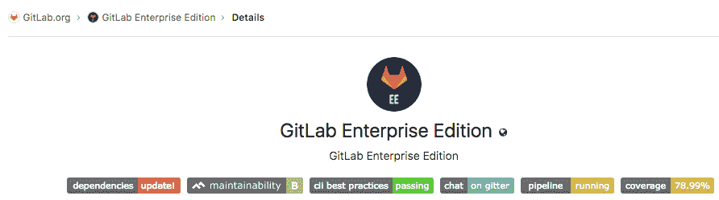

# Badges

> 原文：[https://docs.gitlab.com/ee/user/project/badges.html](https://docs.gitlab.com/ee/user/project/badges.html)

*   [Project badges](#project-badges)
*   [Group badges](#group-badges)
*   [Placeholders](#placeholders)
*   [API](#api)

# Badges

在 GitLab 10.7 中[引入](https://gitlab.com/gitlab-org/gitlab-foss/-/issues/41174) .

徽章是呈现有关您的项目的简要信息的统一方法. 它们由一个小图像以及该图像指向的 URL 组成. 徽章的示例可以是[管道状态](../../ci/pipelines/settings.html#pipeline-status-badge) ， [测试范围](../../ci/pipelines/settings.html#test-coverage-report-badge)或与项目维护者联系的方式.

## Project badges

维护者或所有者可以将徽章添加到项目中，然后在项目的概述页面上可见. 如果发现必须将相同的徽标添加到多个项目，则可能需要在[组级别](#group-badges)添加它们.

要将新徽章添加到项目：

1.  导航到项目的**设置>常规>徽章** .
2.  在"链接"下，输入徽章应指向的 URL，在"徽章图像 URL"下输入应显示的图像的 URL.
3.  通过单击**添加徽章**按钮来提交**徽章** .

将徽章添加到项目后，您可以在表单下方的列表中看到它. 您可以通过单击旁边的笔图标进行编辑，也可以通过单击垃圾箱图标将其删除.

与组关联的徽章只能在[组级别](#group-badges)上进行编辑或删除.

## Group badges

可以将徽章添加到组中，然后将在该组下的每个项目的概述页面上看到它们. 在这种情况下，无法在项目级别上对其进行编辑或删除. 如果每个项目需要单独的徽章，请考虑将其添加到[项目级别](#project-badges)或使用[占位符](#placeholders) .

要将新徽章添加到组：

1.  导航到组的**"设置">"常规">"徽章"** .
2.  在"链接"下，输入徽章应指向的 URL，在"徽章图像 URL"下输入应显示的图像的 URL.
3.  通过单击**添加徽章**按钮来提交**徽章** .

将徽章添加到组后，您可以在表格下方的列表中看到它. 您可以通过单击徽章旁边的笔图标来编辑徽章，也可以通过单击垃圾箱图标来删除徽章.

与项目直接关联的徽章可以在[项目级别](#project-badges)上配置.

## Placeholders

徽章指向的 URL 以及图像 URL 可以包含占位符，在显示徽章时将对其进行评估. 可以使用以下占位符：

*   `%{project_path}` ：包含父组的项目的路径
*   `%{project_id}` ：与项目关联的数据库 ID
*   `%{default_branch}` ：为项目存储库配置的默认分支名称
*   `%{commit_sha}` ：对项目存储库的默认分支的最新提交的 ID

**Note:** Placeholders allow badges to expose otherwise-private information, such as the default branch or commit SHA when the project is configured to have a private repository. This is by design, as badges are intended to be used publicly. Avoid using these placeholders if the information is sensitive.

## API

您还可以通过 GitLab API 配置徽章. 与设置一样，在[项目级别](../../api/project_badges.html)和[组级别的](../../api/group_badges.html)徽章端点之间也有所区别.