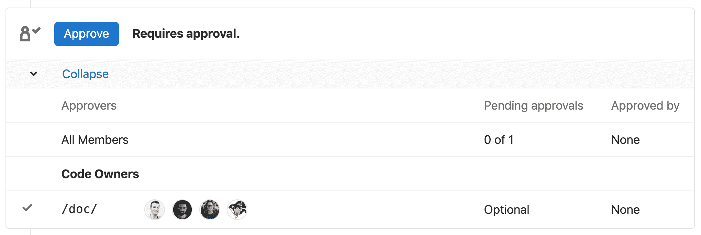

# Code Owners

> 原文：[https://docs.gitlab.com/ee/user/project/code_owners.html](https://docs.gitlab.com/ee/user/project/code_owners.html)

*   [Introduction](#introduction)
*   [Why is this useful?](#why-is-this-useful)
*   [How to set up Code Owners](#how-to-set-up-code-owners)
*   [Approvals by Code Owners](#approvals-by-code-owners)
*   [The syntax of Code Owners files](#the-syntax-of-code-owners-files)

# Code Owners[](#code-owners-starter "Permalink")

版本历史

*   在[GitLab Starter](https://about.gitlab.com/pricing/) 11.3 中[引入](https://gitlab.com/gitlab-org/gitlab/-/merge_requests/6916) .
*   [支持](https://gitlab.com/gitlab-org/gitlab-foss/-/issues/53182)在 GitLab Starter 12.1 中添加的[组名称空间](https://gitlab.com/gitlab-org/gitlab-foss/-/issues/53182) .
*   在[GitLab Premium](https://about.gitlab.com/pricing/) 11.9 中[引入](https://gitlab.com/gitlab-org/gitlab/-/issues/4418)了用于合并请求批准的代码所有者.

## Introduction[](#introduction "Permalink")

在为项目做贡献时，通常很难找出谁应该审查或批准合并请求. 此外，如果您对特定文件或代码块有疑问，可能很难知道从谁那里找到答案.

GitLab 代码所有者是一项功能，用于定义谁拥有存储库中的特定文件或路径，从而允许其他用户了解谁对每个文件或路径负责.

## Why is this useful?[](#why-is-this-useful "Permalink")

代码所有者允许使用版本控制的单个真实文件源，该文件概述了拥有存储库中某些文件或路径的确切 GitLab 用户或组. 可以在合并请求批准过程中利用代码所有者，该过程可以简化为给定合并请求找到合适的审阅者和批准者的过程.

在大型组织或流行的开源项目中，如果您遇到的问题可能与代码审查或合并请求批准无关，则代码所有者还可以帮助您了解与谁联系.

## How to set up Code Owners[](#how-to-set-up-code-owners "Permalink")

您可以使用`CODEOWNERS`文件来指定负责存储库中某些文件的用户或[共享组](members/share_project_with_groups.html) .

您可以在三个位置选择并添加`CODEOWNERS`文件：

*   到存储库的根目录
*   在`.gitlab/`目录中
*   在`docs/`目录中

The `CODEOWNERS` file is scoped to a branch, which means that with the introduction of new files, the person adding the new content can specify themselves as a code owner, all before the new changes get merged to the default branch.

当一个文件与`CODEOWNERS`文件中的多个条目匹配时，与该文件匹配的上一个模式的用户将显示在给定文件的 Blob 页面上. 例如，您具有以下`CODEOWNERS`文件：

```
README.md @user1

# This line would also match the file README.md
*.md @user2 
```

将显示`README.md`的用户为`@user2` .

## Approvals by Code Owners[](#approvals-by-code-owners "Permalink")

将"代码所有者"设置为项目后，可以将其配置为用于合并请求批准：

*   As [merge request eligible approvers](merge_requests/merge_request_approvals.html#code-owners-as-eligible-approvers).
*   根据需要批准[分支机构](protected_branches.html#protected-branches-approval-by-code-owners-premium) .

**注意** ：为了批准合并请求，需要开发人员或更高[权限](../permissions.html) .

设置后，"代码所有者"将显示在合并请求小部件中：

[](img/code_owners_mr_widget_v12_4.png)

尽管`CODEOWNERS`文件除了可以用于合并请求[批准规则之外](merge_requests/merge_request_approvals.html#approval-rules) ，还可以用作合并请求批准的唯一驱动程序（不使用[批准规则](merge_requests/merge_request_approvals.html#approval-rules) ）. 为此，请在上面指定的三个位置之一中创建文件，并将代码所有者设置为[受保护分支的](protected_branches.html#protected-branches-approval-by-code-owners-premium)必需批准者. 使用[代码所有者文件的语法](code_owners.html#the-syntax-of-code-owners-files)来指定实际所有者和精细权限.

结合使用"代码所有者"和" [受保护的分支机构批准"，](protected_branches.html#protected-branches-approval-by-code-owners-premium)将防止在`CODEOWNERS`文件中未指定的任何用户推送对指定文件/路径的更改，即使其角色包含在" **允许推送"**列中. 这允许采用更具包容性的推送策略，因为管理员不必限制开发人员直接将其推送到受保护的分支，而可以将推送限制到某些需要代码所有者审查的文件.

## The syntax of Code Owners files[](#the-syntax-of-code-owners-files "Permalink")

可以使用与`.gitignore`文件中使用的相同类型的模式来指定文件，然后使用一个或多个用户的`@username`或电子邮件或应作为文件所有者的一个或多个组的`@name`进行指定. 必须将组添加为[项目的成员](members/index.html) ，否则它们将被忽略.

从[GitLab 13.0](https://gitlab.com/gitlab-org/gitlab/-/issues/32432)开始，您现在可以将项目组层次结构中的组或子组指定为潜在的代码所有者.

例如，考虑给定项目的以下层次结构：

```
group >> sub-group >> sub-subgroup >> myproject >> file.md 
```

以下任何组都可以被指定为代码所有者：

*   `@group`
*   `@group/sub-group`
*   `@group/sub-group/sub-subgroup`

此外，使用" **成员"**工具邀请到项目的任何组也将被视为合格的代码所有者.

定义路径的顺序很重要：与给定路径匹配的最后一个模式将用于查找代码所有者.

以`#`开头的行表示注释. 需要使用`\#`对其进行转义，以寻址其名称以`#`开头的文件.

Example `CODEOWNERS` file:

```
# This is an example of a code owners file
# lines starting with a `#` will be ignored.

# app/ @commented-rule

# We can specify a default match using wildcards:
* @default-codeowner

# We can also specify "multiple tab or space" separated codeowners:
* @multiple @code @owners

# Rules defined later in the file take precedence over the rules
# defined before.
# This will match all files for which the file name ends in `.rb`
*.rb @ruby-owner

# Files with a `#` can still be accessed by escaping the pound sign
\#file_with_pound.rb @owner-file-with-pound

# Multiple codeowners can be specified, separated by spaces or tabs
# In the following case the CODEOWNERS file from the root of the repo
# has 3 code owners (@multiple @code @owners)
CODEOWNERS @multiple @code @owners

# Both usernames or email addresses can be used to match
# users. Everything else will be ignored. For example this will
# specify `@legal` and a user with email `janedoe@gitlab.com` as the
# owner for the LICENSE file
LICENSE @legal this_does_not_match janedoe@gitlab.com

# Group names can be used to match groups and nested groups to specify
# them as owners for a file
README @group @group/with-nested/subgroup

# Ending a path in a `/` will specify the code owners for every file
# nested in that directory, on any level
/docs/ @all-docs

# Ending a path in `/*` will specify code owners for every file in
# that directory, but not nested deeper. This will match
# `docs/index.md` but not `docs/projects/index.md`
/docs/* @root-docs

# This will make a `lib` directory nested anywhere in the repository
# match
lib/ @lib-owner

# This will only match a `config` directory in the root of the
# repository
/config/ @config-owner

# If the path contains spaces, these need to be escaped like this:
path\ with\ spaces/ @space-owner 
```