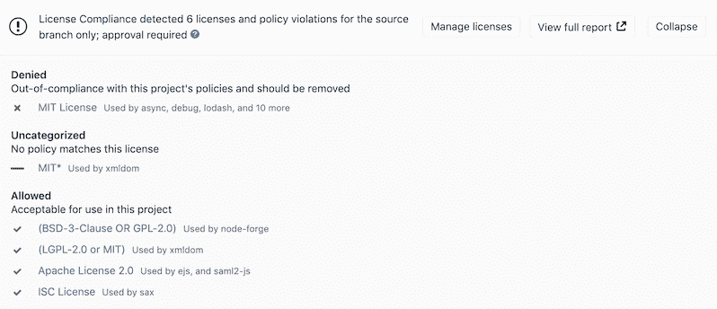
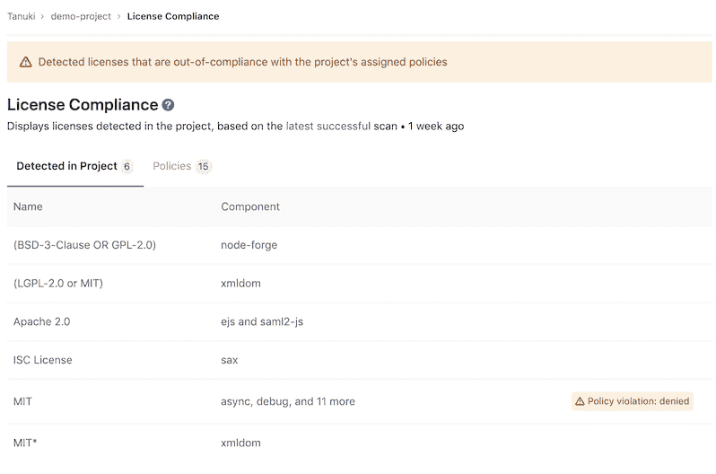
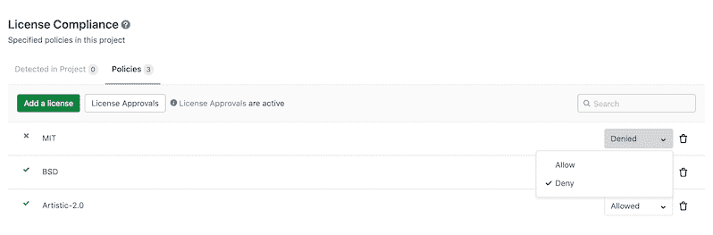
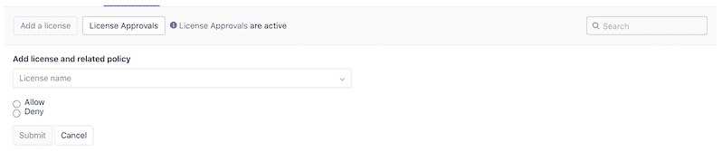
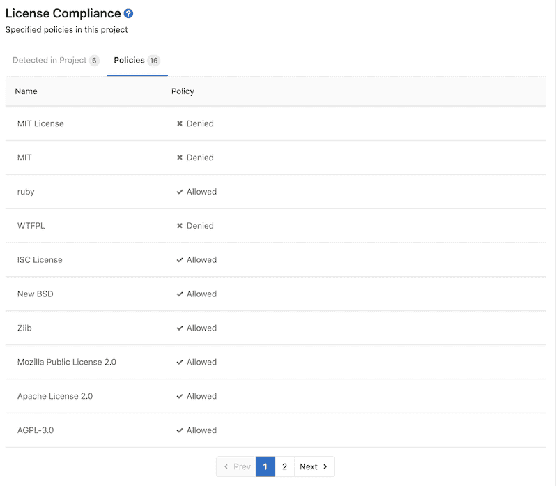

# License Compliance

> 原文：[https://docs.gitlab.com/ee/user/compliance/license_compliance/](https://docs.gitlab.com/ee/user/compliance/license_compliance/)

*   [Overview](#overview)
*   [Use cases](#use-cases)
*   [Supported languages and package managers](#supported-languages-and-package-managers)
    *   [Experimental support](#experimental-support)
*   [Requirements](#requirements)
*   [Configuration](#configuration)
    *   [Available variables](#available-variables)
    *   [Installing custom dependencies](#installing-custom-dependencies)
    *   [Overriding the template](#overriding-the-template)
    *   [Configuring Maven projects](#configuring-maven-projects)
        *   [Using private Maven repos](#using-private-maven-repos)
    *   [Selecting the version of Python](#selecting-the-version-of-python)
    *   [Custom root certificates for Python](#custom-root-certificates-for-python)
        *   [Using private Python repos](#using-private-python-repos)
    *   [Configuring NPM projects](#configuring-npm-projects)
        *   [Using private NPM registries](#using-private-npm-registries)
        *   [Custom root certificates for NPM](#custom-root-certificates-for-npm)
    *   [Configuring Yarn projects](#configuring-yarn-projects)
        *   [Using private Yarn registries](#using-private-yarn-registries)
        *   [Custom root certificates for Yarn](#custom-root-certificates-for-yarn)
    *   [Configuring Bower projects](#configuring-bower-projects)
        *   [Using private Bower registries](#using-private-bower-registries)
        *   [Custom root certificates for Bower](#custom-root-certificates-for-bower)
        *   [Using private Bundler registries](#using-private-bundler-registries)
        *   [Custom root certificates for Bundler](#custom-root-certificates-for-bundler)
    *   [Configuring Conan projects](#configuring-conan-projects)
        *   [Using private Conan registries](#using-private-conan-registries)
        *   [Custom root certificates for Conan](#custom-root-certificates-for-conan)
    *   [Configuring Go projects](#configuring-go-projects)
        *   [Using private Go registries](#using-private-go-registries)
        *   [Custom root certificates for Go](#custom-root-certificates-for-go)
        *   [Using private NuGet registries](#using-private-nuget-registries)
        *   [Custom root certificates for NuGet](#custom-root-certificates-for-nuget)
    *   [Migration from `license_management` to `license_scanning`](#migration-from-license_management-to-license_scanning)
*   [Running License Compliance in an offline environment](#running-license-compliance-in-an-offline-environment)
    *   [Requirements for offline License Compliance](#requirements-for-offline-license-compliance)
    *   [Make GitLab License Compliance analyzer images available inside your Docker registry](#make-gitlab-license-compliance-analyzer-images-available-inside-your-docker-registry)
    *   [Set License Compliance CI job variables to use local License Compliance analyzers](#set-license-compliance-ci-job-variables-to-use-local-license-compliance-analyzers)
*   [License list](#license-list)
*   [Policies](#policies)
    *   [Enabling License Approvals within a project](#enabling-license-approvals-within-a-project)
*   [Troubleshooting](#troubleshooting)
    *   [`ERROR -- : asdf: No preset version installed for command`](#error-----asdf-no-preset-version-installed-for-command)

# License Compliance[](#license-compliance-ultimate "Permalink")

[Introduced](https://gitlab.com/gitlab-org/gitlab/-/issues/5483) in [GitLab Ultimate](https://about.gitlab.com/pricing/) 11.0.

## Overview[](#overview "Permalink")

如果您使用的是[GitLab CI / CD](../../../ci/README.html) ，则可以使用许可证合规性在项目依赖项中搜索其许可证.

您可以通过[将作业包括](#configuration)在现有的`.gitlab-ci.yml`文件中，或者隐式使用[Auto DevOps](../../../topics/autodevops/index.html)提供的[自动](../../../topics/autodevops/index.html) [许可证合规性](../../../topics/autodevops/stages.html#auto-license-compliance-ultimate)来利用[许可证合规性](../../../topics/autodevops/stages.html#auto-license-compliance-ultimate) .

GitLab 检查"许可证合规性"报告，比较源分支机构和目标分支机构之间的许可证，并在合并请求中显示信息. 拒绝许可证将有清晰可见的`x`红色图标旁边还有哪些需要从你决定新的许可证. 此外，您可以在项目的许可证合规性政策部分中[手动允许或拒绝](#policies)许可证.

**注意：**如果许可证合规性报告没有可比较的内容，则合并请求区域中将不会显示任何信息. 第一次在`.gitlab-ci.yml`添加`license_scanning`作业时就是这种情况. 连续的合并请求将具有可比性，并且许可证合规性报告将正确显示.

[](img/license_compliance_v13_0.png)

如果您是项目或组维护者，则可以单击许可证以选择允许或拒绝.

[](img/license_compliance_decision_v13_0.png)

当 GitLab 检测到**拒绝的**许可证时，您可以在[许可证列表中](#license-list)查看它.

[](img/license_list_v13_0.png)

您可以从" [策略"](#policies)选项卡查看和修改现有策略.

[](img/policies_maintainer_edit_v13_2.png)

## Use cases[](#use-cases "Permalink")

It helps you find what licenses your project uses in its dependencies, and decide for each of then whether to allow it or forbid it. For example, your application is using an external (open source) library whose license is incompatible with yours.

## Supported languages and package managers[](#supported-languages-and-package-managers "Permalink")

支持以下语言和程序包管理器.

| Language | 包装经理 | 扫描工具 |
| --- | --- | --- |
| JavaScript | [Bower](https://bower.io/), [npm](https://s0www0npmjs0com.icopy.site/) | [License Finder](https://github.com/pivotal/LicenseFinder) |
| Go | [Godep](https://github.com/tools/godep), [go mod](https://github.com/golang/go/wiki/Modules) | [License Finder](https://github.com/pivotal/LicenseFinder) |
| Java | [Gradle](https://s0gradle0org.icopy.site/), [Maven](https://maven.apache.org/) | [License Finder](https://github.com/pivotal/LicenseFinder) |
| .NET | [Nuget](https://www.nuget.org/) （.NET Framework 通过[mono 项目](https://www.mono-project.com/)支持.目前不支持 Windows 特定的依赖项.） | [License Finder](https://github.com/pivotal/LicenseFinder) |
| Python | [pip](https://pip.pypa.io/en/stable/) （通过[requirements.txt](https://pip.pypa.io/en/stable/user_guide/#requirements-files)和[Pipfile.lock](https://github.com/pypa/pipfile#pipfilelock)支持 Python.） | [License Finder](https://github.com/pivotal/LicenseFinder) |
| Ruby | [gem](https://rubygems.org/) | [License Finder](https://github.com/pivotal/LicenseFinder) |
| 的 Objective-C，斯威夫特 | [Carthage](https://github.com/Carthage/Carthage) | [License Finder](https://github.com/pivotal/LicenseFinder) |

**Note:**

不支持 Java 8 和 Gradle 1.x 项目.

### Experimental support[](#experimental-support "Permalink")

[实验性支持](https://github.com/pivotal/LicenseFinder#experimental-project-types)以下语言和程序包管理器，这意味着报告的许可证可能不完整或不准确.

| Language | 包装经理 | 扫描工具 |
| --- | --- | --- |
| JavaScript | [yarn](https://yarnpkg.com/) | [License Finder](https://github.com/pivotal/LicenseFinder) |
| Go | 去获取，gvt，滑行，部门，垃圾，govendor | [License Finder](https://github.com/pivotal/LicenseFinder) |
| Erlang | [rebar](https://www.rebar3.org/) | [License Finder](https://github.com/pivotal/LicenseFinder) |
| 的 Objective-C，斯威夫特 | [CocoaPods](https://cocoapods.org/) v0.39 及以下 | [License Finder](https://github.com/pivotal/LicenseFinder) |
| Elixir | [mix](https://s0elixir-lang0org.icopy.site/getting-started/mix-otp/introduction-to-mix.html) | [License Finder](https://github.com/pivotal/LicenseFinder) |
| C++/C | [conan](https://conan.io/) | [License Finder](https://github.com/pivotal/LicenseFinder) |
| Scala | [sbt](https://www.scala-sbt.org/) | [License Finder](https://github.com/pivotal/LicenseFinder) |
| Rust | [cargo](https://crates.io) | [License Finder](https://github.com/pivotal/LicenseFinder) |
| PHP | [composer](https://s0getcomposer0org.icopy.site/) | [License Finder](https://github.com/pivotal/LicenseFinder) |

## Requirements[](#requirements "Permalink")

要运行许可证合规性扫描作业，您需要具有[`docker` executor 的](https://docs.gitlab.com/runner/executors/docker.html) GitLab Runner.

## Configuration[](#configuration "Permalink")

对于 GitLab 12.8 及更高版本，要启用许可证合规性，您必须[包括](../../../ci/yaml/README.html#includetemplate)在 GitLab 安装过程中提供的[`License-Scanning.gitlab-ci.yml`模板](https://gitlab.com/gitlab-org/gitlab/blob/master/lib/gitlab/ci/templates/Security/License-Scanning.gitlab-ci.yml) . 对于从 11.9 到 12.7 的较旧版本的 GitLab，您必须[包括](../../../ci/yaml/README.html#includetemplate) [`License-Management.gitlab-ci.yml`模板](https://gitlab.com/gitlab-org/gitlab/blob/master/lib/gitlab/ci/templates/Security/License-Management.gitlab-ci.yml) . 对于 11.9 之前的 GitLab 版本，您可以复制和使用该模板中定义的作业.

**注意：** GitLab 13.0 删除了`License-Management.gitlab-ci.yml`模板. 请改用`License-Scanning.gitlab-ci.yml` .

将以下内容添加到您的`.gitlab-ci.yml`文件中：

```
include:
  - template: License-Scanning.gitlab-ci.yml 
```

The included template will create a `license_scanning` job in your CI/CD pipeline and scan your dependencies to find their licenses.

**注意：**在 GitLab 12.8 之前， `license_scanning`作业名为`license_management` . GitLab 13.0 删除了`license_management`作业，因此建议您迁移到`license_scanning`作业，并使用新的`License-Scanning.gitlab-ci.yml`模板.

结果将保存为" [许可证合规性"报告工件](../../../ci/pipelines/job_artifacts.html#artifactsreportslicense_scanning-ultimate) ，您以后可以下载和分析该[工件](../../../ci/pipelines/job_artifacts.html#artifactsreportslicense_scanning-ultimate) . 由于实施限制，我们始终采用最新的许可证合规性工件. 在后台， [GitLab 许可证合规性 Docker 映像](https://gitlab.com/gitlab-org/security-products/license-management)用于检测语言/框架，进而分析许可证.

可以使用`.gitlab-ci.yml`的[`variables`](../../../ci/yaml/README.html#variables)参数通过[环境变量](#available-variables)来更改许可合规性设置.

### Available variables[](#available-variables "Permalink")

可以使用环境变量来配置许可证合规性.

| 环境变量 | Required | Description |
| --- | --- | --- |
| `ADDITIONAL_CA_CERT_BUNDLE` | no | 捆绑的可信 CA 证书（当前在 Pip，Pipenv，Maven，Gradle，Yarn 和 NPM 项目中受支持）. |
| `ASDF_JAVA_VERSION` | no | 用于扫描的 Java 版本. |
| `ASDF_NODEJS_VERSION` | no | 用于扫描的 Node.js 版本. |
| `ASDF_PYTHON_VERSION` | no | 用于扫描的 Python 版本. |
| `ASDF_RUBY_VERSION` | no | 用于扫描的 Ruby 版本. |
| `GRADLE_CLI_OPTS` | no | gradle 可执行文件的其他参数. 如果未提供，则默认为`--exclude-task=test` . |
| `LICENSE_FINDER_CLI_OPTS` | no | `license_finder`可执行文件的其他参数. 例如，如果您的项目同时在不同的目录中存储了 Golang 和 Ruby 代码，并且您只想扫描 Ruby 代码，则可以更新`.gitlab-ci-yml`模板以指定要扫描的项目目录，例如`LICENSE_FINDER_CLI_OPTS: '--debug --aggregate-paths=. ruby'` `LICENSE_FINDER_CLI_OPTS: '--debug --aggregate-paths=. ruby'` . |
| `LM_JAVA_VERSION` | no | Java 版本. 如果设置为`11` ，则 Maven 和 Gradle 使用 Java 11 而不是 Java 8. |
| `LM_PYTHON_VERSION` | no | Python 版本. 如果设置为`3` ，则将使用 Python 3 而非 Python 2.7 安装依赖项. |
| `MAVEN_CLI_OPTS` | no | mvn 可执行文件的附加参数. 如果未提供，则默认为`-DskipTests` . |
| `PIP_INDEX_URL` | no | Python 软件包索引的基本 URL（默认值： `https://pypi.org/simple/` : `https://pypi.org/simple/` ）. |
| `SECURE_ANALYZERS_PREFIX` | no | 设置 Docker 注册表基地址以从中下载分析器. |
| `SETUP_CMD` | no | 依赖项安装的自定义设置（实验性）. |

### Installing custom dependencies[](#installing-custom-dependencies "Permalink")

在[GitLab Ultimate](https://about.gitlab.com/pricing/) 11.4 中引入.

`license_management`映像已经嵌入了许多自动检测脚本，语言和软件包. 但是，几乎不可能涵盖所有项目的所有案例. 这就是为什么有时需要安装额外的程序包，或在项目自动设置中进行额外步骤的原因，例如证书的下载和安装. 为此，可以将`LICENSE_MANAGEMENT_SETUP_CMD`环境变量与所需的命令一起传递到容器，以在许可证检测之前运行.

如果存在，则此变量将覆盖安装应用程序所有软件包所必需的设置步骤（例如：对于具有`Gemfile`的项目，设置步骤可以为`bundle install` ）.

例如：

```
include:
  - template: License-Scanning.gitlab-ci.yml

variables:
  LICENSE_MANAGEMENT_SETUP_CMD: sh my-custom-install-script.sh 
```

在此示例中， `my-custom-install-script.sh`是项目根目录下的 shell 脚本.

### Overriding the template[](#overriding-the-template "Permalink")

**弃用：**从 GitLab 13.0 开始，不再支持[`only`和`except`](../../../ci/yaml/README.html#onlyexcept-basic)的使用. 覆盖模板时，必须使用[`rules`](../../../ci/yaml/README.html#rules) .

如果要覆盖作业定义（例如，更改诸如`variables`或`dependencies`类的属性），则需要在包含模板之后声明一个`license_scanning`作业，并在其下指定任何其他键. 例如：

```
include:
  - template: License-Scanning.gitlab-ci.yml

license_scanning:
  variables:
    CI_DEBUG_TRACE: "true" 
```

### Configuring Maven projects[](#configuring-maven-projects "Permalink")

许可证合规性工具提供了一个`MAVEN_CLI_OPTS`环境变量，该变量可以保存命令行参数，以传递给在`MAVEN_CLI_OPTS`执行的`mvn install`命令. 随意使用它来定制 Maven 执行. 例如：

```
include:
  - template: License-Scanning.gitlab-ci.yml

license_scanning:
  variables:
    MAVEN_CLI_OPTS: --debug 
```

`mvn install`过所有的运行[构建生命周期](http://maven.apache.org/guides/introduction/introduction-to-the-lifecycle.html)前阶段的`install` ，包括`test` . 出于许可证扫描的目的，运行单元测试不是直接必要的，并且会浪费时间，因此可以通过将`MAVEN_CLI_OPTS`的默认值`MAVEN_CLI_OPTS`为`-DskipTests`跳过它. 如果要提供自定义的`MAVEN_CLI_OPTS`并同时跳过测试，请不要忘记将`-DskipTests`显式添加到您的选项中. 如果在`mvn install`期间仍然需要运行测试，则将`-DskipTests=false`添加到`MAVEN_CLI_OPTS` .

#### Using private Maven repos[](#using-private-maven-repos "Permalink")

如果您有需要登录凭据的私有 Maven 存储库，则可以使用`MAVEN_CLI_OPTS`环境变量.

阅读更多有关[如何使用私有 Maven 仓库的信息](../../application_security/index.html#using-private-maven-repos) .

您还可以使用`MAVEN_CLI_OPTS`连接到使用自签名或内部受信任证书的受信任 Maven 存储库. 例如：

```
include:
  - template: License-Scanning.gitlab-ci.yml

license_scanning:
  variables:
    MAVEN_CLI_OPTS: -Dmaven.wagon.http.ssl.allowall=true -Dmaven.wagon.http.ssl.ignore.validity.dates=true -Dmaven.wagon.http.ssl.insecure=true 
```

或者，您可以使用 Java 密钥存储来验证 TLS 连接. 有关如何生成密钥存储文件的说明，请参阅《 [Maven 通过身份验证的 HTTPS 进行远程存储库访问指南》](http://maven.apache.org/guides/mini/guide-repository-ssl.html) .

### Selecting the version of Python[](#selecting-the-version-of-python "Permalink")

版本历史

*   在[GitLab Ultimate](https://about.gitlab.com/pricing/) 12.0 中[引入](https://gitlab.com/gitlab-org/security-products/license-management/-/merge_requests/36) .
*   在[GitLab 12.2 中](https://gitlab.com/gitlab-org/gitlab/-/issues/12032) ，Python 3.5 成为默认设置.
*   在[GitLab 12.7 中](https://gitlab.com/gitlab-org/security-products/license-management/-/merge_requests/101) ，Python 3.8 成为默认设置.

默认情况下，许可证合规性使用 Python 3.8 和 pip 19.1\. 如果您的项目需要 Python 2，则可以通过将`LM_PYTHON_VERSION`环境变量设置为`2`来切换到 Python 2.7 和 pip 10.0.

```
include:
  - template: License-Scanning.gitlab-ci.yml

license_scanning:
  variables:
    LM_PYTHON_VERSION: 2 
```

### Custom root certificates for Python[](#custom-root-certificates-for-python "Permalink")

您可以使用`ADDITIONAL_CA_CERT_BUNDLE` [环境变量](#available-variables)提供自定义根证书来完成 TLS 验证.

要绕过 TLS 验证，可以使用自定义[`pip.conf`](https://pip.pypa.io/en/stable/user_guide/#config-file)文件来配置受信任的主机.

以下`gitlab-ci.yml`文件使用[`before_script`](../../../ci/yaml/README.html#before_script-and-after_script)注入自定义[`pip.conf`](https://pip.pypa.io/en/stable/user_guide/#config-file) ：

```
include:
  - template: License-Scanning.gitlab-ci.yml

license_scanning:
  variables:
    PIP_INDEX_URL: 'https://pypi.example.com/simple/'
  before_script:
    - mkdir -p ~/.config/pip/
    - cp pip.conf ~/.config/pip/pip.conf 
```

[`pip.conf`](https://pip.pypa.io/en/stable/reference/pip/)允许您指定[受信任主机](https://pip.pypa.io/en/stable/reference/pip/#cmdoption-trusted-host)的列表：

```
[global]
trusted-host = pypi.example.com 
```

#### Using private Python repos[](#using-private-python-repos "Permalink")

如果您拥有专用的 Python 存储库，则可以使用`PIP_INDEX_URL` [环境变量](#available-variables)来指定其位置. 也可以提供自定义的`pip.conf`进行[其他配置](#custom-root-certificates-for-python) .

### Configuring NPM projects[](#configuring-npm-projects "Permalink")

您可以使用[`.npmrc`](https://s0docs0npmjs0com.icopy.site/configuring-npm/npmrc.html)文件配置 NPM 项目.

#### Using private NPM registries[](#using-private-npm-registries "Permalink")

如果您有私有 NPM 注册表，则可以使用[`registry`](https://s0docs0npmjs0com.icopy.site/using-npm/config)设置来指定其位置.

例如：

```
registry = https://npm.example.com 
```

#### Custom root certificates for NPM[](#custom-root-certificates-for-npm "Permalink")

您可以使用`ADDITIONAL_CA_CERT_BUNDLE` [环境变量](#available-variables)提供自定义根证书来完成 TLS 验证.

要禁用 TLS 验证，您可以提供[`strict-ssl`](https://s0docs0npmjs0com.icopy.site/using-npm/config)设置.

例如：

```
strict-ssl = false 
```

### Configuring Yarn projects[](#configuring-yarn-projects "Permalink")

您可以使用[`.yarnrc.yml`](https://yarnpkg.com/configuration/yarnrc)文件配置 Yarn 项目.

#### Using private Yarn registries[](#using-private-yarn-registries "Permalink")

如果您有专用的 Yarn 注册表，则可以使用[`npmRegistryServer`](https://yarnpkg.com/configuration/yarnrc#npmRegistryServer)设置来指定其位置.

例如：

```
npmRegistryServer: "https://npm.example.com" 
```

#### Custom root certificates for Yarn[](#custom-root-certificates-for-yarn "Permalink")

您可以使用`ADDITIONAL_CA_CERT_BUNDLE` [环境变量](#available-variables)提供自定义根证书来完成 TLS 验证.

### Configuring Bower projects[](#configuring-bower-projects "Permalink")

您可以使用[`.bowerrc`](https://bower.io/docs/config/#bowerrc-specification)文件配置 Bower 项目.

#### Using private Bower registries[](#using-private-bower-registries "Permalink")

如果您有专用的 Bower 注册表，则可以使用[`registry`](https://bower.io/docs/config/#bowerrc-specification)设置来指定其位置.

例如：

```
{
  "registry": "https://registry.bower.io"
} 
```

#### Custom root certificates for Bower[](#custom-root-certificates-for-bower "Permalink")

您可以使用`ADDITIONAL_CA_CERT_BUNDLE` [环境变量](#available-variables)或在[`.bowerrc`](https://bower.io/docs/config/#bowerrc-specification)文件中指定`ca`设置来提供自定义根证书来完成 TLS 验证.

#### Using private Bundler registries[](#using-private-bundler-registries "Permalink")

如果您有私人的 Bundler 注册表，则可以使用[`source`](https://bundler.io/man/gemfile.5.html#GLOBAL-SOURCES)设置来指定其位置.

例如：

```
source "https://gems.example.com" 
```

#### Custom root certificates for Bundler[](#custom-root-certificates-for-bundler "Permalink")

您可以使用`ADDITIONAL_CA_CERT_BUNDLE` [环境变量](#available-variables)或在作业定义中指定[`BUNDLE_SSL_CA_CERT`](https://bundler.io/v2.0/man/bundle-config.1.html) [环境变量](../../../ci/variables/README.html#custom-environment-variables)来提供自定义根证书来完成 TLS 验证.

### Configuring Conan projects[](#configuring-conan-projects "Permalink")

您可以通过将`.conan`目录添加到项目根目录来配置[Conan](https://conan.io/)项目. 项目根用作[`CONAN_USER_HOME`](https://docs.conan.io/en/latest/reference/env_vars.html#conan-user-home) .

Consult the [Conan](https://docs.conan.io/en/latest/reference/config_files/conan.conf.html#conan-conf) documentation for a list of settings that you can apply.

`license_scanning`作业在[Debian 10](https://www.debian.org/releases/buster/) Docker 映像中运行. 提供的映像附带了一些构建工具，例如[CMake](https://cmake.org/)和[GCC](https://gcc.gnu.org/) . 但是，默认情况下不支持所有项目类型. 要安装编译依赖关系所需的其他工具，请使用[`before_script`](../../../ci/yaml/README.html#before_script-and-after_script)使用[`apt`](https://wiki.debian.org/PackageManagementTools)软件包管理器安装必要的构建工具. 有关完整列表，请参阅[柯南文档](https://docs.conan.io/en/latest/introduction.html#all-platforms-all-build-systems-and-compilers) .

默认的[柯南](https://conan.io/)配置将[`CONAN_LOGIN_USERNAME`](https://docs.conan.io/en/latest/reference/env_vars.html#conan-login-username-conan-login-username-remote-name)设置为`ci_user` ，并将[`CONAN_PASSWORD`](https://docs.conan.io/en/latest/reference/env_vars.html#conan-password-conan-password-remote-name)绑定到[`CI_JOB_TOKEN`](../../../ci/variables/predefined_variables.html)以用于正在运行的作业. 如果在`.conan/remotes.json`文件中指定了 GitLab 遥控器，则这允许 Conan 项目从[GitLab 科南存储库中](../../packages/conan_repository/#fetching-conan-package-information-from-the-gitlab-package-registry)获取软件包.

要覆盖默认凭据，请指定一个[`CONAN_LOGIN_USERNAME_{REMOTE_NAME}`](https://docs.conan.io/en/latest/reference/env_vars.html#conan-login-username-conan-login-username-remote-name)与`.conan/remotes.json`文件中指定的远程名称匹配.

**注意：**不支持[MSBuild](https://github.com/mono/msbuild#microsoftbuild-msbuild)项目. `license_scanning`映像随[Mono](https://www.mono-project.com/)和[MSBuild 一起提供](https://github.com/mono/msbuild#microsoftbuild-msbuild) . 可能需要其他设置才能生成此项目配置的软件包.

#### Using private Conan registries[](#using-private-conan-registries "Permalink")

默认情况下， [柯南](https://conan.io/)使用[柯南](https://conan.io/) `conan-center`遥控器. 例如：

```
{  "remotes":  [  {  "name":  "conan-center",  "url":  "https://conan.bintray.com",  "verify_ssl":  true  }  ]  } 
```

要从备用远程获取依赖项，请在`.conan/remotes.json`指定该远程. 例如：

```
{  "remotes":  [  {  "name":  "gitlab",  "url":  "https://gitlab.com/api/v4/packages/conan",  "verify_ssl":  true  }  ]  } 
```

如果需要使用凭据进行身份验证，则可以按照[`CONAN_LOGIN_USERNAME`文档中](https://docs.conan.io/en/latest/reference/env_vars.html#conan-login-username-conan-login-username-remote-name)描述的命名约定配置[受保护的变量](../../../ci/variables/README.html#protect-a-custom-variable) .

#### Custom root certificates for Conan[](#custom-root-certificates-for-conan "Permalink")

您可以通过将`.conan/cacert.pem`文件添加到项目根目录并将[`CA_CERT_PATH`](https://docs.conan.io/en/latest/reference/env_vars.html#conan-cacert-path)设置为`.conan/cacert.pem`来提供自定义证书.

如果您指定`ADDITIONAL_CA_CERT_BUNDLE` [环境变量](#available-variables) ，则此变量的 X.509 证书将安装在 Docker 映像的默认信任库中，并且 Conan 配置为将其用作默认`CA_CERT_PATH` .

### Configuring Go projects[](#configuring-go-projects "Permalink")

要配置基于[Go 模块](https://github.com/golang/go/wiki/Modules)的项目，请在`.gitlab-ci.yml`的`license_scanning`作业的[变量](#available-variables)部分中指定[环境变量](https://s0golang0org.icopy.site/pkg/cmd/go/) .

如果项目已[供应了](https://s0golang0org.icopy.site/pkg/cmd/go/)其模块，则使用`vendor`目录和`mod.sum`文件的组合来检测与 Go 模块依赖关系相关的软件许可证.

#### Using private Go registries[](#using-private-go-registries "Permalink")

您可以使用[`GOPRIVATE`](https://s0golang0org.icopy.site/pkg/cmd/go/)和[`GOPROXY`](https://s0golang0org.icopy.site/pkg/cmd/go/)环境变量来控制模块的来源. 另外，您可以使用[`go mod vendor`](https://s0golang0org.icopy.site/ref/mod)来供应项目的模块.

#### Custom root certificates for Go[](#custom-root-certificates-for-go "Permalink")

您可以通过导出[`GOFLAGS`](https://s0golang0org.icopy.site/cmd/go/)环境变量来指定[`-insecure`](https://s0golang0org.icopy.site/pkg/cmd/go/internal/get/)标志. 例如：

```
include:
  - template: License-Scanning.gitlab-ci.yml

license_scanning:
  variables:
    GOFLAGS: '-insecure' 
```

#### Using private NuGet registries[](#using-private-nuget-registries "Permalink")

如果您拥有私有的 NuGet 注册表，则可以通过将其添加到[`nuget.config`](https://docs.microsoft.com/en-us/nuget/reference/nuget-config-file)文件的[`packageSources`](https://docs.microsoft.com/en-us/nuget/reference/nuget-config-file#package-source-sections)部分中来将其添加为源.

例如：

```
<?xml version="1.0" encoding="utf-8"?>
<configuration>
  <packageSources>
    <clear />
    <add key="custom" value="https://nuget.example.com/v3/index.json" />
  </packageSources>
</configuration> 
```

#### Custom root certificates for NuGet[](#custom-root-certificates-for-nuget "Permalink")

您可以使用`ADDITIONAL_CA_CERT_BUNDLE` [环境变量](#available-variables)提供自定义根证书来完成 TLS 验证.

### Migration from `license_management` to `license_scanning`[](#migration-from-license_management-to-license_scanning "Permalink")

在 GitLab 12.8 中，引入了`license_management`作业的新名称. 进行此更改是为了提高扫描目的的清晰度，即扫描并收集项目依赖项中存在的许可证类型. GitLab 13.0 放弃了对`license_management`支持. 如果您使用自定义设置来实现"许可证合规性"，则需要相应地更新 CI 配置：

1.  将 CI 模板更改为`License-Scanning.gitlab-ci.yml` .
2.  将作业名称更改为`license_scanning` （如果在`.gitlab-ci.yml`提到了该`.gitlab-ci.yml` ）.
3.  将工件名称更改为`license_scanning` ，并将文件名称更改为`gl-license-scanning-report.json` （如果在`.gitlab-ci.yml`中`.gitlab-ci.yml` ）.

例如，以下`.gitlab-ci.yml` ：

```
include:
  - template: License-Management.gitlab-ci.yml

license_management:
  artifacts:
    reports:
      license_management: gl-license-management-report.json 
```

应更改为：

```
include:
  - template: License-Scanning.gitlab-ci.yml

license_scanning:
  artifacts:
    reports:
      license_scanning: gl-license-scanning-report.json 
```

如果您在 GitLab 13.0 或更高版本中使用`license_management`工件，则"许可证合规性"作业将产生以下错误：

```
WARNING: Uploading artifacts to coordinator... failed id=:id responseStatus=400 Bad Request status=400 Bad Request token=:sha

FATAL: invalid_argument 
```

如果遇到此错误，请按照本节中的说明进行操作.

## Running License Compliance in an offline environment[](#running-license-compliance-in-an-offline-environment "Permalink")

对于在通过互联网有限，受限或间歇性访问外部资源的环境中进行自我管理的 GitLab 实例，需要进行一些调整才能成功运行许可合规性工作. 有关更多信息，请参阅[脱机环境](../../application_security/offline_deployments/index.html) .

### Requirements for offline License Compliance[](#requirements-for-offline-license-compliance "Permalink")

要在离线环境中使用许可证合规性，您需要：

*   GitLab 亚军与[`docker`或`kubernetes`执行](#requirements) .
*   Docker 容器注册表，其中包含许可证合规性[分析器](https://gitlab.com/gitlab-org/security-products/analyzers)映像的本地可用副本.

**注意：** GitLab Runner 的[默认`pull policy`为`always`](https://docs.gitlab.com/runner/executors/docker.html) ，这意味着即使本地副本可用，Runner 也会尝试从 GitLab 容器注册表中拉取 Docker 映像. 如果您只喜欢使用本地可用的 Docker 映像，则可以在离线环境[`pull_policy`](https://docs.gitlab.com/runner/executors/docker.html) GitLab Runner 的[`pull_policy`设置为`if-not-present`](https://docs.gitlab.com/runner/executors/docker.html) . 但是，如果不在离线环境中，我们建议将拉取策略设置保持为`always` ，因为这样可以在 CI / CD 管道中使用更新的扫描仪.

### Make GitLab License Compliance analyzer images available inside your Docker registry[](#make-gitlab-license-compliance-analyzer-images-available-inside-your-docker-registry "Permalink")

要使用所有[支持的语言和程序包管理器进行](#supported-languages-and-package-managers)许可证合规性检查，请将以下默认许可证合规性分析器映像从`registry.gitlab.com`导入到您的离线[本地 Docker 容器注册表中](../../packages/container_registry/index.html) ：

```
registry.gitlab.com/gitlab-org/security-products/license-management:latest 
```

将 Docker 映像导入本地脱机 Docker 注册表的过程取决于**您的网络安全策略** . 请咨询您的 IT 员工，以找到可以导入或临时访问外部资源的已接受和批准的流程. 请注意，这些扫描程序会[定期](../../application_security/index.html#maintenance-and-update-of-the-vulnerabilities-database)使用新定义进行[更新](../../application_security/index.html#maintenance-and-update-of-the-vulnerabilities-database) ，因此请考虑您是否能够自己进行定期更新.

有关将 Docker 映像保存和传输为文件的详细信息，请参阅 Docker 有关[`docker save`](https://s0docs0docker0com.icopy.site/engine/reference/commandline/save/) ， [`docker load`](https://s0docs0docker0com.icopy.site/engine/reference/commandline/load/) ， [`docker export`](https://s0docs0docker0com.icopy.site/engine/reference/commandline/export/)和[`docker import`](https://s0docs0docker0com.icopy.site/engine/reference/commandline/import/)的文档.

### Set License Compliance CI job variables to use local License Compliance analyzers[](#set-license-compliance-ci-job-variables-to-use-local-license-compliance-analyzers "Permalink")

将以下配置添加到您的`.gitlab-ci.yml`文件. 您必须替换`image`以引用本地 Docker 容器注册表中托管的 License Compliance Docker 映像：

```
include:
  - template: License-Scanning.gitlab-ci.yml

license_scanning:
  image:
    name: localhost:5000/analyzers/license-management:latest 
```

现在，"许可证合规性"作业应使用"许可证合规性"分析器的本地副本来扫描您的代码并生成安全报告，而无需访问 Internet.

连接到[私有 Bower 注册表](#using-private-bower-registries) ， [私有 Bundler 注册表](#using-private-bundler-registries) ， [私有 Conan 注册表](#using-private-bower-registries) ， [私有 Go 注册表](#using-private-go-registries) ， [私有 Maven 仓库](#using-private-maven-repos) ， [私有 NPM 注册表](#using-private-npm-registries) ， [私有 Python 仓库](#using-private-python-repos)和[私有 Yarn 注册表时](#using-private-yarn-registries) ，可能需要附加配置.

在脱机环境中运行时， [项目策略](#policies)必须与名称完全匹配（ [请参阅相关问题](https://gitlab.com/gitlab-org/gitlab/-/issues/212388) ）.

## License list[](#license-list "Permalink")

[Introduced](https://gitlab.com/gitlab-org/gitlab/-/issues/13582) in [GitLab Ultimate](https://about.gitlab.com/pricing/) 12.7.

许可证列表允许您查看项目的许可证以及有关许可证的关键详细信息.

为了使许可证出现在许可证列表下，必须满足以下要求：

1.  必须为您的项目[配置](#configuration)许可证合规性 CI 作业.
2.  您的项目必须至少使用一种[受支持的语言和程序包管理器](#supported-languages-and-package-managers) .

设置完所有内容后，请在项目的侧边栏中导航至" **安全性和合规性">"许可证合规性"** ，您将看到显示的许可证，其中：

*   **名称：**许可证名称.
*   **Component:** The components which have this license.
*   **违反政策：**许可证的[许可证政策](#policies)标记为**拒绝** .

[](img/license_list_v13_0.png)

## Policies[](#policies "Permalink")

[Introduced](https://gitlab.com/gitlab-org/gitlab/-/merge_requests/22465) in [GitLab Ultimate](https://about.gitlab.com/pricing/) 12.9.

通过" **策略"**选项卡，您可以查看项目的软件许可证策略以及每个策略的关联分类.

可以由项目的维护者配置策略.

[](img/policies_maintainer_edit_v13_2.png) [](img/policies_maintainer_add_v13_2.png)

项目的开发人员可以查看项目中配置的策略.

[](img/policies_v13_0.png)

### Enabling License Approvals within a project[](#enabling-license-approvals-within-a-project "Permalink")

[Introduced](https://gitlab.com/gitlab-org/gitlab/-/issues/13067) in [GitLab Ultimate](https://about.gitlab.com/pricing/) 12.3.

`License-Check`是一个批准规则，您可以启用它来允许批准人，个人或组批准包含`denied`许可证的合并请求.

您可以启用`License-Check`的两种方式之一：

*   使用区分大小写的名称`License-Check`创建[项目批准规则](../../project/merge_requests/merge_request_approvals.html#multiple-approval-rules-premium) .
*   在[项目策略部分中为许可合规](#policies)创建批准组. 您必须将此批准组的所需批准数量设置为大于零. 在项目中启用该组后，将为所有合并请求启用批准规则.

任何代码更改都会导致重置所需的批准.

许可证报告如下时，需要批准：

*   包含包含被`denied`的软件许可证的依赖项.
*   在管道执行期间未生成.

许可证报告如下时，批准是可选的：

*   不包含任何违反软件许可证的行为.
*   Contains only new licenses that are `allowed` or unknown.

## Troubleshooting[](#troubleshooting "Permalink")

### `ERROR -- : asdf: No preset version installed for command`[](#error-----asdf-no-preset-version-installed-for-command "Permalink")

当项目使用的工具的版本与`license_scanning` Docker 映像中可用的预安装工具的版本不匹配时，会发生此错误. `license_scanning`作业使用[asdf-vm](https://asdf-vm.com/)来激活项目所依赖的工具的适当版本. 例如，如果您的项目依赖于特定版本的[Node.js](https://s0nodejs0org.icopy.site/)或任何其他受支持的工具，则可以通过向项目中添加[`.tool-versions`](https://asdf-vm.com/#/core-configuration?id=tool-versions)文件或使用适当的[`ASDF_<tool>_VERSION`](https://asdf-vm.com/#/core-configuration?id=environment-variables)环境变量来激活所需的版本，从而指定所需的版本.适当的版本.

例如，以下`.tool-versions`文件将激活[Node.js 的](https://s0nodejs0org.icopy.site/) `12.16.3`版和[Ruby 的](https://www.ruby-lang.org/) `2.6.6`版.

```
nodejs 12.16.3
ruby 2.6.6 
```

下一个示例显示如何通过使用项目的`.gitlab-ci.yml`文件中定义的环境变量来激活上述工具的相同版本.

```
include:
  - template: License-Scanning.gitlab-ci.yml

license_scanning:
  variables:
    ASDF_NODEJS_VERSION: '12.16.3'
    ASDF_RUBY_VERSION: '2.6.6' 
```

完整的变量列表可以在[环境变量中](#available-variables)找到.

要了解在`license_scanning` Docker 映像中预安装了哪些工具，请使用以下命令：

```
$ docker run --entrypoint='' registry.gitlab.com/gitlab-org/security-products/analyzers/license-finder:3 /bin/bash -lc 'asdf list'
golang
  1.14
gradle
  6.3
java
  adopt-openjdk-11.0.7+10
  adopt-openjdk-8u242-b08
maven
  3.6.3
nodejs
  10.20.1
  12.16.3
php
  7.4.5
python
  2.7.18
  3.8.2
ruby
  2.6.6
sbt
  1.3.8 
```

要与`license_scanning`运行时环境进行交互，请使用以下命令：

```
$ docker run -it --entrypoint='' registry.gitlab.com/gitlab-org/security-products/analyzers/license-finder:3 /bin/bash -l
root@6abb70e9f193:~# 
```

**注意：**当前不支持选择[Mono](https://www.mono-project.com/)或[.NET Core](https://dotnet.microsoft.com/download/dotnet-core)的自定义版本.