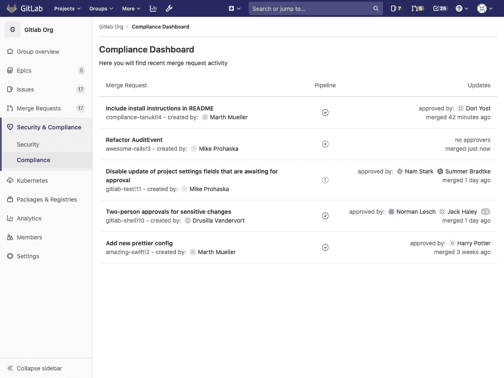

# Compliance Dashboard

> 原文：[https://docs.gitlab.com/ee/user/compliance/compliance_dashboard/](https://docs.gitlab.com/ee/user/compliance/compliance_dashboard/)

*   [Overview](#overview)
*   [Use cases](#use-cases)
*   [Permissions](#permissions)

# Compliance Dashboard

[Introduced](https://gitlab.com/gitlab-org/gitlab/-/issues/36524) in [GitLab Ultimate](https://about.gitlab.com/pricing/) 12.8.

Compliance Dashboard 通过为组中的所有项目提供高级视图，使您能够查看组的"合并请求"活动. 例如，批准用于合并的代码.

## Overview

要访问组的合规性仪表板，请导航至 组菜单上的" **安全性和合规性">"合规性** ".

## Use cases

此功能适用于关心团队中项目的合规性状态的人员.

您可以使用仪表板执行以下操作：

*   概述每个项目的最新合并请求.
*   查看合并请求是否被批准以及由谁批准.
*   请参阅合并请求作者.
*   查看每个合并请求的最新[CI 管道](../../../ci/pipelines/index.html)结果.

## Permissions

*   On [GitLab Ultimate](https://about.gitlab.com/pricing/) tier.
*   By **Administrators** and **集团所有者**.