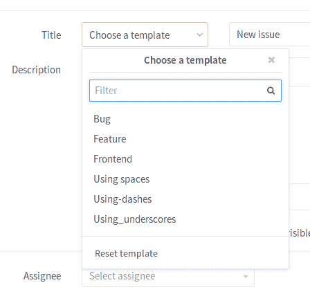
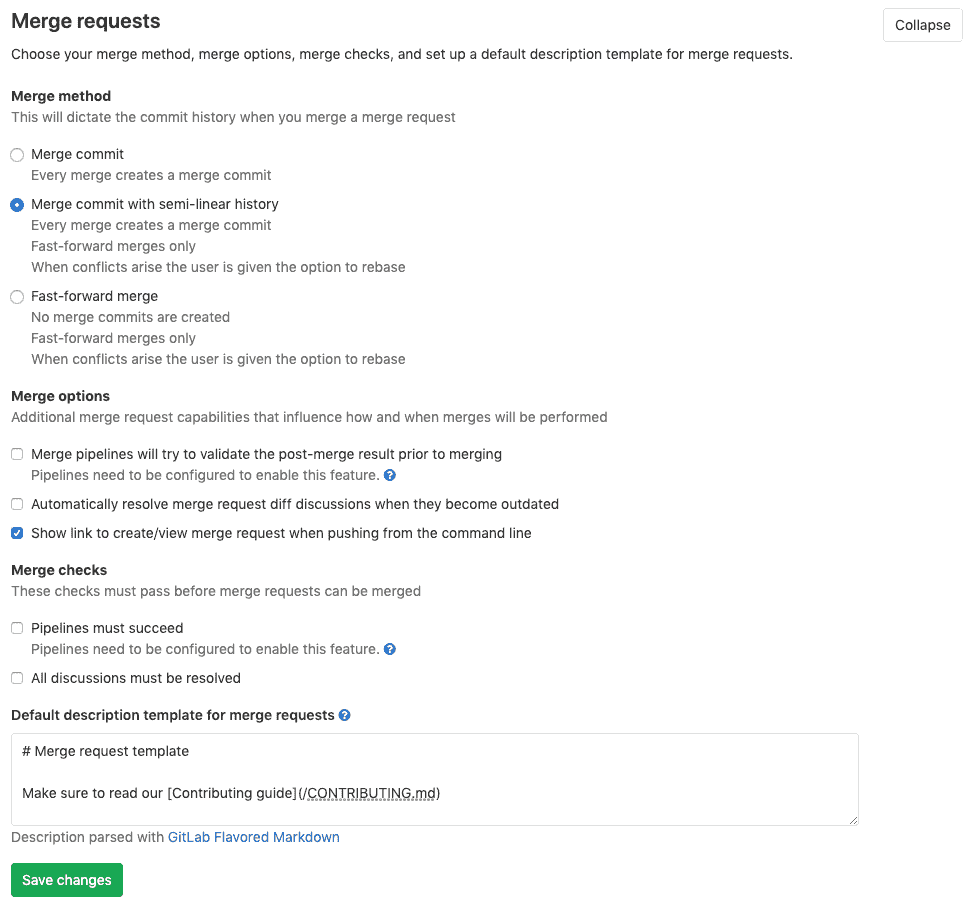
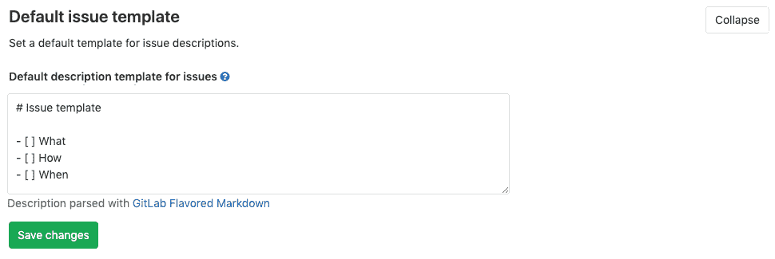

# Description templates

> 原文：[https://docs.gitlab.com/ee/user/project/description_templates.html](https://docs.gitlab.com/ee/user/project/description_templates.html)

*   [Overview](#overview)
*   [Use-cases](#use-cases)
*   [Creating issue templates](#creating-issue-templates)
*   [Creating merge request templates](#creating-merge-request-templates)
*   [Using the templates](#using-the-templates)
*   [Setting a default template for merge requests and issues](#setting-a-default-template-for-merge-requests-and-issues-starter)
*   [Description template example](#description-template-example)

# Description templates[](#description-templates "Permalink")

在 GitLab 8.11 中[引入](https://gitlab.com/gitlab-org/gitlab-foss/-/merge_requests/4981) .

我们都知道，项目开发人员更有可能及时解决提交的问题.

使用描述模板，您可以为问题定义特定于上下文的模板，并为项目合并请求描述字段，并帮助从问题中过滤掉许多不必要的噪音.

## Overview[](#overview "Permalink")

通过使用描述模板，创建新发行或合并请求的用户可以选择描述模板，以帮助他们与其他贡献者进行有效沟通.

每个 GitLab 项目都可以定义自己的一组描述模板，这些模板将被添加到 GitLab 项目存储库的根目录中.

描述模板必须用[Markdown](../markdown.html)编写，并存储在项目的存储库中的`.gitlab`目录下. 仅考虑默认分支的模板.

## Use-cases[](#use-cases "Permalink")

*   添加一个模板，该模板将用于特定项目的每个问题，并提供说明和指南，要求提供特定于该主题的信息. 例如，如果您有一个用于跟踪新博客文章的项目，则可以要求标题，大纲，作者姓名，作者社交媒体信息等等.
*   在前面的示例之后，您可以为随新博客帖子提交的每个 MR 创建模板，要求提供有关帖子日期，前事数据，图像准则，相关问题的链接，审阅者姓名等信息.
*   您还可以为工作流的不同阶段创建问题并合并请求模板，例如功能建议，功能改进或错误报告.

## Creating issue templates[](#creating-issue-templates "Permalink")

在存储库的`.gitlab/issue_templates/`目录内创建一个新的 Markdown（ `.md` ）文件. 提交并推送到您的默认分支.

To create a Markdown file:

1.  单击`master`旁边的`+`按钮，然后单击**New file** .
2.  将问题模板的名称添加到`master`旁边的**File name**文本字段中. 确保单词之间用下划线分隔，并且文件的扩展名为`.md` ，例如`feature_request.md` .
3.  提交并推送到您的默认分支.

如果您的存储库中没有`.gitlab/issue_templates`目录，则需要创建它.

要创建`.gitlab/issue_templates`目录：

1.  单击`master`旁边的`+`按钮，然后选择**New directory** .
2.  将此新目录`.gitlab`并提交到默认分支.
3.  再次单击`master`旁边的`+`按钮，然后选择**New directory** .这次，n
4.  将目录`issue_templates`并提交到默认分支.

要检查它是否正常工作，请[创建一个新问题，](./issues/managing_issues.html#create-a-new-issue)然后查看是否可以选择描述模板.

## Creating merge request templates[](#creating-merge-request-templates "Permalink")

与发布模板类似，在存储库的`.gitlab/merge_request_templates/`目录内创建一个新的 Markdown（ `.md` ）文件. 提交并推送到您的默认分支.

## Using the templates[](#using-the-templates "Permalink")

让我们以创建了`.gitlab/issue_templates/Bug.md`文件`.gitlab/issue_templates/Bug.md` . 在创建或编辑问题时，这将启用`Bug`下拉选项. 选择`Bug` ， `Bug.md`模板文件中的内容将被复制到问题描述字段. "重置模板"按钮将放弃您在选择模板后所做的任何更改，并将其恢复为初始状态.

[](img/description_templates.png)

## Setting a default template for merge requests and issues[](#setting-a-default-template-for-merge-requests-and-issues-starter "Permalink")

版本历史

*   此功能是在[描述模板](#overview)之前引入的，可在[GitLab Starter 中使用](https://about.gitlab.com/pricing/) . 可以在项目设置中启用它.
*   问题模板在 GitLab EE 8.1 中[引入](https://gitlab.com/gitlab-org/gitlab/-/merge_requests/28) .
*   在 GitLab EE 6.9 中[引入](https://gitlab.com/gitlab-org/gitlab/commit/7478ece8b48e80782b5465b96c79f85cc91d391b)了合并请求的模板.

在项目的**"设置" /"可见性"，"项目功能"，"权限"**部分中，应将问题和/或合并请求的可见性设置为"每个人都可以访问"或"只有项目成员"，否则模板文本区域将不会显示. 这是默认行为，因此在大多数情况下都可以.

1.  转到项目的**"设置"** .
2.  单击**合并请求**标题下的**展开** .
3.  填写" **合并请求**的**默认描述模板"**文本区域.
4.  Click **Expand** under **默认问题模板**.
5.  填写问题的**默认描述模板**文本区域. 由于 GitLab 合并请求和问题支持[Markdown](../markdown.html) ，因此您可以使用它来格式化标题，列表等.

[](img/description_templates_merge_request_settings.png)

[](img/description_templates_issue_settings.png)

添加描述后，点击**保存更改**以使设置生效. 现在，每次创建新的合并请求或问题时，都将使用您在模板中输入的文本预先填充.

## Description template example[](#description-template-example "Permalink")

我们在 GitLab 社区版项目中使用问题和合并请求的描述模板. 请参考[`.gitlab`文件夹](https://gitlab.com/gitlab-org/gitlab/tree/master/.gitlab)中的一些示例.

**提示：**可以在描述模板中使用[快速操作](quick_actions.html)来快速添加标签，受让人和里程碑. 仅当提交问题或合并请求的用户有权执行相关操作时，才执行快速操作.

这是错误报告模板的示例：

```
Summary

(Summarize the bug encountered concisely)

Steps to reproduce

(How one can reproduce the issue - this is very important)

Example Project

(If possible, please create an example project here on GitLab.com that exhibits the problematic behaviour, and link to it here in the bug report)

(If you are using an older version of GitLab, this will also determine whether the bug has been fixed in a more recent version)

What is the current bug behavior?

(What actually happens)

What is the expected correct behavior?

(What you should see instead)

Relevant logs and/or screenshots

(Paste any relevant logs - please use code blocks (```) to format console output,
logs, and code as it's very hard to read otherwise.)

Possible fixes

(If you can, link to the line of code that might be responsible for the problem)

/label ~bug ~reproduced ~needs-investigation
/cc @project-manager
/assign @qa-tester 
```