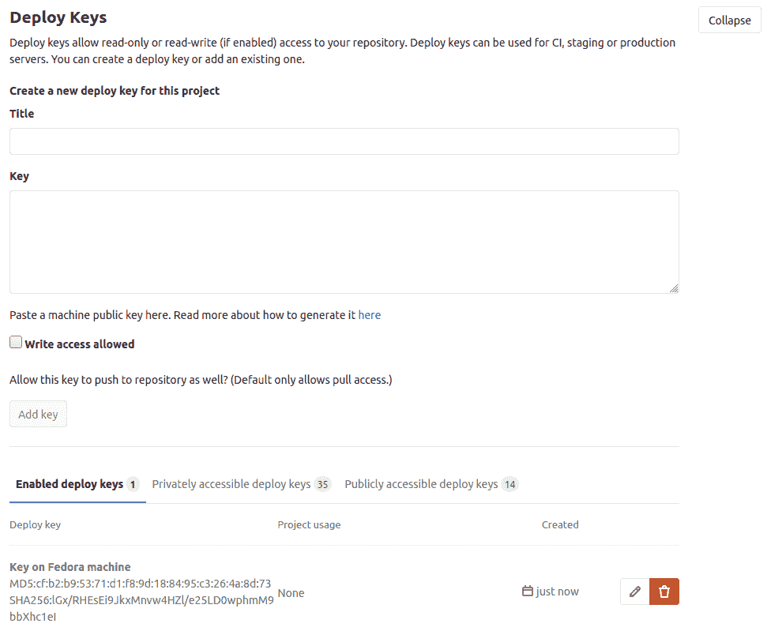
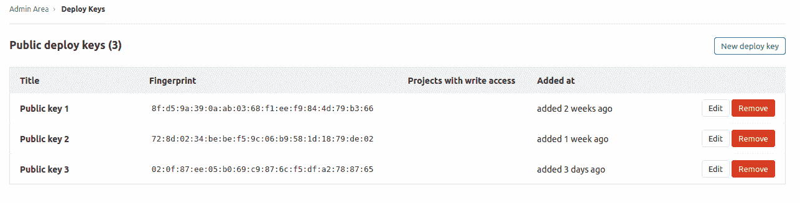

# Deploy Keys

> 原文：[https://docs.gitlab.com/ee/user/project/deploy_keys/](https://docs.gitlab.com/ee/user/project/deploy_keys/)

*   [Key details on deploy keys](#key-details-on-deploy-keys)
*   [Deploy Keys Permissions](#deploy-keys-permissions)
*   [Differences between deploy keys and deploy tokens](#differences-between-deploy-keys-and-deploy-tokens)
*   [How to enable Deploy Keys](#how-to-enable-deploy-keys)
    *   [Project deploy keys](#project-deploy-keys)
    *   [Public deploy keys](#public-deploy-keys)
*   [Troubleshooting](#troubleshooting)
    *   [Deploy Key cannot push to a protected branch](#deploy-key-cannot-push-to-a-protected-branch)

# Deploy Keys

通过将 SSH 公钥导入到 GitLab 实例，部署密钥允许对一个或多个存储库的只读或读写（如果启用）访问.

这对于将存储库克隆到持续集成（CI）服务器非常有用. 通过使用部署密钥，您不必设置虚拟用户帐户.

There are two types of deploy keys:

*   [Project deploy keys](#project-deploy-keys)
*   [Public deploy keys](#public-deploy-keys)

## Key details on deploy keys

部署密钥使远程机器（VM，物理机等）只需几个步骤即可访问 GitLab 存储库. 如果您希望远程计算机以自动化方式与 GitLab 存储库进行交互，这是一个简单的解决方案.

缺点是，如果远程计算机被黑客入侵，则您的存储库可能会变得脆弱. 在存储库中启用部署密钥之前，应限制对远程计算机的访问. 遵循的好规则是仅访问受信任的用户，并确保允许的用户在 GitLab 项目中具有[维护者权限或更高权限](../../permissions.html) .

如果您的组织担心这种安全隐患，则可以使用" [部署令牌"](../deploy_tokens/index.html)作为替代方案，但具有更多的安全控制.

## Deploy Keys Permissions

在项目上启用部署密钥时，可以选择其访问级别：

*   `read-only` ：部署密钥可以读取存储库.
*   `read-write` ：部署密钥可以读取存储库并对其进行写入.

项目维护者和所有者可以激活和停用部署密钥. 他们还可以添加自己的部署密钥并为该项目启用它们.

当使用`write-access`部署密钥来推送提交时，GitLab 会检查部署密钥的**创建者**是否有权访问资源. 例如：

*   当使用部署密钥将提交推送到[受保护的分支时](../protected_branches.html) ，部署密钥的**创建者**必须有权访问该分支.
*   当使用部署密钥来推送触发 CI / CD 管道的提交时，部署密钥的**创建者**必须有权访问 CI / CD 资源（例如受保护的环境，机密变量等）.
*   如果部署密钥的**创建者**没有读取项目存储库的权限，则部署密钥*可能*在此过程中遇到错误.

## Differences between deploy keys and deploy tokens

部署密钥和[部署令牌](../deploy_tokens/index.html#deploy-tokens)都可以帮助您访问存储库，但是它们之间存在一些显着差异：

*   部署密钥可以在不相关甚至不属于同一组的项目之间共享. 部署令牌属于项目或[组](../deploy_tokens/index.html#group-deploy-token) .
*   部署密钥是您需要在计算机上生成自己的 SSH 密钥. 部署令牌是由您的 GitLab 实例生成的，仅在创建时提供给用户一次.
*   只要已注册并启用部署密钥，该密钥便有效. 部署令牌可能是时间敏感的，因为您可以通过设置令牌的到期日期来控制令牌的有效性.
*   您不能使用部署密钥登录注册表，也不能对其执行读/写操作，但是[使用部署令牌是可以的](../deploy_tokens/index.html#gitlab-deploy-token) .
*   您需要 SSH 密钥对才能使用部署密钥，但不需要部署令牌.

## How to enable Deploy Keys

### Project deploy keys

[项目维护者和所有者](../../permissions.html#project-members-permissions)可以为项目存储库添加或启用部署密钥：

1.  导航到项目的**"设置">"存储库"**页面.
2.  展开" **部署密钥"**部分.
3.  为新的部署密钥指定标题，然后粘贴您的公共 SSH 密钥.
4.  （可选）检查**写访问允许**允许`read-write`访问. 保留它的`read-only`访问权限.

有三个项目部署密钥列表：

*   启用的部署密钥
*   Privately accessible deploy keys
*   公共可访问的部署密钥

添加密钥后，默认情况下将为此项目启用该密钥，它将显示在"已**启用的部署密钥"**选项卡中.

在"私有**可访问的部署密钥"**选项卡中，您可以启用已导入到其他项目中的私有密钥. 如果您有权访问这些密钥，那是因为您具有以下任一能力：

*   以前，您自己将密钥上传到了另一个项目中.
*   您是导入密钥的另一个项目的维护者或所有者.

在可**公开访问的部署密钥**选项卡中，您可以启用[对整个 GitLab 实例可用的](#public-deploy-keys)密钥.

添加密钥后，您可以对其进行编辑以更新其标题，或者在`read-only`和`read-write`访问之间切换.

**注意：**如果您为项目启用了私有或公共访问或部署密钥，并且随后将该密钥的访问级别从`read-only`更新为`read-write` ，则更改将仅适用于**当前项目** .

### Public deploy keys

公共部署密钥允许对 GitLab 实例中的任何存储库进行`read-only`或`read-write`访问. 这对于将存储库集成到安全的共享服务（例如 CI / CD）很有用.

实例管理员可以添加公共部署密钥：

1.  转到**管理区域** （ ） **>部署密钥** .
2.  单击**新部署密钥** .

    确保新密钥具有有意义的标题，因为这是项目维护者和所有者识别要添加的正确公共部署密钥的主要方法. 例如，如果密钥允许访问 SaaS CI / CD 实例，请在密钥名称中使用该服务的名称（如果已使用了所有密钥）.

添加密钥后，它将对所有共享系统可用. 项目维护者或更高级别的人员可以[授权公共部署密钥](#project-deploy-keys)开始在项目中使用它.

**注意：**仅在配置了至少一个公共部署密钥的情况下，Project CI / CD 设置中的" **公共可访问部署密钥"**选项卡才会显示.

与项目部署密钥相比，公共部署密钥可以提供更高的安全性，因为目标集成系统的管理员是唯一需要知道或配置密钥值的管理员.

创建公共部署密钥时，请确定是否可以针对非常狭窄的用途（例如仅特定服务）定义它，或者是否需要针对更广泛的用途（例如对所有服务进行完全`read-write`访问）进行定义.

**警告：**添加公共部署密钥不会立即向其公开任何存储库. 公共部署密钥允许从其他系统进行访问，但是只有项目维护者选择使用它之后，才能访问任何项目.

## Troubleshooting

### Deploy Key cannot push to a protected branch

如果此部署密钥的所有者无权访问[受保护的分支](../protected_branches.html) ，则此部署密钥也将无权访问该分支. 除此之外，在["允许推送"部分中](../protected_branches.html#configuring-protected-branches)选择" **否"**值意味着没有用户**和**使用部署密钥的服务都无法推送到该选定分支.

有关更多信息，请参考[此问题](https://gitlab.com/gitlab-org/gitlab/-/issues/30769) .