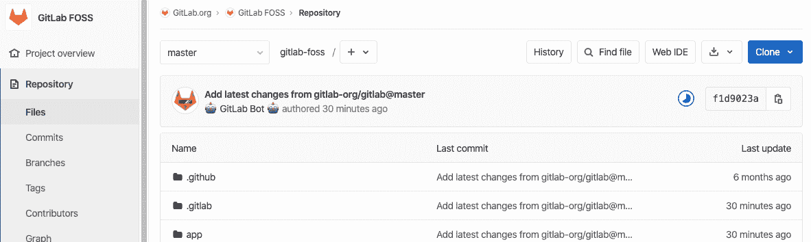

# File finder

> 原文：[https://docs.gitlab.com/ee/user/project/repository/file_finder.html](https://docs.gitlab.com/ee/user/project/repository/file_finder.html)

*   [How it works](#how-it-works)

# File finder

在 GitLab 8.4 中[引入](https://github.com/gitlabhq/gitlabhq/pull/9889) .

文件查找器功能使您可以使用 GitLab UI 在存储库中搜索文件.

您可以在项目的" **文件"**部分中找到" **查找文件"**按钮.

对于那些喜欢用手指触摸键盘的人，还有一个[快捷按钮](../../shortcuts.html) ，您可以从项目中的*任何地方*调用它.

在**问题** ， **合并请求** ， **里程碑**甚至项目设置中，按`t`键启动文件搜索功能.

开始输入您要搜索的内容，然后观察魔术的发生. 使用向上/向下箭头，您可以向上和向下搜索结果，使用`Esc`可以关闭搜索并返回" **文件"**

## How it works

文件查找器功能由[模糊过滤器](https://github.com/jeancroy/fuzz-aldrin-plus)库提供支持.

它通过突出显示来实现模糊搜索，并试图通过识别人们在搜索时使用的模式来提供直观的结果.

例如，考虑[GitLab FOSS 存储库](https://gitlab.com/gitlab-org/gitlab-foss/tree/master) ，并且我们要打开`app/controllers/admin/deploy_keys_controller.rb`文件.

使用模糊搜索，我们首先输入使我们更接近文件的字母.

**提示：**要缩小搜索范围，请在搜索词中包含`/` .

