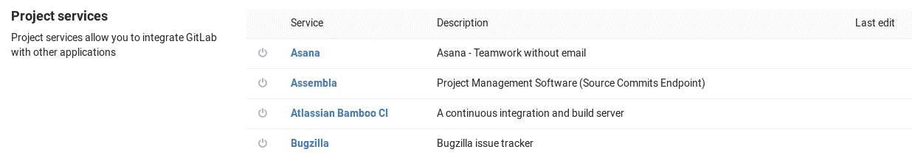
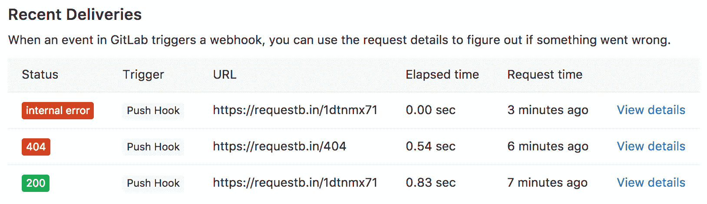

# Integrations

> 原文：[https://docs.gitlab.com/ee/user/project/integrations/overview.html](https://docs.gitlab.com/ee/user/project/integrations/overview.html)

*   [Accessing integrations](#accessing-integrations)
*   [Integrations listing](#integrations-listing)
*   [Push hooks limit](#push-hooks-limit)
*   [Service templates](#service-templates)
*   [Troubleshooting integrations](#troubleshooting-integrations)
    *   [Uninitialized repositories](#uninitialized-repositories)
*   [Contributing to integrations](#contributing-to-integrations)

# Integrations

集成使您可以将 GitLab 与其他应用程序集成. 它们有点像插件，因为它们为 GitLab 添加功能提供了很大的自由度.

## Accessing integrations

您可以在项目的**设置➔集成**页面下找到可用的集成.

有 20 多个要集成的集成. 单击您要配置的一个.

## Integrations listing

单击服务链接以查看更多的配置说明和详细信息.

| Service | Description | 服务挂钩 |
| --- | --- | --- |
| Asana | Asana-无需电子邮件的团队合作 | No |
| Assembla | 项目管理软件（源提交端点） | No |
| [Atlassian Bamboo CI](bamboo.html) | 持续集成和构建服务器 | Yes |
| Buildkite | 持续集成和部署 | Yes |
| [Bugzilla](bugzilla.html) | Bugzilla 问题追踪器 | No |
| Campfire | 基于网络的简单实时群聊 | No |
| [Confluence](../../../api/services.html#confluence-service) | 将指向内部 Wiki 的链接替换为指向 Confluence Cloud Workspace 的链接 | No |
| 自定义问题跟踪器 | 自定义问题跟踪器 | No |
| [Discord Notifications](discord_notifications.html) | 在 Discord 中接收事件通知 | No |
| CI 无人机 | Go 编写的基于 Docker 的持续集成平台 | Yes |
| [Emails on push](emails_on_push.html) | 通过电子邮件将每次推送的提交和差异发送到收件人列表 | No |
| 外部维基 | 将指向内部 Wiki 的链接替换为指向外部 Wiki 的链接 | No |
| Flowdock | Flowdock 是面向技术团队的协作网络应用程序 | No |
| [Generic alerts](generic_alerts.html) | 从任何来源接收有关 GitLab 的警报 | No |
| [GitHub](github.html) | 发送管道通知到 GitHub | No |
| [Hangouts Chat](hangouts_chat.html) | 在 Google 环聊中接收事件通知 | No |
| [HipChat](hipchat.html) | 私人群聊和即时消息 | No |
| [Irker (IRC gateway)](irker.html) | 通过 Irker 网关在更新时将 IRC 消息发送到收件人列表 | No |
| [Jira](jira.html) | 吉拉问题追踪器 | No |
| [Jenkins](../../../integration/jenkins.html) | 可扩展的开源持续集成服务器 | Yes |
| JetBrains TeamCity CI | 持续集成和构建服务器 | Yes |
| [Mattermost slash commands](mattermost_slash_commands.html) | 最重要的聊天和 ChatOps 斜杠命令 | No |
| [Mattermost Notifications](mattermost.html) | 在 Mattermost 接收事件通知 | No |
| [Microsoft teams](microsoft_teams.html) | 使用 Office 365 连接器接收有关在 GitLab 上进入 Microsoft Teams 房间的操作的通知 | No |
| Packagist | 在主要 Composer 存储库 Packagist 上更新项目 | Yes |
| 管道电子邮件 | 通过电子邮件将管道状态发送给收件人列表 | No |
| [Slack Notifications](slack.html) | 将 GitLab 事件（例如，已创建问题）作为通知发送到 Slack | No |
| [Slack slash commands](slack_slash_commands.html) | 在 Slack 中使用斜杠命令控制 GitLab | No |
| [GitLab Slack application](gitlab_slack_application.html) | 使用 Slack 的官方应用程序 | No |
| PivotalTracker | 项目管理软件（源提交端点） | No |
| [Prometheus](prometheus.html) | 监控已部署应用程序的性能 | No |
| Pushover | 通过 Pushover，可以轻松在 Android 设备，iPhone，iPad 和台式机上获取实时通知 | No |
| [Redmine](redmine.html) | Redmine 问题追踪器 | No |
| [Unify Circuit](unify_circuit.html) | 在统一电路中接收事件通知 | No |
| [Webex Teams](webex_teams.html) | 在 Webex Teams 中接收事件通知 | No |
| [YouTrack](youtrack.html) | YouTrack 问题追踪器 | No |

## Push hooks limit

在 GitLab 12.4 中[引入](https://gitlab.com/gitlab-org/gitlab/-/merge_requests/17874) .

如果单个推送包含对三个以上分支或标签的更改，则`push_hooks`和`tag_push_hooks`事件支持的服务将不会执行.

可以通过[`push_event_hooks_limit`应用程序设置](../../../api/settings.html#list-of-settings-that-can-be-accessed-via-api-calls)来更改支持的分支或标记的数量.

## Service templates

服务模板是为实例上所有新项目之间的集成设置预定义值的方法.

[在本文档中](services_templates.html)阅读有关[服务模板的](services_templates.html)更多信息.

## Troubleshooting integrations

某些集成使用服务挂钩来与外部应用程序集成. 要确认哪些使用服务挂钩，请参见上面[列出](#integrations-listing)的[集成](#integrations-listing) . GitLab 存储最近 2 天内发出的服务挂钩请求的详细信息. 要查看请求的详细信息，请转到该集成的配置页面.

**最近发送**部分列出了最近 2 天内提出的每个请求的详细信息：

*   HTTP 状态代码（绿色表示 200-299 代码，红色表示其他代码， `internal error`表示传送失败）
*   触发事件
*   请求发送到的 URL
*   请求经过的时间
*   提出请求的相对时间

要查看有关请求执行的更多信息，请单击相应的**查看详细信息**链接. 在详细信息页面上，您可以看到 GitLab 发送和接收的请求标头和正文.

要使用相同的数据重复发送，请点击**重新发送请求** .

### Uninitialized repositories

某些集成失败，并显示错误" `Test Failed. Save Anyway` 尝试在未初始化的存储库上设置它们时，仍然要`Test Failed. Save Anyway` . 某些集成使用推送数据来构建测试有效负载，并且当项目中尚无推送事件时，就会发生此错误.

要解决此错误，请通过将测试文件推送到项目来初始化存储库，然后再次设置集成.

## Contributing to integrations

因为 GitLab 是开源的，所以我们可以附带所有插件的代码和测试. 这使社区可以使插件保持最新状态，以便它们始终在较新的 GitLab 版本中运行.

有关可用集成的概述，请参见[project_services 源目录](https://gitlab.com/gitlab-org/gitlab/tree/master/app/models/project_services) .

欢迎捐款！