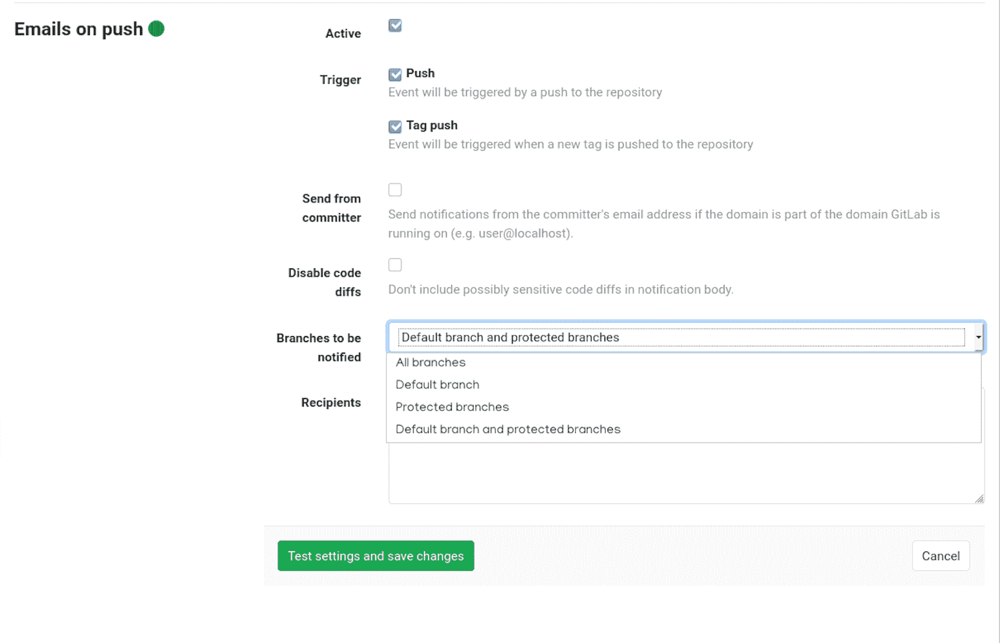
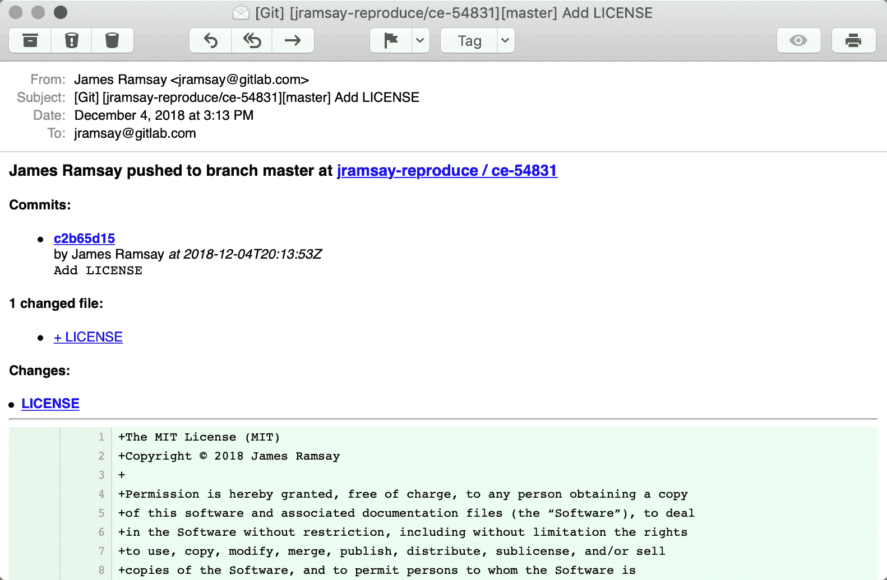

# Enabling emails on push

> 原文：[https://docs.gitlab.com/ee/user/project/integrations/emails_on_push.html](https://docs.gitlab.com/ee/user/project/integrations/emails_on_push.html)

# Enabling emails on push

通过启用此服务，您将收到有关推送至项目的每个更改的电子邮件通知.

在" [集成"页面中，](overview.html#accessing-integrations)选择**"推送**服务中的**电子邮件"**以激活和配置它.

在" *收件人"*区域中，提供用空格或换行符分隔的电子邮件列表.

提供以下选项：

*   **推送事件** -收到推送事件时将触发电子邮件.
*   **标记推送事件** -创建和推送标记时将触发电子邮件.
*   **从提交者**发送-如果该域是运行 GitLab 的域的一部分，则从提交者的电子邮件地址发送通知（例如`user@gitlab.com` ）.
*   **禁用代码差异** -通知正文中不要包含敏感的代码差异.

| Settings | Notification |
| --- | --- |
|  |  |