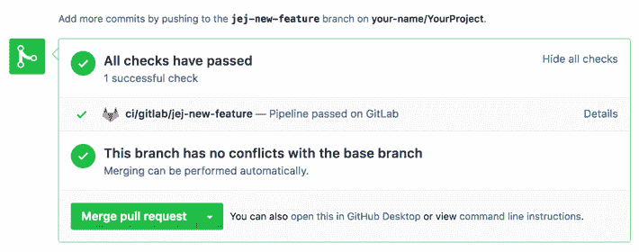
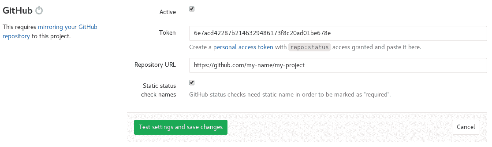

# GitHub project integration

> 原文：[https://docs.gitlab.com/ee/user/project/integrations/github.html](https://docs.gitlab.com/ee/user/project/integrations/github.html)

*   [Configuration](#configuration)
    *   [Complete these steps on GitHub](#complete-these-steps-on-github)
    *   [Complete these steps on GitLab](#complete-these-steps-on-gitlab)
        *   [Static / dynamic status check names](#static--dynamic-status-check-names)

# GitHub project integration

在 GitLab Premium 10.6 中[引入](https://gitlab.com/gitlab-org/gitlab/-/issues/3836) .

GitLab 提供了一个集成，用于更新 GitHub 上的管道状态. 如果仅将 GitLab 用于 CI / CD，这将特别有用.

此项目集成与[实例范围的 GitHub 集成](../import/github.html#mirroring-and-pipeline-status-sharing)分开，并且在[GitHub import](../../../integration/github.html)上自动配置.

## Configuration

### Complete these steps on GitHub

此集成需要[GitHub API 令牌，](https://help.github.com/en/github/authenticating-to-github/creating-a-personal-access-token)并授予`repo:status`访问权限：

1.  转到[https://github.com/settings/tokens 上的](https://github.com/settings/tokens) "个人访问令牌"页面.
2.  点击"生成新令牌"
3.  确保选中`repo:status`并单击" Generate token"
4.  复制生成的令牌以在 GitLab 上使用

### Complete these steps on GitLab

1.  Navigate to the project you want to configure.
2.  导航到" [集成"页面](overview.html#accessing-integrations)
3.  点击" GitHub".
4.  确保启用了**活动**切换.
5.  粘贴您在 GitHub 上生成的令牌
6.  输入您在 GitHub 上的项目的路径，例如`https://github.com/username/repository`
7.  （可选）取消选中" **静态状态检查名称"**复选框以禁用静态状态检查名称.
8.  保存或选择单击"测试设置".

配置完集成后，请参阅[外部请求请求的](../../../ci/ci_cd_for_external_repos/#pipelines-for-external-pull-requests)管道，以配置要为打开请求请求运行的管道.

#### Static / dynamic status check names

版本历史

*   在 GitLab 11.5 中引入：使用静态检查名称作为选择加入选项.
*   [在 GitLab 12.4 中](https://gitlab.com/gitlab-org/gitlab/-/issues/9931) ，静态状态检查名称是新项目的默认行为.

This makes it possible to mark these status checks as *Required* on GitHub. 这样就可以在 GitHub 上将这些状态检查标记为" *必需* ". With **Static status check names** enabled on the integration page, your GitLab instance host name is going to be appended to a status check name, whereas in case of dynamic status check names, a branch name is going to be appended. 在集成页面上启用了**静态状态检查名称后** ，您的 GitLab 实例主机名将被附加到状态检查名称中，而在动态状态检查名的情况下将被添加分支名称.

