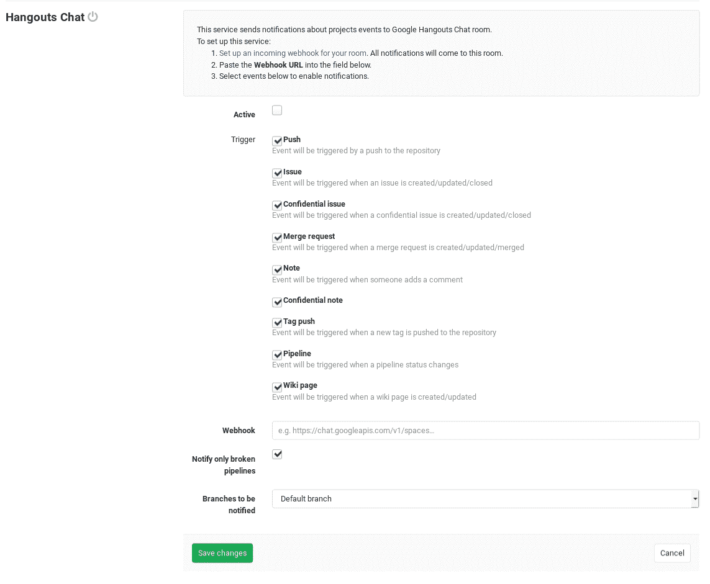

# Hangouts Chat service

> 原文：[https://docs.gitlab.com/ee/user/project/integrations/hangouts_chat.html](https://docs.gitlab.com/ee/user/project/integrations/hangouts_chat.html)

*   [On Hangouts Chat](#on-hangouts-chat)
*   [On GitLab](#on-gitlab)

# Hangouts Chat service

在 GitLab 11.2 中[引入](https://gitlab.com/gitlab-org/gitlab-foss/-/issues/43756) .

环聊聊天服务将通知从 GitLab 发送到创建 Webhook 的房间.

## On Hangouts Chat

1.  打开要在其中查看通知的聊天室.
2.  从聊天室菜单中，选择**配置 Webhooks** .
3.  单击**添加网站，**然后填写将发布消息的机器人的名称. （可选）定义头像.
4.  单击" **保存"，**然后复制您的**Webhook 的 Webhook URL** .

另请参阅[环聊聊天文档，以配置传入的 Webhooks](https://developers.google.com/hangouts/chat/how-tos/webhooks)

## On GitLab

当您拥有环**聊聊天**室**Webhook 的 Webhook URL 时** ，您可以设置 GitLab 服务.

1.  导航到项目设置中的" [集成"页面](overview.html#accessing-integrations) ，即" **项目">"设置">"集成"** .
2.  选择**环聊聊天**集成进行配置.
3.  确保启用了**活动**切换.
4.  选中与您要接收的 GitLab 事件相对应的复选框.
5.  粘贴您从环**聊聊天**配置步骤中复制的**Webhook URL** .
6.  配置其余选项，然后单击" `Save changes` .

您的环聊聊天室现在将开始接收配置的 GitLab 事件通知.

