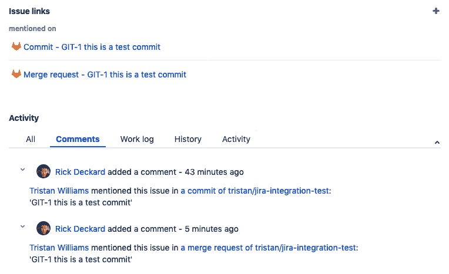
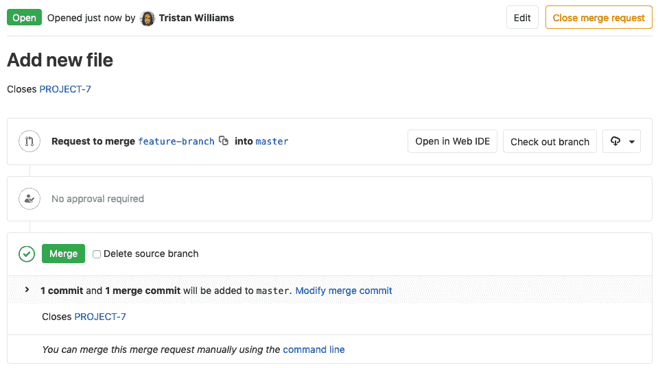
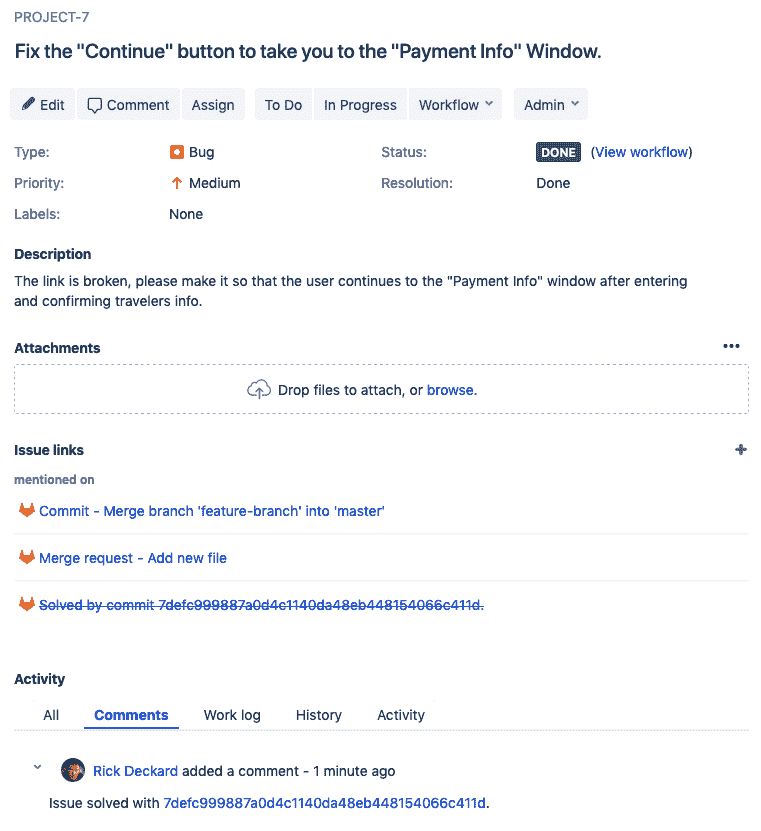

# GitLab Jira integration

> 原文：[https://docs.gitlab.com/ee/user/project/integrations/jira.html](https://docs.gitlab.com/ee/user/project/integrations/jira.html)

*   [Configuration](#configuration)
    *   [Configuring Jira](#configuring-jira)
        *   [Jira Server](#jira-server)
        *   [Jira Cloud](#jira-cloud)
    *   [Configuring GitLab](#configuring-gitlab)
    *   [Obtaining a transition ID](#obtaining-a-transition-id)
    *   [Disabling comments on Jira issues](#disabling-comments-on-jira-issues)
*   [Jira issues](#jira-issues)
    *   [Referencing Jira Issues](#referencing-jira-issues)
    *   [Closing Jira Issues](#closing-jira-issues)
    *   [Jira issue closing example](#jira-issue-closing-example)
*   [Troubleshooting](#troubleshooting)
    *   [GitLab is unable to comment on a Jira issue](#gitlab-is-unable-to-comment-on-a-jira-issue)
    *   [GitLab is unable to close a Jira issue](#gitlab-is-unable-to-close-a-jira-issue)
    *   [CAPTCHA](#captcha)

# GitLab Jira integration[](#gitlab-jira-integration "Permalink")

GitLab 问题是讨论想法，计划和跟踪工作的强大工具. 但是，许多组织已经将 Jira 用于这些目的，并且内置了广泛的数据和业务流程.

尽管您始终可以将内容和流程从 Jira 迁移到 GitLab Issue，但是您也可以选择继续使用 Jira，并通过我们的集成将其与 GitLab 一起使用.

有关与 Jira 集成的视频演示，请观看有关[GitLab 工作流程的 Jira 问题和 Jenkins 管道](https://youtu.be/Jn-_fyra7xQ) .

将 GitLab 项目与 Jira 实例集成后，即可自动检测 GitLab 项目与 Jira 中的任何项目之间的活动并进行交叉引用. 这包括在 GitLab 中完成工作后关闭或转换 Jira 问题的功能.

在 GitLab 中执行以下操作时，集成的响应方式如下：

*   在提交消息或 MR（合并请求）中**提及 Jira 问题 ID** .
    *   GitLab 超链接至 Jira 问题.
    *   Jira 问题将问题链接添加到 GitLab 中的提交/ MR.
    *   Jira 问题会添加评论，以反映在 GitLab 中发表的评论，评论作者以及在 GitLab 中指向 commit / MR 的链接，除非[禁用了](#disabling-comments-on-jira-issues)对 Jira 的评论.
*   **提及提交或 MR"关闭"，"解决"或"修复" Jira 问题 ID** . 在项目的默认分支（通常是主分支）上进行提交或将更改合并到默认分支时：
    *   GitLab 的合并请求页面显示一条注释，指出"已关闭" Jira 问题，并带有指向该问题的链接. （注意：在合并之前，MR 将显示它"关闭"了 Jira 问题.）
    *   Jira 问题显示活动，并且 Jira 问题已关闭或已转换.

您还可以直接从 GitLab 使用[Jira 的 Smart](https://confluence.atlassian.com/fisheye/using-smart-commits-960155400.html) Commit，如文章[如何以及为什么将 GitLab 与 Jira 集成中所述](https://www.programmableweb.com/news/how-and-why-to-integrate-gitlab-jira/how-to/2017/04/25) .

## Configuration[](#configuration "Permalink")

每个 GitLab 项目都可以配置为连接到整个 Jira 实例. 这意味着一个 GitLab 项目一旦配置，便可以与该实例中的*所有* Jira 项目进行交互. 因此，您不必将 GitLab 项目与任何单个 Jira 项目显式关联.

如果您有一个 Jira 实例，则可以使用默认模板预先填充设置页面. 请参阅[服务模板](services_templates.html)文档.

为了在 GitLab 中启用 Jira 服务，您需要首先在 Jira 中配置项目，然后在 GitLab 中输入正确的值.

### Configuring Jira[](#configuring-jira "Permalink")

#### Jira Server[](#jira-server "Permalink")

**Jira Server**支持基本身份验证. 连接时，需要**用户名和密码** . 请注意，无法通过 CAS 连接到 Jira Server. 首先[在 Jira Server 中设置用户，](jira_server_configuration.html)然后继续[配置 GitLab](#configuring-gitlab) .

#### Jira Cloud[](#jira-cloud "Permalink")

**Jira Cloud**支持通过 API 令牌进行身份验证. 连接到**Jira Cloud 时** ，需要**电子邮件和 API 令牌** . 首先[在 Jira Cloud 中设置用户，](jira_cloud_configuration.html)然后继续[配置 GitLab](#configuring-gitlab) .

### Configuring GitLab[](#configuring-gitlab "Permalink")

> **Notes:**
> 
> *   当前支持的 Jira 版本是`v6.x, v7.x, v8.x` . 需要 GitLab 7.8 或更高版本.
> *   GitLab 8.14 引入了一种与 Jira 集成的新方法，该方法大大简化了您必须输入的配置选项. 如果您使用的是旧版本，请[遵循此文档](https://gitlab.com/gitlab-org/gitlab/blob/8-13-stable-ee/doc/project_services/jira.md) .
> *   为了支持 Oracle 的 Access Manager，GitLab 将发送其他 cookie 以启用基本身份验证. 添加到每个请求的 cookie 是`OBBasicAuth` ，其值为`fromDialog` .

要在项目中启用 Jira 集成，请导航到[Integrations 页面](overview.html#accessing-integrations) ，单击**Jira**服务，然后按照下表中的说明在页面上填写所需的详细信息.

| Field | Description |
| --- | --- |
| `Web URL` | 链接到此 GitLab 项目的 Jira 实例 Web 界面的基本 URL. 例如， `https://jira.example.com` . |
| `Jira API URL` | The base URL to the Jira instance API. Web URL value will be used if not set. E.g., `https://jira-api.example.com`. Leave this field blank (or use the same value of `Web URL`) if using **吉拉云**. |
| `Username/Email` | 在[配置 Jira step](#configuring-jira)时创建. 将`username`用于**Jira Server**或将`email`用于**Jira Cloud** . |
| `Password/API token` | 在[配置 Jira 步骤中](#configuring-jira)创建. 为**Jira Server**使用`password`或为**Jira Cloud**使用`API token` . |
| `Transition ID` | 这是将问题移至所需状态的过渡的 ID. 它可以插入过渡 IDS 分离通过`,`或`;` 这意味着将按照给定的顺序将问题逐个移至每个州. **如果您未正确设置 ID，则无法通过提交或合并请求来关闭 Jira 问题.** |

### Obtaining a transition ID[](#obtaining-a-transition-id "Permalink")

在最新的 Jira 用户界面中，您不再可以在工作流管理 UI 中看到过渡 ID. 您可以通过以下两种方式之一获取所需的 ID：

1.  通过使用 API​​，并使用诸如处于适当"打开"状态的问题的请求（例如`https://yourcompany.atlassian.net/rest/api/2/issue/ISSUE-123/transitions`
2.  通过将鼠标悬停在所需转换的链接上并在 URL 中查找" action"参数

请注意，即使您要更改的状态相同，过渡 ID 在工作流之间也可能有所不同（例如，错误与故事）.

保存配置后，您的 GitLab 项目将能够与 Jira 实例中的所有 Jira 项目进行交互，并且您将在 GitLab 项目页面上看到 Jira 链接，该链接将您带到适当的 Jira 项目.

[](img/jira_service_page_v12_2.png)

### Disabling comments on Jira issues[](#disabling-comments-on-jira-issues "Permalink")

当您引用 Jira 问题时，它将始终链接回 GitLab 中的源提交/ MR，但是，您可以控制 GitLab 是否还将交叉发布对 Jira 问题的评论. 默认情况下启用该功能.

要禁用对 Jira 问题的自动评论：

1.  打开" [集成"页面，](overview.html#accessing-integrations)然后选择**Jira** .
2.  在" **事件操作"**部分中，取消选中" **注释"** .

## Jira issues[](#jira-issues "Permalink")

现在，您应该已经[配置了 Jira](#configuring-jira)并[在 GitLab 中](#configuring-gitlab)启用了[Jira 服务](#configuring-gitlab) . 如果一切设置正确，您应该能够通过在 GitLab 提交和合并请求中提及 ID 来引用和关闭 Jira 问题.

### Referencing Jira Issues[](#referencing-jira-issues "Permalink")

当 GitLab 项目配置并启用了 Jira 问题跟踪器时，在 GitLab 中提及 Jira 问题将自动在 Jira 问题中添加评论，并带有返回到 GitLab 的链接. 这意味着在合并请求和提交中引用问题的注释中，例如`PROJECT-7` ，将在 Jira issue 中添加以下格式的注释：

```
USER mentioned this issue in RESOURCE_NAME of [PROJECT_NAME|LINK_TO_COMMENT]:
ENTITY_TITLE 
```

*   `USER`提到问题的用户. 这是指向 GitLab 中的用户配置文件的链接.
*   `LINK_TO_THE_COMMENT`链接到提及的来源，带有提及吉拉问题的实体的名称.
*   `RESOURCE_NAME`引用该问题的`RESOURCE_NAME`种类. 可以是提交或合并请求.
*   `PROJECT_NAME` GitLab 项目名称.
*   `ENTITY_TITLE`合并请求标题或提交消息的第一行.

[](img/jira_issue_reference.png)

例如，以下提交将引用以`PROJECT-1`作为 ID 的 Jira 问题：

```
git commit -m "PROJECT-1 Fix spelling and grammar" 
```

### Closing Jira Issues[](#closing-jira-issues "Permalink")

通过在提交和合并请求中使用触发词，可以直接从 GitLab 关闭 Jira 问题. 当推送包含触发词并在提交消息中包含 Jira 问题 ID 的提交时，GitLab 将在提到的 Jira 问题中添加注释，并立即将其关闭（前提是正确设置了转换 ID）.

当前有三个触发词，您可以使用其中一个来实现相同的目标：

*   `Resolves PROJECT-1`
*   `Closes PROJECT-1`
*   `Fixes PROJECT-1`

其中`PROJECT-1`是 Jira 问题的 ID.

> **Notes:**
> 
> *   只有提交并合并到项目的默认分支（通常是**master** ）才能关闭 Jira 中的问题. 您可以在[项目设置](img/jira_project_settings.png)下更改项目默认分支.
> *   如果有解决方案，那么 Jira 问题将不会过渡.

### Jira issue closing example[](#jira-issue-closing-example "Permalink")

让我们考虑以下示例：

1.  对于 Jira 中名为`PROJECT` ，我们实现了一项新功能，并在 GitLab 中创建了合并请求.
2.  This feature was requested in Jira issue `PROJECT-7` and the merge request in GitLab contains the improvement
3.  在合并请求描述中，我们使用问题关闭触发器`Closes PROJECT-7` .
4.  合并请求合并后，Jira 问题将自动关闭，并带有注释和指向解决该问题的提交的关联链接.

在以下屏幕截图中，您可以看到指向 Jira 问题的链接的外观.

[](img/jira_merge_request_close.png)

合并此合并请求后，将通过指向解决该问题的提交的链接自动关闭 Jira 问题.

[](img/jira_service_close_issue.png)

## Troubleshooting[](#troubleshooting "Permalink")

如果这些功能不能按预期方式工作，则可能是由于集成设置的配置存在问题.

### GitLab is unable to comment on a Jira issue[](#gitlab-is-unable-to-comment-on-a-jira-issue "Permalink")

如果您希望 GitLab 也可以这样做，请确保您为集成设置的 Jira 用户具有正确的访问权限，可以发表有关 Jira 问题的评论并转换问题. 如果禁用了 GitLab 问题跟踪器，则 Jira 问题参考和更新注释将不起作用.

### GitLab is unable to close a Jira issue[](#gitlab-is-unable-to-close-a-jira-issue "Permalink")

确保在" Jira"设置中设置的" `Transition ID`与您的项目解决问题所需的`Transition ID`匹配.

确保尚未将 Jira 问题标记为已解决； 也就是说，未设置" Jira 问题解决"字段. （不应在 Jira 列表中删除它.）

### CAPTCHA[](#captcha "Permalink")

在连续几次失败的登录尝试后，可能会触发 CAPTCHA，这可能会在测试 Jira 集成时导致`401 unauthorized`错误. 如果已触发验证码，则您将无法使用 Jira 的 REST API 对 Jira 站点进行身份验证. 您将需要登录到您的 Jira 实例并完成 CAPTCHA.