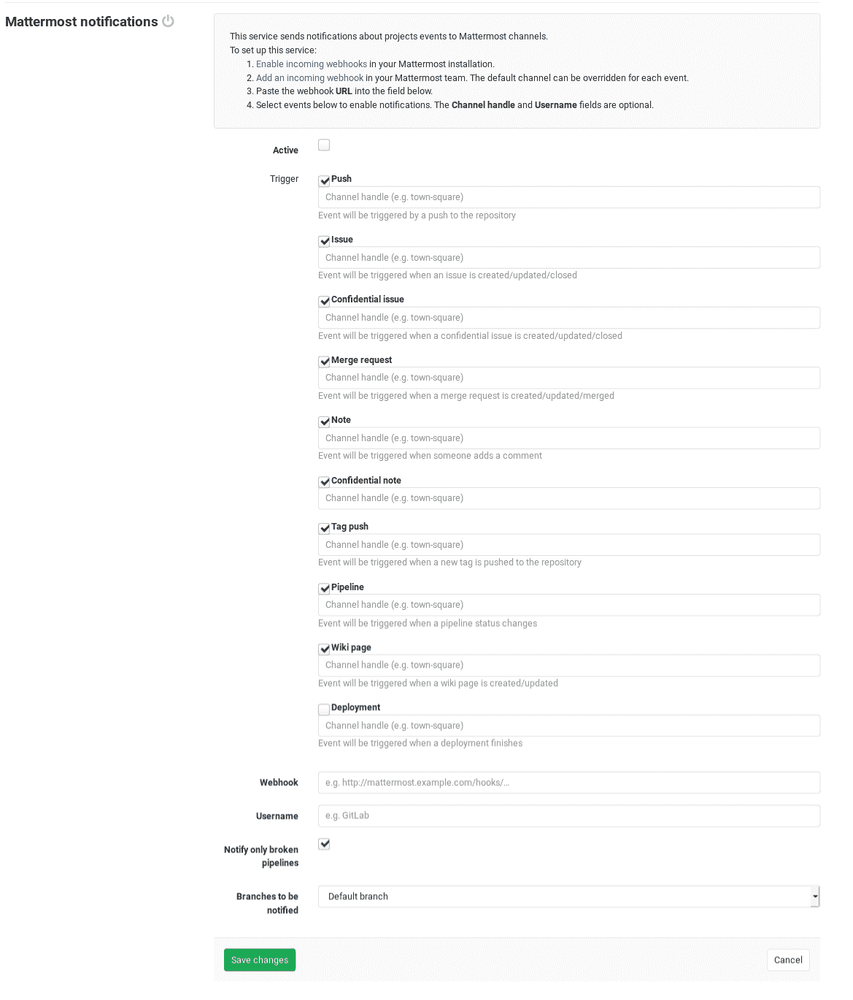

# Mattermost Notifications Service

> 原文：[https://docs.gitlab.com/ee/user/project/integrations/mattermost.html](https://docs.gitlab.com/ee/user/project/integrations/mattermost.html)

*   [On Mattermost](#on-mattermost)
*   [On GitLab](#on-gitlab)

# Mattermost Notifications Service

Mattermost Notifications Service 允许您的 GitLab 项目将事件（例如， `issue created` ）作为通知发送到您现有的 Mattermost 团队. 这需要在 Mattermost 和 GitLab 中进行配置.

您还可以使用 Mattermost 斜杠命令来控制 Mattermost 中的 GitLab. 这是单独配置的[Mattermost 斜杠命令](mattermost_slash_commands.html) .

## On Mattermost

要启用 Mattermost 集成，您必须创建传入的 Webhook 集成：

1.  登录到您的 Mattermost 实例.
2.  访问传入的 Webhooks，类似于： `https://mattermost.example.com/your_team_name/integrations/incoming_webhooks/add` ://mattermost.example.com/your_team_name/integrations/incoming_webhooks/add.
3.  选择显示名称，描述和通道，可以在 GitLab 上覆盖它们.
4.  保存它，复制**Webhook URL** ，稍后我们将在 GitLab 中使用它.

传入的 Webhooks 可能在您的 Mattermost 实例上被阻止. 要求您的 Mattermost 管理员启用它：

*   **Mattermost** 5.12 及更高版本中的**Mattermost 系统控制台>集成>集成管理** .
*   **Mattermost** 5.11 及更低版本中的**Mattermost 系统控制台>集成>自定义集成** .

默认情况下，不启用显示名称覆盖，您需要让您的管理员在同一部分启用它.

## On GitLab

设置 Mattermost 之后，就该设置 GitLab 了.

导航到" [集成"页面，](overview.html#accessing-integrations)然后选择"最**重要的通知"**服务以对其进行配置. 在那里，您将看到一个带有以下可触发事件的复选框：

*   Push
*   Issue
*   机密问题
*   合并要求
*   Note
*   机密说明
*   标签推送
*   Pipeline
*   维基页面
*   Deployment

在每个事件复选框的下方，都有一个输入字段，用于输入您要发送该事件消息的 Mattermost 频道. 输入您首选的频道句柄（井号`#`是可选的）.

最后，填写您最重要的详细信息：

| Field | Description |
| --- | --- |
| **Webhook** | 您必须在 Mattermost 上设置的传入 Webhook URL，它类似于： `http://mattermost.example/hooks/5xo…` |
| **Username** | 可选的用户名，可以在发送给 Mattermost 的邮件中使用. 如果要更改机器人的用户名，请填写. |
| **仅通知断开的管道** | 如果您选择启用**管道**事件，并且只希望收到有关失败管道的通知. |

