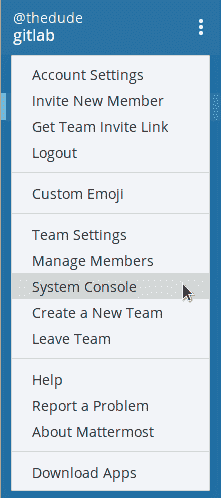
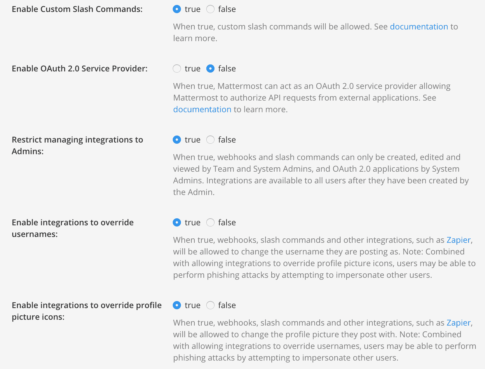
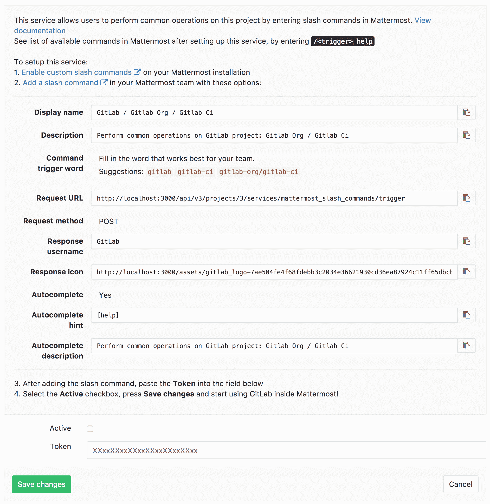
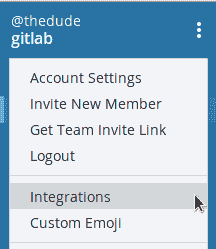
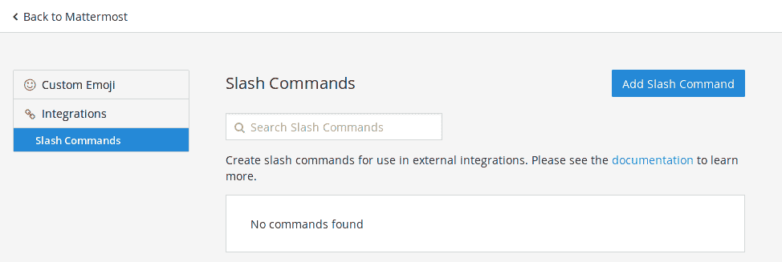
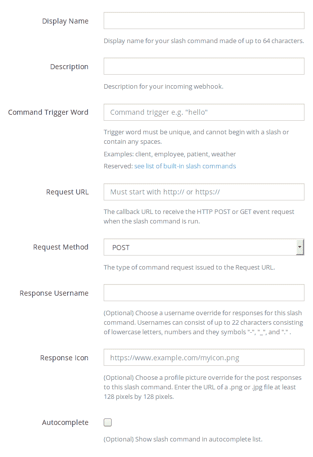
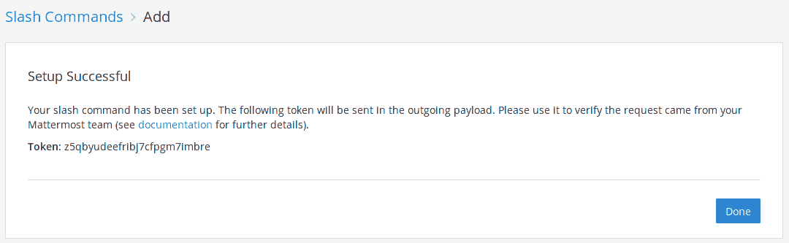
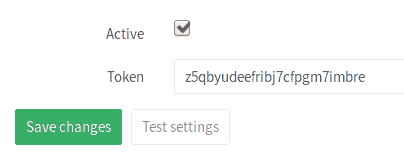
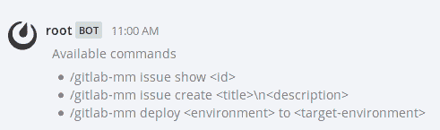

# Mattermost slash commands

> 原文：[https://docs.gitlab.com/ee/user/project/integrations/mattermost_slash_commands.html](https://docs.gitlab.com/ee/user/project/integrations/mattermost_slash_commands.html)

*   [Prerequisites](#prerequisites)
*   [Automated configuration](#automated-configuration)
*   [Manual configuration](#manual-configuration)
    *   [Step 1\. Enable custom slash commands in Mattermost](#step-1-enable-custom-slash-commands-in-mattermost)
    *   [Step 2\. Open the Mattermost slash commands service in GitLab](#step-2-open-the-mattermost-slash-commands-service-in-gitlab)
    *   [Step 3\. Create a new custom slash command in Mattermost](#step-3-create-a-new-custom-slash-command-in-mattermost)
    *   [Step 4\. Copy the Mattermost token into the Mattermost slash command service](#step-4-copy-the-mattermost-token-into-the-mattermost-slash-command-service)
*   [Authorizing Mattermost to interact with GitLab](#authorizing-mattermost-to-interact-with-gitlab)
*   [Available slash commands](#available-slash-commands)
*   [Permissions](#permissions)
*   [Troubleshooting](#troubleshooting)
*   [Further reading](#further-reading)

# Mattermost slash commands

在 GitLab 8.14 中引入

Mattermost 命令为用户提供了一个额外的界面，可以在聊天环境中执行常见操作. 例如，这使得一个问题一经在 Mattermost 中讨论后就可以创建.

GitLab 还可以将事件（例如， `issue created` ）作为通知发送到 Mattermost. 这是单独配置的[Mattermost Notifications Service](mattermost.html) .

## Prerequisites

需要 Mattermost 3.4 及更高版本.

如果您安装了 Omnibus GitLab 软件包，则其中已包含 Mattermost. 您所要做的就是配置它. 在[Omnibus GitLab Mattermost 文档中](https://docs.gitlab.com/omnibus/gitlab-mattermost/)阅读更多[内容](https://docs.gitlab.com/omnibus/gitlab-mattermost/) .

## Automated configuration

如果 Mattermost 与 GitLab 安装在同一服务器上，则 GitLab 可以为您完成配置过程.

转到项目上的 Mattermost Slash Command 服务，然后单击"添加到 Mattermost"按钮.

## Manual configuration

配置由两部分组成. 首先，您需要在 Mattermost 中启用斜杠命令，然后在 GitLab 中启用该服务.

### Step 1\. Enable custom slash commands in Mattermost

仅在使用源代码安装时才需要执行此步骤，Omnibus 安装将使用正确的设置进行预配置.

在 Mattermost 中要做的第一件事是从管理员控制台启用自定义斜杠命令.

1.  使用具有管理员权限的帐户登录并导航至系统控制台.

    

2.  单击" **自定义集成"**并将" **启用自定义斜杠命令"** ，" **启用自定义集成以覆盖用户名** "和" **覆盖自定义集成以覆盖个人资料图片图标"设置**为 true.

    

3.  点击底部的**保存** ，保存更改.

### Step 2\. Open the Mattermost slash commands service in GitLab

1.  打开 GitLab 的新标签，转到项目的" [集成"页面，](overview.html#accessing-integrations)然后选择**Mattermost 命令**服务进行配置. 将出现一个屏幕，其中包含您需要在 Mattermost 中复制的所有值，如下一步所述. 使窗口保持打开状态.

    **注意：** GitLab 将为"最重要的设置"建议一些值. 原样复制粘贴的唯一要求是**请求 URL** ，所有其他都只是建议.

    

2.  继续下一步，并在 Mattermost 中使用上述值创建斜线命令.

### Step 3\. Create a new custom slash command in Mattermost

现在，您已在 Mattermost 中启用了自定义斜杠命令并在 GitLab 中打开了 Mattermost 斜杠命令服务，是时候将这些值复制到新的斜杠命令中了.

1.  回到 Mattermost，在团队页面设置下，您应该看到**Integrations**选项.

    

2.  转到**Slash Commands**集成，然后单击**Add Slash Command**按钮添加一个新的.

    

3.  按照[步骤 2 中的说明](#step-2-open-the-mattermost-slash-commands-service-in-gitlab)填写自定义命令的选项.

    **注意：**如果计划连接多个项目，请选择一个与项目相关的斜杠命令触发词，例如`/gitlab-project-name`或什至`/project-name` . 仅在将单个项目连接到 Mattermost 团队时才使用`/gitlab` .

    

4.  设置所有值之后，复制令牌（我们将在下面使用它）并单击**完成** .

    

### Step 4\. Copy the Mattermost token into the Mattermost slash command service

1.  在 GitLab 中，粘贴您在上一步中复制的最重要的令牌，并确保启用了**活动**切换.

    

2.  单击**保存更改**以使更改生效.

现在，您已设置为在 Mattermost 中开始使用与您配置的 GitLab 项目对话的斜杠命令.

## Authorizing Mattermost to interact with GitLab

用户首次与新创建的斜杠命令进行交互时，Mattermost 将触发授权过程.

这会将您的 Mattermost 用户与 GitLab 用户连接起来. 您可以在个人资料页面的" **聊天"**下看到所有授权的聊天帐户.

授权过程完成后，您可以使用 Mattermost 命令开始与 GitLab 进行交互.

## Available slash commands

可用的斜杠命令是：

| Command | Description | Example |
| --- | --- | --- |
| `/ <trigger>发出新的<title> `⇧Shift` + `↵输入` <description>` | 在与`<trigger>`绑定的项目中创建一个新问题. `<description>`是可选的. | `/gitlab issue new We need to change the homepage` |
| `/<trigger> issue show <issue-number>` | 显示与`<trigger>`绑定的项目中 ID 为`<issue-number>` . | `/gitlab issue show 42` |
| `/ <触发>将<环境>部署到<环境>` | 开始从一个环境部署到另一环境的 CI 作业，例如`staging`到`production` . CI / CD 必须[正确配置](../../../ci/yaml/README.html) . | `/gitlab deploy staging to production` |

要查看与 GitLab 交互的可用命令列表，请输入触发词，然后输入`help` . 示例： `/gitlab help`

## Permissions

运行[可用命令](#available-slash-commands)的[权限](../../permissions.html#project-members-permissions)源自[您对项目](../../permissions.html#project-members-permissions)的[权限](../../permissions.html#project-members-permissions) .

## Troubleshooting

如果未触发某个事件，请确认您使用的频道是公开频道，因为 Mattermost Webhooks 无法访问私有频道.

如果需要专用频道，则可以在 Mattermost 中编辑 Webhook 的频道并选择一个专用频道. 无法将不同的通道用于不同类型的通知-所有事件都将发送到指定的通道.

## Further reading

*   [Mattermost slash commands documentation](https://docs.mattermost.com/developer/slash-commands.html)
*   [Omnibus GitLab Mattermost](https://docs.gitlab.com/omnibus/gitlab-mattermost/)