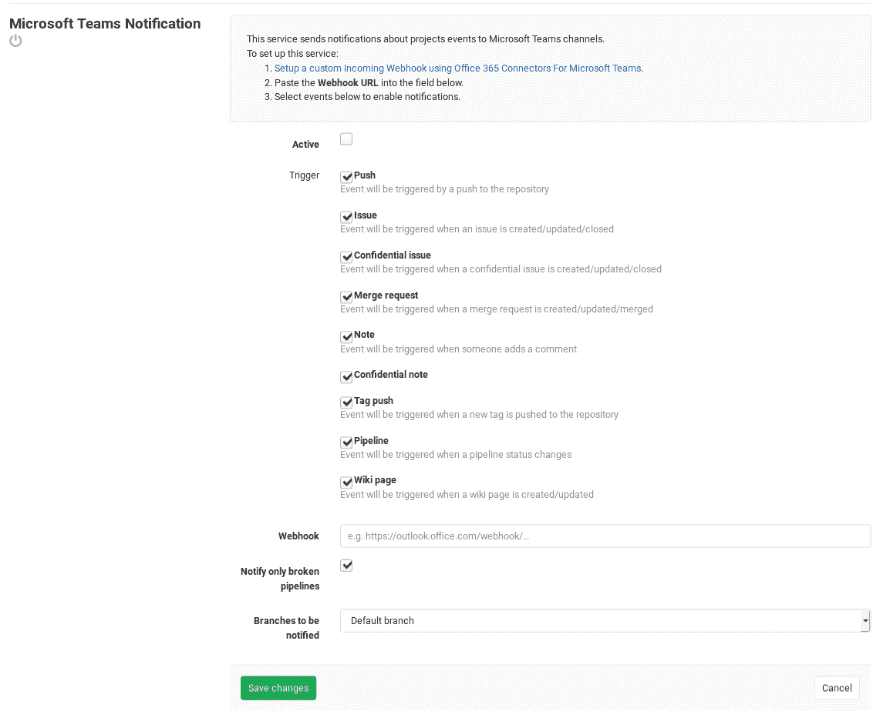

# Microsoft Teams service

> 原文：[https://docs.gitlab.com/ee/user/project/integrations/microsoft_teams.html](https://docs.gitlab.com/ee/user/project/integrations/microsoft_teams.html)

*   [On Microsoft Teams](#on-microsoft-teams)
*   [On GitLab](#on-gitlab)

# Microsoft Teams service

## On Microsoft Teams

要启用 Microsoft Teams 集成，必须按照" [向连接器和 Webhooks 发送消息"中](https://docs.microsoft.com/en-us/microsoftteams/platform/webhooks-and-connectors/how-to/connectors-using)所述的步骤，在 Microsoft Teams 上创建传入的 Webhook 集成.

## On GitLab

设置 Microsoft Teams 之后，就该设置 GitLab 了.

导航到" [集成"页面，](overview.html#accessing-integrations)然后选择" **Microsoft Teams Notification"**服务进行配置. 在那里，您将看到一个带有以下可触发事件的复选框：

*   Push
*   Issue
*   机密问题
*   合并要求
*   Note
*   标签推送
*   Pipeline
*   维基页面

最后，填写您的 Microsoft Teams 详细信息：

| Field | Description |
| --- | --- |
| **Webhook** | 您必须在 Microsoft Teams 上设置的传入 Webhook URL. |
| **仅通知断开的管道** | 如果您选择启用**管道**事件，并且只希望收到有关失败管道的通知. |

完成所有操作后，单击" **保存更改"**以使更改生效.

