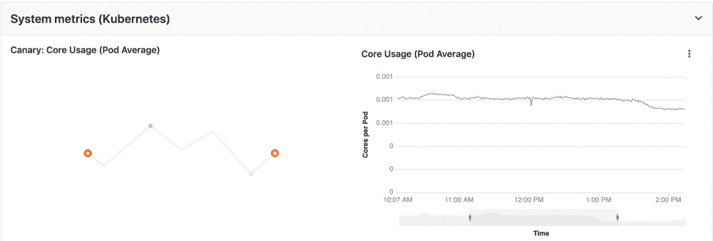
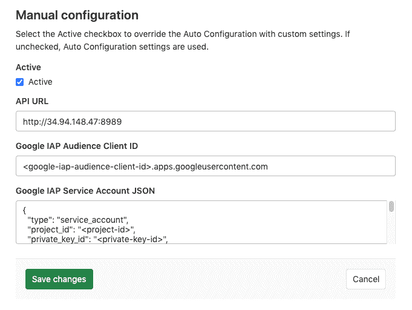
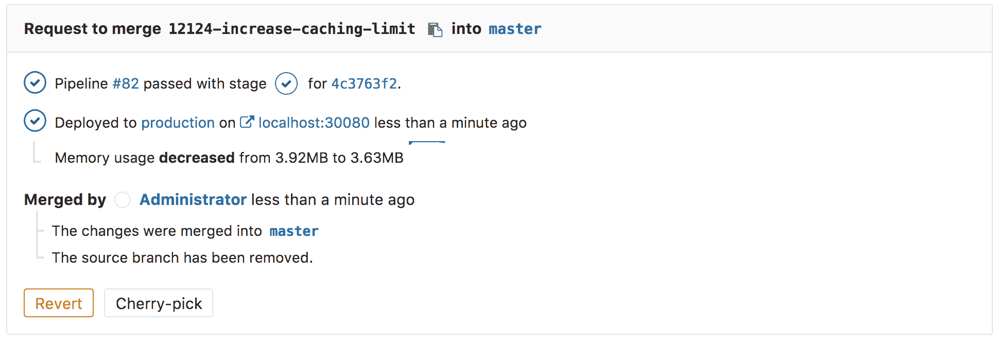

# Prometheus integration

> 原文：[https://docs.gitlab.com/ee/user/project/integrations/prometheus.html](https://docs.gitlab.com/ee/user/project/integrations/prometheus.html)

*   [Enabling Prometheus Integration](#enabling-prometheus-integration)
    *   [Managed Prometheus on Kubernetes](#managed-prometheus-on-kubernetes)
        *   [Requirements](#requirements)
        *   [Getting started](#getting-started)
        *   [About managed Prometheus deployments](#about-managed-prometheus-deployments)
    *   [Manual configuration of Prometheus](#manual-configuration-of-prometheus)
        *   [Requirements](#requirements-1)
        *   [Getting started](#getting-started-1)
        *   [Configuration in GitLab](#configuration-in-gitlab)
        *   [Thanos configuration in GitLab](#thanos-configuration-in-gitlab)
    *   [Precedence with multiple Prometheus configurations](#precedence-with-multiple-prometheus-configurations)
*   [Determining the performance impact of a merge](#determining-the-performance-impact-of-a-merge)

# Prometheus integration

在 GitLab 9.0 中[引入](https://gitlab.com/gitlab-org/gitlab-foss/-/merge_requests/8935) .

GitLab 提供与[Prometheus 的](https://s0prometheus0io.icopy.site)强大集成，可直接在 GitLab 中监视您的应用程序的关键指标. 从 Prometheus 检索每个环境的度量，然后在 GitLab 界面中显示.

有两种方法可以设置 Prometheus 集成，具体取决于应用程序的运行位置：

*   对于在 Kubernetes 上的部署，GitLab 可以自动[部署和管理 Prometheus](#managed-prometheus-on-kubernetes) .
*   对于其他部署目标，只需[指定 Prometheus 服务器](#manual-configuration-of-prometheus) .

启用后，GitLab 将自动从[度量标准库](prometheus_library/index.html)中的已知服务中检测度量[标准](prometheus_library/index.html) . 您还可以[添加自己的指标](../../../operations/metrics/index.html#adding-custom-metrics)并创建[自定义仪表板](../../../operations/metrics/dashboards/index.html) .

## Enabling Prometheus Integration

### Managed Prometheus on Kubernetes

在 GitLab 10.5 中[引入](https://gitlab.com/gitlab-org/gitlab-foss/-/issues/28916) .

GitLab 可以在[连接的 Kubernetes 集群](../clusters/index.html)上无缝部署和管理 Prometheus，从而使对应用程序的监视变得容易.

#### Requirements

*   A [connected Kubernetes cluster](../clusters/index.html)

#### Getting started

拥有连接的 Kubernetes 集群后，只需单击即可轻松部署托管的 Prometheus.

1.  转到**操作> Kubernetes**页面以查看已连接的集群
2.  选择您要部署 Prometheus 的集群
3.  单击**安装**按钮以将 Prometheus 部署到群集

#### About managed Prometheus deployments

使用[官方 Helm 图表](https://github.com/helm/charts/tree/master/stable/prometheus)将 Prometheus 部署到`gitlab-managed-apps`命名空间中. Prometheus 仅可在集群中访问，并且 GitLab 通过[Kubernetes API 进行](https://kubernetes.io/docs/concepts/overview/kubernetes-api/)通信.

Prometheus 服务器将[自动检测和监视](https://s0prometheus0io.icopy.site/docs/prometheus/latest/configuration/configuration/)节点，吊舱和端点. 要配置 Prometheus 监视的资源，只需设置以下[Kubernetes 批注](https://kubernetes.io/docs/concepts/overview/working-with-objects/annotations/) ：

*   `prometheus.io/scrape`为`true`以启用对资源的监视.
*   `prometheus.io/port`定义度量标准端点的端口.
*   `prometheus.io/path`来定义度量标准端点的路径. 默认为`/metrics` .

CPU 和内存使用情况受到监视，但是需要使用[命名约定](prometheus_library/kubernetes.html#specifying-the-environment)来确定环境. 如果您使用的是[Auto DevOps](../../../topics/autodevops/index.html) ，则会自动处理.

由 GitLab 部署到群集的[NGINX Ingress](../clusters/index.html#installing-applications)会自动添加注释，以进行监视，以提供关键的响应指标：延迟，吞吐量和错误率.

### Manual configuration of Prometheus

#### Requirements

与 Prometheus 集成需要满足以下条件：

1.  GitLab 9.0 或更高版本
2.  必须将 Prometheus 配置为收集[支持的指标之一](prometheus_library/index.html)
3.  Each metric must be have a label to indicate the environment
4.  GitLab 必须与 Prometheus 服务器具有网络连接

#### Getting started

安装和配置 Prometheus 来监视应用程序非常简单.

1.  [Install Prometheus](https://s0prometheus0io.icopy.site/docs/prometheus/latest/installation/)
2.  设置[受支持的监视目标之一](prometheus_library/index.html)
3.  配置 Prometheus 服务器以[收集其指标](https://s0prometheus0io.icopy.site/docs/prometheus/latest/configuration/configuration/)

#### Configuration in GitLab

GitLab 中 Prometheus 集成的实际配置非常简单. 您只需要与您要集成的 Prometheus 服务器的域名或 IP 地址. 如果 Prometheus 资源由 Google 的身份识别代理（IAP）保护，则可以传递其他信息，例如客户端 ID 和服务帐户凭据，GitLab 可以使用这些信息来访问资源. 有关从服务帐户进行身份验证的更多信息，请参见 Google 的" [从服务帐户](https://cloud.google.com/iap/docs/authentication-howto#authenticating_from_a_service_account)进行[身份验证"](https://cloud.google.com/iap/docs/authentication-howto#authenticating_from_a_service_account)文档.

1.  导航至位于的" [集成"页面](overview.html#accessing-integrations) **设置>集成** .
2.  单击**Prometheus**服务.
3.  对于**API URL** ，请提供服务器的域名或 IP 地址，例如`http://prometheus.example.com/`或`http://192.0.2.1/` .
4.  （可选）在**Google IAP Audience Client ID 中** ，提供受 Google IAP 保护的 Prometheus OAuth Client 的 Client ID.
5.  （可选）在**Google IAP 服务帐户 JSON 中** ，提供被授权访问 Prometheus 资源的服务帐户凭据文件的内容.
6.  Click **保存更改**.

#### Thanos configuration in GitLab

您可以使用 GitLab 将[Thanos](https://thanos.io/)配置为 Prometheus 的替代品. 您将需要与之集成的 Thanos 服务器的域名或 IP 地址.

1.  导航到" [集成"页面](overview.html#accessing-integrations) .
2.  单击**Prometheus**服务.
3.  提供服务器的域名或 IP 地址，例如`http://thanos.example.com/`或`http://192.0.2.1/` .
4.  Click **保存更改**.

### Precedence with multiple Prometheus configurations

尽管可以同时启用 Prometheus 的[手动配置](#manual-configuration-of-prometheus)和[自动配置](#managed-prometheus-on-kubernetes) ，但仅使用其中之一：

*   如果您已[在 Kubernetes 上](#managed-prometheus-on-kubernetes)启用了[Prometheus 手动配置](#manual-configuration-of-prometheus)和[托管的 Prometheus](#managed-prometheus-on-kubernetes) ，则手动配置优先，并用于从[仪表板](../../../operations/metrics/dashboards/index.html#defining-custom-dashboards-per-project)和[自定义指标](../../../operations/metrics/index.html#adding-custom-metrics)运行查询.
*   如果您已在**不同**级别（项目，组，实例）的 Kubernetes 集群上安装了托管的 Prometheus 应用程序，则集群的优先级中将描述[优先级的顺序](../../instance/clusters/index.html#cluster-precedence) .
*   If you have managed Prometheus applications installed on multiple Kubernetes clusters at the **same** level, the Prometheus application of a cluster with a matching [environment scope](../../../ci/environments/index.html#scoping-environments-with-specs) is used.

## Determining the performance impact of a merge

版本历史

*   在 GitLab 9.2 中[引入](https://gitlab.com/gitlab-org/gitlab-foss/-/merge_requests/10408) .
*   GitLab 9.3 添加了 30 分钟平均值的[数字比较](https://gitlab.com/gitlab-org/gitlab-foss/-/issues/27439) .

开发人员可以在合并请求工作流程中查看其更改对性能的影响.

**Note:** Requires [Kubernetes](prometheus_library/kubernetes.html) metrics.

将源分支部署到环境后，将出现迷你图和平均内存消耗的数值比较. 在迷你图上，圆点指示部署当前更改的时间，前后最多显示 30 分钟的性能数据. 比较结果显示了部署前后 30 分钟平均值之间的差异. 部署每个提交后，将更新此信息.

合并并重新部署目标分支后，指标将切换为显示此修订版已部署到的新环境.

性能数据将在 Prometheus 服务器上持久保存的时间内可用.

