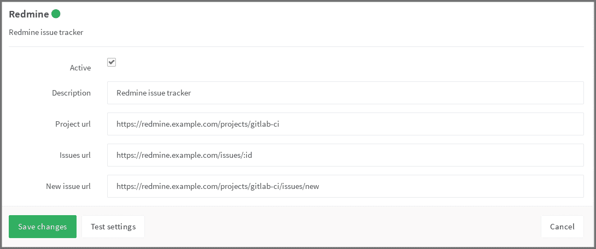

# Redmine Service

> 原文：[https://docs.gitlab.com/ee/user/project/integrations/redmine.html](https://docs.gitlab.com/ee/user/project/integrations/redmine.html)

*   [Referencing issues in Redmine](#referencing-issues-in-redmine)

# Redmine Service

1.  要在项目中启用 Redmine 集成，请导航到[Integrations 页面](overview.html#accessing-integrations) ，单击**Redmine**服务，然后按照下表中的说明在页面上填写所需的详细信息.

    | Field | Description |
    | --- | --- |
    | `project_url` | Redmine 中与该 GitLab 项目链接的项目的 URL |
    | `issues_url` | 链接到该 GitLab 项目的 Redmine 项目中问题的 URL. 请注意， `issues_url`在 URL 中需要`:id` . GitLab 使用此 ID 作为占位符来替换问题编号. |
    | `new_issue_url` | 这是在 Redmine 中为与此 GitLab 项目链接的项目创建新发行版的 URL. **当前未使用此功能，并将在以后的版本中将其删除.** |

    配置并启用 Redmine 后，您将在 GitLab 项目页面上看到 Redmine 链接，该链接将您带到适当的 Redmine 项目.

    例如，下面是一个名为`gitlab-ci`的项目的配置.

    

2.  要禁用项目中的内部问题跟踪系统，请导航至"常规"页面，展开[权限](../settings/index.html#sharing-and-permissions)部分，然后将" **问题"**切换切换为"禁用".

## Referencing issues in Redmine

Redmine 中的问题可以通过两种替代方式进行引用：

*   `#<ID>` ，其中`<ID>`是数字（示例`#143` ）.
*   `<PROJECT>-<ID>` where `<PROJECT>` starts with a capital letter which is then followed by capital letters, numbers or underscores, and `<ID>` is a number (example `API_32-143`).

如果您同时启用了内部和外部问题跟踪器，我们建议使用更长的格式. 如果您使用较短的格式，并且内部问题跟踪器中存在具有相同 ID 的问题，则内部问题将被链接.

请注意， `<PROJECT>`部分将被忽略，链接始终指向`issues_url`指定的地址.