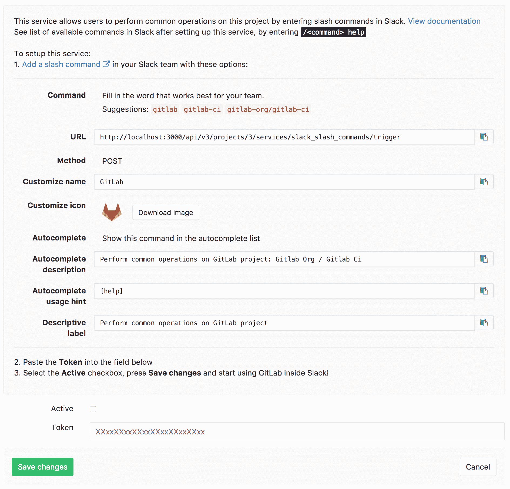

# Slack slash commands

> 原文：[https://docs.gitlab.com/ee/user/project/integrations/slack_slash_commands.html](https://docs.gitlab.com/ee/user/project/integrations/slack_slash_commands.html)

*   [Configuration](#configuration)
*   [Usage](#usage)

# Slack slash commands

在 GitLab 8.15 中引入.

使用 Slack 斜杠命令，您可以控制 GitLab 并直接在 Slack 内部查看内容，而不必离开它. 这需要在 Slack 和 GitLab 中进行配置.

GitLab 还可以将事件（例如， `issue created` ）作为通知发送到 Slack. 这是单独配置的[Slack Notifications Service](slack.html) .

**注意：**对于 GitLab.com，请改用[Slack 应用程序](gitlab_slack_application.html) .

## Configuration

1.  Slack 斜杠命令的作用域是项目. 导航到项目设置中的" [集成"页面](overview.html#accessing-integrations) ，即" **项目">"设置">"集成"** .
2.  选择**Slack 斜杠命令**集成进行配置. 该页面包含完成 Slack 中配置所需的信息. 将此浏览器选项卡保持打开状态.
3.  打开一个新的浏览器选项卡，然后登录到您的 Slack 团队. [开始新的 Slash Commands 集成](https://my.slack.com/services/new/slash-commands) .
4.  输入触发条件. 我们建议您使用项目名称. 单击**添加斜线命令集成** .
5.  使用来自 GitLab 浏览器选项卡的信息来完成 Slack 配置页面中的其余字段. 特别是，URL 需要复制和粘贴. 单击" **保存集成"**以完成 Slack 中的配置.
6.  仍在 Slack 配置页面上，复制**令牌** . 返回到 GitLab 浏览器选项卡并粘贴**令牌** .
7.  确保启用了**活动**切换，然后单击**保存更改**以完成 GitLab 中的配置.

## Usage

现在，您可以使用[Slack 斜杠命令](../../../integration/slash_commands.html) .