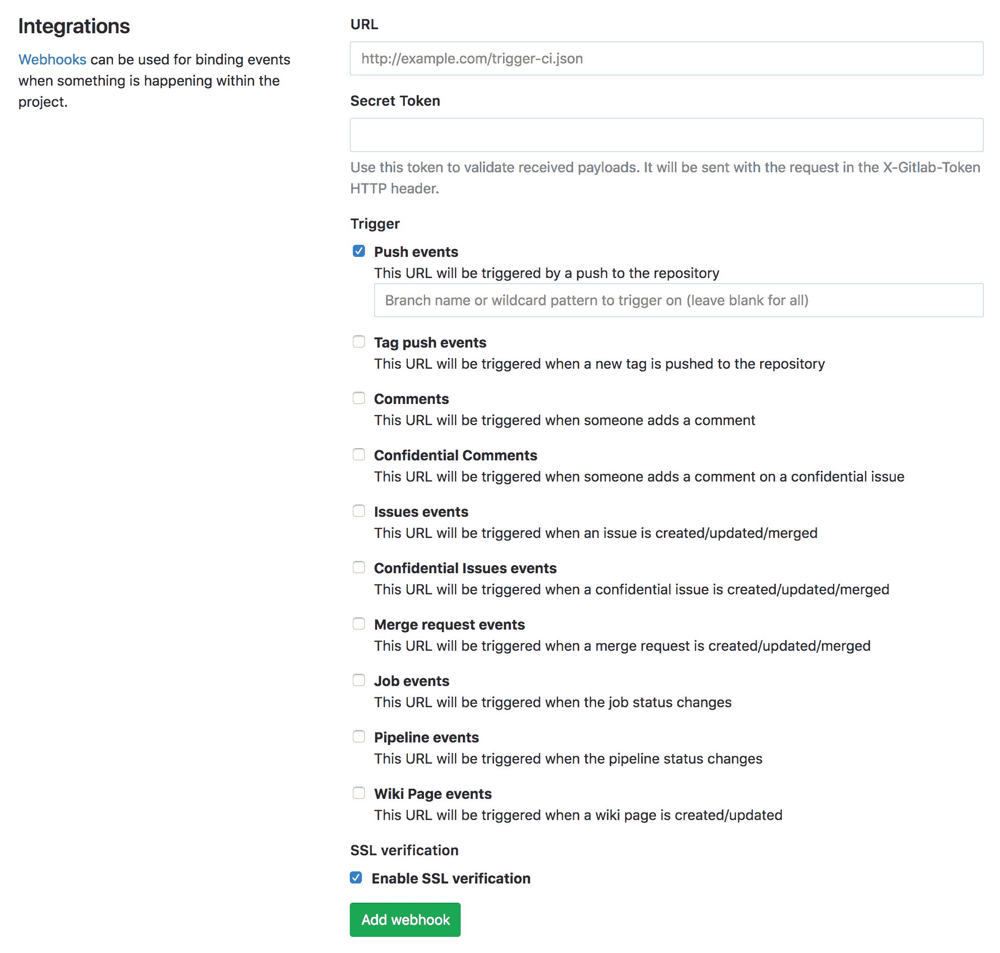
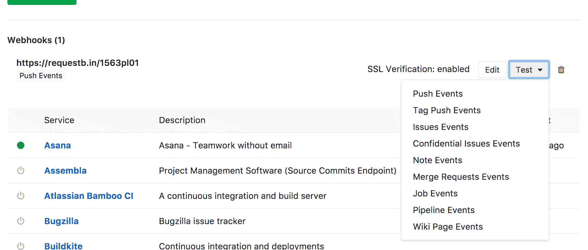

# Webhooks

> 原文：[https://docs.gitlab.com/ee/user/project/integrations/webhooks.html](https://docs.gitlab.com/ee/user/project/integrations/webhooks.html)

*   [Overview](#overview)
*   [Use-cases](#use-cases)
*   [Webhook endpoint tips](#webhook-endpoint-tips)
*   [Secret token](#secret-token)
*   [SSL verification](#ssl-verification)
*   [Branch filtering](#branch-filtering)
*   [Events](#events)
    *   [Push events](#push-events)
    *   [Tag events](#tag-events)
    *   [Issue events](#issue-events)
    *   [Comment events](#comment-events)
        *   [Comment on commit](#comment-on-commit)
        *   [Comment on merge request](#comment-on-merge-request)
        *   [Comment on issue](#comment-on-issue)
        *   [Comment on code snippet](#comment-on-code-snippet)
    *   [Merge request events](#merge-request-events)
    *   [Wiki Page events](#wiki-page-events)
    *   [Pipeline events](#pipeline-events)
    *   [Job events](#job-events)
*   [Image URL rewriting](#image-url-rewriting)
*   [Testing webhooks](#testing-webhooks)
*   [Troubleshoot webhooks](#troubleshoot-webhooks)
    *   [Receiving duplicate or multiple webhook requests triggered by one event](#receiving-duplicate-or-multiple-webhook-requests-triggered-by-one-event)
    *   [Troubleshooting: “Unable to get local issuer certificate”](#troubleshooting-unable-to-get-local-issuer-certificate)
*   [Example webhook receiver](#example-webhook-receiver)

# Webhooks[](#webhooks "Permalink")

> **注意：**从 GitLab 8.5 开始：
> 
> *   不推荐使用`repository`密钥，而推荐使用`project`密钥
> *   不推荐使用`project.ssh_url`密钥，而推荐使用`project.git_ssh_url`密钥
> *   不推荐使用`project.http_url`键，而推荐使用`project.git_http_url`键
> 
> **注意：**从 GitLab 11.1 开始，一个月后会自动删除 Webhooks 的日志.
> 
> **注意：**从 GitLab 11.2 开始：
> 
> *   重写问题，合并请求，评论和 Wiki 页面的`description`字段，以便简单的 Markdown 图像引用（如`` ）将其目标 URL 更改为绝对 URL. 有关更多详细信息，请参见[图像 URL 重写](#image-url-rewriting) .

通过项目 webhooks，您可以在例如推送新代码或创建新问题时触发 URL. 您可以将 webhook 配置为侦听特定事件，例如推送，问题或合并请求. GitLab 会将带有数据的 POST 请求发送到 webhook URL.

在大多数情况下，您需要设置自己的[Webhook 接收器](#example-webhook-receiver)以从 GitLab 接收信息，然后根据需要将其发送到另一个应用程序. 我们已经有一个[内置接收器，](slack.html)用于*每个项目*发送[Slack](https://api.slack.com/incoming-webhooks)通知.

## Overview[](#overview "Permalink")

[Webhooks](https://en.wikipedia.org/wiki/Webhook)是" *用户定义的 HTTP 回调* ". 它们通常是由某些事件触发的，例如将代码推送到存储库或将评论发布到博客. 发生该事件时，源应用程序向为 Webhook 配置的 URI 发出 HTTP 请求. 采取的措施可能是任何事情. 常见用途是触发具有持续集成系统的构建或通知错误跟踪系统.

Webhooks 可用于更新外部问题跟踪器，触发 CI 作业，更新备份镜像，甚至部署到您的生产服务器. 他们**每个项目**可以 GitLab 社区版，以及**每个项目和每个组** **GitLab 企业版** .

通过转到项目的**设置➔Webhooks**导航到 webhooks 页面.

**注意：**在 GitLab.com 上，每个项目和每个组的[最大 Webhooks 数量](../../../user/gitlab_com/index.html#maximum-number-of-webhooks)是有限的.

## Use-cases[](#use-cases "Permalink")

*   您可以在 GitLab 中设置一个 Webhook，以在每次作业失败时向[Slack](https://api.slack.com/incoming-webhooks)发送通知.
*   每当在 GitLab 中为特定项目或组创建问题时，您都可以[与 Twilio 集成以通过 SMS 收到通知](https://www.datadoghq.com/blog/send-alerts-sms-customizable-webhooks-twilio/)
*   You can use them to [automatically assign labels to merge requests](https://about.gitlab.com/blog/2016/08/19/applying-gitlab-labels-automatically/).

## Webhook endpoint tips[](#webhook-endpoint-tips "Permalink")

如果您正在编写自己的将接收 GitLab webhooks 的端点（Web 服务器），请记住以下几点：

*   您的端点应尽快发送其 HTTP 响应. 如果等待时间太长，GitLab 可能会确定挂钩失败并重试.
*   您的端点应始终返回有效的 HTTP 响应. 如果您不这样做，则 GitLab 会认为挂钩失败并重试. 大多数 HTTP 库会自动为您处理此问题，但是如果您正在编写低级钩子，记住这一点很重要.
*   GitLab 会忽略端点返回的 HTTP 状态代码.

## Secret token[](#secret-token "Permalink")

如果您指定一个秘密令牌，它将与挂钩请求一起在`X-Gitlab-Token` HTTP 标头中发送. 您的 webhook 端点可以检查以验证请求是否合法.

## SSL verification[](#ssl-verification "Permalink")

默认情况下，将基于证书颁发机构的内部列表来验证 webhook 端点的 SSL 证书，这意味着该证书无法进行自签名.

您可以在 GitLab 项目的 webhook 设置中将其关闭.

[](img/webhooks_ssl.png)

## Branch filtering[](#branch-filtering "Permalink")

在 GitLab 11.3 中[引入](https://gitlab.com/gitlab-org/gitlab-foss/-/issues/20338) .

可以使用分支名称或通配符模式按分支过滤推送事件，以限制将哪些推送事件发送到您的 Webhook 端点. 默认情况下，该字段为空白，导致所有推送事件都发送到您的 Webhook 端点.

## Events[](#events "Permalink")

下面介绍了受支持的事件.

### Push events[](#push-events "Permalink")

当您推送到存储库时（推送标签时除外）触发.

**注意：**一次推送超过 20 个提交时，出于性能原因， `commits` webhook 属性将仅包含前 20 个. 加载详细的提交数据非常昂贵. 请注意，尽管`commits`属性中仅存在 20 个提交，但`total_commits_count`属性将包含实际总数.

另外，如果单个推送包含三个以上分支的更改（默认情况下，取决于[`push_event_hooks_limit`设置](../../../api/settings.html#list-of-settings-that-can-be-accessed-via-api-calls) ），则不会执行此挂钩.

**请求标头**:

```
X-Gitlab-Event: Push Hook 
```

**要求正文：**

```
{  "object_kind":  "push",  "before":  "95790bf891e76fee5e1747ab589903a6a1f80f22",  "after":  "da1560886d4f094c3e6c9ef40349f7d38b5d27d7",  "ref":  "refs/heads/master",  "checkout_sha":  "da1560886d4f094c3e6c9ef40349f7d38b5d27d7",  "user_id":  4,  "user_name":  "John Smith",  "user_username":  "jsmith",  "user_email":  "john@example.com",  "user_avatar":  "https://s.gravatar.com/avatar/d4c74594d841139328695756648b6bd6?s=8://s.gravatar.com/avatar/d4c74594d841139328695756648b6bd6?s=80",  "project_id":  15,  "project":{  "id":  15,  "name":"Diaspora",  "description":"",  "web_url":"http://example.com/mike/diaspora",  "avatar_url":null,  "git_ssh_url":"git@example.com:mike/diaspora.git",  "git_http_url":"http://example.com/mike/diaspora.git",  "namespace":"Mike",  "visibility_level":0,  "path_with_namespace":"mike/diaspora",  "default_branch":"master",  "homepage":"http://example.com/mike/diaspora",  "url":"git@example.com:mike/diaspora.git",  "ssh_url":"git@example.com:mike/diaspora.git",  "http_url":"http://example.com/mike/diaspora.git"  },  "repository":{  "name":  "Diaspora",  "url":  "git@example.com:mike/diaspora.git",  "description":  "",  "homepage":  "http://example.com/mike/diaspora",  "git_http_url":"http://example.com/mike/diaspora.git",  "git_ssh_url":"git@example.com:mike/diaspora.git",  "visibility_level":0  },  "commits":  [  {  "id":  "b6568db1bc1dcd7f8b4d5a946b0b91f9dacd7327",  "message":  "Update Catalan translation to e38cb41.\n\nSee https://gitlab.com/gitlab-org/gitlab for more information",  "title":  "Update Catalan translation to e38cb41.",  "timestamp":  "2011-12-12T14:27:31+02:00",  "url":  "http://example.com/mike/diaspora/commit/b6568db1bc1dcd7f8b4d5a946b0b91f9dacd7327",  "author":  {  "name":  "Jordi Mallach",  "email":  "jordi@softcatala.org"  },  "added":  ["CHANGELOG"],  "modified":  ["app/controller/application.rb"],  "removed":  []  },  {  "id":  "da1560886d4f094c3e6c9ef40349f7d38b5d27d7",  "message":  "fixed readme",  "title":  "fixed readme",  "timestamp":  "2012-01-03T23:36:29+02:00",  "url":  "http://example.com/mike/diaspora/commit/da1560886d4f094c3e6c9ef40349f7d38b5d27d7",  "author":  {  "name":  "GitLab dev user",  "email":  "gitlabdev@dv6700.(none)"  },  "added":  ["CHANGELOG"],  "modified":  ["app/controller/application.rb"],  "removed":  []  }  ],  "total_commits_count":  4  } 
```

### Tag events[](#tag-events "Permalink")

在创建（或删除）存储库标签时触发.

**注意：**如果单个推送包含三个以上的更改（默认情况下，取决于[`push_event_hooks_limit`设置](../../../api/settings.html#list-of-settings-that-can-be-accessed-via-api-calls) ），则不会执行此挂钩.

**请求标头**:

```
X-Gitlab-Event: Tag Push Hook 
```

**要求正文：**

```
{  "object_kind":  "tag_push",  "before":  "0000000000000000000000000000000000000000",  "after":  "82b3d5ae55f7080f1e6022629cdb57bfae7cccc7",  "ref":  "refs/tags/v1.0.0",  "checkout_sha":  "82b3d5ae55f7080f1e6022629cdb57bfae7cccc7",  "user_id":  1,  "user_name":  "John Smith",  "user_avatar":  "https://s.gravatar.com/avatar/d4c74594d841139328695756648b6bd6?s=8://s.gravatar.com/avatar/d4c74594d841139328695756648b6bd6?s=80",  "project_id":  1,  "project":{  "id":  1,  "name":"Example",  "description":"",  "web_url":"http://example.com/jsmith/example",  "avatar_url":null,  "git_ssh_url":"git@example.com:jsmith/example.git",  "git_http_url":"http://example.com/jsmith/example.git",  "namespace":"Jsmith",  "visibility_level":0,  "path_with_namespace":"jsmith/example",  "default_branch":"master",  "homepage":"http://example.com/jsmith/example",  "url":"git@example.com:jsmith/example.git",  "ssh_url":"git@example.com:jsmith/example.git",  "http_url":"http://example.com/jsmith/example.git"  },  "repository":{  "name":  "Example",  "url":  "ssh://git@example.com/jsmith/example.git",  "description":  "",  "homepage":  "http://example.com/jsmith/example",  "git_http_url":"http://example.com/jsmith/example.git",  "git_ssh_url":"git@example.com:jsmith/example.git",  "visibility_level":0  },  "commits":  [],  "total_commits_count":  0  } 
```

### Issue events[](#issue-events "Permalink")

在创建新问题或更新/关闭/重新打开现有问题时触发.

**请求标头**:

```
X-Gitlab-Event: Issue Hook 
```

**要求正文：**

```
{  "object_kind":  "issue",  "event_type":  "issue",  "user":  {  "name":  "Administrator",  "username":  "root",  "avatar_url":  "http://www.gravatar.com/avatar/e64c7d89f26bd1972efa854d13d7dd61?s=40\u0026d=identicon",  "email":  "admin@example.com"  },  "project":  {  "id":  1,  "name":"Gitlab Test",  "description":"Aut reprehenderit ut est.",  "web_url":"http://example.com/gitlabhq/gitlab-test",  "avatar_url":null,  "git_ssh_url":"git@example.com:gitlabhq/gitlab-test.git",  "git_http_url":"http://example.com/gitlabhq/gitlab-test.git",  "namespace":"GitlabHQ",  "visibility_level":20,  "path_with_namespace":"gitlabhq/gitlab-test",  "default_branch":"master",  "ci_config_path":  null,  "homepage":"http://example.com/gitlabhq/gitlab-test",  "url":"http://example.com/gitlabhq/gitlab-test.git",  "ssh_url":"git@example.com:gitlabhq/gitlab-test.git",  "http_url":"http://example.com/gitlabhq/gitlab-test.git"  },  "object_attributes":  {  "id":  301,  "title":  "New API: create/update/delete file",  "assignee_ids":  [51],  "assignee_id":  51,  "author_id":  51,  "project_id":  14,  "created_at":  "2013-12-03T17:15:43Z",  "updated_at":  "2013-12-03T17:15:43Z",  "updated_by_id":  1,  "last_edited_at":  null,  "last_edited_by_id":  null,  "relative_position":  0,  "description":  "Create new API for manipulations with repository",  "milestone_id":  null,  "state_id":  1,  "confidential":  false,  "discussion_locked":  true,  "due_date":  null,  "moved_to_id":  null,  "duplicated_to_id":  null,  "time_estimate":  0,  "total_time_spent":  0,  "human_total_time_spent":  null,  "human_time_estimate":  null,  "weight":  null,  "iid":  23,  "url":  "http://example.com/diaspora/issues/23",  "state":  "opened",  "action":  "open",  "labels":  [{  "id":  206,  "title":  "API",  "color":  "#ffffff",  "project_id":  14,  "created_at":  "2013-12-03T17:15:43Z",  "updated_at":  "2013-12-03T17:15:43Z",  "template":  false,  "description":  "API related issues",  "type":  "ProjectLabel",  "group_id":  41  }]  },  "repository":  {  "name":  "Gitlab Test",  "url":  "http://example.com/gitlabhq/gitlab-test.git",  "description":  "Aut reprehenderit ut est.",  "homepage":  "http://example.com/gitlabhq/gitlab-test"  },  "assignees":  [{  "name":  "User1",  "username":  "user1",  "avatar_url":  "http://www.gravatar.com/avatar/e64c7d89f26bd1972efa854d13d7dd61?s=40\u0026d=identicon"  }],  "assignee":  {  "name":  "User1",  "username":  "user1",  "avatar_url":  "http://www.gravatar.com/avatar/e64c7d89f26bd1972efa854d13d7dd61?s=40\u0026d=identicon"  },  "labels":  [{  "id":  206,  "title":  "API",  "color":  "#ffffff",  "project_id":  14,  "created_at":  "2013-12-03T17:15:43Z",  "updated_at":  "2013-12-03T17:15:43Z",  "template":  false,  "description":  "API related issues",  "type":  "ProjectLabel",  "group_id":  41  }],  "changes":  {  "updated_by_id":  {  "previous":  null,  "current":  1  },  "updated_at":  {  "previous":  "2017-09-15 16:50:55 UTC",  "current":  "2017-09-15 16:52:00 UTC"  },  "labels":  {  "previous":  [{  "id":  206,  "title":  "API",  "color":  "#ffffff",  "project_id":  14,  "created_at":  "2013-12-03T17:15:43Z",  "updated_at":  "2013-12-03T17:15:43Z",  "template":  false,  "description":  "API related issues",  "type":  "ProjectLabel",  "group_id":  41  }],  "current":  [{  "id":  205,  "title":  "Platform",  "color":  "#123123",  "project_id":  14,  "created_at":  "2013-12-03T17:15:43Z",  "updated_at":  "2013-12-03T17:15:43Z",  "template":  false,  "description":  "Platform related issues",  "type":  "ProjectLabel",  "group_id":  41  }]  }  }  } 
```

> **注意** ：不赞成使用`assignee`和`assignee_id`键，现在仅显示第一个受让人.

### Comment events[](#comment-events "Permalink")

在对提交，合并请求，问题和代码段进行新注释时触发. 音符数据将被存储在`object_attributes` （如`note` ， `noteable_type` ）. 有效负载还将包括有关注释目标的信息. 例如，对问题的评论将在`issue`密钥下包括特定的问题信息. 有效的目标类型：

*   `commit`
*   `merge_request`
*   `issue`
*   `snippet`

#### Comment on commit[](#comment-on-commit "Permalink")

**Request header**:

```
X-Gitlab-Event: Note Hook 
```

**要求正文：**

```
{  "object_kind":  "note",  "user":  {  "name":  "Administrator",  "username":  "root",  "avatar_url":  "http://www.gravatar.com/avatar/e64c7d89f26bd1972efa854d13d7dd61?s=40\u0026d=identicon"  },  "project_id":  5,  "project":{  "id":  5,  "name":"Gitlab Test",  "description":"Aut reprehenderit ut est.",  "web_url":"http://example.com/gitlabhq/gitlab-test",  "avatar_url":null,  "git_ssh_url":"git@example.com:gitlabhq/gitlab-test.git",  "git_http_url":"http://example.com/gitlabhq/gitlab-test.git",  "namespace":"GitlabHQ",  "visibility_level":20,  "path_with_namespace":"gitlabhq/gitlab-test",  "default_branch":"master",  "homepage":"http://example.com/gitlabhq/gitlab-test",  "url":"http://example.com/gitlabhq/gitlab-test.git",  "ssh_url":"git@example.com:gitlabhq/gitlab-test.git",  "http_url":"http://example.com/gitlabhq/gitlab-test.git"  },  "repository":{  "name":  "Gitlab Test",  "url":  "http://example.com/gitlab-org/gitlab-test.git",  "description":  "Aut reprehenderit ut est.",  "homepage":  "http://example.com/gitlab-org/gitlab-test"  },  "object_attributes":  {  "id":  1243,  "note":  "This is a commit comment. How does this work?",  "noteable_type":  "Commit",  "author_id":  1,  "created_at":  "2015-05-17 18:08:09 UTC",  "updated_at":  "2015-05-17 18:08:09 UTC",  "project_id":  5,  "attachment":null,  "line_code":  "bec9703f7a456cd2b4ab5fb3220ae016e3e394e3_0_1",  "commit_id":  "cfe32cf61b73a0d5e9f13e774abde7ff789b1660",  "noteable_id":  null,  "system":  false,  "st_diff":  {  "diff":  "--- /dev/null\n+++ b/six\n@@ -0,0 +1 @@\n+Subproject commit 409f37c4f05865e4fb208c771485f211a22c4c2d\n",  "new_path":  "six",  "old_path":  "six",  "a_mode":  "0",  "b_mode":  "160000",  "new_file":  true,  "renamed_file":  false,  "deleted_file":  false  },  "url":  "http://example.com/gitlab-org/gitlab-test/commit/cfe32cf61b73a0d5e9f13e774abde7ff789b1660#note_1243"  },  "commit":  {  "id":  "cfe32cf61b73a0d5e9f13e774abde7ff789b1660",  "message":  "Add submodule\n\nSigned-off-by: Example User \u003cuser@example.com.com\u003e\n",  "timestamp":  "2014-02-27T10:06:20+02:00",  "url":  "http://example.com/gitlab-org/gitlab-test/commit/cfe32cf61b73a0d5e9f13e774abde7ff789b1660",  "author":  {  "name":  "Example User",  "email":  "user@example.com"  }  }  } 
```

#### Comment on merge request[](#comment-on-merge-request "Permalink")

**请求标头**:

```
X-Gitlab-Event: Note Hook 
```

**要求正文：**

```
{  "object_kind":  "note",  "user":  {  "name":  "Administrator",  "username":  "root",  "avatar_url":  "http://www.gravatar.com/avatar/e64c7d89f26bd1972efa854d13d7dd61?s=40\u0026d=identicon"  },  "project_id":  5,  "project":{  "id":  5,  "name":"Gitlab Test",  "description":"Aut reprehenderit ut est.",  "web_url":"http://example.com/gitlab-org/gitlab-test",  "avatar_url":null,  "git_ssh_url":"git@example.com:gitlab-org/gitlab-test.git",  "git_http_url":"http://example.com/gitlab-org/gitlab-test.git",  "namespace":"Gitlab Org",  "visibility_level":10,  "path_with_namespace":"gitlab-org/gitlab-test",  "default_branch":"master",  "homepage":"http://example.com/gitlab-org/gitlab-test",  "url":"http://example.com/gitlab-org/gitlab-test.git",  "ssh_url":"git@example.com:gitlab-org/gitlab-test.git",  "http_url":"http://example.com/gitlab-org/gitlab-test.git"  },  "repository":{  "name":  "Gitlab Test",  "url":  "http://localhost/gitlab-org/gitlab-test.git",  "description":  "Aut reprehenderit ut est.",  "homepage":  "http://example.com/gitlab-org/gitlab-test"  },  "object_attributes":  {  "id":  1244,  "note":  "This MR needs work.",  "noteable_type":  "MergeRequest",  "author_id":  1,  "created_at":  "2015-05-17 18:21:36 UTC",  "updated_at":  "2015-05-17 18:21:36 UTC",  "project_id":  5,  "attachment":  null,  "line_code":  null,  "commit_id":  "",  "noteable_id":  7,  "system":  false,  "st_diff":  null,  "url":  "http://example.com/gitlab-org/gitlab-test/merge_requests/1#note_1244"  },  "merge_request":  {  "id":  7,  "target_branch":  "markdown",  "source_branch":  "master",  "source_project_id":  5,  "author_id":  8,  "assignee_id":  28,  "title":  "Tempora et eos debitis quae laborum et.",  "created_at":  "2015-03-01 20:12:53 UTC",  "updated_at":  "2015-03-21 18:27:27 UTC",  "milestone_id":  11,  "state":  "opened",  "merge_status":  "cannot_be_merged",  "target_project_id":  5,  "iid":  1,  "description":  "Et voluptas corrupti assumenda temporibus. Architecto cum animi eveniet amet asperiores. Vitae numquam voluptate est natus sit et ad id.",  "position":  0,  "source":{  "name":"Gitlab Test",  "description":"Aut reprehenderit ut est.",  "web_url":"http://example.com/gitlab-org/gitlab-test",  "avatar_url":null,  "git_ssh_url":"git@example.com:gitlab-org/gitlab-test.git",  "git_http_url":"http://example.com/gitlab-org/gitlab-test.git",  "namespace":"Gitlab Org",  "visibility_level":10,  "path_with_namespace":"gitlab-org/gitlab-test",  "default_branch":"master",  "homepage":"http://example.com/gitlab-org/gitlab-test",  "url":"http://example.com/gitlab-org/gitlab-test.git",  "ssh_url":"git@example.com:gitlab-org/gitlab-test.git",  "http_url":"http://example.com/gitlab-org/gitlab-test.git"  },  "target":  {  "name":"Gitlab Test",  "description":"Aut reprehenderit ut est.",  "web_url":"http://example.com/gitlab-org/gitlab-test",  "avatar_url":null,  "git_ssh_url":"git@example.com:gitlab-org/gitlab-test.git",  "git_http_url":"http://example.com/gitlab-org/gitlab-test.git",  "namespace":"Gitlab Org",  "visibility_level":10,  "path_with_namespace":"gitlab-org/gitlab-test",  "default_branch":"master",  "homepage":"http://example.com/gitlab-org/gitlab-test",  "url":"http://example.com/gitlab-org/gitlab-test.git",  "ssh_url":"git@example.com:gitlab-org/gitlab-test.git",  "http_url":"http://example.com/gitlab-org/gitlab-test.git"  },  "last_commit":  {  "id":  "562e173be03b8ff2efb05345d12df18815438a4b",  "message":  "Merge branch 'another-branch' into 'master'\n\nCheck in this test\n",  "timestamp":  "2015-04-08T21: 00:25-07:00",  "url":  "http://example.com/gitlab-org/gitlab-test/commit/562e173be03b8ff2efb05345d12df18815438a4b",  "author":  {  "name":  "John Smith",  "email":  "john@example.com"  }  },  "work_in_progress":  false,  "assignee":  {  "name":  "User1",  "username":  "user1",  "avatar_url":  "http://www.gravatar.com/avatar/e64c7d89f26bd1972efa854d13d7dd61?s=40\u0026d=identicon"  }  }  } 
```

#### Comment on issue[](#comment-on-issue "Permalink")

**请求标头**:

```
X-Gitlab-Event: Note Hook 
```

**要求正文：**

```
{  "object_kind":  "note",  "user":  {  "name":  "Administrator",  "username":  "root",  "avatar_url":  "http://www.gravatar.com/avatar/e64c7d89f26bd1972efa854d13d7dd61?s=40\u0026d=identicon"  },  "project_id":  5,  "project":{  "id":  5,  "name":"Gitlab Test",  "description":"Aut reprehenderit ut est.",  "web_url":"http://example.com/gitlab-org/gitlab-test",  "avatar_url":null,  "git_ssh_url":"git@example.com:gitlab-org/gitlab-test.git",  "git_http_url":"http://example.com/gitlab-org/gitlab-test.git",  "namespace":"Gitlab Org",  "visibility_level":10,  "path_with_namespace":"gitlab-org/gitlab-test",  "default_branch":"master",  "homepage":"http://example.com/gitlab-org/gitlab-test",  "url":"http://example.com/gitlab-org/gitlab-test.git",  "ssh_url":"git@example.com:gitlab-org/gitlab-test.git",  "http_url":"http://example.com/gitlab-org/gitlab-test.git"  },  "repository":{  "name":"diaspora",  "url":"git@example.com:mike/diaspora.git",  "description":"",  "homepage":"http://example.com/mike/diaspora"  },  "object_attributes":  {  "id":  1241,  "note":  "Hello world",  "noteable_type":  "Issue",  "author_id":  1,  "created_at":  "2015-05-17 17:06:40 UTC",  "updated_at":  "2015-05-17 17:06:40 UTC",  "project_id":  5,  "attachment":  null,  "line_code":  null,  "commit_id":  "",  "noteable_id":  92,  "system":  false,  "st_diff":  null,  "url":  "http://example.com/gitlab-org/gitlab-test/issues/17#note_1241"  },  "issue":  {  "id":  92,  "title":  "test",  "assignee_ids":  [],  "assignee_id":  null,  "author_id":  1,  "project_id":  5,  "created_at":  "2015-04-12 14:53:17 UTC",  "updated_at":  "2015-04-26 08:28:42 UTC",  "position":  0,  "branch_name":  null,  "description":  "test",  "milestone_id":  null,  "state":  "closed",  "iid":  17,  "labels":  [  {  "id":  25,  "title":  "Afterpod",  "color":  "#3e8068",  "project_id":  null,  "created_at":  "2019-06-05T14:32:20.211Z",  "updated_at":  "2019-06-05T14:32:20.211Z",  "template":  false,  "description":  null,  "type":  "GroupLabel",  "group_id":  4  },  {  "id":  86,  "title":  "Element",  "color":  "#231afe",  "project_id":  4,  "created_at":  "2019-06-05T14:32:20.637Z",  "updated_at":  "2019-06-05T14:32:20.637Z",  "template":  false,  "description":  null,  "type":  "ProjectLabel",  "group_id":  null  }  ],  }  } 
```

> **注意** ：不建议使用`assignee_id`字段，现在仅显示第一个受让人.

#### Comment on code snippet[](#comment-on-code-snippet "Permalink")

**请求标头**:

```
X-Gitlab-Event: Note Hook 
```

**要求正文：**

```
{  "object_kind":  "note",  "user":  {  "name":  "Administrator",  "username":  "root",  "avatar_url":  "http://www.gravatar.com/avatar/e64c7d89f26bd1972efa854d13d7dd61?s=40\u0026d=identicon"  },  "project_id":  5,  "project":{  "id":  5,  "name":"Gitlab Test",  "description":"Aut reprehenderit ut est.",  "web_url":"http://example.com/gitlab-org/gitlab-test",  "avatar_url":null,  "git_ssh_url":"git@example.com:gitlab-org/gitlab-test.git",  "git_http_url":"http://example.com/gitlab-org/gitlab-test.git",  "namespace":"Gitlab Org",  "visibility_level":10,  "path_with_namespace":"gitlab-org/gitlab-test",  "default_branch":"master",  "homepage":"http://example.com/gitlab-org/gitlab-test",  "url":"http://example.com/gitlab-org/gitlab-test.git",  "ssh_url":"git@example.com:gitlab-org/gitlab-test.git",  "http_url":"http://example.com/gitlab-org/gitlab-test.git"  },  "repository":{  "name":"Gitlab Test",  "url":"http://example.com/gitlab-org/gitlab-test.git",  "description":"Aut reprehenderit ut est.",  "homepage":"http://example.com/gitlab-org/gitlab-test"  },  "object_attributes":  {  "id":  1245,  "note":  "Is this snippet doing what it's supposed to be doing?",  "noteable_type":  "Snippet",  "author_id":  1,  "created_at":  "2015-05-17 18:35:50 UTC",  "updated_at":  "2015-05-17 18:35:50 UTC",  "project_id":  5,  "attachment":  null,  "line_code":  null,  "commit_id":  "",  "noteable_id":  53,  "system":  false,  "st_diff":  null,  "url":  "http://example.com/gitlab-org/gitlab-test/snippets/53#note_1245"  },  "snippet":  {  "id":  53,  "title":  "test",  "content":  "puts 'Hello world'",  "author_id":  1,  "project_id":  5,  "created_at":  "2015-04-09 02:40:38 UTC",  "updated_at":  "2015-04-09 02:40:38 UTC",  "file_name":  "test.rb",  "expires_at":  null,  "type":  "ProjectSnippet",  "visibility_level":  0  }  } 
```

### Merge request events[](#merge-request-events "Permalink")

在创建新的合并请求，更新/合并/关闭现有合并请求或在源分支中添加提交时触发.

**请求标头**:

```
X-Gitlab-Event: Merge Request Hook 
```

**要求正文：**

```
{  "object_kind":  "merge_request",  "user":  {  "name":  "Administrator",  "username":  "root",  "avatar_url":  "http://www.gravatar.com/avatar/e64c7d89f26bd1972efa854d13d7dd61?s=40\u0026d=identicon"  },  "project":  {  "id":  1,  "name":"Gitlab Test",  "description":"Aut reprehenderit ut est.",  "web_url":"http://example.com/gitlabhq/gitlab-test",  "avatar_url":null,  "git_ssh_url":"git@example.com:gitlabhq/gitlab-test.git",  "git_http_url":"http://example.com/gitlabhq/gitlab-test.git",  "namespace":"GitlabHQ",  "visibility_level":20,  "path_with_namespace":"gitlabhq/gitlab-test",  "default_branch":"master",  "homepage":"http://example.com/gitlabhq/gitlab-test",  "url":"http://example.com/gitlabhq/gitlab-test.git",  "ssh_url":"git@example.com:gitlabhq/gitlab-test.git",  "http_url":"http://example.com/gitlabhq/gitlab-test.git"  },  "repository":  {  "name":  "Gitlab Test",  "url":  "http://example.com/gitlabhq/gitlab-test.git",  "description":  "Aut reprehenderit ut est.",  "homepage":  "http://example.com/gitlabhq/gitlab-test"  },  "object_attributes":  {  "id":  99,  "target_branch":  "master",  "source_branch":  "ms-viewport",  "source_project_id":  14,  "author_id":  51,  "assignee_id":  6,  "title":  "MS-Viewport",  "created_at":  "2013-12-03T17:23:34Z",  "updated_at":  "2013-12-03T17:23:34Z",  "milestone_id":  null,  "state":  "opened",  "merge_status":  "unchecked",  "target_project_id":  14,  "iid":  1,  "description":  "",  "source":  {  "name":"Awesome Project",  "description":"Aut reprehenderit ut est.",  "web_url":"http://example.com/awesome_space/awesome_project",  "avatar_url":null,  "git_ssh_url":"git@example.com:awesome_space/awesome_project.git",  "git_http_url":"http://example.com/awesome_space/awesome_project.git",  "namespace":"Awesome Space",  "visibility_level":20,  "path_with_namespace":"awesome_space/awesome_project",  "default_branch":"master",  "homepage":"http://example.com/awesome_space/awesome_project",  "url":"http://example.com/awesome_space/awesome_project.git",  "ssh_url":"git@example.com:awesome_space/awesome_project.git",  "http_url":"http://example.com/awesome_space/awesome_project.git"  },  "target":  {  "name":"Awesome Project",  "description":"Aut reprehenderit ut est.",  "web_url":"http://example.com/awesome_space/awesome_project",  "avatar_url":null,  "git_ssh_url":"git@example.com:awesome_space/awesome_project.git",  "git_http_url":"http://example.com/awesome_space/awesome_project.git",  "namespace":"Awesome Space",  "visibility_level":20,  "path_with_namespace":"awesome_space/awesome_project",  "default_branch":"master",  "homepage":"http://example.com/awesome_space/awesome_project",  "url":"http://example.com/awesome_space/awesome_project.git",  "ssh_url":"git@example.com:awesome_space/awesome_project.git",  "http_url":"http://example.com/awesome_space/awesome_project.git"  },  "last_commit":  {  "id":  "da1560886d4f094c3e6c9ef40349f7d38b5d27d7",  "message":  "fixed readme",  "timestamp":  "2012-01-03T23:36:29+02:00",  "url":  "http://example.com/awesome_space/awesome_project/commits/da1560886d4f094c3e6c9ef40349f7d38b5d27d7",  "author":  {  "name":  "GitLab dev user",  "email":  "gitlabdev@dv6700.(none)"  }  },  "work_in_progress":  false,  "url":  "http://example.com/diaspora/merge_requests/1",  "action":  "open",  "assignee":  {  "name":  "User1",  "username":  "user1",  "avatar_url":  "http://www.gravatar.com/avatar/e64c7d89f26bd1972efa854d13d7dd61?s=40\u0026d=identicon"  }  },  "labels":  [{  "id":  206,  "title":  "API",  "color":  "#ffffff",  "project_id":  14,  "created_at":  "2013-12-03T17:15:43Z",  "updated_at":  "2013-12-03T17:15:43Z",  "template":  false,  "description":  "API related issues",  "type":  "ProjectLabel",  "group_id":  41  }],  "changes":  {  "updated_by_id":  {  "previous":  null,  "current":  1  },  "updated_at":  {  "previous":  "2017-09-15 16:50:55 UTC",  "current":"2017-09-15 16:52:00 UTC"  },  "labels":  {  "previous":  [{  "id":  206,  "title":  "API",  "color":  "#ffffff",  "project_id":  14,  "created_at":  "2013-12-03T17:15:43Z",  "updated_at":  "2013-12-03T17:15:43Z",  "template":  false,  "description":  "API related issues",  "type":  "ProjectLabel",  "group_id":  41  }],  "current":  [{  "id":  205,  "title":  "Platform",  "color":  "#123123",  "project_id":  14,  "created_at":  "2013-12-03T17:15:43Z",  "updated_at":  "2013-12-03T17:15:43Z",  "template":  false,  "description":  "Platform related issues",  "type":  "ProjectLabel",  "group_id":  41  }]  }  }  } 
```

### Wiki Page events[](#wiki-page-events "Permalink")

在创建，更新或删除 Wiki 页面时触发.

**请求标题**:

```
X-Gitlab-Event: Wiki Page Hook 
```

**请求正文**:

```
{  "object_kind":  "wiki_page",  "user":  {  "name":  "Administrator",  "username":  "root",  "avatar_url":  "http://www.gravatar.com/avatar/e64c7d89f26bd1972efa854d13d7dd61?s=80\u0026d=identicon"  },  "project":  {  "id":  1,  "name":  "awesome-project",  "description":  "This is awesome",  "web_url":  "http://example.com/root/awesome-project",  "avatar_url":  null,  "git_ssh_url":  "git@example.com:root/awesome-project.git",  "git_http_url":  "http://example.com/root/awesome-project.git",  "namespace":  "root",  "visibility_level":  0,  "path_with_namespace":  "root/awesome-project",  "default_branch":  "master",  "homepage":  "http://example.com/root/awesome-project",  "url":  "git@example.com:root/awesome-project.git",  "ssh_url":  "git@example.com:root/awesome-project.git",  "http_url":  "http://example.com/root/awesome-project.git"  },  "wiki":  {  "web_url":  "http://example.com/root/awesome-project/-/wikis/home",  "git_ssh_url":  "git@example.com:root/awesome-project.wiki.git",  "git_http_url":  "http://example.com/root/awesome-project.wiki.git",  "path_with_namespace":  "root/awesome-project.wiki",  "default_branch":  "master"  },  "object_attributes":  {  "title":  "Awesome",  "content":  "awesome content goes here",  "format":  "markdown",  "message":  "adding an awesome page to the wiki",  "slug":  "awesome",  "url":  "http://example.com/root/awesome-project/-/wikis/awesome",  "action":  "create"  }  } 
```

### Pipeline events[](#pipeline-events "Permalink")

在管道状态更改时触发.

**请求标题**:

```
X-Gitlab-Event: Pipeline Hook 
```

**请求正文**:

```
{  "object_kind":  "pipeline",  "object_attributes":{  "id":  31,  "ref":  "master",  "tag":  false,  "sha":  "bcbb5ec396a2c0f828686f14fac9b80b780504f2",  "before_sha":  "bcbb5ec396a2c0f828686f14fac9b80b780504f2",  "source":  "merge_request_event",  "status":  "success",  "stages":[  "build",  "test",  "deploy"  ],  "created_at":  "2016-08-12 15:23:28 UTC",  "finished_at":  "2016-08-12 15:26:29 UTC",  "duration":  63,  "variables":  [  {  "key":  "NESTOR_PROD_ENVIRONMENT",  "value":  "us-west-1"  }  ]  },  "merge_request":  {  "id":  1,  "iid":  1,  "title":  "Test",  "source_branch":  "test",  "source_project_id":  1,  "target_branch":  "master",  "target_project_id":  1,  "state":  "opened",  "merge_status":  "can_be_merged",  "url":  "http://192.168.64.1:3005/gitlab-org/gitlab-test/merge_requests/1"  },  "user":{  "name":  "Administrator",  "username":  "root",  "avatar_url":  "http://www.gravatar.com/avatar/e32bd13e2add097461cb96824b7a829c?s=80\u0026d=identicon",  "email":  "user_email@gitlab.com"  },  "project":{  "id":  1,  "name":  "Gitlab Test",  "description":  "Atque in sunt eos similique dolores voluptatem.",  "web_url":  "http://192.168.64.1:3005/gitlab-org/gitlab-test",  "avatar_url":  null,  "git_ssh_url":  "git@192.168.64.1:gitlab-org/gitlab-test.git",  "git_http_url":  "http://192.168.64.1:3005/gitlab-org/gitlab-test.git",  "namespace":  "Gitlab Org",  "visibility_level":  20,  "path_with_namespace":  "gitlab-org/gitlab-test",  "default_branch":  "master"  },  "commit":{  "id":  "bcbb5ec396a2c0f828686f14fac9b80b780504f2",  "message":  "test\n",  "timestamp":  "2016-08-12T17:23:21+02:00",  "url":  "http://example.com/gitlab-org/gitlab-test/commit/bcbb5ec396a2c0f828686f14fac9b80b780504f2",  "author":{  "name":  "User",  "email":  "user@gitlab.com"  }  },  "builds":[  {  "id":  380,  "stage":  "deploy",  "name":  "production",  "status":  "skipped",  "created_at":  "2016-08-12 15:23:28 UTC",  "started_at":  null,  "finished_at":  null,  "when":  "manual",  "manual":  true,  "allow_failure":  false,  "user":{  "name":  "Administrator",  "username":  "root",  "avatar_url":  "http://www.gravatar.com/avatar/e32bd13e2add097461cb96824b7a829c?s=80\u0026d=identicon"  },  "runner":  null,  "artifacts_file":{  "filename":  null,  "size":  null  }  },  {  "id":  377,  "stage":  "test",  "name":  "test-image",  "status":  "success",  "created_at":  "2016-08-12 15:23:28 UTC",  "started_at":  "2016-08-12 15:26:12 UTC",  "finished_at":  null,  "when":  "on_success",  "manual":  false,  "allow_failure":  false,  "user":{  "name":  "Administrator",  "username":  "root",  "avatar_url":  "http://www.gravatar.com/avatar/e32bd13e2add097461cb96824b7a829c?s=80\u0026d=identicon"  },  "runner":  {  "id":380987,  "description":"shared-runners-manager-6.gitlab.com",  "active":true,  "is_shared":true  },  "artifacts_file":{  "filename":  null,  "size":  null  }  },  {  "id":  378,  "stage":  "test",  "name":  "test-build",  "status":  "success",  "created_at":  "2016-08-12 15:23:28 UTC",  "started_at":  "2016-08-12 15:26:12 UTC",  "finished_at":  "2016-08-12 15:26:29 UTC",  "when":  "on_success",  "manual":  false,  "allow_failure":  false,  "user":{  "name":  "Administrator",  "username":  "root",  "avatar_url":  "http://www.gravatar.com/avatar/e32bd13e2add097461cb96824b7a829c?s=80\u0026d=identicon"  },  "runner":  {  "id":380987,  "description":"shared-runners-manager-6.gitlab.com",  "active":true,  "is_shared":true  },  "artifacts_file":{  "filename":  null,  "size":  null  }  },  {  "id":  376,  "stage":  "build",  "name":  "build-image",  "status":  "success",  "created_at":  "2016-08-12 15:23:28 UTC",  "started_at":  "2016-08-12 15:24:56 UTC",  "finished_at":  "2016-08-12 15:25:26 UTC",  "when":  "on_success",  "manual":  false,  "allow_failure":  false,  "user":{  "name":  "Administrator",  "username":  "root",  "avatar_url":  "http://www.gravatar.com/avatar/e32bd13e2add097461cb96824b7a829c?s=80\u0026d=identicon"  },  "runner":  {  "id":380987,  "description":"shared-runners-manager-6.gitlab.com",  "active":true,  "is_shared":true  },  "artifacts_file":{  "filename":  null,  "size":  null  }  },  {  "id":  379,  "stage":  "deploy",  "name":  "staging",  "status":  "created",  "created_at":  "2016-08-12 15:23:28 UTC",  "started_at":  null,  "finished_at":  null,  "when":  "on_success",  "manual":  false,  "allow_failure":  false,  "user":{  "name":  "Administrator",  "username":  "root",  "avatar_url":  "http://www.gravatar.com/avatar/e32bd13e2add097461cb96824b7a829c?s=80\u0026d=identicon"  },  "runner":  null,  "artifacts_file":{  "filename":  null,  "size":  null  }  }  ]  } 
```

### Job events[](#job-events "Permalink")

在工作状态更改时触发.

**请求标题**:

```
X-Gitlab-Event: Job Hook 
```

**请求正文**:

```
{  "object_kind":  "build",  "ref":  "gitlab-script-trigger",  "tag":  false,  "before_sha":  "2293ada6b400935a1378653304eaf6221e0fdb8f",  "sha":  "2293ada6b400935a1378653304eaf6221e0fdb8f",  "build_id":  1977,  "build_name":  "test",  "build_stage":  "test",  "build_status":  "created",  "build_started_at":  null,  "build_finished_at":  null,  "build_duration":  null,  "build_allow_failure":  false,  "build_failure_reason":  "script_failure",  "pipeline_id":  2366,  "project_id":  380,  "project_name":  "gitlab-org/gitlab-test",  "user":  {  "id":  3,  "name":  "User",  "email":  "user@gitlab.com",  "avatar_url":  "http://www.gravatar.com/avatar/e32bd13e2add097461cb96824b7a829c?s=80\u0026d=identicon"  },  "commit":  {  "id":  2366,  "sha":  "2293ada6b400935a1378653304eaf6221e0fdb8f",  "message":  "test\n",  "author_name":  "User",  "author_email":  "user@gitlab.com",  "status":  "created",  "duration":  null,  "started_at":  null,  "finished_at":  null  },  "repository":  {  "name":  "gitlab_test",  "description":  "Atque in sunt eos similique dolores voluptatem.",  "homepage":  "http://192.168.64.1:3005/gitlab-org/gitlab-test",  "git_ssh_url":  "git@192.168.64.1:gitlab-org/gitlab-test.git",  "git_http_url":  "http://192.168.64.1:3005/gitlab-org/gitlab-test.git",  "visibility_level":  20  },  "runner":  {  "active":  true,  "is_shared":  false,  "id":  380987,  "description":  "shared-runners-manager-6.gitlab.com"  }  } 
```

请注意， `commit.id`是管道的 ID，而不是提交的 ID.

## Image URL rewriting[](#image-url-rewriting "Permalink")

从 GitLab 11.2 开始，简单的图像引用被重写为在 webhooks 中使用绝对 URL. 因此，如果图像，合并请求，评论或维基页面的描述中包含以下内容：

```
 
```

它将显示在 webhook 主体中，如下所示（假设 GitLab 安装在`gitlab.example.com` ，并且该项目位于`example-group/example-project` ）：

```
 
```

这不会重写已经指向 HTTP，HTTPS 或协议相对 URL 的 URL. 它还不会使用链接标记之类的高级 Markdown 功能重写图像 URL.

## Testing webhooks[](#testing-webhooks "Permalink")

您可以手动触发 Webhook. 将使用项目中的样本数据. >例如：要触发" `Push Events`您的项目应至少提交一次.

[](img/webhook_testing.png)

## Troubleshoot webhooks[](#troubleshoot-webhooks "Permalink")

manbetx 客户端打不开存储 webhook 的每个执行. 您可以在每个 Webhook 的编辑页面上的"最近发送"部分中找到最近 2 天的记录.

[](img/webhook_logs.png)

在本部分中，您可以看到 HTTP 状态代码（绿色表示 200-299 代码，红色表示其他代码，传递失败的`internal error` ），触发的事件，事件被调用的时间，请求的经过时间.

如果需要有关执行的更多信息，可以单击`View details`链接. 在此页面上，您可以查看 GitLab 发送的数据（请求标头和正文）和收到的数据（响应标头和正文）.

在此页面上，您可以通过单击" `Resend Request`按钮以相同的数据重复`Resend Request` .

> **注意：**如果已更新 Webhook 的 URL 或秘密令牌，则数据将被传递到新地址.

### Receiving duplicate or multiple webhook requests triggered by one event[](#receiving-duplicate-or-multiple-webhook-requests-triggered-by-one-event "Permalink")

当 GitLab 发送一个 Webhook 时，它期望在 10 秒内响应（设置默认值）. 如果没有收到，它将重试网络挂钩. 如果端点在这 10 秒钟内未发送 HTTP 响应，则 GitLab 可能会确定挂钩失败并重试.

如果接收到多个请求，可以通过取消注释或将以下设置添加到`/etc/gitlab/gitlab.rb`来尝试增加发送`/etc/gitlab/gitlab.rb`之后的默认值，以等待 HTTP 响应：

```
gitlab_rails['webhook_timeout'] = 10 
```

### Troubleshooting: “Unable to get local issuer certificate”[](#troubleshooting-unable-to-get-local-issuer-certificate "Permalink")

启用 S​​SL 验证后，此错误表明 GitLab 无法验证 Webhook 端点的 SSL 证书. 通常，这是因为根证书不是由[CAcert.org](http://www.cacert.org/)确定的受信任的证书颁发机构[颁发的](http://www.cacert.org/) .

如果不是这种情况，请考虑使用[SSL Checker](https://www.sslshopper.com/ssl-checker.html)来识别故障. 缺少中间证书是验证失败的常见原因.

## Example webhook receiver[](#example-webhook-receiver "Permalink")

如果您希望通过测试了解 GitLab 的 webhooks，可以使用在控制台会话中运行的简单回显脚本. 为了使以下脚本正常工作，您需要安装 Ruby.

将以下文件另存为`print_http_body.rb` ：

```
require 'webrick'

server = WEBrick::HTTPServer.new(:Port => ARGV.first)
server.mount_proc '/' do |req, res|
  puts req.body
end

trap 'INT' do
  server.shutdown
end
server.start 
```

选择一个未使用的端口（例如 8000）并启动脚本： `ruby print_http_body.rb 8000` . 然后，将您的服务器作为 Webhook 接收器添加到 GitLab 中，作为`http://my.host:8000/` .

在 GitLab 中按"测试"时，您应该在控制台中看到以下内容：

```
{"before":"077a85dd266e6f3573ef7e9ef8ce3343ad659c4e","after":"95cd4a99e93bc4bbabacfa2cd10e6725b1403c60",<SNIP>}
example.com - - [14/May/2014:07:45:26 EDT] "POST / HTTP/1.1" 200 0
- -> / 
```

**注意：**您可能需要[允许向本地网络](../../../security/webhooks.html)发送[请求，](../../../security/webhooks.html)以便添加此接收器.